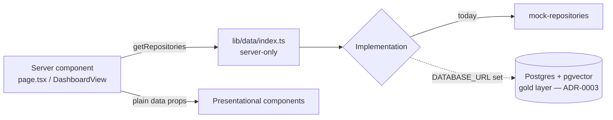

# Data-access layer

How the application reads data. Implements ADR-0007; precedes the PostgreSQL +
pgvector store (ADR-0003).

## What it is
A typed repository abstraction in `src/lib/data`. Callers depend on interfaces,
never on a concrete data source. Today the implementation is mock fixtures;
swapping to Postgres changes one function.

## Structure
| File | Responsibility |
|---|---|
| `repositories.ts` | Async contracts: `DashboardRepository`, `AgentRepository`, `Repositories`. |
| `mock/mock-repositories.ts` | Fixture-backed implementation (wraps `lib/mock-data`). |
| `index.ts` | `getRepositories()` — server-only selection point (mock now; Postgres when `DATABASE_URL` is set). |

## Data flow

## Rules
- Only **server components / route handlers / the orchestrator** call
  `getRepositories()` — it is `server-only` and must not enter client bundles.
- Components are presentational: they receive plain data via props and import no
  data source.
- Repository methods are **async** so they can become real queries unchanged.

## Mapping to the staged pipeline (§4)
Repositories expose **gold** (AI/UI-ready) reads. Bronze/silver live in Postgres;
gold projections are what the UI and agents consume. Row scoping to the signed-in
user's Entra permissions will be enforced inside the implementation.

Tree-shaped writes (e.g. `createDeliveryTemplate`, ADR-0081 — template → phases →
tasks) run in a single `pool.connect()` transaction (`BEGIN`/`COMMIT`/`ROLLBACK`),
mirroring `applyOnboardingTemplate`; the `getDeliveryTemplate` read assembles the
tree client-side from three ordered queries. See `delivery-templates.test.ts` for
the SQL-shape + mapping contract.

**Timesheet methods (ADR-0082, migrations 0085–0087).** `listTimesheets` /
`getTimesheetForWeek` / `ensureTimesheetForWeek` / `addTimeEntry` / `updateTimeEntry` /
`deleteTimeEntry` / `submitTimesheet` back the employee weekly-timesheet vertical.
`getTimesheetForWeek` assembles the week from three ordered reads (the timesheet row,
its attendance entries, and the per-day `time_reconciliation_day` rows that seed the
memory-jogger); minutes are **derived in SQL** (`EXTRACT(EPOCH …)/60`), never stored.
`ensureTimesheetForWeek` is an idempotent upsert on `UNIQUE (app_user_id, week_start)`.
`submitTimesheet` is a single atomic statement that transitions **only an Open sheet** →
Submitted, stamps the attester, and snapshots the entries (`jsonb_agg`) for audit. The
attest **Hard-deviation gate** (over-logged day or same-day overlap) is computed in
`hasHardDeviation` over the assembled week. Comp data (0085 `pay_rate`) is NOT read here —
that stays in the backend reconciliation process. See `timesheets.test.ts` for the
SQL-shape + mapping + gate contract.

## Swapping to Postgres (ADR-0003)
1. Add a `postgres/` implementation of the same interfaces (querying gold).
2. In `index.ts`, return it when `process.env.DATABASE_URL` is set.
3. No change to any caller or component.

## Failure behaviour — fail closed, with one exception (`postgres/fallback.ts`)
With **no database configured**, every read returns mock data (dev/demo). With a
**database configured**, a failed read does NOT silently return demo data — the guarded
fallback seam (#193) logs and throws `DataUnavailableError`, which the route error
boundary renders as "Live data is unavailable" rather than fake numbers.

**The one exception is schema lag (#301).** A merged read of a new *optional* bronze
table can outpace its prod migration (this bit SharePoint 0078 and directory-groups
0079). That surfaces as Postgres `42P01` (undefined_table) / `42703` (undefined_column) —
deterministic "not migrated yet", not an outage. So the **optional enrichment reads**
(account-scoped posture / Defender / MFA / SharePoint / credential-exposure reads and the
contact directory-groups read) treat those two codes as **empty** (`isSchemaLagError`),
degrading one section to blank instead of failing the whole page. Every other error —
connection loss, timeout, syntax — still fails closed. **Core reads** (account, contact,
timeline, bronze-source drill) are never degraded: a failure there is a real problem.
