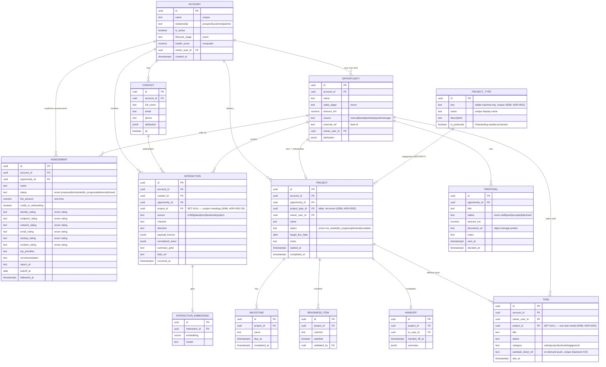
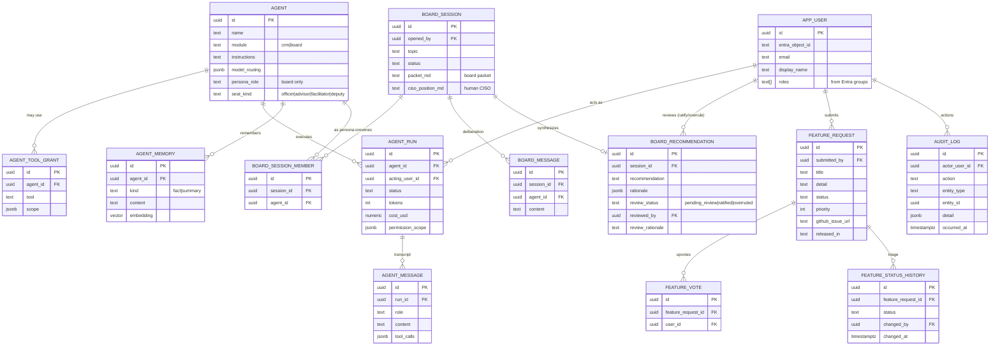
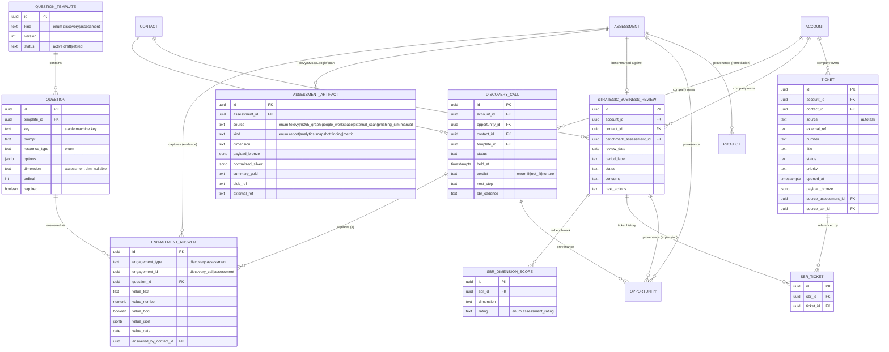
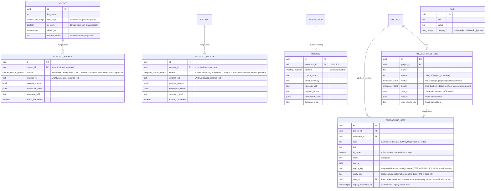
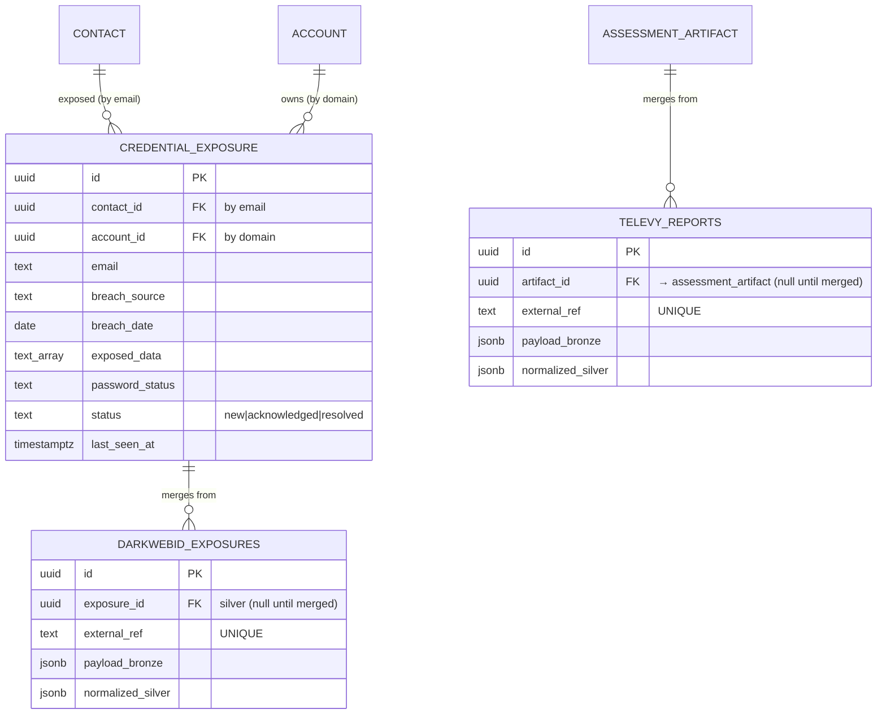

# Imperion CRM — Data Model

- **Status:** Draft (decisions D1–D11 locked 2026-06-07)
- **Related:** [product-requirements](../architecture/product-requirements.md),
  ADR-0010 … ADR-0016, [data-access-layer](./data-access-layer.md)
- **Store:** PostgreSQL + `pgvector` (ADR-0003), single unified store: system of
  record, embedding store, and agent memory.

## Principles

- **Modular by bounded context.** Each module (below) owns its tables; the spine
  (Account/Contact/Opportunity) is referenced by FK, never reshaped by satellites.
- **Staged enrichment (bronze→silver→gold, CLAUDE.md §4).** Raw payloads land in
  bronze (JSONB), are normalized to silver columns, and distilled to gold
  (summaries + embeddings) for agent consumption.
- **Append-only where it's evidence.** Interactions, consent events, agent runs,
  and audit logs are immutable event logs; current state is derived.
- **External systems are referenced, not owned.** Autotask/IT Glue data is polled;
  only an identity map + short-lived cache lives here.
- **PII-aware.** PII columns are tagged; access is audit-logged (ADR-0016).
- All PKs are `uuid`; all rows carry `created_at`/`updated_at`; soft-delete via
  `archived_at` where retention requires it.

> Conventions in the diagrams: `PK` primary key, `FK` foreign key. Attribute lists
> show **key** columns only, not the full DDL (that lands with the migrations in
> Phase 1).

## Diagram 1 — CRM core, delivery, and the engagement timeline

## Diagram 2 — Integrations, demand generation, communications & consent

> **As-built note:** Diagram 2 is the original *design* sketch. The tables actually
> built in migrations `0018`–`0026` are shown in **Diagram 5** (ADR-0024–0027), which
> refines this design — notably: `integration_connection` + `sync_state` became a
> single scope-aware **`connection`** (per-user *and* company, ADR-0024); `enrichment`
> became **`contact_enrichment`** with per-fact `lawful_basis` plus
> `contact_social_identity` (ADR-0025); the consent ledger gained `data_enrichment` and
> `ad_targeting` channels; and **`audience`/`audience_member`**, **`lead_hook`/
> `lead_capture_event`**, **`meeting_action_item`**, and the `engagement_answer`
> provenance columns were added. Diagram 5 is authoritative where they differ.

### Events + registration (ADR-0053, migration 0070)

**Events are first-class objects, campaigns are delivery vehicles.** `event`
(kind `webinar | live_event`; Teams `join_url` for webinars, `location` for live
events; typed `registration_page` jsonb; `workflow_id` auto-enrolls registrants once
#112 wires it) and `event_registration` (one row per signup: `contact_id`,
`capture_event_id` back to the capture inbox, status
`registered|attended|no_show|canceled`, unique per event+contact). A campaign of any
channel points at the event it promotes via `campaign.event_id`. Registration IS lead
capture: the `event_registration` lead-hook kind lands signups in
`lead_capture_event`, resolving to contacts like every other lead source. Funnel
numbers (registrations, attendance) are derived from `event_registration`, never
stored.

## Diagram 3 — Agent platform, AI Board, feedback & identity

## Diagram 4 — Engagement capture & long-term relationship (ADR-0023)

Discovery, assessment evidence, and SBRs are **account-scoped** (the contact is only
the employee who performed an instance). Questionnaires are editable data; answers are
stored once; downstream records point back via provenance FKs.

> **Provenance, not duplication:** `opportunity`, `project`, and `ticket` carry nullable
> `source_discovery_id` / `source_assessment_id` / `source_sbr_id` FKs so a downstream
> record points back to the engagement that produced it — the engagement's data is never
> copied forward.

## Diagram 5 — As-built: communications, connections, enrichment, demand-gen audiences & automation (ADR-0024–0027)

The multi-channel timeline (every comm is one `interaction`), per-user + company
connections, the lawful-basis-gated enrichment dossier, demand-gen audiences over the
aggregated profiles, lead-capture hooks, and nurture/pre-discovery automation. A comm
is related **first to the employee** (`interaction.owner_user_id`, via the connection
that produced it) and then to the contact/account.

```mermaid
erDiagram
    APP_USER ||--o{ CONNECTION : "personal connections"
    CONNECTION ||--o{ INTERACTION : "ingested via"
    APP_USER ||--o{ INTERACTION : "owner (employee)"
    ACCOUNT ||--o{ INTERACTION : "timeline"
    CONTACT ||--o{ INTERACTION : "participates"
    INTERACTION ||--o{ MEETING_ACTION_ITEM : "follow-ups"
    MEETING_ACTION_ITEM ||--o| TASK : "promoted to"
    ACCOUNT ||--o{ EXTERNAL_IDENTITY : "identity map"
    CONTACT ||--o{ EXTERNAL_IDENTITY : "identity map"
    CONTACT ||--o{ CONTACT_SOCIAL_IDENTITY : "linked profiles"
    CONTACT ||--o{ CONTACT_ENRICHMENT : "dossier (gold)"
    CONTACT ||--o| CONTACT_EMBEDDING : "profile vector"
    CONTACT ||--o{ CONSENT_EVENT : "append-only ledger"
    CONNECTION ||--o{ CONTACT_ENRICHMENT : "provenance"
    CAMPAIGN ||--o{ AD : contains
    CAMPAIGN ||--o{ CAMPAIGN_METRIC : "polled"
    CAMPAIGN ||--o{ CONTACT : "attributed"
    AUDIENCE ||--o{ AUDIENCE_MEMBER : "aggregated profiles"
    CONTACT ||--o{ AUDIENCE_MEMBER : "member of"
    LEAD_HOOK ||--o{ LEAD_CAPTURE_EVENT : captures
    LEAD_CAPTURE_EVENT ||--o| CONTACT : "resolves to"
    WORKFLOW ||--o{ WORKFLOW_STEP : has
    WORKFLOW ||--o{ WORKFLOW_ENROLLMENT : enrolls
    CONTACT ||--o{ WORKFLOW_ENROLLMENT : "nurtured by"

    CONNECTION {
      uuid id PK
      text scope "user|company"
      uuid owner_user_id FK "null for company"
      text provider "m365|youtube|linkedin|facebook|autotask|itglue|myitprocess|televy|quotemanager|gdap|…"
      text status "active|pending|expired|revoked|error"
      text[] scopes
      text keyvault_secret_ref "token ref only — never the token"
      jsonb sync_cursor
      timestamptz last_sync_at
      int poll_interval_minutes "pipeline poll cadence; 0 = manual/paused (ADR-0038)"
    }
    INTERACTION {
      uuid id PK
      uuid account_id FK
      uuid contact_id FK
      uuid owner_user_id FK "employee"
      uuid source_connection_id FK
      uuid project_id FK "SET NULL — project meetings (0066, ADR-0052 §5); NULL on sales meetings"
      text source "enum interaction_source"
      text kind "email|message|call|meeting|social_comment|…"
      text subject
      text summary_gold
      timestamptz occurred_at
    }
    MEETING_ACTION_ITEM {
      uuid id PK
      uuid interaction_id FK
      uuid contact_id FK
      uuid owner_user_id FK
      text description
      text status "open|done"
      date due_at
      uuid source_task_id FK
    }
    EXTERNAL_IDENTITY {
      uuid id PK
      uuid account_id FK
      uuid contact_id FK
      text provider
      text external_id
    }
    CONTACT_SOCIAL_IDENTITY {
      uuid id PK
      uuid contact_id FK
      text platform
      text handle
      text profile_url
      int follower_count
      boolean verified
    }
    CONTACT_ENRICHMENT {
      uuid id PK
      uuid contact_id FK
      text attribute_key
      text value_text
      jsonb value_json
      numeric confidence
      text source
      uuid source_connection_id FK
      text lawful_basis "enum lawful_basis"
      timestamptz observed_at
      timestamptz expires_at
    }
    CONTACT_EMBEDDING {
      uuid id PK
      uuid contact_id FK
      vector embedding
      text model
    }
    CONSENT_EVENT {
      uuid id PK
      uuid contact_id FK
      text channel "email|sms|call_recording|data_enrichment|ad_targeting"
      text state "opt_in|opt_out"
      text lawful_basis
      text source
      jsonb proof
      timestamptz occurred_at
    }
    CAMPAIGN {
      uuid id PK
      text name
      text platform "facebook|google|youtube|linkedin|email"
      text status "draft|active|paused|completed"
      numeric budget
    }
    AD {
      uuid id PK
      uuid campaign_id FK
      text name
      jsonb creative
      text status
    }
    CAMPAIGN_METRIC {
      uuid id PK
      uuid campaign_id FK
      uuid ad_id FK
      date metric_date
      numeric spend
      int impressions
      int clicks
      int leads
    }
    AUDIENCE {
      uuid id PK
      text name
      text kind "static|dynamic"
      jsonb definition "criteria over enrichment"
      text platform_sync_ref
    }
    AUDIENCE_MEMBER {
      uuid audience_id FK
      uuid contact_id FK
      text source
    }
    LEAD_HOOK {
      uuid id PK
      text name
      text kind "web_form|facebook_lead|youtube_comment|…"
      jsonb config
      boolean active
    }
    LEAD_CAPTURE_EVENT {
      uuid id PK
      uuid hook_id FK
      jsonb payload_bronze
      uuid contact_id FK
      text status "new|resolved|ignored"
      timestamptz received_at
    }
    WORKFLOW {
      uuid id PK
      text name
      text kind "nurture|pre_discovery|re_engagement"
      jsonb trigger
      text status
    }
    WORKFLOW_STEP {
      uuid id PK
      uuid workflow_id FK
      int ordinal
      text kind "send_email|send_sms|chat_prompt|agent_enrich|wait|branch"
      jsonb config
    }
    WORKFLOW_ENROLLMENT {
      uuid id PK
      uuid workflow_id FK
      uuid contact_id FK
      uuid account_id FK
      text status "active|completed|exited"
      int current_step_ordinal
    }
```

> **Consent & lawful basis are the gate.** `current_consent` (a view = latest event
> per contact × channel) is read at send time and at ad-launch time; `contact_enrichment`
> rows each carry a `lawful_basis`. Outbound sends and ad targeting are blocked unless
> the relevant channel is currently opt-in (ADR-0014/0025/0026). The ledger is
> append-only — a change of mind is a new event, never an update.

## Diagram 6 — As-built: contact lifecycle, meetings, per-source bronze & onboarding PM (ADR-0030–0035)

Front-end-driven additions. The normalized `contact` gains a CRM-lifecycle axis (Leads
vs Contacts are opposite filters); structured `meeting` objects hang off the timeline;
per-source **bronze** rows merge into the silver `contact`/`account`; tasks are
categorized and onboarding gets R/Y/G milestones. RBAC roles live on `app_user.roles`
(ADR-0016/0030).

> **Onboarding playbook (ADR-0037).** The standard 9-phase, ~90-step MSP onboarding
> playbook lives in `lib/onboarding-template.ts`. `applyOnboardingTemplate` instantiates
> it: each phase → a `PROJECT_MILESTONE`, each step → an `ONBOARDING_STEP`. Checking off
> steps re-derives the phase R/Y/G. Ad-hoc PM work still uses `TASK` (category
> project/onboarding); the playbook checklist does not.

> **Easy mode (ADR-0052 §3/§4, #101, migration 0067).** A step with a `deploy_key`
> renders the Deploy button and auto-creates ONE linked project task when the template
> is applied. Close is **verify-to-close**: completing the step (today the manual check,
> later the backend verification over posture silver — same path) closes the linked task
> idempotently; a deploy-flagged step completing with no linked task writes an
> `audit_log` note (`onboarding.deploy.no_linked_task`) instead. v1 ships SPARSE — no
> template step carries a key until the project-plan solidification exercise assigns
> them, so the button renders nowhere yet. Migration 0067 also grants the backend role
> SELECT on posture silver + UPDATE on `task`/`onboarding_step` for the verification
> check.

> **Apollo** (ADR-0035) is a company-scope `connection` provider and an enrichment
> source for both contacts and companies. The normalization/merge job
> (bronze → silver) runs in the pipeline repo (pipeline ADR-0006/0009).

> **SUPERSEDED by ADR-0039.** The single `CONTACT_SOURCE` / `ACCOUNT_SOURCE` tables above
> were replaced by **one physical bronze table per (source, entity)** plus a new `device`
> entity — see Diagram 6b. `contact`/`account` remain the silver aggregate; a `device` silver
> table is added.

## Diagram 6b — As-built: per-source bronze tables + device (ADR-0039)

Each source lands in its own bronze table (uniform shape; `source` implicit in the table name,
`UNIQUE(external_ref)`). Read-only union views `contact_bronze_all` / `account_bronze_all` /
`device_bronze_all` re-add a `source` key for the app's "Data sources" popup and the merge scan;
all writes target the physical tables. The merge folds every source into silver `contact` /
`account` / `device` by precedence (manual `website` highest).

> All `*_contacts` tables share the `AUTOTASK_CONTACTS` shape (with `contact_id`); all
> `*_companies` share it with `account_id`; all `*_devices` with `device_id`. Bronze tables:
> contacts `{autotask,apollo,m365,itglue,website}_contacts`, companies
> `{autotask,apollo,itglue,website}_companies`, devices `{itglue,m365,website}_devices`.

## Diagram 6c — Security & assessment ingestion (ADR-0040)

Dark Web ID compromised credentials and Televy assessment reports, ingested by the Azure
pipeline (per-source bronze, ADR-0039 shape). Dark Web ID merges into a new silver
`credential_exposure`; Televy stages in `televy_reports` then merges into the existing
`assessment_artifact` (`source='televy'`).

> Bronze read via the `exposure_bronze_all` view (single-source today). Wired but gated —
> nothing ingests until the Dark Web ID / Televy API key is configured in Settings (ADR-0040).

### M365 communications bronze (migration 0065, issue #182)

Three local-pipeline-envelope bronze tables (0038's contract: text flat columns,
lossless `raw_payload` jsonb, `content_hash`, PK `(tenant_id, source, external_id)`)
for the on-prem collectors' cross-org Imperion↔client communications — the lead-loop
feed (v1 gate 6):

| Table | Source | Collector (local pipeline) |
| --- | --- | --- |
| `m365_mail_messages` | `m365_email` | `Get-ImperionM365Mail` — mailbox, from/to/cc, subject, conversation_id, received/sent times |
| `m365_teams_chats` | `m365_teams` | `Get-ImperionM365TeamsChat` — user_upn, topic, chat_type, member emails/names |
| `m365_teams_meetings` | `m365_teams` | `Get-ImperionM365TeamsMeeting` — user_upn, organizer/attendees, start/end, join_url |

Writer: `imperion-localpipeline` (SELECT/INSERT/UPDATE, idempotent upserts, never
DELETE). Readers: the cloud pipeline (bronze→silver merge into `interaction`) and the
backend functions (interaction-timeline ingestion). The Teams collectors' flat `user`
property lands in `user_upn` (reserved keyword).

### Intune managed-devices bronze (migration 0069, #225 / local #75)

`intune_managed_devices` — same local-pipeline envelope, one row per Graph managedDevice
(unreduced, flat compliance queryable per ADR-0051 decision 6). Fed by the on-prem
collector `scheduled-tasks/m365/intune-devices.task.ps1` (local PR #123; self-gates
until this migration is applied). Indexed on `serial_number` and `azure_ad_device_id` —
the merge-join keys to silver `device` (and the #162 device policy-applied indicator).
Writer: `imperion-localpipeline`; readers: `mgid-imperioncrmpipeline` (merge) and the
web role (device page).

## Diagram 6d — Tenant Mapping (ADR-0051, migration 0061)

Posture bronze is keyed by Microsoft tenant GUID; the app navigates by account.
`account_tenant` is the explicit, admin-managed mapping (Settings surface) — one account
per tenant, an account may own several tenants, never inferred from domains. Tenants in
posture bronze with no mapping surface in an "unmapped tenants" admin list. Both pipeline
roles read it to resolve account→tenants for posture merges (pipeline #20 on-demand;
on-prem bulk + quarterly snapshots).

Migration 0062 adds the posture silver pair: `posture_policy` (current classification
per tenant + family + policy — the Get-ImperionPolicyDrift FULL OUTER JOIN semantics:
`compliant | drift | ungoverned | missing`; replaced per merge) and `tenant_posture`
(one-row-per-tenant rollup). Writers: both pipeline roles (on-prem bulk, cloud
on-demand) — the SAME classification rules by ADR-0051 decision 2.

Migration 0063 adds the immutable snapshot pair: `posture_snapshot` (per-account
Imperion Secure Score at capture — composite, stored letter grade, Score Model
version; triggers `scheduled | on_demand | business_review`, the last FK'd to
`strategic_business_review` with ON DELETE SET NULL so deleting a review never
destroys posture history) and `posture_snapshot_pillar` (one row per pillar:
covered flag, 0–100 score — 0 when uncovered, weight, report-ready `metrics`
jsonb). Append-only by GRANT: pipeline writers hold INSERT but no UPDATE/DELETE —
grades and composites are never recomputed after capture (ADR-0051 decision 5).
Migration 0064 (#167) completes the enforcement: the web app role is SELECT-only on
both tables (inherited INSERT/UPDATE/DELETE revoked) — snapshot creation is a
*process* (ADR-0042) owned by the pipeline/backend roles, never the GUI.

> `posture_policy`/`tenant_posture` are keyed by tenant GUID, not FK'd to
> `account_tenant` — posture for an unmapped tenant still lands and surfaces in the
> unmapped list rather than being rejected (ADR-0051: surface, never hide).

The web app's posture reads (#93) are account-scoped and always join THROUGH
`account_tenant`: the tenant rollup is a LEFT JOIN from the mapping (a mapped tenant
the pipeline hasn't classified yet surfaces with an all-null rollup), the policy and
secure-score-control reads are INNER JOINs (no mapping → no rows), and credential
exposures read silver `credential_exposure` by its own `account_id` (the ADR-0040
domain match, independent of Tenant Mapping).

## Enumerations

- `account.relationship`: `prospect | customer | partner` (null = unknown)
- `account.lifecycle_stage`: `prospect | onboarding | implementation |
  operational_readiness | managed_active | dormant`
- `opportunity.sales_stage`: `lead | qualified | proposal | won | lost`
- `proposal.status`: `draft | sent | accepted | declined`
- `project.type`: `onboarding | implementation`
- `project.status`: `not_started | in_progress | blocked | complete`
- `assessment.status`: `proposed | scheduled | in_progress | delivered | closed`
- `assessment_rating` (per dimension): `at_risk | needs_work | solid | strong`
- `engagement_kind`: `discovery | assessment`
- `question_response_type`: `text | longtext | number | currency | boolean |
  single_select | multi_select | rating | date`
- `discovery_call.verdict`: `fit | not_fit | nurture`
- `assessment_artifact.source`: `televy | m365_graph | google_workspace |
  external_scan | phishing_sim | manual`
- `assessment_artifact.kind`: `report | analytics | snapshot | finding | metric`
- `interaction.source`: `m365_email | m365_teams | plaud | sms | email |
  facebook | system | youtube | linkedin | whatsapp | phone_call | in_person |
  meeting | web_form` (extended in ADR-0024 for the multi-channel timeline)
- `interaction.kind`: `email | message | call | meeting | transcript | summary |
  social_post | social_comment | dm | ad_engagement | note`
- `consent_event.channel`: `email | sms | call_recording | data_enrichment |
  ad_targeting` (last two added by ADR-0025/0026 to gate enrichment & ad use)
- `consent_event.state`: `opt_in | opt_out`
- `lawful_basis`: `consent | legitimate_interest | contract | public_data` (ADR-0025)
- `connection.scope`: `user | company` (ADR-0024)
- `connection.provider`: `m365 | google | youtube | linkedin | facebook | plaud |
  autotask | itglue | apollo | myitprocess | televy | quotemanager | gdap` (apollo by
  ADR-0035; myitprocess/televy/quotemanager/gdap by ADR-0036)
- `connection.status`: `active | expired | revoked | error | pending` (pending added by
  ADR-0036 for credentials recorded before the backend writes the secret)
- **Uniqueness:** `uq_connection_company_provider` — partial unique index on
  `(provider) WHERE scope = 'company'`, so each company system has exactly one row;
  re-saving a credential rotates it in place rather than duplicating (ADR-0036, migration 0033).
- `contact.crm_stage`: `audience | lead | prospect | client` (ADR-0031; Leads =
  not-client, Contacts = client — opposite filters of one object)
- `meeting.platform`: `teams | plaud | other` (ADR-0011/0033 structured meeting)
- ~~`contact_bronze_source` / `company_bronze_source`~~ — **removed in ADR-0039** (migration
  0037). Source is now the bronze table identity, not an enum; manual entries use the `website`
  source (per-source tables in Diagram 6b).
- `task.category`: `sales | project | onboarding | general` (ADR-0034)
- `milestone_status`: `not_started | in_progress | blocked | complete` (ADR-0034)
- `milestone_health`: `green | amber | red` (ADR-0034; R/Y/G onboarding indicator)
- `campaign.platform`: `facebook | google | youtube | linkedin | email`
- `campaign.status` (and `ad.status`): `draft | active | paused | completed`
- `audience.kind`: `static | dynamic`
- `lead_hook.kind`: `web_form | facebook_lead | youtube_comment | linkedin_message |
  inbound_email | qr | manual | event_registration` (event_registration by ADR-0053,
  migration 0070 — hook `config` carries the event id)
- `event.kind`: `webinar | live_event` (ADR-0053, migration 0070)
- `event.status`: `draft | scheduled | live | completed | canceled` (leaving draft
  requires `starts_at`)
- `event_registration.status`: `registered | attended | no_show | canceled`
  (attendance recorded post-event; funnel counts derived, never stored)
- `workflow.kind`: `nurture | pre_discovery | re_engagement`
- `workflow_step.kind`: `send_email | send_sms | chat_prompt | agent_enrich | wait |
  branch`
- `workflow_enrollment.status`: `active | completed | exited`
- `engagement_answer.source`: `human | agent | automation` (ADR-0027)
- `engagement_answer.status`: `draft | confirmed | rejected` (ADR-0027)

The dashboard's five-stage strip (Lead, Qualified, Proposal, Onboarding, Active) is
a **read view** mapping Opportunity `sales_stage` and Account `lifecycle_stage`, not
a stored field.

## Vector data (pgvector)

**One vector space (ADR-0041 / ADR-0043):** embeddings live in the unified gold store —
`knowledge_object` (the agent-consumable text per entity) + `knowledge_embedding`
(`vector(1024)`, Voyage `voyage-3-large`, chunking `v1`), migration 0045. Every row
records `embedding_model` + `dimension` + `chunking_version` + `content_hash`, so a
model/chunking change is a *versioned re-embed* and unchanged text is never re-billed.
The **on-prem local pipeline is the sole producer**; the backend embeds only queries
and reads by cosine distance, filtered to the pinned contract. Retrieval is gold-only —
agents query summaries + embeddings, never raw bronze.

**Draft convention (migration 0068, #214 / backend #58):** `knowledge_object.status`
(`'draft' | 'published'`, default `'published'`). The backend documentation sub-agent
may INSERT/UPDATE *draft* knowledge objects (AI-labeled in `metadata`, audited
`agent.knowledge.draft`) for human review — it never publishes. **Drafts carry NO
embeddings**, so they are invisible to semantic retrieval until a human approves and the
on-prem hub publishes + vectorizes; `knowledge_embedding` writes remain on-prem-only.
A partial index (`ix_knowledge_object_drafts`) serves the review queue.

The legacy 1536-dim `interaction_embedding` / `contact_embedding` tables (migrations
0001/0021) were never populated and are **dropped by migration 0046** (ADR-0043).

## Build phases

The schema is designed in full now; tables are created per the phase plan in the
[requirements doc](../architecture/product-requirements.md#build-phasing-schema-designed-now-built-in-order).
Phase 1 creates the Diagram 1 spine + interactions + identity/RBAC and wires the
dashboard to real queries behind the existing repository abstraction (ADR-0007).
This ERD is updated on every schema change (CLAUDE.md §8).
