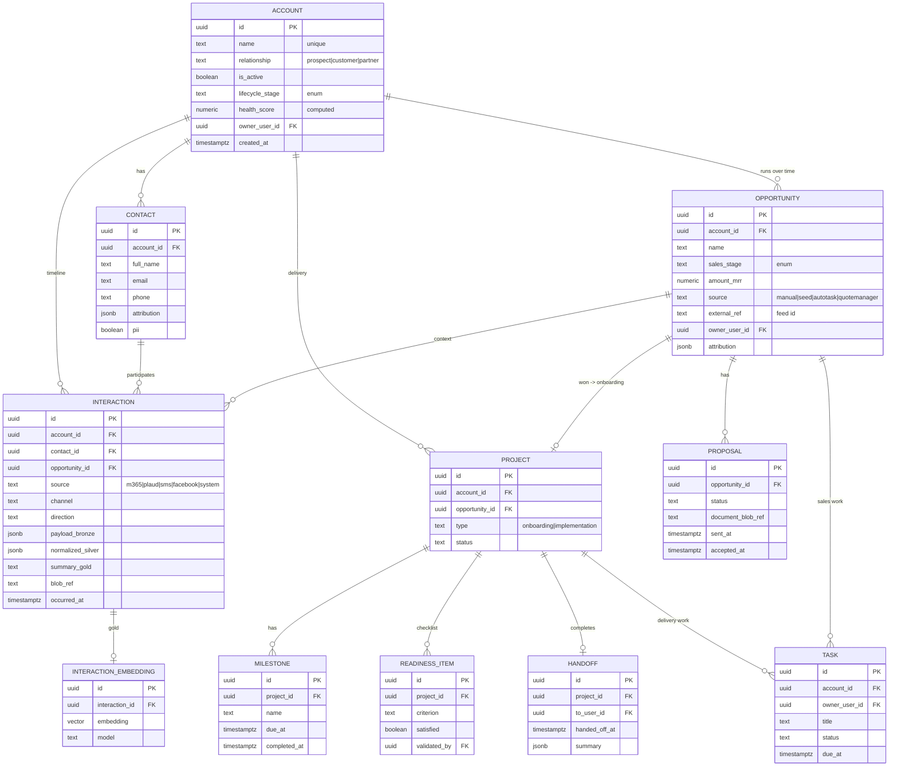
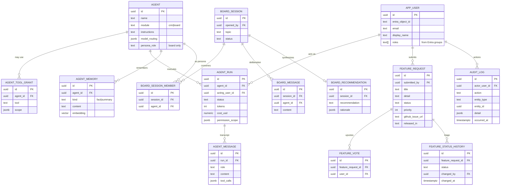

# Imperion CRM — Data Model

- **Status:** Draft (decisions D1–D11 locked 2026-06-07)
- **Related:** [product-requirements](../architecture/product-requirements.md),
  ADR-0010 … ADR-0016, [data-access-layer](./data-access-layer.md)
- **Store:** PostgreSQL + `pgvector` (ADR-0003), single unified store: system of
  record, embedding store, and agent memory.

## Principles

- **Modular by bounded context.** Each module (below) owns its tables; the spine
  (Account/Contact/Opportunity) is referenced by FK, never reshaped by satellites.
- **Staged enrichment (bronze→silver→gold, CLAUDE.md §4).** Raw payloads land in
  bronze (JSONB), are normalized to silver columns, and distilled to gold
  (summaries + embeddings) for agent consumption.
- **Append-only where it's evidence.** Interactions, consent events, agent runs,
  and audit logs are immutable event logs; current state is derived.
- **External systems are referenced, not owned.** Autotask/IT Glue data is polled;
  only an identity map + short-lived cache lives here.
- **PII-aware.** PII columns are tagged; access is audit-logged (ADR-0016).
- All PKs are `uuid`; all rows carry `created_at`/`updated_at`; soft-delete via
  `archived_at` where retention requires it.

> Conventions in the diagrams: `PK` primary key, `FK` foreign key. Attribute lists
> show **key** columns only, not the full DDL (that lands with the migrations in
> Phase 1).

## Diagram 1 — CRM core, delivery, and the engagement timeline

## Diagram 2 — Integrations, demand generation, communications & consent

## Diagram 3 — Agent platform, AI Board, feedback & identity

## Enumerations

- `account.relationship`: `prospect | customer | partner` (null = unknown)
- `account.lifecycle_stage`: `prospect | onboarding | implementation |
  operational_readiness | managed_active | dormant`
- `opportunity.sales_stage`: `lead | qualified | proposal | won | lost`
- `interaction.source`: `m365_email | m365_teams | plaud | sms | email |
  facebook | system`
- `consent_event.channel`: `email | sms | call_recording`

The dashboard's five-stage strip (Lead, Qualified, Proposal, Onboarding, Active) is
a **read view** mapping Opportunity `sales_stage` and Account `lifecycle_stage`, not
a stored field.

## Vector data (pgvector)

Embeddings live in `interaction_embedding`, `enrichment`, and `agent_memory`. Each
row records the embedding `model` so retrieval can filter by model and the corpus
can be re-embedded on model change. Retrieval is gold-only — agents query summaries
+ embeddings, never raw bronze. Chunking/retention policy: see open items in the
[requirements](../architecture/product-requirements.md).

## Build phases

The schema is designed in full now; tables are created per the phase plan in the
[requirements doc](../architecture/product-requirements.md#build-phasing-schema-designed-now-built-in-order).
Phase 1 creates the Diagram 1 spine + interactions + identity/RBAC and wires the
dashboard to real queries behind the existing repository abstraction (ADR-0007).
This ERD is updated on every schema change (CLAUDE.md §8).
