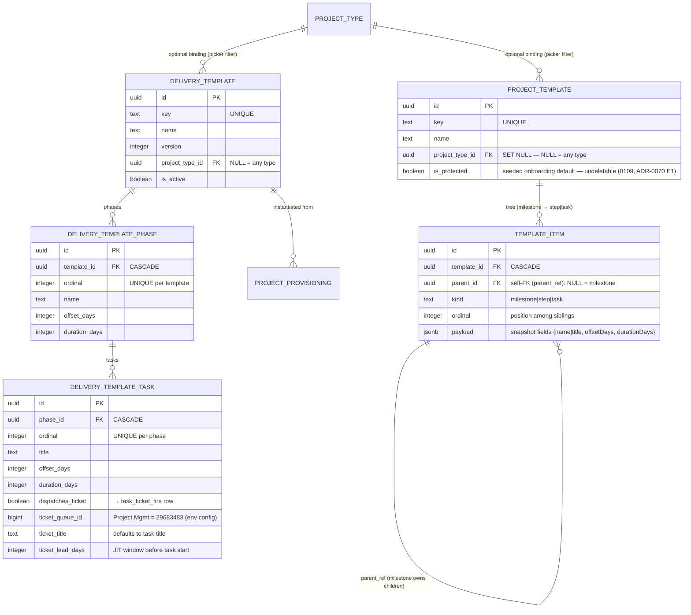
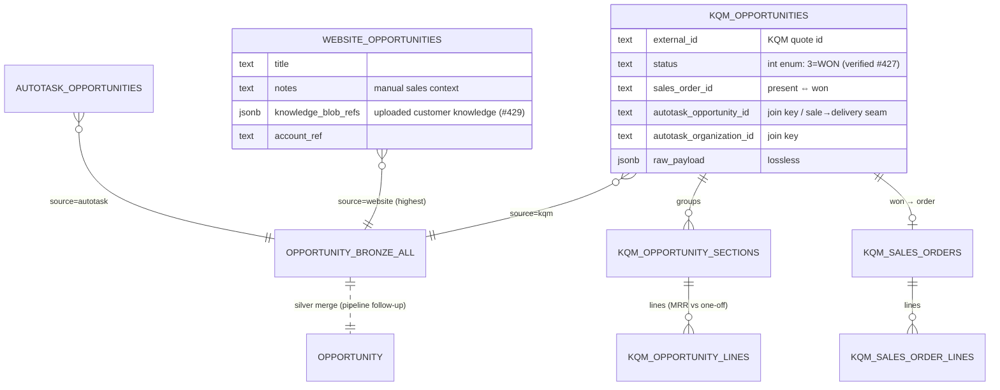
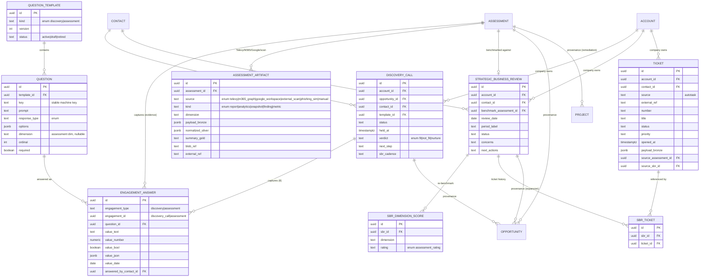
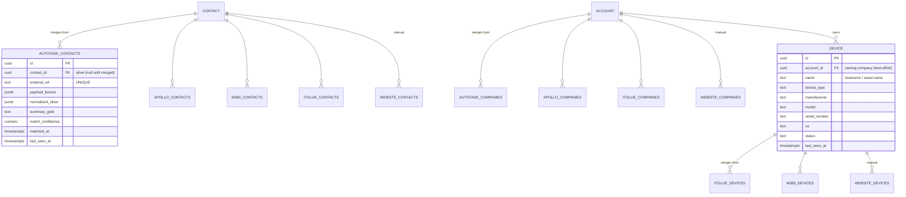
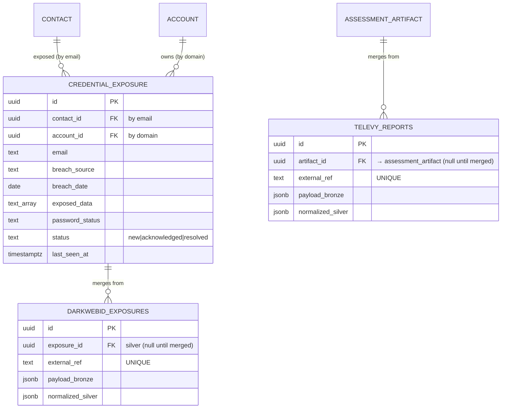
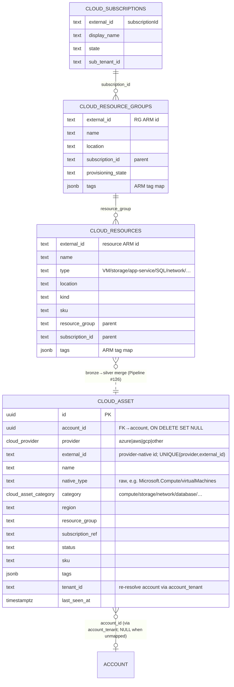
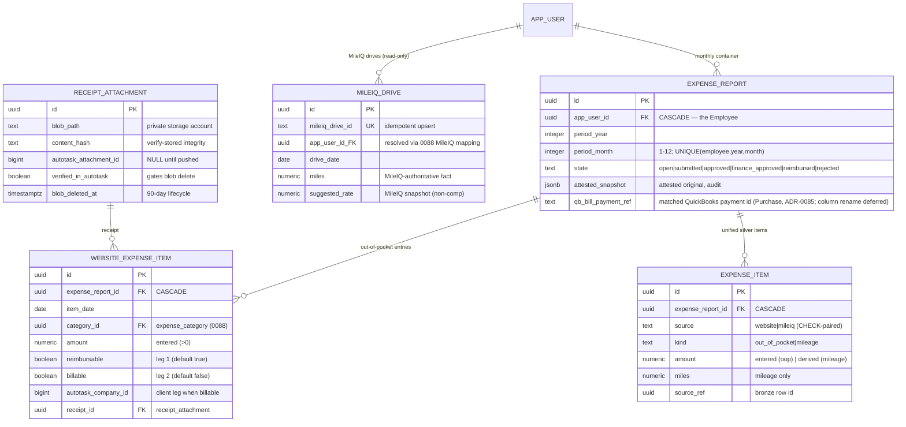
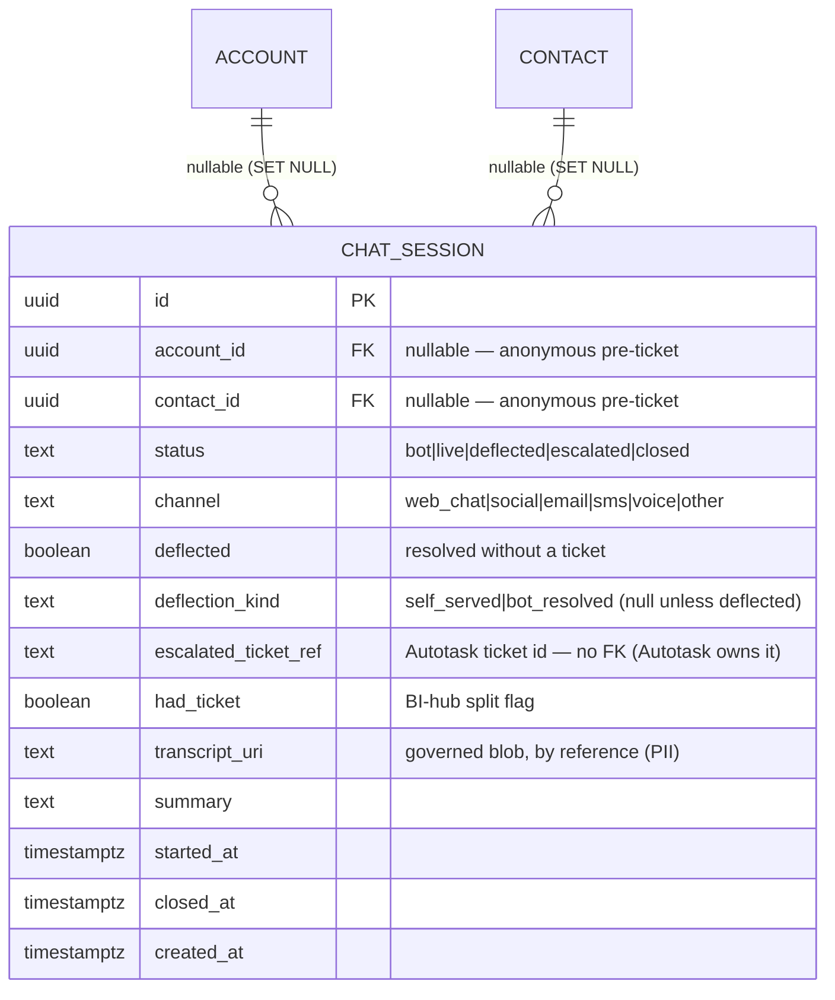

# Imperion OS — Data Model (ERD)

> **This is the structural reference** — every entity, column, FK, and enum, organized
> into five `erdiagram` blocks. For the *narrative* (how the store is organized, the
> medallion tiers, how to navigate, migration discipline) start at
> [schema-guide.md](schema-guide.md); for the *meaning* of each silver entity
> (source-of-record, joins, PII) see the governed
> [OKF semantic layer](semantic-layer/index.md) (ADR-0086). **Updated on every schema
> change** (CLAUDE.md §8).

- **Related:** [database overview](README.md) · [schema-guide](schema-guide.md) ·
  [data-access-layer](./data-access-layer.md) ·
  [product-requirements](../architecture/product-requirements.md) ·
  [ADR-0092 medallion data platform](../decision-records/ADR-0092-medallion-data-platform-consolidated.md)
- **Store:** PostgreSQL + `pgvector` (ADR-0003), single unified store: system of
  record, embedding store, and agent memory.

## Principles

- **Modular by bounded context.** Each module (below) owns its tables; the spine
  (Account/Contact/Opportunity) is referenced by FK, never reshaped by satellites.
- **Staged enrichment (bronze→silver→gold, CLAUDE.md §4).** Raw payloads land in
  bronze (JSONB), are normalized to silver columns, and distilled to gold
  (summaries + embeddings) for agent consumption.
- **Append-only where it's evidence.** Interactions, consent events, agent runs,
  and audit logs are immutable event logs; current state is derived.
- **External systems are referenced, not owned.** Autotask/IT Glue data is polled;
  only an identity map + short-lived cache lives here.
- **PII-aware.** PII columns are tagged; access is audit-logged (ADR-0016).
- All PKs are `uuid`; all rows carry `created_at`/`updated_at`; soft-delete via
  `archived_at` where retention requires it.

> Conventions in the diagrams: `PK` primary key, `FK` foreign key. Attribute lists
> show **key** columns only, not the full DDL (that lands with the migrations in
> Phase 1).

## Diagram 1 — CRM core, delivery, and the engagement timeline

```mermaid
erDiagram
    ACCOUNT ||--o{ CONTACT : has
    ACCOUNT ||--o{ OPPORTUNITY : "runs over time"
    ACCOUNT ||--o{ ASSESSMENT : "readiness assessments"
    ACCOUNT ||--o{ PROJECT : "delivery"
    ACCOUNT ||--o{ INTERACTION : "timeline"
    CONTACT ||--o{ INTERACTION : "participates"
    OPPORTUNITY ||--o{ PROPOSAL : has
    OPPORTUNITY ||--o{ ASSESSMENT : "sold via"
    OPPORTUNITY ||--o| PROJECT : "won -> onboarding"
    OPPORTUNITY ||--o{ INTERACTION : "context"
    PROJECT_TYPE ||--o{ PROJECT : "categorizes (RESTRICT)"
    PROJECT ||--o{ MILESTONE : has
    PROJECT ||--o{ READINESS_ITEM : "checklist"
    PROJECT ||--o| HANDOFF : "completes"
    PROJECT ||--o{ TASK : "delivery work"
    OPPORTUNITY ||--o{ TASK : "sales work"
    PROJECT ||--o{ SPRINT : "iterations (NULL=cross-project, 0107, ADR-0069 D4)"
    SPRINT ||--o{ TASK : "committed work (NULL=backlog)"
    PROJECT ||--o{ PROJECT_BASELINE : "planned-vs-actual snapshots (0108, ADR-0069 D6)"
    INTERACTION ||--o| INTERACTION_EMBEDDING : "gold"

    ACCOUNT {
      uuid id PK
      text name "unique"
      text relationship "prospect|customer|partner"
      boolean is_active
      text lifecycle_stage "enum"
      numeric health_score "computed"
      uuid owner_user_id FK
      timestamptz created_at
    }
    CONTACT {
      uuid id PK
      uuid account_id FK
      text full_name
      text email
      text phone
      jsonb attribution
      boolean pii
    }
    OPPORTUNITY {
      uuid id PK
      uuid account_id FK
      text name
      text sales_stage "enum"
      numeric amount_mrr
      text source "manual|seed|autotask|quotemanager"
      text external_ref "feed id"
      uuid owner_user_id FK
      jsonb attribution
    }
    PROPOSAL {
      uuid id PK
      uuid opportunity_id FK
      text title
      text status "enum draft|sent|accepted|declined"
      numeric amount_mrr
      text document_url "object-storage pointer"
      text notes
      timestamptz sent_at
      timestamptz decided_at
    }
    ASSESSMENT {
      uuid id PK
      uuid account_id FK
      uuid opportunity_id FK
      text name
      text status "enum proposed|scheduled|in_progress|delivered|closed"
      numeric fee_amount "one-time"
      boolean credit_to_onboarding
      text identity_rating "enum rating"
      text endpoint_rating "enum rating"
      text network_rating "enum rating"
      text email_rating "enum rating"
      text backup_rating "enum rating"
      text incident_rating "enum rating"
      text top_priorities
      text recommendation
      text report_url
      date kickoff_at
      timestamptz delivered_at
    }
    PROJECT_TYPE {
      uuid id PK
      text key "stable machine key, unique (0058, ADR-0052)"
      text name "unique display name"
      text description
      boolean is_protected "Onboarding seeded protected"
    }
    PROJECT {
      uuid id PK
      uuid account_id FK
      uuid opportunity_id FK
      uuid project_type_id FK "table, not enum (0058, ADR-0052)"
      uuid owner_user_id FK
      text name
      text status "legacy enum not_started|in_progress|blocked|complete"
      uuid status_def_id FK "SET NULL — configurable status (0104, ADR-0065 B5)"
      date target_live_date
      text notes
      timestamptz started_at
      timestamptz completed_at
    }
    MILESTONE {
      uuid id PK
      uuid project_id FK
      text name
      timestamptz due_at
      timestamptz completed_at
    }
    READINESS_ITEM {
      uuid id PK
      uuid project_id FK
      text criterion
      boolean satisfied
      uuid validated_by FK
    }
    HANDOFF {
      uuid id PK
      uuid project_id FK
      uuid to_user_id FK
      timestamptz handed_off_at
      jsonb summary
    }
    TASK {
      uuid id PK
      uuid account_id FK
      uuid owner_user_id FK
      uuid project_id FK "SET NULL — one task model (0058, ADR-0052)"
      uuid parent_task_id FK "CASCADE — subtask hierarchy (0095, ADR-0065 B1)"
      uuid sprint_id FK "SET NULL — committed sprint, NULL=backlog (0107, ADR-0069 D4)"
      text title
      text status "legacy label open|in_progress|done"
      uuid status_def_id FK "SET NULL — configurable status (0104, ADR-0065 B5)"
      text category "sales|project|onboarding|general"
      integer ordinal "sibling order under a parent (ADR-0065 B1)"
      text autotask_ticket_ref "on-demand push, unique (backend #19)"
      timestamptz due_at
    }
    SPRINT {
      uuid id PK
      uuid project_id FK "CASCADE — NULL=cross-project (0107, ADR-0069 D4)"
      text name
      date starts_at
      date ends_at
      text status "planned|active|completed"
    }
    PROJECT_BASELINE {
      uuid id PK
      uuid project_id FK "CASCADE — write-once snapshot (0108, ADR-0069 D6)"
      timestamptz captured_at
      jsonb planned_dates "frozen target go-live + task due dates"
    }
    INTERACTION {
      uuid id PK
      uuid account_id FK
      uuid contact_id FK
      uuid opportunity_id FK
      uuid project_id FK "SET NULL — project meetings (0066, ADR-0052 §5)"
      text source "m365|plaud|sms|facebook|system"
      text channel
      text direction
      jsonb payload_bronze
      jsonb normalized_silver
      text summary_gold
      text blob_ref
      timestamptz occurred_at
    }
    INTERACTION_EMBEDDING {
      uuid id PK
      uuid interaction_id FK
      vector embedding
      text model
    }
    STATUS_DEF {
      uuid id PK
      text scope "global|project_type (0104, ADR-0065 B5)"
      uuid project_type_id FK "CASCADE — null for global sets"
      text context "task|project"
      text key "stable machine key; unique per (context,scope,type)"
      text label
      text color
      text category "todo|in_progress|done — the reporting partition"
      integer ordinal "board column order"
      integer wip_limit "optional per-status cap (ADR-0066 C1); null = none"
    }
    TAG {
      uuid id PK
      text label "unique on lower(label) — global vocab (0096, ADR-0065 B6)"
      text color "design-token name, not hex"
      uuid created_by FK "SET NULL"
    }
    WORK_TAG {
      uuid tag_id FK "CASCADE — application of a tag"
      text parent_type "task|project (CHECK)"
      uuid parent_id "polymorphic — no FK"
    }
    TASK_DEPENDENCY {
      uuid predecessor_id FK "CASCADE — the blocking task (0098, ADR-0065 B2)"
      uuid successor_id FK "CASCADE — the blocked task"
      text type "blocks (finish-to-start) — CHECK"
    }
    WORK_ASSIGNMENT {
      text parent_type "task|project (CHECK) — 0099, ADR-0065 B3, #337"
      uuid parent_id "polymorphic — no FK"
      uuid user_id FK "CASCADE → app_user"
      text role "primary|assignee|watcher (CHECK); one primary per object (partial unique)"
    }
    TAG  ||--o{ WORK_TAG          : "applied via"
    TASK ||--o{ TASK_DEPENDENCY   : "blocks (predecessor)"
    TASK ||--o{ TASK_DEPENDENCY   : "blocked by (successor)"
    APP_USER ||--o{ WORK_ASSIGNMENT : "assigned/watches via"
    PROJECT_TYPE ||--o{ STATUS_DEF : "scopes status set (0104, ADR-0065 B5)"
    STATUS_DEF ||--o{ TASK         : "configurable status"
    STATUS_DEF ||--o{ PROJECT      : "configurable status"
```



### Multiple assignees & watchers (ADR-0065 B3, migration 0099, #337)

A work object (task today; `project` reserved in the `parent_type` CHECK) keeps a
**single primary owner** but can carry many additional **assignees** plus **watchers**.
Rather than widen the single `task.owner_user_id` FK, `work_assignment` is the polymorphic
people-on-work join — same shape as `work_comment` (0094) and `work_tag` (0096):
`(parent_type, parent_id, user_id, role)` with `role ∈ {primary, assignee, watcher}`.

- **Primary** is the single owner that still drives rollups, the Sales Queue (ADR-0052 §6)
  and RBAC. A partial unique index (`role='primary'`) enforces exactly one per object, and
  the data layer mirrors a primary change onto the legacy `task.owner_user_id` so existing
  reads stay in lockstep (acceptance: "primary still drives reporting").
- **Assignee** is an additional worker; **watcher** is a follower. Everyone attached sees
  the item and receives the relevant notifications (notification fan-out rides the ADR-0064
  A1 activity feed).
- The migration **backfills** every existing `task.owner_user_id` into a `primary` row
  (idempotent `ON CONFLICT DO NOTHING`). No FK on `parent_id` (polymorphic, same tradeoff
  as `work_comment`/`work_tag`); `ON DELETE CASCADE` on `user_id` clears a removed user.

### Sale→delivery orchestration tracking (ADR-0080, migration 0082)

Imperion is the **intent/schedule** plane; **Autotask is the execution SoR**. A won KQM
quote provisions an Autotask Project (template-emulated) and JIT project-queue Tickets.
Two **1:1 sidecar tables** track the binding + provisioning state without bloating the
core `project`/`task` model (one task model, ADR-0052 §2). Idempotency is **ours, not
Autotask's** — Autotask creates are non-idempotent (spike #426), so each row holds a
stable `idempotency_key` + state the executor checks before every write.

```mermaid
erDiagram
    PROJECT ||--o| PROJECT_PROVISIONING : "provisions to Autotask"
    TASK    ||--o| TASK_TICKET_FIRE     : "JIT project-queue ticket"
    PROJECT_PROVISIONING {
      uuid project_id PK_FK "CASCADE"
      text source_kqm_quote_id "won-quote provenance (#427)"
      bigint autotask_opportunity_id "the won→Autotask seam"
      bigint autotask_project_id "NULL until created"
      text provision_state "pending|creating|created|failed"
      text idempotency_key "UNIQUE — imperioncrm-project-{id}"
      timestamptz provisioned_at
      text last_error
    }
    TASK_TICKET_FIRE {
      uuid task_id PK_FK "CASCADE"
      text fire_state "none|scheduled|fired|failed"
      timestamptz scheduled_for "JIT window; NULL = manual-only"
      bigint autotask_ticket_id "NULL until fired; links via ticket.projectID"
      bigint autotask_queue_id "Project Management = 29683483 (env config)"
      text idempotency_key "UNIQUE — imperioncrm-taskticket-{id}"
      timestamptz fired_at
      text last_error
    }
```

> **Plane of control:** the web board reads these + *requests* a fire (sets `scheduled_for`
> / `fire_state='scheduled'`); the **backend executor** does the actual Autotask write and
> stamps the typed id (the front end never holds Autotask creds, ADR-0042). The pipelines
> read them to reconcile the written Project/Ticket back from `autotask_*` bronze.

### Delivery templates + provisioning contract gate (ADR-0081, migration 0084)

The orchestration spine (0082) needed an **input**: something to turn a won
opportunity into a native delivery project, and a *template* to shape it. The only
prior template was the hardcoded onboarding playbook (ADR-0037). Migration 0084 adds
a **data-driven delivery template** (template → phases → tasks) the team authors and
a human picks on the board to provision a won deal — generalizing the onboarding
playbook shape. Each template task optionally carries a **JIT dispatch-ticket spec**
that maps 1:1 to `task_ticket_fire` at instantiation. Provisioning is **human-triggered**
(ADR-0081 §2), never auto-on-won (Autotask `canDelete=False` → conservative-on-create).



`project_provisioning` (0082) gains `delivery_template_id` (provenance) and a **hard
contract gate** — `contract_state` (`none|sent|signed`), `contract_signed_at`,
`contract_envelope_ref` (DocuSign envelope, ADR-0071). The backend executor **must not**
provision a row unless `contract_state='signed'`; the `idx_project_provisioning_ready`
partial index is its gated work queue (`pending` + `signed`). The gate is enforced now
but **inert** (`'none'`) until DocuSign (#318) is wired.

### Opportunity as merged silver from three bronze sources (#428, migration 0083)

The `opportunity` (silver, ADR-0010) is **merged from three per-source bronze tables**, not
modelled per-source. Each adds unique data; the KQM `autotask_*` ids are the cross-source
join keys. Bronze follows the local-pipeline lossless envelope (LP ingests KQM + Autotask;
the web app writes the website source). **Precedence: website > autotask > kqm.**



> **Scope note (0083):** this migration lands the bronze tables + the `opportunity_bronze_all`
> union view. KQM has **no header total** — the silver merge sums *selected* lines
> (`is_recurring` splits MRR vs one-off). The silver `opportunity` **merge recompute** over
> the union (precedence website > autotask > kqm) is a pipeline-repo transform (ADR-0039
> pattern), shipped separately; 0083 does not modify the live `opportunity` table.

## Diagram 2 — Integrations, demand generation, communications & consent

> **As-built note:** Diagram 2 is the original *design* sketch. The tables actually
> built in migrations `0018`–`0026` are shown in **Diagram 5** (ADR-0024–0027), which
> refines this design — notably: `integration_connection` + `sync_state` became a
> single scope-aware **`connection`** (per-user *and* company, ADR-0024); `enrichment`
> became **`contact_enrichment`** with per-fact `lawful_basis` plus
> `contact_social_identity` (ADR-0025); the consent ledger gained `data_enrichment` and
> `ad_targeting` channels; and **`audience`/`audience_member`**, **`lead_hook`/
> `lead_capture_event`**, **`meeting_action_item`**, and the `engagement_answer`
> provenance columns were added. Diagram 5 is authoritative where they differ.

### Events + registration (ADR-0053, migration 0070)

**Events are first-class objects, campaigns are delivery vehicles.** `event`
(kind `webinar | live_event`; Teams `join_url` for webinars, `location` for live
events; typed `registration_page` jsonb; `workflow_id` auto-enrolls registrants once
#112 wires it) and `event_registration` (one row per signup: `contact_id`,
`capture_event_id` back to the capture inbox, status
`registered|attended|no_show|canceled`, unique per event+contact). A campaign of any
channel points at the event it promotes via `campaign.event_id`. Registration IS lead
capture: the `event_registration` lead-hook kind lands signups in
`lead_capture_event`, resolving to contacts like every other lead source. Funnel
numbers (registrations, attendance) are derived from `event_registration`, never
stored.


## Diagram 3 — Agent platform, AI Board, feedback & identity


## Diagram 4 — Engagement capture & long-term relationship (ADR-0023)

Discovery, assessment evidence, and SBRs are **account-scoped** (the contact is only
the employee who performed an instance). Questionnaires are editable data; answers are
stored once; downstream records point back via provenance FKs.



> **Provenance, not duplication:** `opportunity`, `project`, and `ticket` carry nullable
> `source_discovery_id` / `source_assessment_id` / `source_sbr_id` FKs so a downstream
> record points back to the engagement that produced it — the engagement's data is never
> copied forward.

### SLA breach read-model — `ticket_sla_breach` view (ADR-0074 §2, migrations 0118 + 0128)

SLA breach is a **read-model PROJECTION over silver `ticket`, not an authoritative
`sla_state` store** (ADR-0074 §2 — Autotask is the ticket system of record; Imperion keeps
no forked ticket state). It is a plain `CREATE OR REPLACE VIEW ticket_sla_breach`, so every
read recomputes against the latest pulled silver `ticket` — the pipeline's normal ticket
pull (bronze `autotask_tickets`, mig 0038 → `mergeTicketSources`) **is** the refresh; no
separate projection job exists. A breach annotation worth persisting is written to the
Autotask ticket via the API (ADR-0074 §2) and round-trips back through the pull — never
stored in this view.

**Columns it derives onto each ticket row:** `sla_applies` / `sla_id` (does a contractual
SLA apply, via the account's `contract.sla_id`, mig 0050), `first_response_due_at` /
`resolution_due_at`, `first_response_breached` / `resolution_breached`,
`resolution_time_remaining` (interval; negative = overrun), and an `sla_state` worklist
bucket (`breached` > `at_risk` (open, <25% of budget left) > `ok` > `unknown`).

**SLA targets — real Autotask targets now preferred (ADR-0074 §2, ADR-0044):** the ADR allows
targets from "Autotask SLA fields pulled into silver, OR computed against contract terms where
absent." **Migration 0128 (#666)** promotes the typed Autotask SLA-target timestamps
(`dueDateTime` / `firstResponseDateTime` / `resolvedDateTime`) — previously bronze-only
(`autotask_tickets.due_date_time` / `first_response_date_time` / `resolved_date_time`, mig 0038,
all-text) — to typed `timestamptz` columns on silver `ticket`: `sla_due_at` /
`sla_first_response_due_at` / `sla_resolved_at`. The view now `COALESCE`s the real targets
ahead of the derived policy — `COALESCE(t.sla_first_response_due_at, opened_at +
first_response_target)` and `COALESCE(t.sla_due_at, opened_at + resolution_target)` — feeding
those instants into the breach booleans, `resolution_time_remaining` and the `sla_state`
bucket, and uses `sla_resolved_at` to stop the first-response clock at the actual resolution
instant. The priority-keyed contract-term policy (critical/high/medium/low) is now only the
**fallback** used where a real target is NULL. **Sibling-repo follow-up (must land for this to
do anything, sequenced after this merges per CLAUDE.md §1):** the cloud pipeline's
`mergeTicketSources` must parse the three bronze text fields into the new typed columns. Until
then the columns are NULL and every `COALESCE` falls through to the derived policy — output is
unchanged, no regression. Read via `src/lib/sla-breach.ts` (typed `TicketSlaBreachRow`, worklist
sort + breach summary). PII-free: the view selects no ticket title/description/resolution text.

### AR/invoice mirror read-model — `invoice_mirror` view (ADR-0085 / ADR-0044, migration 0121, #668)

The accounts-receivable surface (money owed **to** the MSP) is a **read-only MIRROR over
bronze `qbo_invoices`, not an app-owned AR object** (#668 own-vs-mirror RESOLVED as MIRROR;
ADR-0085 — QuickBooks is the invoice system of record and read-only on our side, no app→QBO
write path). It is a plain `CREATE OR REPLACE VIEW invoice_mirror`, so every read recomputes
aging against the latest pulled bronze (`qbo_invoices`, mig 0120, LP #197 QBO pull) — that
pull **is** the refresh; no bronze→silver merge job exists or is needed (the reason a view
was chosen over a materialized table). The Collections (AR-dunning) and Controller
(reconciliation-assurance) agents (#667) detect/draft/escalate against it and **never move
money**.

**Columns it derives onto each invoice row:** type-cast `total_amount` / `balance` (from the
all-text bronze envelope), `is_open` (`balance > 0`), `days_overdue` (whole days past
`due_date`, only while open & overdue — else NULL), and an `aging_bucket` worklist partition
(`paid` · `current` · `1-30` · `31-60` · `61-90` · `90+`). The silver `account` is resolved
**best-effort by case-insensitive name** (LEFT JOIN; NULL on a miss — observability only).

**Follow-up (pipeline-owned, file as a sibling-repo issue per CLAUDE.md §1):** a typed
`account` ↔ QBO-customer mapping so the account join is a firm key rather than a name match;
and a `qbo_payments` apply/match if a paid-line breakdown is later needed. The mirror is
correct now (balance>0 is the open-AR truth); it sharpens when the mapping lands. Read via
`src/lib/data` `crm.listInvoices()` (typed `InvoiceMirrorRow`) + `src/lib/invoice-aging.ts`
(worklist sort + aging summary). PII-free: the view selects no customer email/phone/address.

### Collections / dunning overlay — `collections_activity` table (ADR-0085/0087, migration 0122, #677)

The dunning **workflow state** QuickBooks can't give us, layered on the read-only invoice
mirror: agents and humans **READ** `invoice_mirror`, **WRITE** this overlay (parent #668 —
own-vs-mirror RESOLVED: the AR fact is mirrored, the workflow state is app-owned). **Archetype
D (write-back sidecar) but app-native — NOT synced to QuickBooks**: there is still NO app→QBO
write path and no money movement; `promised` is a human-recorded promise-to-pay, not a payment.

A single table, **one CURRENT-state row per (tenant, invoice)** keyed by the QBO invoice id
**business key** (`qbo_invoice_id` text — the mirror is a VIEW, so no real FK; the app resolves
`tenant_id` from the mirror at write). Columns: `status` (`dunning_status` enum —
none|reminded|escalated|promised|paused|disputed), `escalation_level` (smallint ≥ 0),
`assignee_user_id` → `app_user` (SET NULL on delete), an **append-only `reminders` JSONB log**
(`[{ at, channel, kind, note }]`, appended via `||`, never rewritten), and internal `notes`.
Unique `(tenant_id, qbo_invoice_id)`. Gated by `collections:read` / `collections:write`
(admin∨finance, ADR-0030/0045). Read via `crm.getCollectionsActivity(qboInvoiceId)`, write via
`crm.upsertCollectionsActivity`; pure helpers in `src/lib/collections.ts`. The worklist UI is a
follow-up (#678). PII-free: no amounts/balances (read live from the mirror), no customer
contact data, no personal identifiers.

### Recurring invoice generation — `recurring_invoice_schedule` + `generated_invoice` tables (ADR-0085, migration 0199 placeholder, #1095)

The **billing** (money-out template) leg, the inverse of the read-only AR mirror (`invoice_mirror`,
0121, which covers money already billed). Tracer slice of epic #1045. **Two app-native tables**, NO
QBO write: QuickBooks is the invoice SoR and read-only on our side today (ADR-0085) and the
invoice-write OAuth scopes are **Mark-gated** — so generation produces app-side **drafts** that a
future gated backend job will POST to QBO; nothing here calls QuickBooks.

`recurring_invoice_schedule` (**archetype H**, config/template) holds the cadence the MSP authors
per account: an **RFC-5545 RRULE subset** `rrule` (`FREQ=…;INTERVAL=n`, parsed by the existing
`src/lib/recurrence.ts`, ADR-0070 E2 — one cadence vocabulary across the app), `line_items` JSONB
(`[{ description, quantity, unit_amount }]`), `net_terms_days`, `start_on`/`end_on`, a materialised
`next_run_on`, and the `last_generated_period` idempotency anchor. `status` is
`recurring_invoice_status` (active|paused|ended).

`generated_invoice` (**archetype D**, app-native until the push exists — the twin of
`collections_activity`) is the **per-period draft queue/ledger**: one row per (schedule, period),
**`UNIQUE (schedule_id, period_key)`** so a retry/overlap never double-bills. `status` is
`generated_invoice_status` (pending→drafted→pushed, plus failed|skipped); `qbo_invoice_id` /
`pushed_at` are written **ONLY** by the future Mark-gated QBO push and stay NULL until then — the
mirror (0121) then picks the invoice up read-only. `total_amount` is an app-side draft subtotal for
display/approval (Σ qty×unit, summed in cents); QBO recomputes tax/totals at push. Generation logic
is pure in `src/lib/recurring-invoice.ts` (`generateDueDrafts`, deterministic catch-up with a
`maxPeriods` safety cap). Gated by `invoicing:read` / `invoicing:write` (admin∨finance, ADR-0030).
PII-free: the billed party is a business; no personal data, no secrets.

### CMDB relationship layer — `ci_relationship` table (ADR-0078, migration 0131, #647)

The CMDB's first **persisted** table: a typed, directional **edge** between two Configuration
Items (#647, parent #372; CMDB authority ADR authored in parallel under #646). The CI register
(#645) is a READ-ONLY `cmdb_ci` UNION over silver `account` / `contact` / `device` (no
`cmdb_ci` table), so a CI is a polymorphic `(ci_type, ci_id)` pair; this table stores the
**edges between those pairs**. **Archetype D (app-native overlay)** — the twin of
`collections_activity` — but the IT Glue write-back is a **separate gated slice**, not here.

One row per edge: `(from_ci_type, from_ci_id) -[relation_type]-> (to_ci_type, to_ci_id)`.
Endpoints are CI **business keys** (text + CHECK on `account|user|device`), **not FKs** — a CI
is a projection, there is no `cmdb_ci` table, and `ci_id` is unique only within a `ci_type`
(the app validates both endpoints in the CI union before insert). `relation_type` is a loose
oriented vocabulary string (`belongs-to`, `assigned-to`, `depends-on`, …), not an enum, so new
types need no migration. `source` (`ci_relation_source` enum) = **derived** (recomputed from
silver FKs — `device`/`contact` `account_id` → `belongs-to`; recomputable via
`crm.deriveCiRelationships()`) or **manual** (human-authored, `cmdb:write`). **Manual edges
survive re-derivation:** the derivation deletes + reinserts ONLY `source='derived'` rows, and
`source` is part of the unique key `(from, to, relation_type, source)` so a manual edge of the
same shape coexists. A self-loop CHECK forbids an edge to the same CI. Indexed on both
endpoints (neighbourhood lookups query `from OR to`) and on `source` (the re-derivation delete).

Gated by `cmdb:write` (admin-only, ADR-0045) on every write; the register stays admin∨support
read (`canSeeCmdb`). Read via `crm.listCiRelationships(ciType, ciId)` (both directions); pure
helpers in `src/lib/cmdb/relationship.ts`. Backs the CI-detail "Relationships" panel + the
neighbourhood dependency-graph view. PII-free: an edge is two CI business keys + a relation +
an optional internal note; CI names/attributes resolve live from the read-only register.

### CMDB criticality overlay — `cmdb_ci_overlay` table (ADR-0078/0097, migration 0132, #648)

The CMDB's per-CI **criticality / business-impact** overlay: one row per Configuration Item
(#648, parent #372; CMDB authority ADR authored in parallel under #646 / PR #812). Where
`ci_relationship` (0131) is the **edge** overlay, this is the **attribute** twin — both
**archetype D (app-native overlay)** hung off the read-only `cmdb_ci` union (#645), keyed by
the polymorphic CI **business key** `(ci_type, ci_id)` (text + CHECK on `account|user|device`,
PRIMARY KEY), **not FKs** (a CI is a projection; `ci_id` is unique only within a `ci_type`; the
app validates the CI in the union before an UPSERT). A separate table, not a column on
`ci_relationship` — different grain (one CI vs one edge).

Each row carries `derived_default` + a nullable `override` (both `ci_criticality` enum =
`critical|high|medium|low`). **Effective criticality = `override ?? derived_default`** — the
weighting input for impact analysis (#650). The **derived_default** is computed from EXISTING
silver attributes (account `relationship` × `lifecycle_stage`; device `device_type`) and
recomputable via `crm.deriveCiCriticality()` (the same rule the migration seed and
`src/lib/cmdb/criticality.ts::deriveCriticality` encode, so SQL and code never diverge); it
**never** assigns `critical` (reserved for an explicit human override). The **override** is an
admin's rating (`cmdb:write`, with `override_by`/`override_at` audit) that **survives
re-derivation** — the derivation rewrites ONLY `derived_default`, never `override` (the same
survival pattern manual edges use). Indexed on `override` and `derived_default`.

Gated by `cmdb:write` (admin-only, ADR-0045) on writes (`crm.setCiCriticalityOverride` /
`crm.deriveCiCriticality`); read folded into `crm.listConfigurationItems()` (merged in code,
with an in-code derived fallback so the badge is meaningful before the overlay is seeded).
Backs the criticality badge on the CI register + the CI-detail criticality panel. PII-free: a
row is a CI business key + a rating + an admin/timestamp audit; CI names/attributes resolve
live from the read-only register. App-native — IT Glue write-back is a **separate gated slice**.

### Agent autonomy dial — `agent_autopilot_policy` table (ADR-0087, migration 0123, #721)

The data-driven **autonomy dial** for orchestration agents: one CURRENT autonomy rung per
`(agent_key, workflow_key, plane)` so **ramping an agent's autonomy is a data change, not a
code change** (ADR-0087's "one dial, stored as data"). **Archetype H** app-native
governance/control table (horizontal domain) — the twin of `agent_settings`, **not** the
unrelated `autopilot_policies` (migration 0038, Intune device-posture bronze; the name
collision is why this table is `agent_`-prefixed).

Columns: `agent_key` (stable roster key, e.g. `collections`), `workflow_key` (the work-unit,
or `'*'` = the agent default), `plane` (`agent_plane` enum — `icm`|`coding`|`infra`), `rung`
(`autonomy_rung` enum — `L0` observe | `L1` draft | `L2` act-gated | `L3` auto, default
`L1`), an orthogonal `mark_gated` boolean (when true, customer-facing/money/prod-migration/
deploy/X.0.0 legs still funnel to the 🔒 human queue regardless of rung), and a `note`. No
FKs — `agent_key`/`workflow_key` are loose roster keys (docs, not tables). Unique
`(agent_key, workflow_key, plane)`; re-ramping is an upsert. Read resolves most-specific
(exact `workflow_key` beats `'*'`); **no matching row ⇒ the safe default rung** (`L1`).
Read via `agent.getAutonomyPolicy({ agentKey, workflowKey?, plane })` (returns null ⇒ safe
default; pure resolvers in `src/lib/autonomy-dial.ts`); the `agents:operate`-gated write
(admin-only) is a server action. Backend orchestration agents read the rung here to make
their autonomy data-driven (e.g. BE #156 collections agent, today hardcoding `L1`). Run
telemetry stays in `agent_run`. PII-free: config keys only, no secrets, no client data.

## Diagram 5 — As-built: communications, connections, enrichment, demand-gen audiences & automation (ADR-0024–0027)

The multi-channel timeline (every comm is one `interaction`), per-user + company
connections, the lawful-basis-gated enrichment dossier, demand-gen audiences over the
aggregated profiles, lead-capture hooks, and nurture/pre-discovery automation. A comm
is related **first to the employee** (`interaction.owner_user_id`, via the connection
that produced it) and then to the contact/account.

```mermaid
erDiagram
    APP_USER ||--o{ CONNECTION : "personal connections"
    CONNECTION ||--o{ INTERACTION : "ingested via"
    APP_USER ||--o{ INTERACTION : "owner (employee)"
    ACCOUNT ||--o{ INTERACTION : "timeline"
    CONTACT ||--o{ INTERACTION : "participates"
    INTERACTION ||--o{ MEETING_ACTION_ITEM : "follow-ups"
    MEETING_ACTION_ITEM ||--o| TASK : "promoted to"
    ACCOUNT ||--o{ EXTERNAL_IDENTITY : "identity map"
    CONTACT ||--o{ EXTERNAL_IDENTITY : "identity map"
    CONTACT ||--o{ CONTACT_SOCIAL_IDENTITY : "linked profiles"
    CONTACT ||--o{ CONTACT_ENRICHMENT : "dossier (gold)"
    CONTACT ||--o| CONTACT_EMBEDDING : "profile vector"
    CONTACT ||--o{ CONSENT_EVENT : "append-only ledger"
    CONNECTION ||--o{ CONTACT_ENRICHMENT : "provenance"
    CAMPAIGN ||--o{ AD : contains
    CAMPAIGN ||--o{ CAMPAIGN_METRIC : "polled"
    CAMPAIGN ||--o{ CONTACT : "attributed"
    AUDIENCE ||--o{ AUDIENCE_MEMBER : "aggregated profiles"
    CONTACT ||--o{ AUDIENCE_MEMBER : "member of"
    LEAD_HOOK ||--o{ LEAD_CAPTURE_EVENT : captures
    LEAD_CAPTURE_EVENT ||--o| CONTACT : "resolves to"
    WORKFLOW ||--o{ WORKFLOW_STEP : has
    WORKFLOW ||--o{ WORKFLOW_ENROLLMENT : enrolls
    CONTACT ||--o{ WORKFLOW_ENROLLMENT : "nurtured by"

    CONNECTION {
      uuid id PK
      text scope "user(personal)|company|client (ADR-0103)"
      uuid owner_user_id FK "null for company/client"
      uuid account_id FK "owning account for client scope; null otherwise (ADR-0103)"
      text provider "m365|youtube|linkedin|facebook|autotask|itglue|myitprocess|televy|quotemanager|gdap|…"
      text status "active|pending|expired|revoked|error"
      text[] scopes
      text keyvault_secret_ref "KV secret NAME — never the token/secret value"
      text auth_method "certificate|secret (enterprise app)|api_key (UniFi etc, #960); null for OAuth (ADR-0103)"
      text cert_thumbprint "cert when auth_method=certificate (ADR-0103)"
      jsonb provider_config "non-secret per-connection config; UniFi {connectionType,controllerHost} (#962)"
      jsonb sync_cursor
      timestamptz last_sync_at
      int poll_interval_minutes "pipeline poll cadence; 0 = manual/paused (ADR-0038)"
    }
    INTERACTION {
      uuid id PK
      uuid account_id FK
      uuid contact_id FK
      uuid owner_user_id FK "employee"
      uuid source_connection_id FK
      uuid project_id FK "SET NULL — project meetings (0066, ADR-0052 §5); NULL on sales meetings"
      text source "enum interaction_source"
      text kind "email|message|call|meeting|social_comment|…"
      text subject
      text summary_gold
      timestamptz occurred_at
    }
    MEETING_ACTION_ITEM {
      uuid id PK
      uuid interaction_id FK
      uuid contact_id FK
      uuid owner_user_id FK
      text description
      text status "open|done"
      date due_at
      uuid source_task_id FK
    }
    EXTERNAL_IDENTITY {
      uuid id PK
      uuid account_id FK
      uuid contact_id FK
      text provider
      text external_id
    }
    CONTACT_SOCIAL_IDENTITY {
      uuid id PK
      uuid contact_id FK
      text platform
      text handle
      text profile_url
      int follower_count
      boolean verified
    }
    CONTACT_ENRICHMENT {
      uuid id PK
      uuid contact_id FK
      text attribute_key
      text value_text
      jsonb value_json
      numeric confidence
      text source
      uuid source_connection_id FK
      text lawful_basis "enum lawful_basis"
      timestamptz observed_at
      timestamptz expires_at
    }
    CONTACT_EMBEDDING {
      uuid id PK
      uuid contact_id FK
      vector embedding
      text model
    }
    CONSENT_EVENT {
      uuid id PK
      uuid contact_id FK
      text channel "email|sms|call_recording|data_enrichment|ad_targeting"
      text state "opt_in|opt_out"
      text lawful_basis
      text source
      jsonb proof
      timestamptz occurred_at
    }
    CAMPAIGN {
      uuid id PK
      text name
      text platform "facebook|google|youtube|linkedin|email|sms"
      text status "draft|active|paused|completed"
      numeric budget
      uuid event_id FK "event this campaign promotes (ADR-0053)"
      uuid workflow_id FK "auto-enroll attributed responders (#112)"
    }
    AD {
      uuid id PK
      uuid campaign_id FK
      text name
      jsonb creative "typed ADR-0053: headline, body, imageRef, cta, landingUrl, utm, audienceId; legacy rows: copy"
      text status
    }
    CAMPAIGN_METRIC {
      uuid id PK
      uuid campaign_id FK
      uuid ad_id FK
      date metric_date
      numeric spend
      int impressions
      int clicks
      int leads
    }
    AUDIENCE {
      uuid id PK
      text name
      text kind "static|dynamic"
      jsonb definition "criteria over enrichment"
      text platform_sync_ref
    }
    AUDIENCE_MEMBER {
      uuid audience_id FK
      uuid contact_id FK
      text source
    }
    LEAD_HOOK {
      uuid id PK
      text name
      text kind "web_form|facebook_lead|youtube_comment|…"
      jsonb config
      boolean active
    }
    LEAD_CAPTURE_EVENT {
      uuid id PK
      uuid hook_id FK
      jsonb payload_bronze
      uuid contact_id FK
      text status "new|resolved|ignored"
      timestamptz received_at
    }
    WORKFLOW {
      uuid id PK
      text name
      text kind "nurture|pre_discovery|re_engagement"
      jsonb trigger
      text status
    }
    WORKFLOW_STEP {
      uuid id PK
      uuid workflow_id FK
      int ordinal
      text kind "send_email|send_sms|chat_prompt|agent_enrich|wait|branch"
      jsonb config
    }
    WORKFLOW_ENROLLMENT {
      uuid id PK
      uuid workflow_id FK
      uuid contact_id FK
      uuid account_id FK
      text status "active|completed|exited — one ACTIVE per (workflow, contact), migration 0073"
      int current_step_ordinal
    }
```



> **Consent & lawful basis are the gate.** `current_consent` (a view = latest event
> per contact × channel) is read at send time and at ad-launch time; `contact_enrichment`
> rows each carry a `lawful_basis`. Outbound sends and ad targeting are blocked unless
> the relevant channel is currently opt-in (ADR-0014/0025/0026). The ledger is
> append-only — a change of mind is a new event, never an update.

## Diagram 6 — As-built: contact lifecycle, meetings, per-source bronze & onboarding PM (ADR-0030–0035)

Front-end-driven additions. The normalized `contact` gains a CRM-lifecycle axis (Leads
vs Contacts are opposite filters); structured `meeting` objects hang off the timeline;
per-source **bronze** rows merge into the silver `contact`/`account`; tasks are
categorized and onboarding gets R/Y/G milestones. RBAC roles live on `app_user.roles`
(ADR-0016/0030).


> **Onboarding playbook (ADR-0037).** The standard 9-phase, ~90-step MSP onboarding
> playbook lives in `lib/onboarding-template.ts`. `applyOnboardingTemplate` instantiates
> it: each phase → a `PROJECT_MILESTONE`, each step → an `ONBOARDING_STEP`. Checking off
> steps re-derives the phase R/Y/G. Ad-hoc PM work still uses `TASK` (category
> project/onboarding); the playbook checklist does not.

> **Subtasks / task hierarchy (ADR-0065 B1, #335, migration 0095).** A `TASK` carries a
> nullable self-FK `parent_task_id` (ON DELETE CASCADE — a parent's subtree dies with it)
> plus a sibling `ordinal`. One level is required; arbitrary depth is allowed (no DB depth
> cap). The task list shows top-level tasks only, with an **n/m children-done rollup** read
> per row; subtasks surface under their parent on the task edit page (add child inline,
> promote/demote). Re-parenting rejects self/descendant **cycles in the data layer**
> (recursive ancestor walk), never via a DB trigger. Auto-complete-on-children is **manual
> in v1** — the rollup flags "all done" but never forces the parent done (auto only via the
> out-of-scope rules engine). `onboarding_step` **coexists** (B1-F4 decision: coexist);
> unifying steps as a task `kind` is a tracked follow-up.

> **Task dependencies (ADR-0065 B2, #336, migration 0098).** Directed blocks /
> blocked-by links live in a `TASK_DEPENDENCY` join table —
> `{ predecessor_id, successor_id, type }`, where `predecessor_id` **blocks**
> `successor_id`. Both ends are real FKs to `task(id)` (ON DELETE CASCADE — deleting
> either endpoint removes the edge); the PK on `(predecessor_id, successor_id, type)`
> makes a link idempotent. `type` ships only `'blocks'` (finish-to-start) in v1, a
> CHECK-bounded enum-style column so later kinds widen additively. v1 is **soft**: a
> task is **flagged** BLOCKED when any predecessor isn't done, and the project view
> warns on unmet blockers before close — it is never hard-blocked (no trigger stops a
> close). Two structural guards live in the schema (no self-link CHECK, unique
> directed pair); full **cycle prevention** is enforced in the **data layer** — a
> recursive walk forward from the prospective successor refuses any link that would
> close a loop, mirroring the subtask ancestor walk (B1). Dependencies surface on the
> task edit page (add/remove, both directions navigable so "A blocks B shows on
> both") and as an unmet-blocker banner on the project detail page. The on-timeline
> connector render (C3) is a tracked follow-up, not this change.

> **Easy mode (ADR-0052 §3/§4, #101, migration 0067).** A step with a `deploy_key`
> renders the Deploy button and auto-creates ONE linked project task when the template
> is applied. Close is **verify-to-close**: completing the step (today the manual check,
> later the backend verification over posture silver — same path) closes the linked task
> idempotently; a deploy-flagged step completing with no linked task writes an
> `audit_log` note (`onboarding.deploy.no_linked_task`) instead. v1 ships SPARSE — no
> template step carries a key until the project-plan solidification exercise assigns
> them, so the button renders nowhere yet. Migration 0067 also grants the backend role
> SELECT on posture silver + UPDATE on `task`/`onboarding_step` for the verification
> check.

> **Apollo** (ADR-0035) is a company-scope `connection` provider and an enrichment
> source for both contacts and companies. The normalization/merge job
> (bronze → silver) runs in the pipeline repo (pipeline ADR-0006/0009).

> **SUPERSEDED by ADR-0039.** The single `CONTACT_SOURCE` / `ACCOUNT_SOURCE` tables above
> were replaced by **one physical bronze table per (source, entity)** plus a new `device`
> entity — see Diagram 6b. `contact`/`account` remain the silver aggregate; a `device` silver
> table is added.

## Diagram 6b — As-built: per-source bronze tables + device (ADR-0039)

Each source lands in its own bronze table (uniform shape; `source` implicit in the table name,
`UNIQUE(external_ref)`). Read-only union views `contact_bronze_all` / `account_bronze_all` /
`device_bronze_all` re-add a `source` key for the app's "Data sources" popup and the merge scan;
all writes target the physical tables. The merge folds every source into silver `contact` /
`account` / `device` by precedence (manual `website` highest).



> All `*_contacts` tables share the `AUTOTASK_CONTACTS` shape (with `contact_id`); all
> `*_companies` share it with `account_id`; all `*_devices` with `device_id`. Bronze tables:
> contacts `{autotask,apollo,m365,itglue,website}_contacts`, companies
> `{autotask,apollo,itglue,website}_companies`, devices `{itglue,m365,website}_devices`.

## Diagram 6c — Security & assessment ingestion (ADR-0040)

Dark Web ID compromised credentials and Televy assessment reports, ingested by the Azure
pipeline (per-source bronze, ADR-0039 shape). Dark Web ID merges into a new silver
`credential_exposure`; Televy stages in `televy_reports` then merges into the existing
`assessment_artifact` (`source='televy'`).



> Bronze read via the `exposure_bronze_all` view (single-source today). Wired but gated —
> nothing ingests until the Dark Web ID / Televy API key is configured in Settings (ADR-0040).

### M365 communications bronze (migration 0065, issue #182)

Three local-pipeline-envelope bronze tables (0038's contract: text flat columns,
lossless `raw_payload` jsonb, `content_hash`, PK `(tenant_id, source, external_id)`)
for the on-prem collectors' cross-org Imperion↔client communications — the lead-loop
feed (v1 gate 6):

| Table | Source | Collector (local pipeline) |
| --- | --- | --- |
| `m365_mail_messages` | `m365_email` | `Get-ImperionM365Mail` — mailbox, from/to/cc, subject, conversation_id, received/sent times |
| `m365_teams_chats` | `m365_teams` | `Get-ImperionM365TeamsChat` — user_upn, topic, chat_type, member emails/names |
| `m365_teams_meetings` | `m365_teams` | `Get-ImperionM365TeamsMeeting` — user_upn, organizer/attendees, start/end, join_url |

Writer: `imperion-localpipeline` (SELECT/INSERT/UPDATE, idempotent upserts, never
DELETE). Readers: the cloud pipeline (bronze→silver merge into `interaction`) and the
backend functions (interaction-timeline ingestion). The Teams collectors' flat `user`
property lands in `user_upn` (reserved keyword).

### Intune managed-devices bronze (migration 0069, #225 / local #75)

`intune_managed_devices` — same local-pipeline envelope, one row per Graph managedDevice
(unreduced, flat compliance queryable per ADR-0051 decision 6). Fed by the on-prem
collector `scheduled-tasks/m365/intune-devices.task.ps1` (local PR #123; self-gates
until this migration is applied). Indexed on `serial_number` and `azure_ad_device_id` —
the merge-join keys to silver `device` (and the #162 device policy-applied indicator).
Writer: `imperion-localpipeline`; readers: `mgid-imperioncrmpipeline` (merge) and the
web role (device page).

### Intune managed-apps bronze (migration 0148, #261, epic #873)

`intune_managed_apps` — the per-device managed/detected **app** inventory (the remaining
Intune drillable-detail gap after devices/compliance/config-policies). Same
local-pipeline envelope, one row per (device, app), fed by the on-prem collector over
Graph `DeviceManagementApps.Read.All` (a **Mark-gated** grant; the collector is a
local-pipeline companion, self-gates until this migration is applied). Queryable join
keys mirror the silver `device` merge keys: `managed_device_id`
(= `intune_managed_devices.external_id`, the primary join) and `serial_number` (fallback)
— both indexed. Flat app columns (`display_name`, `publisher`, `version`, `platform`,
`install_state`, …) stay all-text; true types + the lossless payload live in
`raw_payload`. **Bronze, not silver** — no silver entity, no OKF concept file. Writer:
`imperion-localpipeline`; readers: `mgid-imperioncrmpipeline`, the backend role, and the
web role (the device-CI detail **Managed apps** drill section). Surfaced via
`crm.listDeviceManagedApps(deviceId)` on the `/cmdb/device/<id>` detail.

### Meta Business Manager bronze + organic social silver (migration 0075, #253)

Six local-pipeline-envelope bronze tables for Imperion's own Business Suite assets
(FB Page + Instagram business account), read with a BM **system-user token** (on-prem
SecretStore custody) and collected/merged by the local pipeline (posture-merge
precedent — local repo writes silver here too):

| Table | What | Silver destination |
| --- | --- | --- |
| `facebook_posts` | Page feed posts | `interaction` (`social_post`, source `facebook`) |
| `facebook_comments` | Comments on page posts | `interaction` (`social_comment`) — timeline-only, never leads |
| `facebook_messages` | Page-inbox (Messenger) messages | `interaction` (`dm`) **+** `lead_capture_event` (kind `facebook_dm`) + contact resolve/create |
| `instagram_media` | IG media via the linked page | `interaction` (`social_post`, source `instagram`) |
| `instagram_comments` | Comments on IG media | `interaction` (`social_comment`) |
| `meta_insights` | Raw Page/IG insight snapshots | `social_metric` |

New silver table **`social_metric`** = the organic insights time series (platform,
entity, metric, period, value, captured_at); `campaign_metric` stays paid-campaign-only
(ADR-0012). Enums: `interaction_source` += `instagram`; `lead_hook_kind` += `facebook_dm`.
Writer: `imperion-localpipeline` (bronze write + widened silver merge surface:
`interaction` insert, lead capture, contact create, `contact_social_identity`); web role
reads. Collector contract: local-pipeline `docs/integrations/meta.md` (local #126).

**Backend Meta push grants (#1332, ADR-0053 slice E — backend #416/#406).** The backend
Function App role `mgid-imperioncrmbackendfunction` holds **`SELECT, UPDATE` on `campaign`
and `ad`** — it reads the `facebook`-platform worklist and writes the created Meta object
id back onto `external_ref`. Metric *writes* stay split per ADR-0053 decision 7: the
**pipeline** role owns `campaign_metric` (its daily Meta pull, ADR-0012), and the backend's
only metric-side write is `campaign_send.delivered_count` reconciliation (already granted in
0071). The backend is **not** granted `campaign_metric`.

### Threads bronze + interaction/social-metric mapping (migration 0208, #1336, ADR-0125)

Threads (`graph.threads.net`) is a **separate API with its own Threads OAuth** — it shares
no token or code with the FB/IG Graph Meta integration (0075), so it is a net-new connector
(`conn-company-threads`, company-scope; enum `connection_provider += 'threads'`) and a
net-new bronze set, but its data rides the **existing** unified timeline and social-metric
layer — no silo (epic #1334 slice S2; ADR-0125, plane ADR-0124). Four local-pipeline-envelope
bronze tables for Imperion's own Threads presence, collected + merged on-prem (LP ADR-0026,
S3 LP #356):

| Table | What | Silver destination |
| --- | --- | --- |
| `threads_posts` | Our own published Threads posts | `interaction` (`social_post`, source `threads`, direction outbound) |
| `threads_replies` | Replies on our Threads posts | `interaction` (`social_comment`, source `threads`, direction by author) |
| `threads_mentions` | Public Threads mentions of us | `interaction` (`mention`, source `threads`, direction inbound) |
| `threads_insights` | Raw Threads insight snapshots | `social_metric` (platform `threads`) |

No new silver table — both `interaction` and `social_metric` already exist (0018/0075); this
migration only enables the `threads` mapping. Enum: `interaction_source += 'threads'` (the
`mention`/`social_post`/`social_comment` `kind`s are free text, no enum). Per ADR-0124's
inbound split, v1 mentions are *of us* → ride the contact-centric timeline; anonymous public
brand chatter would later route to the plane's Social Engagement store, not here. Writer:
`imperion-localpipeline` (bronze write + `interaction` insert + `social_metric` upsert; **no**
lead-capture grant — Threads mentions are not leads, unlike FB DMs); web role reads bronze +
`social_metric`. Six App Review scopes (`threads_basic`, `threads_content_publish`,
`threads_manage_replies`, `threads_read_replies`, `threads_manage_mentions`,
`threads_manage_insights`) bound the build; outbound publish/reply is a governed Social Action
(backend, S4 BE #417) with a HARD customer-facing autonomy ceiling — **dormant/fail-closed**
until the token + Meta App Review land. No secrets (token in Key Vault as `conn-company-threads`,
by name only).

### Defender incidents + alerts bronze and Autotask layering (migration 0076, #256, ADR-0059)

`defender_incidents` (Graph `/security/incidents`) and `defender_alerts`
(`/security/alerts_v2`) — local-pipeline envelope, fed by the on-prem collector
(local #138; `SecurityIncident/SecurityAlert.Read.All` already consented). The
existing `sentinel_*` bronze (0038) is Sentinel rules/automation only and does NOT
cover these. `defender_alerts.incident_external_id` (indexed with tenant) groups
alerts under their incident. **Open incident** = `status` not
`resolved`/`redirected` (case-folded text match — bronze is all-text).

`defender_incident_ticket_link` (ADR-0059) pairs an incident with the Autotask
ticket worked for it — a standalone table, never a bronze column (loader full-row
upserts would clobber it). PK `(tenant_id, incident_external_id)` is the sync-back
idempotency key: at most one ticket per incident, writers use
`INSERT … ON CONFLICT DO NOTHING`, so ticket creation can never loop. Both sides
are external ids (no FKs — collectors land in any order); `origin` records who
asserted the link (`defender_to_autotask` | `autotask_to_defender` | `manual`).
Indexed on `autotask_ticket_external_id` for the ticket→incident reverse lookup.

Writers: `imperion-localpipeline` (bronze + auto-link) and
`mgid-imperioncrmbackendfunction` (link only — ticket creation is a process,
ADR-0042). Cloud pipeline + web read. Surfaced today as the open-incident badge on
the account Security posture card (joined via `account_tenant`).

### Entra auth methods bronze — per-user MFA registration (migration 0077, #258)

`entra_auth_methods` — local-pipeline envelope, fed by the on-prem collector (local
#140; `UserAuthenticationMethod.Read.All`). One Graph call per tenant —
`/reports/authenticationMethods/userRegistrationDetails` — covers every user's
`isMfaRegistered` / `isMfaCapable` / `methodsRegistered` / SSPR state /
preferred-method fields, flattened to all-text columns (true types live in
`raw_payload`). `external_id` = the Entra user object id, so re-collection upserts
per user. **MFA registered** = `is_mfa_registered` case-folded `'true'` (bronze is
all-text).

Writer: `imperion-localpipeline`. Cloud pipeline, backend, and web read. Surfaced
today as the MFA coverage badge ("X% MFA registered (of Y users)") on the account
Security posture card, joined via `account_tenant` (ADR-0051). It is posture-pillar
*input* only — the Imperion Secure Score composite is unchanged (model versioning is
ADR-0051-governed; a pillar change would be a new Score Model version + ADR).

### SharePoint sites bronze — site inventory, metadata only (migration 0078, #255)

`sharepoint_sites` — local-pipeline envelope, fed by the on-prem collector
(local-pipeline companion issue; `Sites.Read.All`). Flattens Graph `/sites`
(getAllSites enumeration) per tenant: display name, web URL, description,
created/last-modified, web template, personal-site flag, site-collection hostname,
and storage used/quota where Graph exposes them — all-text columns (true types live
in `raw_payload`). `external_id` = the Graph composite site id, so re-collection
upserts per site.

**No file content, by design.** `Files.Read.All` was pruned from the per-client
Onboarding app (pipeline ADR-0018, 2026-06-12 per-source review); only
`Sites.Read.All` remains. The table has no file/drive/item columns and none may be
added — site *metadata* is the entire surface.

Writer: `imperion-localpipeline`. Cloud pipeline, backend, and web read. Surfaced
today as the drillable "SharePoint sites" section on the Company 360, joined via
`account_tenant` (ADR-0051): per-site drill shows dates, template, storage, and an
outbound link to the site itself.

### Entra groups + membership bronze — feeds the user object (migration 0079, #257)

`m365_groups` (Graph `/groups`) and `m365_group_members` (per-group member
expansion, `/groups/{id}/members`) — local-pipeline envelope, fed by the on-prem
collector (local #139; `Group.Read.All` / `GroupMember.Read.All`). All-text flat
columns (true types live in `raw_payload`). `m365_groups.external_id` = the Entra
group object id. Membership has no single natural id, so
`m365_group_members.external_id` is the collector-built `<group id>/<member id>`
composite (0078 composite-id precedent — the generic envelope upsert stays
intact); the flat parts `group_external_id` / `member_external_id` carry the
(tenant, group, member) key, indexed both ways (group → members, member → groups).

**The user-object join (Mark's 2026-06-12 verdict: groups are bronze to the USER
object):** `m365_group_members.member_external_id` = the Entra user object id =
`m365_contacts.external_ref`, whose `contact_id` is the silver contact resolved by
the pipeline's contact merge. Group kind derives from the raw Graph fields:
`group_types` containing `Unified` = Microsoft 365 group, else
`security_enabled` / `mail_enabled` (case-folded — bronze is all-text);
`membership_rule_processing_state = 'On'` marks dynamic groups.

Writer: `imperion-localpipeline`. Cloud pipeline, backend, and web read. Surfaced
today as the drillable "Directory groups" section on the Contact 360 (groups the
contact belongs to, via the bronze join above). A deeper silver merge (group
context folded into `contact_enrichment` by the pipeline's contact-matcher) is the
follow-up issue noted on #257.

### DNS posture — migration 0080 (#308, ADR-0063)

Per-customer DNS posture across two capture planes (ADR-0063). **Bronze** (all-text
local-pipeline envelope, true types in `raw_payload`):

`dns_zones` — Azure DNS zones via the on-prem ARM collector (local #155).
`external_id` = the ARM zone resource id; `manageable` = a write role (DNS Zone
Contributor / Contributor / Owner) proven by a role-assignment read; `verdict` is
collector-computed (`not-in-azure` | `in-azure-readonly` | `managed`). This is the
manage plane that proves "hosted in Azure and manageable".

`dns_records` — DNS recordset snapshots via the ARM collector (`plane = azure`,
authoritative zone config) and the public-resolution collector (`plane = public`,
local #156 — what the domain resolves to from the outside, the only signal for
domains not in Azure DNS). `external_id` = `<domain>|<plane>|<type>|<name>`; indexed
by domain and by (domain, plane) for cross-plane reconciliation.

**Silver** (real types, keyed per `(tenant_id, domain)`, written by the drift merge
local #157): `dns_golden` — the human-approved DNS Golden State per domain
(`golden_hash` + `golden_records`, approved via `Set-ImperionDnsGoldenState`);
`dns_domain` — the per-domain rollup: governance `verdict` (CHECK-constrained),
`records_compliant|drift|ungoverned|missing` counts (full-outer-join of captured vs
golden, ADR-0051 §3 semantics), 0–100 `score`, `last_captured_at`.

Writer: `imperion-localpipeline`. Cloud pipeline, backend, and web read. DNS is a
candidate Posture Pillar for Score Model v2 (deferred behind an ADR-0051 amendment,
blocked-on-data like MFA #265). **Apply 0080 to prod before the GUI read PR (#309)
merges** (schema-lag foot-gun #301/#302).

#### Domain source — `account_domain`, migration 0081 (#334, ADR-0063 amendment)

ADR-0063 originally assumed DNS domains were derived from a tenant's verified domains,
but the system has **no domain source** (no account/company domain column; per-client
Graph not built). Mark's model: **each account has a GUI-managed list of domains (one or
several), and DNS posture checks each.** So `account_domain (account_id, domain, note,
created_at, created_by)` — PK `(account_id, domain)` — is the **single domain source of
truth**, edited per account in the GUI (web MI holds SELECT/INSERT/DELETE; pipeline +
backend read). DNS ownership is now **account-keyed**: `account_id` was added (additive,
nullable) to the four `dns_*` tables; the silver merge (#157) stamps it from
`account_domain`. `security.listDnsDomainsForAccount` is account_domain-driven — it LEFT
JOINs `dns_domain` so a tracked-but-not-yet-captured domain still surfaces (null verdict),
through the optional-enrichment seam (#301). **Apply 0081 to prod before the read PR
merges.**

### Security-posture bronze drain — sensitivity labels, custom security attributes, EasyDMARC (migration 0106, #575/#581)

Three already-shipped collectors/readers get their front-end-owned bronze tables in one
migration (≤1 FE migration-author per wave, §10.3). All-text local-pipeline envelope
(0080 contract: flat text columns, true types + lossless original in `raw_payload`), PK
`(tenant_id, source, external_id)`, `content_hash` for change detection; bronze stays
permissive (no CHECK):

`m365_sensitivity_labels` — Microsoft Purview / M365 sensitivity labels per mapped tenant.
`external_id` = the Purview label id; `priority` (lower = more sensitive) and `is_active`
are text. Read account-scoped via `account_tenant` by the #259 surface
(`src/lib/security/sensitivity-csa.ts`). Collector = local #141.

`entra_custom_security_attributes` — Entra CSA **definitions** (`attribute_set` + `name`)
per mapped tenant; `external_id` = `<attribute_set>|<name>`. The #259 card benchmarks
observed names against the MSP `STANDARD_CSA_SET`. Definitions only — assignments are out
of scope until a collector needs them. Collector = local #141.

`easydmarc_domains` — **new source**: per-domain email-authentication posture
(DMARC/SPF/DKIM/BIMI status + `setup_status`, `dmarc_policy`, `organization_ref`).
`external_id` = the domain. Field names are best-effort from EasyDMARC docs (no live key
yet) — `raw_payload` is lossless so casing/name drift is recoverable without a migration.
The DMARC aggregate-report (RUA) table is deferred (#581) until a live key exists; a silver
posture entity will get an OKF concept file at the silver-merge, not here. Collector =
local #122 (gated on this + the EasyDMARC API key, Mark-gated).

Writer: `imperion-localpipeline` (idempotent upsert, never DELETE). Cloud pipeline,
backend, and web read. The #259 sensitivity/CSA card and the EasyDMARC surface light up
automatically once 0106 is applied (schema-lag-tolerant readers, #301/#302). **Apply 0106
to prod for the feeds to populate.**

> **Already-satisfied siblings (closed, no migration this wave):** `mileiq_drive` (#590)
> and `qbo_expense_account` (#592) were requested as bronze-drain tables but already exist
> and are prod-applied — `qbo_expense_account` in **0088** (typed bronze, `qbo_account_id`
> natural key) and `mileiq_drive` in **0089** (typed bronze, `mileiq_drive_id` natural key).
> Both ship the expense-tracking ADR-0083 set; the existing column contracts satisfy the
> requests, so #590/#592 were closed rather than re-authored.

### Per-client Azure ARM cloud-resource bronze (migration 0130, #800; CMDB cloud-asset, #372/ADR-0078)

Three bronze tables hold the **per-managed-client Azure ARM inventory** that backs the
CMDB **cloud-asset CI type** (#372 / ADR-0078). The on-prem collector
(`Get-ImperionCloudResource` → `Set-ImperionCloudResourceToBronze`, source key
`azure_arm`, LocalPipeline #201/#216) is already authored against these names and merges
**dormant** (fail-loud) until they exist; 0130 lands the schema dependency only.

**Distinct from the `azure_*` posture set** (`azure_subscriptions` / `azure_resource_groups`
/ `azure_resources`, migration 0038, ADR-0008). Those are the **partner-tenant**,
security-scoped inventory (one tenant, Sentinel/Secure-Score scoped, not account-relatable).
These `cloud_*` tables are **per-client**, CMDB-shaped, fanned out across client tenants, and
account-relatable. They are kept separate on purpose — folding ARM CMDB inventory into the
posture set would overload that set's meaning (a silver/OKF hazard).

All-text local-pipeline lossless envelope (0080 contract: flat text columns, true types +
lossless original in `raw_payload`), PK `(tenant_id, source, external_id)`, `content_hash`
for change detection; bronze stays permissive (no CHECK / no FK). ARM `tags` is stored as
`jsonb` (a small key→value map, like 0083 `knowledge_blob_refs`).



`external_id` is the ARM **resource id** (`cloud_resources`), the **RG ARM id**
(`cloud_resource_groups`), or the **`subscriptionId`** (`cloud_subscriptions`). The
parent-id columns (`subscription_id`, `resource_group`) are indexed for the later silver
walk (RG → subscription → resource). Writer: `imperion-localpipeline` (idempotent upsert,
never DELETE). Web, backend, and cloud-pipeline roles read.

> **Scope note (0130 → 0139):** 0130 landed the bronze tables only. The silver **`cloud_asset`**
> table (provider-agnostic), the `cloud_resource_bronze_all` projection, and the OKF concept file
> now land in **migration 0139** (#874) — see [`semantic-layer/tables/cloud_asset.md`](semantic-layer/tables/cloud_asset.md).
> The bronze→silver merge is the cloud **Pipeline**'s ([Pipeline #126](https://github.com/markdconnelly/ImperionCRM_Pipeline/issues/126));
> ARM ingest + `account_tenant` population is the **LocalPipeline**'s (#201). The CMDB `cloud` CI
> arm that projects `cloud_asset` is #875. **Apply 0130 + 0139 to prod before the collector
> populates** (the merge runs on 0 rows until then).

## Diagram 6d — Tenant Mapping (ADR-0051, migration 0061)

Posture bronze is keyed by Microsoft tenant GUID; the app navigates by account.
`account_tenant` is the explicit, admin-managed mapping (Settings surface) — one account
per tenant, an account may own several tenants, never inferred from domains. Tenants in
posture bronze with no mapping surface in an "unmapped tenants" admin list. Both pipeline
roles read it to resolve account→tenants for posture merges (pipeline #20 on-demand;
on-prem bulk + quarterly snapshots).

Migration 0062 adds the posture silver pair: `posture_policy` (current classification
per tenant + family + policy — the Get-ImperionPolicyDrift FULL OUTER JOIN semantics:
`compliant | drift | ungoverned | missing`; replaced per merge) and `tenant_posture`
(one-row-per-tenant rollup). Writers: both pipeline roles (on-prem bulk, cloud
on-demand) — the SAME classification rules by ADR-0051 decision 2.

Migration 0063 adds the immutable snapshot pair: `posture_snapshot` (per-account
Imperion Secure Score at capture — composite, stored letter grade, Score Model
version; triggers `scheduled | on_demand | business_review`, the last FK'd to
`strategic_business_review` with ON DELETE SET NULL so deleting a review never
destroys posture history) and `posture_snapshot_pillar` (one row per pillar:
covered flag, 0–100 score — 0 when uncovered, weight, report-ready `metrics`
jsonb). Append-only by GRANT: pipeline writers hold INSERT but no UPDATE/DELETE —
grades and composites are never recomputed after capture (ADR-0051 decision 5).
Migration 0064 (#167) completes the enforcement: the web app role is SELECT-only on
both tables (inherited INSERT/UPDATE/DELETE revoked) — snapshot creation is a
*process* (ADR-0042) owned by the pipeline/backend roles, never the GUI.


> `posture_policy`/`tenant_posture` are keyed by tenant GUID, not FK'd to
> `account_tenant` — posture for an unmapped tenant still lands and surfaces in the
> unmapped list rather than being rejected (ADR-0051: surface, never hide).

The web app's posture reads (#93) are account-scoped and always join THROUGH
`account_tenant`: the tenant rollup is a LEFT JOIN from the mapping (a mapped tenant
the pipeline hasn't classified yet surfaces with an all-null rollup), the policy and
secure-score-control reads are INNER JOINs (no mapping → no rows), and credential
exposures read silver `credential_exposure` by its own `account_id` (the ADR-0040
domain match, independent of Tenant Mapping).

## Enumerations

- `account.relationship`: `prospect | customer | partner` (null = unknown)
- `account.lifecycle_stage`: `prospect | onboarding | implementation |
  operational_readiness | managed_active | dormant`
- `opportunity.sales_stage`: `lead | qualified | proposal | won | lost`
- `proposal.status`: `draft | sent | accepted | declined`
- `project.type`: `onboarding | implementation`
- `project.status`: `not_started | in_progress | blocked | complete`
- `assessment.status`: `proposed | scheduled | in_progress | delivered | closed`
- `assessment_rating` (per dimension): `at_risk | needs_work | solid | strong`
- `engagement_kind`: `discovery | assessment`
- `question_response_type`: `text | longtext | number | currency | boolean |
  single_select | multi_select | rating | date`
- `discovery_call.verdict`: `fit | not_fit | nurture`
- `assessment_artifact.source`: `televy | m365_graph | google_workspace |
  external_scan | phishing_sim | manual`
- `assessment_artifact.kind`: `report | analytics | snapshot | finding | metric`
- `interaction.source`: `m365_email | m365_teams | plaud | sms | email |
  facebook | system | youtube | linkedin | whatsapp | phone_call | in_person |
  meeting | web_form` (extended in ADR-0024 for the multi-channel timeline)
- `interaction.kind`: `email | message | call | meeting | transcript | summary |
  social_post | social_comment | dm | ad_engagement | note`
- `consent_event.channel`: `email | sms | call_recording | data_enrichment |
  ad_targeting` (last two added by ADR-0025/0026 to gate enrichment & ad use)
- `consent_event.state`: `opt_in | opt_out`
- `lawful_basis`: `consent | legitimate_interest | contract | public_data` (ADR-0025)
- `connection.scope`: `user | company` (ADR-0024)
- `connection.provider`: `m365 | google | youtube | linkedin | facebook | plaud |
  autotask | itglue | apollo | myitprocess | televy | quotemanager | gdap | darkwebid |
  acs | qbo | meta` (apollo by ADR-0035; myitprocess/televy/quotemanager/gdap by
  ADR-0036; darkwebid/acs/qbo added in migrations 0042/0071/0093; meta = company FB/IG
  send credential, migration 0127, #603)
- `connection.status`: `active | expired | revoked | error | pending` (pending added by
  ADR-0036 for credentials recorded before the backend writes the secret)
- **Uniqueness:** `uq_connection_company_provider` — partial unique index on
  `(provider) WHERE scope = 'company'`, so each company system has exactly one row;
  re-saving a credential rotates it in place rather than duplicating (ADR-0036, migration 0033).
- `contact.crm_stage`: `audience | lead | prospect | client` (ADR-0031; Leads =
  not-client, Contacts = client — opposite filters of one object)
- `meeting.platform`: `teams | plaud | other` (ADR-0011/0033 structured meeting)
- ~~`contact_bronze_source` / `company_bronze_source`~~ — **removed in ADR-0039** (migration
  0037). Source is now the bronze table identity, not an enum; manual entries use the `website`
  source (per-source tables in Diagram 6b).
- `task.category`: `sales | project | onboarding | general` (ADR-0034)
- `milestone_status`: `not_started | in_progress | blocked | complete` (ADR-0034)
- `milestone_health`: `green | amber | red` (ADR-0034; R/Y/G onboarding indicator)
- `campaign.platform`: `facebook | google | youtube | linkedin | email`
- `campaign.status` (and `ad.status`): `draft | active | paused | completed`
- `audience.kind`: `static | dynamic`
- `lead_hook.kind`: `web_form | facebook_lead | youtube_comment | linkedin_message |
  inbound_email | qr | manual | event_registration` (event_registration by ADR-0053,
  migration 0070 — hook `config` carries the event id)
- `event.kind`: `webinar | live_event` (ADR-0053, migration 0070)
- `event.status`: `draft | scheduled | live | completed | canceled` (leaving draft
  requires `starts_at`)
- `event_registration.status`: `registered | attended | no_show | canceled`
  (attendance recorded post-event; funnel counts derived, never stored)
- `campaign_send.status`: `draft | scheduled | sending | sent | canceled` (ADR-0053,
  migration 0071); `channel`: `email | sms`; `recipient_scope`: `audience |
  event_registrants` — non-draft sends carry exactly one of `send_at` /
  `event_offset_minutes` (CHECK-enforced); recipients materialize at fire time,
  consent-gated per recipient per channel
- `campaign.platform` gains `sms`; `connection.provider` gains `acs` (migration 0071)
- `workflow.kind`: `nurture | pre_discovery | re_engagement`
- `workflow_step.kind`: `send_email | send_sms | chat_prompt | agent_enrich | wait |
  branch`
- `workflow_enrollment.status`: `active | completed | exited`
- `engagement_answer.source`: `human | agent | automation` (ADR-0027)
- `engagement_answer.status`: `draft | confirmed | rejected` (ADR-0027)

The dashboard's five-stage strip (Lead, Qualified, Proposal, Onboarding, Active) is
a **read view** mapping Opportunity `sales_stage` and Account `lifecycle_stage`, not
a stored field.

## Diagram — Employee time tracking (ADR-0082)

Imperion tracks employee time as **website-authoritative weekly timesheets** (attendance),
corroborated by Autotask Ticket Time Entries, documented back to Autotask as one weekly
Time Ticket, and verified paid read-only against QuickBooks. An **Employee** is an existing
`app_user` EXTENDED — never reshaped — by a payroll-role-gated comp store. This section
grows with the migrations (0085 comp/mapping → 0086 attendance/timesheet/silver → 0087
time_ticket/recon); only the **0085** tables are shown below.

```mermaid
erDiagram
    APP_USER ||--o| EMPLOYEE_PROFILE : "1:1 time-tracking extension"
    APP_USER ||--o{ PAY_RATE         : "effective-dated comp"
    EMPLOYEE_PROFILE {
      uuid app_user_id PK_FK "CASCADE — 1:1 sidecar on app_user"
      text classification "1099|W2 (v1 all 1099) — comp-sensitive"
      bigint autotask_resource_id "mapping — joins Ticket Time Entries"
      text quickbooks_vendor_id "mapping — matches QB payments"
      timestamptz mappings_resolved_at "email-resolve audit"
      uuid mappings_confirmed_by_FK "who confirmed once"
      boolean is_active
    }
    PAY_RATE {
      uuid id PK
      uuid app_user_id FK "CASCADE"
      date effective_from "rate in force from this date"
      text rate_kind "hourly|salaried (salaried=W2, dormant)"
      numeric hourly_rate "v1 1099-hourly straight"
      numeric salaried_annual "W2-dormant"
      numeric overtime_multiplier "1.5x FLSA, W2-dormant"
      uuid created_by_FK "who set it"
    }
```

> **Comp data is the highest-sensitivity surface here (ADR-0082 §Security).** It lives in
> a SEPARATE store, never on the Entra-synced `app_user` row, never employee/agent/client-
> visible. Grants: `pay_rate` (the comp itself) → web (app-gated to `finance`/`admin` via
> `canApprovePayroll`) + backend reconciliation **read** only. The pipelines get **column-
> level** SELECT on `employee_profile`'s **mapping** columns only (Resource/vendor ids, to
> join Autotask Time Entries to an employee) — never `classification`, never `pay_rate`.
> The Timesheet reconciles against the rate with the greatest `effective_from <=` its week.

**Attendance, timesheet & the silver timeline (migration 0086).** Two per-source bronze
feeds normalize into one silver `time_record` (ADR-0039 discipline): `website_time_entry`
(authoritative attendance — start/end blocks, duration **derived**, category) and
`autotask_time_entry` (corroborating Ticket Time Entries, ingested by the local pipeline).
The weekly `timesheet` (one employee, one Mon–Sun week) carries the lifecycle.


> **Source of truth:** website attendance rows are authoritative; Autotask allocation rows
> corroborate. The cloud pipeline merge writes `time_record`; `source`↔`kind` is CHECK-paired
> (website→attendance, autotask→allocation). A `time_entry_bronze_all` union view exposes the
> raw per-source facts side by side (ADR-0039). Timesheet state transitions: the web GUI drives
> open→submitted→approved; the backend stamps `paid` from Payroll Reconciliation (the front end
> never holds Autotask/QuickBooks creds, ADR-0042). The Reconciliation read model is added by 0087.

**Time Ticket write-tracking & the Reconciliation read model (migration 0087).** Approval
writes ONE idempotent Autotask summary ticket per timesheet; reconciliation is **derived**
(views, not stored). Comp data stays out of every broadly-granted view — expected-pay math
lives in the backend, the sole reader of `pay_rate`.

```mermaid
erDiagram
    TIMESHEET ||--o| TIME_TICKET : "1 idempotent Autotask ticket / week"
    TIME_TICKET {
      uuid id PK
      uuid timesheet_id PK_FK "UNIQUE — one per timesheet"
      bigint external_ref "Autotask Time Ticket id; NULL until written"
      text write_state "pending|writing|written|failed"
      text idempotency_key "UNIQUE — imperioncrm-timeticket-{id}"
      bigint autotask_company_id "house company (config)"
      bigint autotask_queue_id "Timesheets queue (config)"
    }
```

> **Derived read model (no stored verdicts, no comp leakage):**
> - `time_reconciliation_day` — per employee per day, attended (envelope) vs logged
>   (allocation) minutes + verdict `balanced | under_logged | over_logged` (±30 min default
>   tolerance). Over silver `time_record` only. The **six Deviations** (overlap, orphan, etc.)
>   are detected by the backend process on this base — they need row-pair logic beyond a view.
> - `timesheet_payroll_status` — approved attendance minutes per timesheet + state + matched QB
>   payment ref. **No `pay_rate`** — expected pay (hours × effective rate) is computed in the
>   backend reconciliation process, which alone reads the comp store (0085).
>
> Idempotency is **ours, not Autotask's** (backend ADR-0044): `idempotency_key` + `write_state`
> + stored `external_ref` → re-approval updates the same ticket. The ticket **links** Ancillary
> Tickets, never re-creates their TimeEntries, so summing Autotask never double-counts. This
> completes the ADR-0082 schema; sibling-repo processes (Autotask write, QuickBooks read,
> bronze→silver merge) build on these tables — **prod-applied 2026-06-13 (0085–0087)**.

**QuickBooks payment fact (migration 0092 `qbo_purchases`, #526, ADR-0085 — supersedes 0091
`qbo_bill_payments`).** The payroll/reimbursement tail's missing input: the **authoritative
payment fact**. Imperion's QBO company is **Simple Start**, which has no Accounts Payable, so
`BillPayment` (0091) is unavailable; the fact re-targets to the **`Purchase`** entity
(Check/Expense — how Simple Start records 1099 contractor pay and reimbursements). The on-prem
local pipeline bulk-pulls the MSP's own QuickBooks Online purchases into `qbo_purchases`
(bronze, LP lossless envelope — flat text subset + lossless `raw_payload`, conflict key
`(tenant_id, source, external_id)` where `external_id` = the QBO `Purchase.Id`). The backend
reconciliations read it: Payroll Reconciliation (BE #105 / recon#2, ADR-0082 → **Paid**) and
expense reimbursement (ADR-0083 → **Reimbursed**) match expected pay/reimbursement (computed
backend-side over the 0085 comp store) to a real `total_amount` here, filtered to the payee
(`entity_id` = `employee_profile.qb_vendor_id`, 0085) and the CFO-designated expense
account(s) (`Line[].AccountBasedExpenseLineDetail.AccountRef`, preserved in `raw_payload`).
**Read-only — the app never pays** (ADR-0082); `total_amount` is the payment fact, **never
logged**, and is NOT comp data. Grants mirror the 0086 bronze pattern: `imperion-localpipeline`
writes (SELECT/INSERT/UPDATE), the backend function reads (SELECT). Field names are modeled
from the Intuit Accounting API v3 and are **unverified against the real company / sandbox**
until the QBO read-only app registration lands (LP collector #174, backend #116 stay
deploy-ahead until then); `raw_payload` is lossless, so drift is recoverable without a
migration.

## Diagram — Employee expense tracking (ADR-0083)

Imperion tracks employee expenses — **business mileage** (MileIQ, read-only) + **manual
out-of-pocket** entries (with receipts) — from capture through **reimbursement**, validated
read-only against a QuickBooks payment (`Purchase`, ADR-0085). It mirrors the time-tracking shape: an
**Employee** is the same `app_user` extension (0085), and the one comp figure expenses add —
the **mileage rate** — joins the payroll-gated comp store. This section grows with the
migrations (0088 config/comp → 0089 capture/silver → 0090 autotask-write/recon); all three
sets of tables are shown below.


> **Categories are hard-linked to QuickBooks (the SoR).** `qbo_expense_account` is bronze
> synced **read-only** (the app never writes QuickBooks); an admin maps each QuickBooks
> account → a clean `expense_category` with caps/threshold/billable-default/Autotask category
> id/visibility. A category cannot go **active** unmapped (CHECK), except the rate-driven,
> receipt-exempt **Mileage** system category. The v1 seed ships six until-mapped placeholders
> + active Mileage, and the eight policy rules (4 hard / 4 soft).
>
> **The mileage rate is comp data (ADR-0083 §Security)** — gated exactly like `pay_rate`
> (0085): web (app-gated `finance`/`admin`) + backend reconciliation **read** only; never on
> the Entra-synced `app_user`, never pipeline-visible, never employee/agent/client-visible.
> Unlike `pay_rate` it is **system-wide** (not per-employee) and effective-dated — a drive
> uses the rate with the greatest `effective_from <=` its drive date. The pipelines get
> **column-level** SELECT on the new `employee_profile.mileiq_user_id` **mapping** column only
> (to join a MileIQ drive → an employee), never the rate.

**Capture, the monthly report & the silver surface (migration 0089).** Two per-source
bronze feeds normalize into one silver `expense_item` (ADR-0039 discipline, mirroring
`time_record`): `website_expense_item` (manual out-of-pocket, authoritative) and
`mileiq_drive` (business-classified drives pulled read-only — authoritative for the **miles**
fact only). The monthly `expense_report` (one employee, one calendar month) carries the
lifecycle; receipts live in `receipt_attachment` (blob → Autotask → verified → 90-day delete).



> **Source of truth & the comp boundary:** out-of-pocket `amount` is **entered** (>0);
> mileage `amount` is **derived** (miles × effective Mileage Rate) by the **backend** — the
> comp reader — never hand-typed, since the pipelines cannot read the comp-gated rate (0088).
> The bronze `mileiq_drive` carries only the non-comp MileIQ suggested rate/amount snapshot.
> The cloud pipeline merge writes `expense_item` + upserts the monthly `expense_report`
> container; `source`↔`kind` is CHECK-paired (website→out_of_pocket, mileiq→mileage), and a
> second CHECK enforces the kind shape (mileage carries miles; out-of-pocket carries amount,
> no miles). **Reimbursable and billable are independent legs** — an item can be both. The
> `expense_item_all` union view exposes the raw per-source bronze facts side by side (parallels
> `time_entry_bronze_all`). Report state transitions: the web GUI drives
> open→submitted→approved; the backend stamps `reimbursed` from Reimbursement Reconciliation
> (the front end never holds Autotask/QuickBooks creds, ADR-0042). **Receipts** are guarded —
> a receipt not yet `verified_in_autotask` is retained/flagged, never silently deleted.

**Autotask write-tracking, policy violations, reimbursement reconciliation & the unified
monthly close (migration 0090).** Approval writes ONE idempotent Autotask ExpenseReport per
employee per month; the policy memory-jogger and the reconciliation/close surfaces are
**derived** (views), so comp data never leaks through the read model. The monthly close unifies
time + expense (amends ADR-0082).

```mermaid
erDiagram
    EXPENSE_REPORT ||--o| AUTOTASK_EXPENSE_REPORT : "1 idempotent Autotask report / month"
    EXPENSE_REPORT ||--o| EXPENSE_RECONCILIATION  : "reimbursement verdict"
    AUTOTASK_EXPENSE_REPORT {
      uuid id PK
      uuid expense_report_id PK_FK "UNIQUE — one per report"
      bigint external_ref "Autotask ExpenseReport id; NULL until written"
      text write_state "pending|writing|written|failed"
      text idempotency_key "UNIQUE — imperioncrm-expensereport-{id}"
      boolean attachment_verified "receipts read-back verified"
    }
    EXPENSE_RECONCILIATION {
      uuid id PK
      uuid expense_report_id PK_FK "UNIQUE — one per report"
      numeric expected_reimbursable_total "approved reimbursable total"
      text qb_bill_payment_ref "matched QuickBooks payment id (Purchase, ADR-0085; column rename deferred)"
      numeric tolerance "configurable match tolerance"
      text verdict "pending|matched|mismatch"
    }
```

> **Derived read models (no stored verdicts where derivable, no comp leakage):**
> - `expense_policy_violation` — the per-item memory-jogger, a view over `expense_item` +
>   `expense_category` caps + the active `expense_policy` rules (0088). Seven deterministic
>   rules (4 hard / 3 soft) UNION'd; a rule fires only while active in `expense_policy`. The
>   row-pair rule **suspected_duplicate** is detected by the app/backend on top of this base
>   (like time's six Deviations on `time_reconciliation_day`, 0087). Hard rows block attest.
> - `monthly_close` — the unified time+expense surface (amends ADR-0082): per employee per
>   month, rolled-up approved time minutes (timesheets by month of `week_start`) + reimbursable
>   expense total, both QuickBooks match statuses, and open obligations (approved/finance-
>   approved but not yet confirmed paid). FULL OUTER JOIN so a time-only or expense-only month
>   still shows. **Comp-free** (minutes + dollar amounts, never a rate) and role-gated like the
>   time recon views — expected pay (hours × rate) stays in the backend, the sole reader of the
>   comp store (0085/0088).
>
> **Idempotency is ours, not Autotask's** (backend ADR-0044): `idempotency_key` + `write_state`
> + stored `external_ref` → re-approval updates the same ExpenseReport. **Reimbursement
> Reconciliation** is backend-written (the QuickBooks reader): expected reimbursable total vs
> the authoritative QuickBooks payment (`Purchase`, ADR-0085) within `tolerance` → `matched` sets the report `reimbursed`; a
> `mismatch` blocks auto-reimbursed until a human resolves. This completes the ADR-0083 schema;
> sibling-repo processes (Autotask write, MileIQ OAuth, QuickBooks read, bronze→silver merge,
> receipt lifecycle) build on these tables — **prod-applied 2026-06-14 (0088–0090, #494)**.

## Work collaboration — comments & activity feed (ADR-0064 A1, migration 0094)

PM collaboration adds a **polymorphic** comment surface reused across every work
object instead of per-entity comment tables (ADR-0064 chose this; the reuse
outweighs losing a parent FK for an internal tool).

- **`work_comment`** — `{ id, parent_type (task|project|milestone, CHECK), parent_id,
  author_user_id → app_user, body (markdown), edited_at, deleted_at, created_at }`.
  No DB-level FK on the parent (polymorphic): `parent_type` is bounded by a CHECK,
  the app validates the parent exists, and a covering index
  `(parent_type, parent_id, created_at DESC)` serves the per-object read. Comments
  **soft-delete** (`deleted_at`) so the activity trail is retained (NFR-2).
- **`work_activity_feed`** (view) — the unified per-object feed: live `work_comment`
  rows **UNION** `audit_log` system events for the same object (`entity_type` ∈
  task|project|milestone), discriminated by `kind` (`comment`|`event`). Read
  newest-first by `occurred_at`, filtered by `(parent_type, parent_id)` and
  optionally to comments-only. Deleting a comment writes a `comment.deleted`
  `audit_log` row, so a delete still **leaves an audit record in the feed**
  (acceptance).

Authorization: posting/editing/deleting requires `delivery:write`; edit/delete are
author-scoped in SQL unless the caller is an admin (ADR-0064: own, or any if admin).
Comment bodies are stored raw and rendered as **plain text** (never HTML) so a body
cannot inject script. Notifications (A3) and attachments (A4) are separate ADR-0064
follow-ups. These are **app-native tables, not silver tier** — no semantic-layer
concept file applies.

### Status-change system events (ADR-0066 C1, #438)

Moving a task between kanban statuses (the drag on the board, and an equivalent
status change from the edit form) **emits a `task.status_changed` system event**
into the same feed (ADR-0066 C1: "emits a system event (ADR-0064 activity feed)").
No new schema — `WorkRepository.emitWorkEvent` writes an `audit_log` row whose
`(entity_type, entity_id)` map onto `(parent_type, parent_id)` in
`work_activity_feed`, so the event surfaces on the task's Activity tab with `kind =
'event'`. `detail = { from, to }` carries the transition, which the feed renders as
`moved status Open → Done`. The event fires only on a **real X→Y move**:
`setTaskStatus` now returns the previous status, and the action skips the emit when
it is unchanged (a same-status drag records nothing). The write is **best-effort** —
a feed-event failure is logged and swallowed so it can never fail the underlying
status mutation. The actor is resolved from the session email → `app_user`; an
unresolved user still records the event as a system-authored fact.

### @mentions (ADR-0064 A2, migration 0097, #331)

A comment body may **@mention** a user as `@handle`, where the handle is the
lowercased local-part of the user's email (`ada@imperion.com` → `@ada`). On save,
the body is parsed, each handle resolved against `app_user`, and a link persisted:

- **`comment_mention`** — `{ id, comment_id → work_comment (ON DELETE CASCADE),
  mention_user_id → app_user (ON DELETE SET NULL), created_at }`, **UNIQUE
  `(comment_id, mention_user_id)`** so re-parsing an edited body is idempotent.
  Indexes: `(mention_user_id, created_at DESC)` for the "mentions of me" inbox read
  and `(comment_id)` for per-comment resolution. A mention **is a resolvable ref**
  (the A2 acceptance) — the UI renders it as a chip, the parser is in
  `src/lib/mentions.ts` (pure, tested).
- **Notification:** each *new* mention emits a `comment.mentioned` `audit_log`
  event (`detail = { commentId, mentionedUserId }`) — a self-mention does not
  notify. The event flows through `work_activity_feed` already, so it is durable;
  the dedicated A3 notification inbox and B3 watcher auto-subscribe will consume
  `comment_mention` / this event when they land (forward-compatible, no schema
  churn). Edits **reconcile**: links no longer present are dropped, new ones added.

App-native, not silver tier — no semantic-layer concept file applies.

### File attachments (ADR-0064 A4, migration 0100, #333)

The fourth ADR-0064 slice adds **file attachments** on a work object — the same
**polymorphic** shape as `work_comment`/`work_tag`/`work_assignment`.

- **`work_attachment`** — `{ id, parent_type (task|project|milestone, CHECK),
  parent_id, storage_ref, filename, content_type, size_bytes (CHECK ≥ 0),
  uploaded_by → app_user (ON DELETE SET NULL), deleted_at, created_at }`. No
  DB-level FK on the parent (polymorphic, same tradeoff). The covering index
  `(parent_type, parent_id, created_at DESC)` serves the per-object list.
  Attachments **soft-delete** (`deleted_at`) so the activity trail is retained
  (NFR-2).
- **Storage contract.** The file **bytes live in Azure Blob, not Postgres** — this
  table holds only metadata + an opaque `storage_ref` (the blob key the **backend**
  mints a short-lived per-request **SAS** against; **no public URL, no SAS at
  rest**). The GUI is storage-credential-free (ADR-0042): the upload-to-blob, the
  authoritative **type allowlist + size cap**, and the **AV-scan hook** are backend
  processes. Until that backend path lands, the GUI records metadata against a
  `pending:` `storage_ref` and degrades gracefully (the house pattern) — the first
  enforcement line (allowlist + cap) is in `src/lib/attachments.ts` (pure, tested),
  applied in the upload server action.
- **Removal is audited.** A remove soft-deletes (uploader-scoped unless admin) and
  writes an `attachment.removed` `audit_log` event (`detail = { attachmentId,
  filename }`) — so it surfaces in `work_activity_feed` with no view change (the A4
  acceptance: removal audited + emits an activity event).

App-native, not silver tier — no semantic-layer concept file applies (the gate
does not flag a new polymorphic collaboration table, see
`docs/operations/semantic-layer-gate.md`).

### In-app notifications (ADR-0064 A3, migration 0101, #332)

The third ADR-0064 slice adds the **in-app notification centre** (the bell) plus the
recipient store the **backend** fans out from. Recipients are the people on the work
object — the watchers/assignees in `work_assignment` (B3 / migration 0099) and
@mentioned users (0097). A notification is written inside the originating work
event's transaction (assigned / @mentioned / commented); the GUI reads the bell
straight off the table (ADR-0042), while the **outbound** fan-out to email/Teams via
Power Automate and the **scheduled** due-soon/overdue evaluation are **backend
processes** (ADR-0064: the front end never holds a provider key).

- **`notification`** — `{ id, recipient_user_id → app_user (ON DELETE CASCADE),
  kind (assigned|mentioned|commented|due_soon|overdue|blocked, CHECK),
  parent_type (task|project|milestone, CHECK), parent_id, actor_user_id → app_user
  (ON DELETE SET NULL), payload jsonb, read_at, created_at }`. No DB-level FK on
  `parent_id` (polymorphic, same tradeoff). `read_at NULL = unread` drives the
  bell badge; `idx_notification_recipient (recipient_user_id, created_at DESC)`
  serves the list and a **partial** `idx_notification_unread … WHERE read_at IS NULL`
  the badge count. `payload` is pre-rendered context (title + actor) — **no client
  PII** (recipients are employees).
- **`notification_pref`** — `{ user_id → app_user (ON DELETE CASCADE),
  kind (CHECK), channel (in_app|email|teams, CHECK), enabled, updated_at }`, PK
  `(user_id, kind, channel)`. **Absence of a row = default** (in-app ON); an explicit
  `enabled=false` row **mutes** that trigger on that channel (acceptance: "muting a
  trigger suppresses it"). The FE honours `in_app`; the backend dispatcher honours
  `email`/`teams`. The in-app dispatch insert suppresses a muted kind via a
  `NOT EXISTS` guard.
- **Dispatch points.** `addComment`/mention-reconcile write a `mentioned` row per
  @mention and a `commented` row per watcher/assignee (minus the author and the
  already-mentioned); `setTaskAssignees` writes an `assigned` row per **newly-added**
  assignee. The insert **never fails the originating event** — a schema-lag (table
  not yet applied) is swallowed so the bell is simply dormant until migration 0101
  lands. `due_soon`/`overdue`/`blocked` are produced by the **backend's scheduled
  evaluation** (out of scope for this front-end slice — see the #332 follow-up).
- **Actor attribution on assignment (#601).** `setTaskAssignees` now takes the
  acting employee's `app_user.id` (resolved in `setTaskAssigneesAction` from the
  session email, best-effort) and stamps it as the `assigned` row's `actor_user_id`,
  so the bell reads as actor-attributed ("X assigned you") instead of a bare system
  event. An unresolved actor falls back to `null` (system) — backward-safe. A
  self-assign is still skipped (`insertNotification` no-ops when recipient = actor).
- **Preferences surface (#601).** Employees tune their own notifications at
  **`/notifications/preferences`** — a per-user grid of (trigger kind × channel)
  toggles over `notification_pref`. It is a **per-user** page (sign-in gated only,
  not the admin-only Settings page); the `setNotificationPrefAction` server action
  resolves the acting user server-side and only ever upserts that user's own rows
  (validated against the schema CHECK sets), so one user can never mute another's
  notifications. The grid overlays the user's explicit rows on the channel defaults
  (in-app ON). `in_app` toggles take effect immediately (the FE dispatch honours the
  mute); `email`/`teams` are **recorded** here but **dispatched by the backend** —
  the backend dispatch + the scheduled due-eval remain a **backend lane** (#601
  parts 1+2), not built in this front-end slice (no provider key in the FE).

App-native, not silver tier — no semantic-layer concept file applies (the gate
does not flag a new polymorphic collaboration table, see
`docs/operations/semantic-layer-gate.md`).

## Tags / labels — global vocabulary + polymorphic application (ADR-0065 B6, migration 0096)

PM task-structure B6 adds **free-form, colour-coded tags** with a **global
vocabulary**, applied to work objects (task / project) across the system — distinct
from `task.category` (the fixed sales|project|onboarding|general lane). A user tags
work "urgent" anywhere and then filters any view by that tag (the B6 acceptance).
Same polymorphic shape ADR-0064 chose for `work_comment`.

- **`tag`** — the global vocabulary: `{ id, label, color (design-token name, not
  hex), created_by → app_user, created_at }`. A unique index on `lower(label)`
  enforces one label globally (case-insensitive), so "Urgent" and "urgent" are one
  tag.
- **`work_tag`** — the polymorphic join: `{ tag_id → tag (ON DELETE CASCADE),
  parent_type (task|project, CHECK), parent_id, created_at }` with **PK
  `(tag_id, parent_type, parent_id)`** so a tagging is idempotent. No DB-level FK on
  `parent_id` (polymorphic, ADR-0064 tradeoff); a covering index
  `(parent_type, parent_id)` serves the per-object chip read and the
  "all work carrying tag X" filter.

**Rename** is an `UPDATE tag.label`. **Merge** (fold tag B into A) repoints B's
`work_tag` rows onto A — skipping rows that would collide on the PK — then deletes
B, in one transaction. Deleting a tag cascades its applications. Authorization:
every mutation requires `delivery:write`; `color` is clamped to the design-token
palette so a caller can't inject a raw hex. These are **app-native tables, not
silver tier** — no semantic-layer concept file applies.

## Custom fields — admin-definable fields on tasks/projects (ADR-0065 B4, migration 0103)

PM task-structure B4 adds **admin-definable custom fields** on work objects
(task / project), optionally **scoped to one `project_type`**, so an admin can add
(e.g.) a "Risk level" single-select that appears **only on Implementation projects**
and is filterable in reporting (the B4 acceptance). The EAV shape ADR-0065 chose
(definition + `*_value` jsonb), mirroring the polymorphic application of `work_tag`.

- **`custom_field_def`** — the definition: `{ id, scope (task|project, CHECK),
  project_type_id? → project_type (ON DELETE CASCADE; NULL = every project/task of
  the scope), key, label, field_type (text|number|date|single_select|multi_select|
  checkbox|user|currency, CHECK), options jsonb (choice list for the select types),
  required (B4-F3), ordinal, created_by, created_at, updated_at }`. The `key` is
  unique within a `(scope, project_type_id)` group — two **partial** unique indexes
  cover the NULL-vs-typed cases (NULLs aren't equal in a plain unique index), so a
  global `risk_level` and an Implementation-only `risk_level` can coexist. A
  `(scope, project_type_id, ordinal)` index serves the per-form read.
- **`custom_field_value`** — the polymorphic value: `{ field_id → custom_field_def
  (ON DELETE CASCADE), parent_type (task|project, CHECK), parent_id, value jsonb,
  updated_at }` with **PK `(field_id, parent_type, parent_id)`** so a write is
  idempotent. No DB-level FK on `parent_id` (polymorphic, ADR-0064/0065 tradeoff). A
  **GIN index on `value`** (issue #338) lets reporting filter work objects by a custom
  field's value (e.g. Risk level = High) without a sequential scan.

Defining a field is an **admin** action (`catalog:write`, the catalog-config
capability); writing a value is `delivery:write`. A custom field **can capture PII at
runtime** — handled as any task field (ADR-0065 security impact) — but the **schema
holds none**. These are **app-native tables, not silver tier** — no semantic-layer
concept file applies. The admin definition surface is `/custom-fields` (linked from
Settings → Tools & configuration). The per-object value read/write on the task/project
detail and the reporting filter integration are tracked as a follow-up to #338.

## Recurring tasks — series schedule + spawn-on-completion (ADR-0070 E2, migration 0110, #353)

PM templates/recurrence E2 lets a task recur on a schedule. The GUI defines the
schedule; the app **materialises** the next occurrence when the task is completed.

- **`task_recurrence`** — one row per recurring **series**: `{ id, task_id → task
  (ON DELETE CASCADE, **UNIQUE** = one live series per task), rule (RRULE subset),
  next_run_at (date — the next occurrence's due date), ends_at? (series end date),
  count_remaining? (CHECK ≥ 0 — how many MORE occurrences to spawn; NULL =
  unbounded), created_at, updated_at }`. `rule` is an RFC-5545 **subset** —
  `FREQ=DAILY|WEEKLY|MONTHLY;INTERVAL=n` — authored by the GUI and parsed by
  [`src/lib/recurrence.ts`](../../src/lib/recurrence.ts) (no RRULE engine in the DB;
  next-date math is DST-safe UTC arithmetic, with end-of-month clamping for MONTHLY).

The series row is **attached to the task that currently holds it** (the UNIQUE
`task_id`). On completion (`moveTaskAction` / edit-form status→done →
`advanceTaskRecurrence`, a single transaction): the source task is cloned into the
next instance (status reset to `open`, `due_at = next_run_at`, preserving any
start→due span), the series row is **re-pointed** at the freshly-spawned task,
`next_run_at` advances one period, and `count_remaining` decrements. The series is
deleted once exhausted (`count_remaining` hits 0, or `next_run_at` passes
`ends_at`) — that is "ending the series stops generation". Re-pointing on each spawn
is the **idempotency guard**: completing an already-done task no longer owns the
series, so it can never double-spawn.

v1 ships daily/weekly/monthly + interval + end-by-date/count and edits the whole
series; richer RRULE (BYDAY/BYMONTHDAY) and edit-this-vs-edit-series for a single
spawned instance are documented follow-ups. A **scheduled backend catch-up job**
(generate due occurrences for tasks left un-completed past `next_run_at`) is the
sibling-repo half of E2 — filed separately; the on-completion spawn satisfies the
#353 acceptance on its own. `task_recurrence` is an **app-native operational table,
not silver tier** (like `time_entry` / `work_comment` / `notification`) — no
semantic-layer concept file applies, and the migration only `REFERENCES task` (it
does not alter the `task` concept).

## Intake forms — form → task on submit (ADR-0070 E3, migration 0111, #354)

PM templates/recurrence E3 lets staff author internal **intake forms** that create a
task on submit, routed to a default project/queue — reusing the
`event.registration_page` JSON-form pattern (ADR-0053). v1 is **staff-authenticated
only** (`delivery:write`); a public channel is a deliberate later phase.

- **`intake_form`** — one reusable form definition: `{ id, key (UNIQUE slug), name,
  description, fields (jsonb array), default_project_id? → project (SET NULL),
  default_account_id? → account (SET NULL), default_owner_user_id? → app_user
  (SET NULL), default_category (CHECK sales|project|onboarding|general = the queue),
  is_active, created_at, updated_at }`. `fields` is an ordered array of descriptors
  `{ key, label, type (text|textarea|date|select), required, options (select only),
  mapsTo (title|detail|due_at|note|assignee|custom:<cf_key>) }` — `mapsTo` decides
  where each answer lands on the created task. jsonb so the field shape can grow
  without a migration: the **assignee** and **custom-field** targets (#638) ride the
  same `fields` array — `assignee` sets the new task's primary owner
  (`task.owner_user_id`, overriding `default_owner_user_id`) from an app_user-picker
  answer, and `custom:<cf_key>` writes a `custom_field_value` (migration 0103) keyed
  by the **task-scoped, global** `custom_field_def` whose `key` is `<cf_key>`.
- **`intake_submission`** — one audit row per submit: `{ id, form_id → intake_form
  (ON DELETE CASCADE), payload (jsonb raw answers), created_task_id? → task
  (SET NULL), submitted_by? → app_user (SET NULL), created_at }`.

On submit (`submitIntakeForm`, one transaction): each answered field maps onto the
task per its `mapsTo` — first `title` field → task title (falls back to the form name
when none is filled), `detail` fields concatenated, `note` fields appended as
`Label: value` lines, first valid `due_at` field → due date — then the task is
inserted with the form's default account/project/owner/category and the submission
row records who requested what + the task produced. Both tables are **app-native
operational/config objects, not silver tier** (like `custom_field_def` /
`saved_views` / `task_recurrence`) — no semantic-layer concept file applies, and the
migration only `REFERENCES project`/`account`/`app_user`/`task` (it alters no existing
concept). v1 maps to the task's base fields + routing defaults; **assignee +
custom-field field mapping landed in #638** (the form builder exposes `assignee` and
each task custom field as `custom:<key>` targets; submit resolves the assignee answer
to the task owner and writes the custom-field answers as `custom_field_value` rows in
the same transaction — an unmatched/removed custom key is ignored), and the in-place
form editor landed in #639.

## Self-serve report builder — report_definition + dashboard + dashboard_item (ADR-0075, migration 0124, #410)

CRM-parity epic #321 adds a **governed self-serve report builder** (ADR-0075): a user
picks a reportable object, chooses fields/aggregations/filters/grouping + a viz, saves
it, and composes saved reports onto dashboards. The **semantic registry** that names the
reportable objects/fields + the RBAC grant each requires lives in **code** (ADR-0075 §1,
#409) — `root_object`/`fields` are validated against it at the **app layer**, never as a
DB FK. This migration adds only the persistence, reusing the saved-view (ADR-0046)
ownership/visibility model exactly.

- **`report_definition`** — one saved report: `{ id, owner_user_id → app_user
  (ON DELETE CASCADE), name, root_object, fields (jsonb — selected fields +
  aggregations), filters (jsonb), group_by (jsonb), viz (table|bar|line|…),
  visibility (CHECK private|shared), created_at, updated_at }` with **UNIQUE
  `(owner_user_id, name)`**. Partial index on `visibility = 'shared'` + an owner index
  serve the list read.
- **`dashboard`** — a named composition of reports: `{ id, owner_user_id → app_user
  (ON DELETE CASCADE), name, layout (jsonb grid/placement), visibility (CHECK
  private|shared), created_at, updated_at }`, **UNIQUE `(owner_user_id, name)`**.
- **`dashboard_item`** — one tile: `{ id, dashboard_id → dashboard (ON DELETE CASCADE),
  report_definition_id → report_definition (ON DELETE CASCADE), position (jsonb —
  {x,y,w,h,ordinal}), created_at }`. Deleting a dashboard cascades its tiles; deleting a
  referenced report cascades the tiles pointing at it.

RBAC/visibility (ADR-0075 §2, the saved-view posture): reads return the viewer's own
rows plus any `visibility='shared'` row; mutations are owner-only (the write WHERE clause
is the enforcement, admins may delete shared rows for cleanup). The **field-level grant
stripping** ("no report surfaces data its author could not see") is enforced at **run
time** in the query layer (#411), not in this schema. Grants follow the `saved_view`
least-privilege pattern — the **web** identity gets SELECT/INSERT/UPDATE/DELETE;
pipeline/backend/local get nothing (a pure GUI concern). These are **app-native config
tables, not silver tier** (like `saved_view` / `status_def` / `custom_field_def` /
`intake_form`) — **no semantic-layer concept file applies**, and the migration only
`REFERENCES app_user`. The builder GUI is #411 (next wave); this slice is schema +
persistence accessors so #411 rides on them.

## Integration marketplace — connector_instance (ADR-0076, migration 0125, #414)

CRM-parity epic #322 adds a **declarative connector registry** (ADR-0076): connectors are
described by a uniform **manifest** (auth type, scopes, default poll cadence, identity-map
shape, capabilities) so the catalog (#416) can browse/enable/configure them consistently,
replacing the bespoke per-integration wiring. The **manifest is a versioned CODE artifact**
(`src/lib/integrations/connector-manifest.ts`), NOT a DB table — so this migration adds
only the per-configuration **instance**:

- **`connector_instance`** — one enabled connector per scope: `{ id, connector_key (the
  manifest key — app-validated against the in-code registry, NOT a DB FK, mirroring
  `report_definition.root_object`), account_scope ('global' or a per-company key), status
  (CHECK `available|connecting|connected|first_sync|polling|error`), granted_scopes (jsonb),
  cadence_override_minutes (int, ADR-0038; null = manifest default), last_sync_at, health
  (jsonb), created_at, updated_at }` with **UNIQUE `(connector_key, account_scope)`** (re-
  enabling upserts the existing row). Indexes on `connector_key` and `status`.

Lifecycle is **backend-orchestrated** (ADR-0076 §3, ADR-0042): the web identity manages
instances from the catalog GUI (SELECT/INSERT/UPDATE/DELETE), the **backend** advances
status/health/last_sync (SELECT/UPDATE — #149), the **pipeline** reads cadence + last_sync
to register the poll (SELECT — #116). **SECURITY:** NO secret material in the row —
credentials are custodied in **backend Key Vault** (ADR-0034/0036/0043); this is non-secret
config + status only, no client PII. **App-native config, not silver tier** — no
semantic-layer concept file applies. The catalog GUI is #416 (W48); this slice is the
manifest format + schema + persistence accessors so #416/#149/#116 ride on them.

## Conversational intelligence — call/meeting capture → transcribe → analyze (ADR-0068, migration 0112, #375)

The voice channel of the customer 360 (ADR-0068, epic #315). A captured conversation —
an ACS call, a Teams meeting, or a manual upload — is transcribed (Azure Speech,
diarized), analyzed (Claude — ADR-0043), and its transcript turns embedded for search
(Voyage @1024 — ADR-0041). The backend orchestrates and holds the credentials
(ADR-0042); this front end only **reads** (`listConversationsForAccount` /
`getConversation`). Real transcription/analysis is **DORMANT** until ACS/Speech creds
land (#66/#21) — the schema ships now so the 360 panel (#379) and the backend
orchestrator (#376/#377) build against it. A conversation is a *derived artifact*, not a
polled source, so there is **no bronze-per-source table** (ADR-0068 decision 3).

- **`conversation`** (silver) — one call/meeting/upload: `{ id, account_id? → account
  (SET NULL), contact_id? → contact (SET NULL), opportunity_id? → opportunity (SET NULL),
  source (CHECK acs|teams|upload), external_ref? (the source id; `(source, external_ref)`
  UNIQUE where present = dedupe), audio_artifact_uri?, transcript_artifact_uri?,
  started_at?, ended_at?, duration_seconds? (≥0), consent_basis_id? → consent_event
  (SET NULL), retention_expires_at?, status (CHECK captured|transcribed|analyzed|purged),
  created_at, updated_at }`. Raw audio + full transcript are **referenced blobs**, not
  stored inline.
- **`conversation_segment`** — one diarized turn, the **embedding unit** (ADR-0041):
  `{ id, conversation_id → conversation (CASCADE), speaker?, start_ms?, end_ms?, text,
  created_at }`. Vectorized in `_LocalPipelineEnrichment`, not here.
- **`conversation_segment_citation`** (view, migration 0129, ADR-0068, local-pipeline #200)
  — resolves a retrieved gold vector back to its source: `knowledge_object`
  (`entity_type='conversation_segment'`, `entity_ref` = the segment id) → `conversation_segment`
  → parent `conversation`, exposing `{ knowledge_object_id, tenant_id, segment_id,
  conversation_id, conversation_source, conversation_external_ref, account_id, contact_id,
  opportunity_id, speaker, start_ms, end_ms, conversation_started_at, segment_text,
  conversation_status }` so the backend agent can render an attributed citation. Mirrors the
  related-bronze citation views (migration 0039); **purged conversations excluded**
  (`status <> 'purged'`). 0129 also adds least-privilege **SELECT** grants for the
  `imperion-localpipeline` SP on `conversation` + `conversation_segment` (the composer reads
  the diarized turns + parent context; SELECT-only, no DELETE).
- **`conversation_insight`** — one AI output (ADR-0043): `{ id, conversation_id →
  conversation (CASCADE), kind (CHECK summary|action_item|sentiment|objection|risk),
  payload (jsonb, kind-specific), model?, created_at }`. `risk`/`objection` feed
  forecasting (#316); a summary lands on the interaction timeline (ADR-0011).

**Consent + retention are first-class** (ADR-0068 decision 5): no transcription without a
`consent_basis_id` in the ledger (ADR-0014) — enforced by the **backend orchestrator**,
not a NOT NULL (capture can precede the check). On/after `retention_expires_at` a backend
purge job removes transcript + segments and sets `status = purged`; insights are
optionally retained in aggregate. `conversation` is a **silver entity** on the timeline,
so it carries an OKF concept file
([`semantic-layer/tables/conversation.md`](semantic-layer/tables/conversation.md));
`conversation_segment`/`conversation_insight` are tracked ⏳ in the coverage matrix.
Transcript/segment/insight TEXT is sensitive client conversation content — kept out of
docs/issues.

## E-signature — DocuSign envelope (ADR-0071, migration 0113, #391)

The signature event for a proposal, made first-class (ADR-0071, epic #318). A proposal
(ADR-0019) is the signable artifact; today there is no path from a proposal to a
signature. **DocuSign** is the chosen provider: the backend mints a JWT token from Key
Vault and sends the envelope (it holds the credentials — ADR-0034/0042, front end never
holds a provider key); the pipeline receives DocuSign **Connect** webhooks, verifies the
HMAC, and upserts status by `(provider, external_ref)` (ADR-0012). This front end only
**reads** (`listEsignEnvelopesForProposal`). Send + webhook are **DORMANT** until DocuSign
JWT consent lands (#318/#392) — the schema ships now so the status surface (#395) and the
backend send (#392/#393) / pipeline webhook (#394) build against it.

- **`esign_envelope`** (silver) — one DocuSign envelope per send attempt: `{ id,
  proposal_id → proposal (CASCADE), contract_id? → contract (SET NULL — created from the
  signed proposal, ADR-0044), provider (default 'docusign'; abstraction kept open),
  external_ref? (DocuSign envelope_id; `(provider, external_ref)` UNIQUE where present =
  idempotent webhook upsert), status (CHECK created|sent|delivered|completed|declined|
  voided), recipients (jsonb — signer order/role/status, signer PII), signed_pdf_uri?,
  certificate_uri? (referenced blobs set on completed — Postgres holds the pointer, not
  the PDF), sent_at?, delivered_at?, completed_at?, declined_at?, voided_at?, created_at,
  updated_at }`.
- **`proposal` / `contract`** each gain a nullable **`esign_status`** column — a
  denormalized mirror of the active envelope's status for fast list render. The envelope
  is the source of record; ADR-0019 still owns the proposal lifecycle enum
  (`proposal.status`) and Autotask owns `contract.status`, separately. The
  `completed → signed → create contract` coupling is a backend process (ADR-0071
  decision 4), not in this migration.

`esign_envelope` is a **silver entity**, so it carries an OKF concept file
([`semantic-layer/tables/esign_envelope.md`](semantic-layer/tables/esign_envelope.md)).
DocuSign holds **signer PII + signed documents** (a security-review item at build,
ADR-0071); `recipients`, the signed PDF, and the certificate are sensitive +
client-identifying — kept out of docs/issues (this schema stores only blob pointers).

## Revenue forecasting (ADR-0072, migration 0114)

The forecasting vertical (epic #316) makes the pipeline forecastable. Migration
**0114** adds three forecast fields to `opportunity` and two new tables — the
schema heavy lane; the forecast surface (#383) and the nightly snapshot job (#382,
backend/pipeline) build on it. This front end (ADR-0042) only **reads** (the
`listOpportunityForecast` / `listQuotas` read model); the per-owner/period roll-up is
a runtime computation in `lib/forecast.ts`, not stored.

- **`opportunity` forecast fields** — `expected_close_date` (forecasted close,
  distinct from the actual `closed_at`), `win_probability` (0..1, defaulted **per
  `sales_stage`** in the app read model, owner-overridable; NULL = use the stage
  default), `forecast_category` (`commit` | `best_case` | `pipeline` | `omitted` —
  the owner's explicit call, **independent of stage**, ADR-0072 decision 2; NULL =
  not yet categorised). `deal_value` is `amount_mrr` in v1, quote-derived post-CPQ
  (ADR-0067).
- **`quota`** — a revenue target per `(owner_user_id | team, period)`; exactly one of
  owner/team set (`quota_owner_xor_team`). Attainment = closed-won in period ÷
  `amount` (computed at read, ADR-0072 decision 4).
- **`forecast_snapshot`** — a nightly point-in-time capture per owner/period of the
  weighted + categorised totals + closed-won + quota (ADR-0072 decision 5), for the
  forecast-over-time trend and forecast-accuracy. Written by the snapshot job (#382);
  idempotent per `(captured_on, owner|team, period)` via two partial-UNIQUE indexes.

ADR-0072 decision 3 shows **two** numbers side by side: **weighted** (Σ open
`deal_value` × `win_probability` — pipeline health) and **categorised** (commit /
best_case / pipeline bands — finance), with closed-won as the realised floor.
`opportunity`, `quota`, and `forecast_snapshot` are **silver entities**, each with an
OKF concept file
([`opportunity`](semantic-layer/tables/opportunity.md) ·
[`quota`](semantic-layer/tables/quota.md) ·
[`forecast_snapshot`](semantic-layer/tables/forecast_snapshot.md)). Revenue + quota
are RBAC-gated server-side (ADR-0030 — `canSeeRevenue`); the tables hold no client
PII (deal-level identity stays on `opportunity`).

## Marketing journeys — a single object on the workflow engine (ADR-0073, migration 0115, #397)

The marketing-automation vertical (epic #319) adds automation **depth** — multi-step
nurture cadences, A/B sends, and engagement-branching journeys — on top of the
one-shot campaign sends (ADR-0053). The key call (ADR-0073 decision 1, **ratified by
Mark**): do NOT build a second engine. A **journey is a single object on the existing
`workflow` substrate** — a `workflow` row whose embedded config holds the steps;
enrollment reuses `workflow_enrollment` (one ACTIVE per `(workflow, contact)`,
idempotent). There are deliberately **no `journey_step` / `journey_enrollment` /
`journey_step_variant` child tables**. Migration **0115** is therefore three additive
changes on existing tables:

- **`workflow_kind` gains `journey`** — marks a `workflow` row as a marketing journey
  (vs the legacy `nurture` / `pre_discovery` / `re_engagement` sequences, which keep
  their ordered steps in child `workflow_step` rows).
- **`workflow.definition`** (new jsonb, nullable) — the journey as one object: the
  ordered steps (`send` / `wait` / `branch` / `score` / `exit`), the A/B variant config
  on send steps, and the source segment refs it enrolls from (the `segment` table is a
  later build, #420 — refs are held as data, forward-compatible). The shape is validated
  in the app (`lib/journey.ts` — `parseJourneyDefinition` / `validateJourneyDefinition`),
  not by the DB: one object to author, version, and reason about.
- **`workflow_enrollment` gains two journey-only columns** — `variant_assignments`
  (jsonb, sticky A/B per enrollee — `{ stepKey: variantKey }`) and `current_step_key`
  (text, the branch-aware runtime cursor; the legacy linear `current_step_ordinal`
  cannot address a branching journey).

This is the **schema heavy lane**; the journey **builder** (#399) and the backend
**journey runner** that executes gated sends on ICM (#398, ADR-0061) build on it. This
front end (ADR-0042) only READS — it ships a read model (`listJourneys` / `getJourney`
over the parsed `definition`) and a read-only `/journeys` viewer. A journey send is **not
a gate bypass** (ADR-0058/0055): it crosses the same approval gate + autonomy dial as a
manual send. No new silver entity is minted (a journey IS a `workflow`), so the
[`workflow`](semantic-layer/tables/workflow.md) OKF concept + coverage-matrix row are
updated in place; journey config is internal (no client PII).

## Lead scoring — a shared rule-based signal (ADR-0073 decision 5, migration 0116, #401)

The scoring slice of the marketing-automation vertical (epic #319). A journey can route
on engagement (0115), but there was no single shared signal of how hot a contact is.
ADR-0073 decision 5 settles it: ship a **rule-based** score first — deterministic,
explainable, editable — and leave a **predicted** score (an LP model over engagement
history, #402) as a later slice that **coexists**, never silently replacing the rule
score. Migration **0116** adds one new silver table, **`lead_score`**:

- One **current** row per `(contact, kind)` — `kind` is `rule` (this slice) or
  `predicted` (#402), so a contact carries both at once and neither overwrites the
  other. `UNIQUE(contact_id, kind)` makes the writer's upsert idempotent (re-scoring
  UPDATEs in place rather than appending history).
- **`score`** numeric 0..100 (CHECK); the band (cold / warm / hot) is derived in the app
  (`lib/lead-score.ts`), not stored.
- **`breakdown`** jsonb — the per-rule contributions (fit + weighted engagement, each
  `label` / `points` / `group`) that sum to the score. This is what makes the rule score
  **explainable**: the UI shows WHY and an editor can tune the weights (held in
  `LEAD_SCORE_RULES`).

WHO writes it: the score is a **process** output (ADR-0042) — the backend / local-pipeline
scoring pass computes the rule from the [`contact`](semantic-layer/tables/contact.md) fit
fields + the [`interaction`](semantic-layer/tables/interaction.md) engagement timeline and
UPSERTs the row; the front end only **reads** it (`listLeadScores` / `listLeadScoresForContact`).
The pure rule computation (`computeRuleLeadScore`) ships alongside so the surface can
preview a score and the backend reuses the same weights it persists. `lead_score` is a
derived silver signal → new OKF concept
[`lead_score`](semantic-layer/tables/lead_score.md) + coverage-matrix (Demand generation)
+ index rows. No new client PII (the score references the contact by id). The score is a
shared signal for routing (ADR-0024), journeys (ADR-0073), and forecasting (#316).

## CRM contact segments — a reusable contact set + membership (ADR-0073 decision 2, migration 0126, #420)

The segmentation slice of the marketing-automation vertical (epic #319). A journey needs
an **enrollment source** — a reusable set of contacts to draw from — and the CRM more
broadly needs first-class contact grouping for comms, list views, and reporting. ADR-0073
decision 2 names the missing build: a general-purpose **contact segment** (static/manual
or dynamic/rule) + membership. Migration **0126** adds two new silver tables:

- **`segment`** — one contact set. `type` is `manual` (a static set whose members are
  added/removed explicitly) or `rule` (a dynamic set defined by `rule_json`, a predicate
  over contact fields materialized into membership). `rule_json` is NULL for a manual
  segment and present for a rule segment (a CHECK pairs the two). `owner_user_id` FK →
  `app_user` (ON DELETE SET NULL) is who curates it. The rule shape is validated in the
  app (`lib/segment.ts`), not the DB — one object to author/version (like
  `workflow.definition` in 0115).
- **`segment_member`** — a contact's membership. `UNIQUE(segment_id, contact_id)` makes
  add idempotent and lets a rule recompute UPSERT. `source` (`manual` | `bulk` | `rule`)
  records how the row got there so a rule recompute replaces only its own `rule`-sourced
  rows and leaves manually pinned members alone. `added_by` FK → `app_user` (ON DELETE SET
  NULL).

**Distinct from an ad audience** (ADR-0026): an `audience` / `audience_member` is the
paid-media targeting object that syncs OUT to ad platforms and carries a platform audience
id; a `segment` is an INTERNAL set over our own [`contact`](semantic-layer/tables/contact.md)
rows that never leaves the system. Separate tables, separate lifecycles.

WHO writes it: the front end (ADR-0042) **authors** segments — create/edit, manual
add/remove, bulk add — and **reads** membership; processes (backend / local-pipeline)
read it to **enroll** contacts into journeys (the journey runner #398 reads
`segment_member`) and to **recompute** a rule segment's membership. The
[`workflow`](semantic-layer/tables/workflow.md) kind=journey `definition` holds source
segment refs (held as data in 0115, an FK now that segment exists). `segment` is an
app-native silver entity → new OKF concept
[`segment`](semantic-layer/tables/segment.md) + coverage-matrix (Demand generation) +
index rows. A segment is an internal grouping over contacts — no new client PII of its own
(it references contacts by id). NOT prod-applied until Mark runs the migration.

## Service desk — native chat session + deflection telemetry (ADR-0074 §5, migration 0117, #403)

ADR-0074 settles the service-desk-depth boundary: **Autotask is the ticket system of
record**; Imperion documents back via the Autotask API and reads its own write-backs
natively through the existing pull (`autotask_tickets` bronze → silver `ticket`). So
Imperion keeps a **native** table ONLY for data that is *not* ticket-resident and has
nowhere to round-trip to. ADR-0074 §5 names exactly two such things — a **pre-ticket chat
session** and **deflection telemetry** — and migration **0117** adds them as one silver
table, **`chat_session`** (archetype B, born silver, app SoR):

- Lifecycle **`status`** — `bot` → `live` → `deflected | escalated | closed`. A
  gold-grounded bot (ADR-0041) answers first; the session either **deflects** (resolved,
  no ticket) or **escalates** (creates an Autotask ticket and hands over the transcript).
- **Deflection telemetry** (ADR-0074 §4 — the chatbot-deflection-rate source for the BI
  hub, ADR-0062) lives as columns on the row: `deflected` bool, `deflection_kind`
  (`self_served` | `bot_resolved`), and a denormalized `had_ticket`. A CHECK enforces
  deflected XOR escalated.
- **`channel`** — the inbound surface (web_chat / social / email / …), so the unified
  routing view (ADR-0074 §6, coordinated with ICM service-desk #280) can fold chat into
  one queue without a second router.
- **`account_id` / `contact_id`** — nullable FKs, **ON DELETE SET NULL**: a pre-ticket
  session is often anonymous, and deleting the party must not destroy the telemetry.
- **`escalated_ticket_ref`** text — the Autotask ticket id once escalated (text, no FK
  into silver `ticket`: Autotask owns the id and the pull may lag — read-after-write).
- **`transcript_uri`** — the transcript is held **by reference** in governed blob (it may
  carry PII), never inlined; `summary` is an optional short timeline/routing card line.

Deliberately **NOT** in this migration (ADR-0074): no `sla_state` SoR (SLA breach is a
read-model projection over silver `ticket`, refreshed by the pipeline) and no standalone
CSAT store (CSAT writes back to the Autotask ticket and round-trips into bronze→silver).

WHO writes it: a **process** (ADR-0042 / ADR-0074 §7) — the **backend** chat process
creates/updates the session and stamps the deflection outcome; the front end only
**reads** it (`listChatSessions` / `listChatSessionsForContact`, with a pure deflection
roll-up `summarizeDeflection` in `lib/chat-session.ts`). The chat-console surface is a
later slice (#407 / #404). `chat_session` is a native silver entity → new OKF concept
[`chat_session`](semantic-layer/tables/chat_session.md) + coverage-matrix (Engagement /
service) + index rows. The transcript PII stays out of the row (blob by reference).



## RMM/managed-estate + security-incident bronze — bronze-batch-A (#674, LP #195/#196)

Eight lossless-envelope bronze landing tables (the `0083` convention — flat text columns
for the curated subset + lossless `raw_payload jsonb`; envelope
`tenant_id/source/external_id/collected_at/raw_payload/content_hash`, PK
`(tenant_id, source, external_id)`). FE owns the table names (CLAUDE.md §1); the on-prem
LocalPipeline collectors (LP #195 RMM, LP #196 security) **fail loudly until these exist**,
so this front-end migration lands them ahead of the gated collectors. Bronze only — **no
silver entity changes** (so no OKF concept file, no app surface). Writer:
`imperion-localpipeline` (SELECT/INSERT/UPDATE); web/backend/cloud-pipeline read (SELECT).

**RMM / managed-estate (LP #195):**

- `datto_rmm_devices` — Datto RMM managed-estate device inventory + patch/AV posture.
  Domain: RMM. Source: Datto RMM. Flat: device_uid, hostname, site_name, operating_system,
  last_seen, patch_status, antivirus_status, agent_version, device_type, soft_delete.
  `external_id` = device_uid; **device_uid** is the join key to `datto_bcdr_backups`.
- `datto_bcdr_backups` — backup posture per device (protected/unprotected, last-good-backup).
  Domain: RMM/BCDR. Source: Datto BCDR. Flat: device_uid, protected_status, last_backup_at,
  last_good_backup_at, backup_type, agent_version. Joins `datto_rmm_devices` on `device_uid`.
- `myitprocess_recommendations` — strategic roadmap / QBR / assessment recommendations.
  Domain: vCIO/strategy. Source: myITprocess. Flat: account_ref, assessment_name,
  recommendation_title, category, priority, status, target_date. `account_ref` joins the
  silver account.

**Security incidents + posture (LP #196):**

- `m365_incidents` — M365 XDR/Sentinel security incidents. Source: Microsoft Graph
  security. Flat: incident_id, title, severity, status, classification, autotask_ticket_ref,
  created_at, last_update_at, assigned_to. **Autotask is the incident system of record**;
  `autotask_ticket_ref` correlates to the `autotask_*` ticket bronze (0038).
- `m365_alerts` — alerts under an incident. Flat: alert_id, incident_id, title, severity,
  category, mitre_techniques, detection_source, created_at. `incident_id` joins
  `m365_incidents`.
- `m365_evidence` — evidence entities per alert. Flat: evidence_id, alert_id, evidence_type,
  entity_value, verdict, remediation_status. `alert_id` joins `m365_alerts`.
- `purview_compliance_policies` — Microsoft Purview compliance **posture** (config/compliance
  STATE only). Flat: policy_id, policy_name, policy_type, state, scope, last_modified_at.
  Follows the existing `*_policies`/`*_golden` posture pattern (cf. `dns_*`, 0080).
- `purview_compliance_golden` — human-approved golden snapshot of the Purview posture for
  drift reconciliation (same drift pattern as `dns_golden`, 0080).

**Exclusions (recorded on `purview_compliance_policies`, owned LP-side per #196):** raw
security logs and Purview **alerts** are NOT ingested — KQL hunting stays native. The
**180-day retention prune** of security rows is an LP cmdlet (#196), not a DB constraint
here.

## Finance/logistics/interaction bronze — bronze-batch-B (#688, LP #197/#198/#199)

Eleven lossless-envelope bronze landing tables (the `0083` convention — flat text columns
for the curated subset + lossless `raw_payload jsonb`; envelope
`tenant_id/source/external_id/collected_at/raw_payload/content_hash`, PK
`(tenant_id, source, external_id)`). FE owns the table names (CLAUDE.md §1); the on-prem
LocalPipeline collectors (LP #197 finance, LP #198 logistics, LP #199 interaction) **fail
loudly until these exist**, so this front-end migration lands them ahead of the gated
collectors. Bronze only — **no silver entity changes** (so no OKF concept file, no app
surface). Writer: `imperion-localpipeline` (SELECT/INSERT/UPDATE); web/backend/cloud-pipeline
read (SELECT).

**Finance / QBO (LP #197):** full read-only pull on the existing `conn-company-qbo`
connection — the app never writes to QBO. Field names model the Intuit Accounting API v3;
`raw_payload` is lossless so any drift is recoverable. (`qbo_purchases` already exists from
0092 and is NOT recreated.)

- `qbo_invoices` — Invoices (A/R). Flat: doc_number, customer_ref, customer_name, txn_date,
  due_date, total_amount, balance, currency, email_status, last_updated_time. `external_id` =
  QBO Invoice Id; `customer_ref` joins `qbo_customers`.
- `qbo_payments` — customer Payments received against invoices. Flat: customer_ref,
  customer_name, txn_date, total_amount, unapplied_amount, payment_method, deposit_account,
  currency, last_updated_time. Applied-invoice links in `raw_payload`.
- `qbo_customers` — Customers (the billed entity → maps LP-side to the silver account). Flat:
  customer_id, display_name, company_name, active, balance, currency, created_time,
  last_updated_time. Join target for the invoice/payment/estimate refs. PII in `raw_payload`.
- `qbo_estimates` — Estimates (quotes). Flat: doc_number, customer_ref, customer_name,
  txn_date, expiration_date, txn_status, total_amount, currency, last_updated_time.
- `qbo_bills` — Bills (A/P; feature-limited on Simple Start, cf. 0092). Flat: doc_number,
  vendor_ref, vendor_name, txn_date, due_date, total_amount, balance, currency,
  last_updated_time.
- `qbo_accounts` — chart of accounts. Flat: account_id, name, fully_qualified_name,
  account_type, account_sub_type, classification, active, current_balance, currency,
  last_updated_time. The CFO expense-account mapping (cf. 0092) resolves against this list.
- `qbo_profit_and_loss` — Profit & Loss **report** snapshot. Flat (header only): report_name,
  period_start, period_end, accounting_method, summarize_by, currency, generated_at. The full
  report Rows tree is lossless in `raw_payload`; `external_id` = an LP-minted period+basis key.

**Logistics (LP #198):** procurement orders + shipment/tracking + spend; per-line detail is
lossless in `raw_payload`.

- `amazon_business_orders` — Amazon Business orders. Flat: order_id, order_date, order_status,
  order_total, currency, buyer_name, tracking_number, carrier, ship_status, estimated_delivery.
  `external_id` = order_id.
- `cdw_orders` — CDW orders. Flat: order_id, po_number, order_date, order_status, order_total,
  currency, account_ref, tracking_number, carrier, ship_status, estimated_delivery.
  `external_id` = order_id.

**Interaction (LP #199):** scoped Derek/Mark↔clients capture. The participant **allowlist
filter is applied LP-side at collection**, not in this schema. Only a short preview is curated;
full bodies + structured participants are lossless in `raw_payload`.

- `m365_email` — scoped email. Flat: message_id, conversation_id, subject, preview,
  from_address, to_recipients, direction, sent_at, has_attachments, mailbox_owner.
  `external_id` = message_id; `conversation_id` threads.
- `m365_teams` — scoped Teams chat/channel. Flat: message_id, conversation_id, preview,
  from_user, participants, direction, message_type, sent_at, has_attachments, captured_user.
  `external_id` = message_id; `conversation_id` threads.

## Entity-resolution spine — `entity_xref` + `entity_resolve()` (epic #1049)

The golden-record identity spine `entity_xref` (migration 0160, #1054) is the one canonical
answer to *"are these two source records the same real-world thing?"* across every source
system — the table an autonomous Technician (#1038) resolves before acting cross-client. One row
per `(entity_type, source_system, source_key)` → one polymorphic `internal_entity_id` (the silver
PK for that `entity_type`; no hard FK), with `match_confidence` + `match_method`
(`deterministic`/`fuzzy`/`manual`). **Bitemporal** (migration 0191, #1112): valid-time
(`valid_from`/`valid_to` — *what was true when*) + system-time (`system_from`/`system_to` — *what
we believed when*). Partial-unique on `(entity_type, source_system, source_key) WHERE valid_to IS
NULL AND system_to IS NULL` (one **live** mapping; history accumulates); plain history index on
`(entity_type, source_system, source_key)`; reverse index on `(entity_type, internal_entity_id)`.

Migration 0190 (#1111) adds the two consumption-side pieces:

- **`entity_resolve(entity_type, source_system, source_key) → internal_entity_id`** — the single
  STABLE SQL function every merge / backend resolver / Technician calls for the forward lookup,
  so the matching rule has one home rather than N hand-rolled SELECTs. Migration 0191 (#1112)
  makes it bitemporal — it returns the row valid **now** under the **current** belief
  (`valid_from <= now() < COALESCE(valid_to, 'infinity')` AND `system_to IS NULL`), extending
  0190's `valid_from <= now()` seam **without changing the signature**. FE mirror (vocabularies +
  arg-encoder + `isLiveMapping`): `src/lib/integrations/entity-resolution.ts`.
- **`external_identity` backfill** — the already-resolved account/contact↔provider links
  (migration 0020, ADR-0012/0024) are copied into the spine as `deterministic` links (provider →
  `source_system`, the set subject column → `entity_type`), idempotent `ON CONFLICT DO NOTHING`
  so a curated `manual` link wins. (The 0165 backfill already seeded the M365 tenant links.)

```mermaid
erDiagram
    external_identity ||--o{ entity_xref : "backfills (0190)"
    entity_xref }o--|| account : "internal_entity_id (polymorphic)"
    entity_xref }o--|| contact : "internal_entity_id (polymorphic)"
    entity_xref {
        uuid id PK
        text entity_type "account|contact|device|asset|opportunity"
        uuid internal_entity_id "silver PK for entity_type (no hard FK)"
        text source_system
        text source_key
        numeric match_confidence
        text match_method "deterministic|fuzzy|manual"
        timestamptz valid_from "valid-time start"
        timestamptz valid_to "valid-time end; NULL=still valid (0191)"
        timestamptz system_from "system-time start (0191)"
        timestamptz system_to "system-time end; NULL=current belief (0191)"
    }
```

The forward resolver is `entity_resolve()`; the reverse expansion (internal entity → all its
source identities, including closed bitemporal history) stays the indexed SELECT in the read
contract. Full contract + backfill ledger: [`entity-xref-registry.md`](entity-xref-registry.md);
meaning: [`semantic-layer/tables/entity_xref.md`](semantic-layer/tables/entity_xref.md). No PII,
no secrets — `source_key` is a source-system identifier. Merge-lineage backfills are later #1049
slices.

**Pillar 3 — data-quality autonomy gate** (migration 0194, #1113 — completes epic #1049). Acting
on the right entity (#1111) and knowing what was true/believed when (#1112) is not enough for an
autonomous Technician: it must refuse to act on **stale or incomplete** data. `dq_sla` (one row
per `data_class`, the 0175 axis) sets `max_age_seconds` + `min_completeness`; the SQL function
`entity_dq_gate(data_class, age_seconds, completeness)` returns whether a record MEETS its SLA
(**fail-closed** on any breach / unknown class / NULL input). The backend dispatcher calls it
AFTER the dial+earned verdict — a breach DOWNGRADES an otherwise-inline action to the human
cockpit (a one-way clamp; DQ never raises autonomy, "freshness = correctness"). FE mirror:
`src/lib/agent/data-quality-gate.ts` (`evaluateDqGate` + `gateDispatchOnDataQuality`, the third
dispatch gate). `dq_sla` is archetype-H config (no OKF concept file, the 0175 precedent);
deploy-dormant until the spine hydrates.

## Vector data (pgvector)

**One vector space (ADR-0041 / ADR-0043):** embeddings live in the unified gold store —
`knowledge_object` (the agent-consumable text per entity) + `knowledge_embedding`
(`vector(1024)`, Voyage `voyage-3-large`, chunking `v1`), migration 0045. Every row
records `embedding_model` + `dimension` + `chunking_version` + `content_hash`, so a
model/chunking change is a *versioned re-embed* and unchanged text is never re-billed.
The **on-prem local pipeline is the sole producer**; the backend embeds only queries
and reads by cosine distance, filtered to the pinned contract. Retrieval is gold-only —
agents query summaries + embeddings, never raw bronze.

**Draft convention (migration 0068, #214 / backend #58):** `knowledge_object.status`
(`'draft' | 'published'`, default `'published'`). The backend documentation sub-agent
may INSERT/UPDATE *draft* knowledge objects (AI-labeled in `metadata`, audited
`agent.knowledge.draft`) for human review — it never publishes. **Drafts carry NO
embeddings**, so they are invisible to semantic retrieval until a human approves and the
on-prem hub publishes + vectorizes; `knowledge_embedding` writes remain on-prem-only.
A partial index (`ix_knowledge_object_drafts`) serves the review queue.

The legacy 1536-dim `interaction_embedding` / `contact_embedding` tables (migrations
0001/0021) were never populated and are **dropped by migration 0046** (ADR-0043).

## Build phases

The schema is designed in full now; tables are created per the phase plan in the
[requirements doc](../architecture/product-requirements.md#build-phasing-schema-designed-now-built-in-order).
Phase 1 creates the Diagram 1 spine + interactions + identity/RBAC and wires the
dashboard to real queries behind the existing repository abstraction (ADR-0007).
This ERD is updated on every schema change (CLAUDE.md §8).
