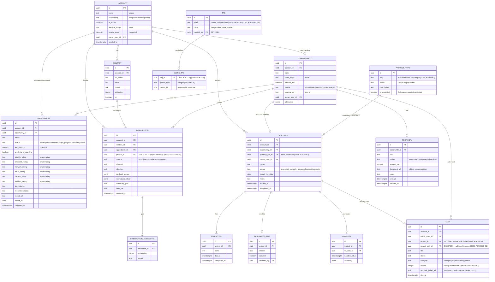
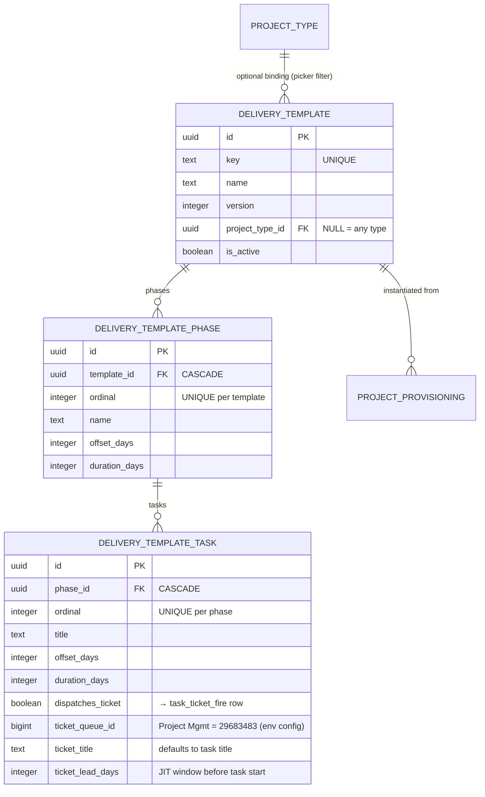
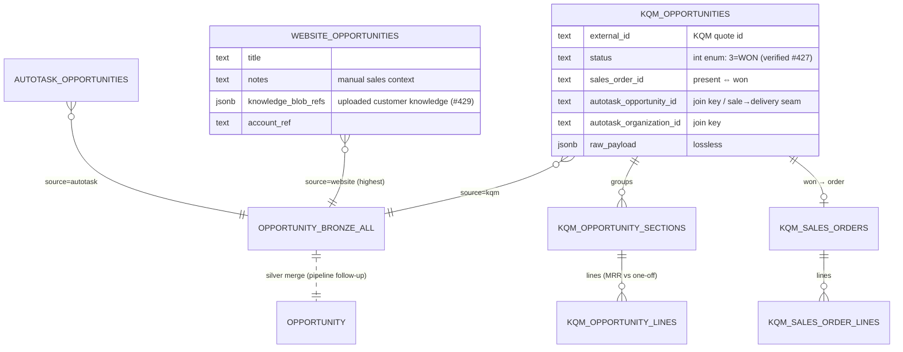
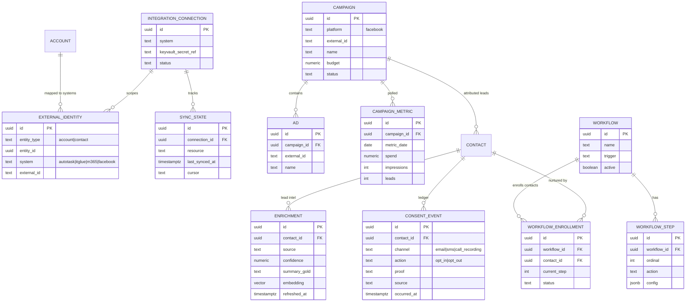
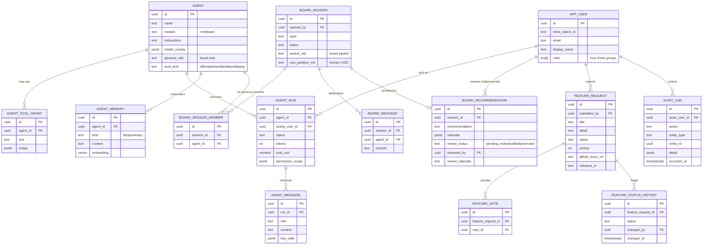
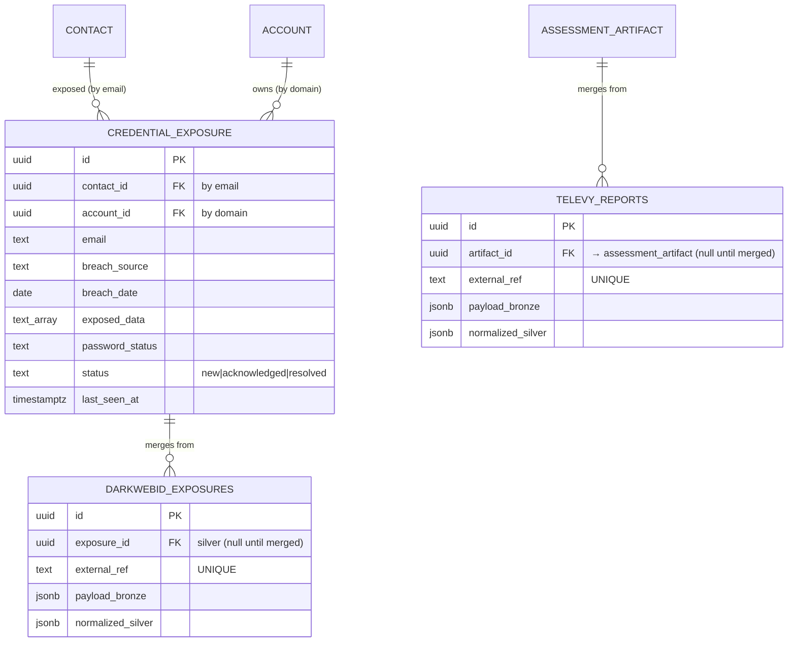
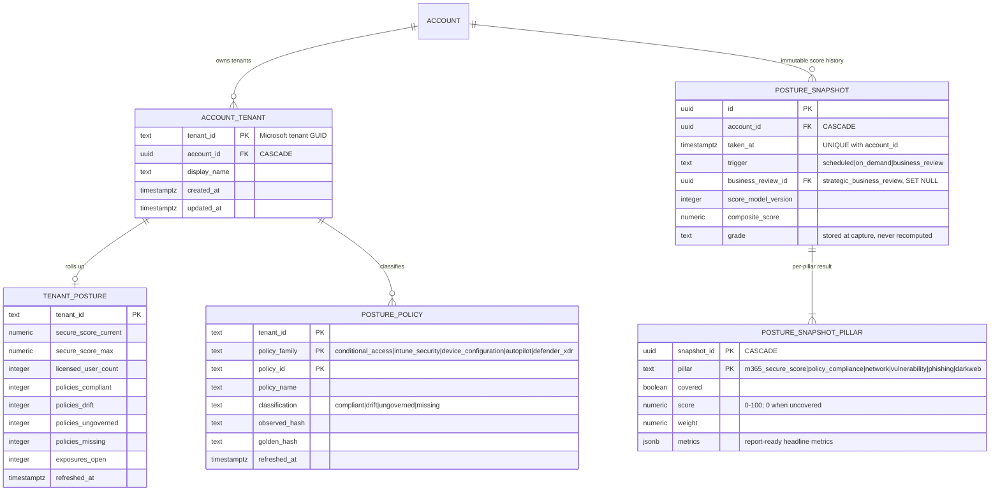
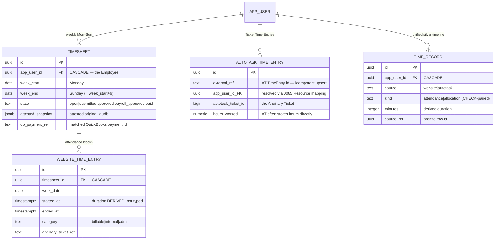
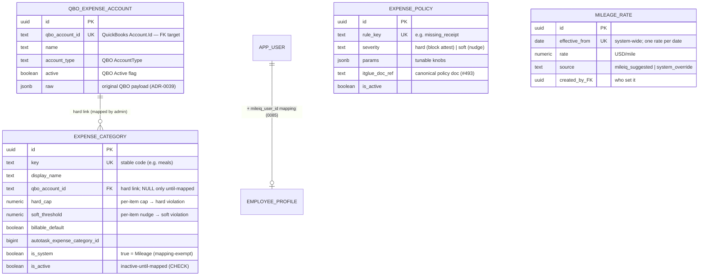

# Imperion CRM — Data Model

- **Status:** Draft (decisions D1–D11 locked 2026-06-07)
- **Related:** [product-requirements](../architecture/product-requirements.md),
  ADR-0010 … ADR-0016, [data-access-layer](./data-access-layer.md)
- **Store:** PostgreSQL + `pgvector` (ADR-0003), single unified store: system of
  record, embedding store, and agent memory.

## Principles

- **Modular by bounded context.** Each module (below) owns its tables; the spine
  (Account/Contact/Opportunity) is referenced by FK, never reshaped by satellites.
- **Staged enrichment (bronze→silver→gold, CLAUDE.md §4).** Raw payloads land in
  bronze (JSONB), are normalized to silver columns, and distilled to gold
  (summaries + embeddings) for agent consumption.
- **Append-only where it's evidence.** Interactions, consent events, agent runs,
  and audit logs are immutable event logs; current state is derived.
- **External systems are referenced, not owned.** Autotask/IT Glue data is polled;
  only an identity map + short-lived cache lives here.
- **PII-aware.** PII columns are tagged; access is audit-logged (ADR-0016).
- All PKs are `uuid`; all rows carry `created_at`/`updated_at`; soft-delete via
  `archived_at` where retention requires it.

> Conventions in the diagrams: `PK` primary key, `FK` foreign key. Attribute lists
> show **key** columns only, not the full DDL (that lands with the migrations in
> Phase 1).

## Diagram 1 — CRM core, delivery, and the engagement timeline



### Sale→delivery orchestration tracking (ADR-0080, migration 0082)

Imperion is the **intent/schedule** plane; **Autotask is the execution SoR**. A won KQM
quote provisions an Autotask Project (template-emulated) and JIT project-queue Tickets.
Two **1:1 sidecar tables** track the binding + provisioning state without bloating the
core `project`/`task` model (one task model, ADR-0052 §2). Idempotency is **ours, not
Autotask's** — Autotask creates are non-idempotent (spike #426), so each row holds a
stable `idempotency_key` + state the executor checks before every write.

```mermaid
erDiagram
    PROJECT ||--o| PROJECT_PROVISIONING : "provisions to Autotask"
    TASK    ||--o| TASK_TICKET_FIRE     : "JIT project-queue ticket"
    PROJECT_PROVISIONING {
      uuid project_id PK_FK "CASCADE"
      text source_kqm_quote_id "won-quote provenance (#427)"
      bigint autotask_opportunity_id "the won→Autotask seam"
      bigint autotask_project_id "NULL until created"
      text provision_state "pending|creating|created|failed"
      text idempotency_key "UNIQUE — imperioncrm-project-{id}"
      timestamptz provisioned_at
      text last_error
    }
    TASK_TICKET_FIRE {
      uuid task_id PK_FK "CASCADE"
      text fire_state "none|scheduled|fired|failed"
      timestamptz scheduled_for "JIT window; NULL = manual-only"
      bigint autotask_ticket_id "NULL until fired; links via ticket.projectID"
      bigint autotask_queue_id "Project Management = 29683483 (env config)"
      text idempotency_key "UNIQUE — imperioncrm-taskticket-{id}"
      timestamptz fired_at
      text last_error
    }
```

> **Plane of control:** the web board reads these + *requests* a fire (sets `scheduled_for`
> / `fire_state='scheduled'`); the **backend executor** does the actual Autotask write and
> stamps the typed id (the front end never holds Autotask creds, ADR-0042). The pipelines
> read them to reconcile the written Project/Ticket back from `autotask_*` bronze.

### Delivery templates + provisioning contract gate (ADR-0081, migration 0084)

The orchestration spine (0082) needed an **input**: something to turn a won
opportunity into a native delivery project, and a *template* to shape it. The only
prior template was the hardcoded onboarding playbook (ADR-0037). Migration 0084 adds
a **data-driven delivery template** (template → phases → tasks) the team authors and
a human picks on the board to provision a won deal — generalizing the onboarding
playbook shape. Each template task optionally carries a **JIT dispatch-ticket spec**
that maps 1:1 to `task_ticket_fire` at instantiation. Provisioning is **human-triggered**
(ADR-0081 §2), never auto-on-won (Autotask `canDelete=False` → conservative-on-create).



`project_provisioning` (0082) gains `delivery_template_id` (provenance) and a **hard
contract gate** — `contract_state` (`none|sent|signed`), `contract_signed_at`,
`contract_envelope_ref` (DocuSign envelope, ADR-0071). The backend executor **must not**
provision a row unless `contract_state='signed'`; the `idx_project_provisioning_ready`
partial index is its gated work queue (`pending` + `signed`). The gate is enforced now
but **inert** (`'none'`) until DocuSign (#318) is wired.

### Opportunity as merged silver from three bronze sources (#428, migration 0083)

The `opportunity` (silver, ADR-0010) is **merged from three per-source bronze tables**, not
modelled per-source. Each adds unique data; the KQM `autotask_*` ids are the cross-source
join keys. Bronze follows the local-pipeline lossless envelope (LP ingests KQM + Autotask;
the web app writes the website source). **Precedence: website > autotask > kqm.**



> **Scope note (0083):** this migration lands the bronze tables + the `opportunity_bronze_all`
> union view. KQM has **no header total** — the silver merge sums *selected* lines
> (`is_recurring` splits MRR vs one-off). The silver `opportunity` **merge recompute** over
> the union (precedence website > autotask > kqm) is a pipeline-repo transform (ADR-0039
> pattern), shipped separately; 0083 does not modify the live `opportunity` table.

## Diagram 2 — Integrations, demand generation, communications & consent

> **As-built note:** Diagram 2 is the original *design* sketch. The tables actually
> built in migrations `0018`–`0026` are shown in **Diagram 5** (ADR-0024–0027), which
> refines this design — notably: `integration_connection` + `sync_state` became a
> single scope-aware **`connection`** (per-user *and* company, ADR-0024); `enrichment`
> became **`contact_enrichment`** with per-fact `lawful_basis` plus
> `contact_social_identity` (ADR-0025); the consent ledger gained `data_enrichment` and
> `ad_targeting` channels; and **`audience`/`audience_member`**, **`lead_hook`/
> `lead_capture_event`**, **`meeting_action_item`**, and the `engagement_answer`
> provenance columns were added. Diagram 5 is authoritative where they differ.

### Events + registration (ADR-0053, migration 0070)

**Events are first-class objects, campaigns are delivery vehicles.** `event`
(kind `webinar | live_event`; Teams `join_url` for webinars, `location` for live
events; typed `registration_page` jsonb; `workflow_id` auto-enrolls registrants once
#112 wires it) and `event_registration` (one row per signup: `contact_id`,
`capture_event_id` back to the capture inbox, status
`registered|attended|no_show|canceled`, unique per event+contact). A campaign of any
channel points at the event it promotes via `campaign.event_id`. Registration IS lead
capture: the `event_registration` lead-hook kind lands signups in
`lead_capture_event`, resolving to contacts like every other lead source. Funnel
numbers (registrations, attendance) are derived from `event_registration`, never
stored.




## Diagram 3 — Agent platform, AI Board, feedback & identity



## Diagram 4 — Engagement capture & long-term relationship (ADR-0023)

Discovery, assessment evidence, and SBRs are **account-scoped** (the contact is only
the employee who performed an instance). Questionnaires are editable data; answers are
stored once; downstream records point back via provenance FKs.


> **Provenance, not duplication:** `opportunity`, `project`, and `ticket` carry nullable
> `source_discovery_id` / `source_assessment_id` / `source_sbr_id` FKs so a downstream
> record points back to the engagement that produced it — the engagement's data is never
> copied forward.

## Diagram 5 — As-built: communications, connections, enrichment, demand-gen audiences & automation (ADR-0024–0027)

The multi-channel timeline (every comm is one `interaction`), per-user + company
connections, the lawful-basis-gated enrichment dossier, demand-gen audiences over the
aggregated profiles, lead-capture hooks, and nurture/pre-discovery automation. A comm
is related **first to the employee** (`interaction.owner_user_id`, via the connection
that produced it) and then to the contact/account.

```mermaid
erDiagram
    APP_USER ||--o{ CONNECTION : "personal connections"
    CONNECTION ||--o{ INTERACTION : "ingested via"
    APP_USER ||--o{ INTERACTION : "owner (employee)"
    ACCOUNT ||--o{ INTERACTION : "timeline"
    CONTACT ||--o{ INTERACTION : "participates"
    INTERACTION ||--o{ MEETING_ACTION_ITEM : "follow-ups"
    MEETING_ACTION_ITEM ||--o| TASK : "promoted to"
    ACCOUNT ||--o{ EXTERNAL_IDENTITY : "identity map"
    CONTACT ||--o{ EXTERNAL_IDENTITY : "identity map"
    CONTACT ||--o{ CONTACT_SOCIAL_IDENTITY : "linked profiles"
    CONTACT ||--o{ CONTACT_ENRICHMENT : "dossier (gold)"
    CONTACT ||--o| CONTACT_EMBEDDING : "profile vector"
    CONTACT ||--o{ CONSENT_EVENT : "append-only ledger"
    CONNECTION ||--o{ CONTACT_ENRICHMENT : "provenance"
    CAMPAIGN ||--o{ AD : contains
    CAMPAIGN ||--o{ CAMPAIGN_METRIC : "polled"
    CAMPAIGN ||--o{ CONTACT : "attributed"
    AUDIENCE ||--o{ AUDIENCE_MEMBER : "aggregated profiles"
    CONTACT ||--o{ AUDIENCE_MEMBER : "member of"
    LEAD_HOOK ||--o{ LEAD_CAPTURE_EVENT : captures
    LEAD_CAPTURE_EVENT ||--o| CONTACT : "resolves to"
    WORKFLOW ||--o{ WORKFLOW_STEP : has
    WORKFLOW ||--o{ WORKFLOW_ENROLLMENT : enrolls
    CONTACT ||--o{ WORKFLOW_ENROLLMENT : "nurtured by"

    CONNECTION {
      uuid id PK
      text scope "user|company"
      uuid owner_user_id FK "null for company"
      text provider "m365|youtube|linkedin|facebook|autotask|itglue|myitprocess|televy|quotemanager|gdap|…"
      text status "active|pending|expired|revoked|error"
      text[] scopes
      text keyvault_secret_ref "token ref only — never the token"
      jsonb sync_cursor
      timestamptz last_sync_at
      int poll_interval_minutes "pipeline poll cadence; 0 = manual/paused (ADR-0038)"
    }
    INTERACTION {
      uuid id PK
      uuid account_id FK
      uuid contact_id FK
      uuid owner_user_id FK "employee"
      uuid source_connection_id FK
      uuid project_id FK "SET NULL — project meetings (0066, ADR-0052 §5); NULL on sales meetings"
      text source "enum interaction_source"
      text kind "email|message|call|meeting|social_comment|…"
      text subject
      text summary_gold
      timestamptz occurred_at
    }
    MEETING_ACTION_ITEM {
      uuid id PK
      uuid interaction_id FK
      uuid contact_id FK
      uuid owner_user_id FK
      text description
      text status "open|done"
      date due_at
      uuid source_task_id FK
    }
    EXTERNAL_IDENTITY {
      uuid id PK
      uuid account_id FK
      uuid contact_id FK
      text provider
      text external_id
    }
    CONTACT_SOCIAL_IDENTITY {
      uuid id PK
      uuid contact_id FK
      text platform
      text handle
      text profile_url
      int follower_count
      boolean verified
    }
    CONTACT_ENRICHMENT {
      uuid id PK
      uuid contact_id FK
      text attribute_key
      text value_text
      jsonb value_json
      numeric confidence
      text source
      uuid source_connection_id FK
      text lawful_basis "enum lawful_basis"
      timestamptz observed_at
      timestamptz expires_at
    }
    CONTACT_EMBEDDING {
      uuid id PK
      uuid contact_id FK
      vector embedding
      text model
    }
    CONSENT_EVENT {
      uuid id PK
      uuid contact_id FK
      text channel "email|sms|call_recording|data_enrichment|ad_targeting"
      text state "opt_in|opt_out"
      text lawful_basis
      text source
      jsonb proof
      timestamptz occurred_at
    }
    CAMPAIGN {
      uuid id PK
      text name
      text platform "facebook|google|youtube|linkedin|email|sms"
      text status "draft|active|paused|completed"
      numeric budget
      uuid event_id FK "event this campaign promotes (ADR-0053)"
      uuid workflow_id FK "auto-enroll attributed responders (#112)"
    }
    AD {
      uuid id PK
      uuid campaign_id FK
      text name
      jsonb creative "typed ADR-0053: headline, body, imageRef, cta, landingUrl, utm, audienceId; legacy rows: copy"
      text status
    }
    CAMPAIGN_METRIC {
      uuid id PK
      uuid campaign_id FK
      uuid ad_id FK
      date metric_date
      numeric spend
      int impressions
      int clicks
      int leads
    }
    AUDIENCE {
      uuid id PK
      text name
      text kind "static|dynamic"
      jsonb definition "criteria over enrichment"
      text platform_sync_ref
    }
    AUDIENCE_MEMBER {
      uuid audience_id FK
      uuid contact_id FK
      text source
    }
    LEAD_HOOK {
      uuid id PK
      text name
      text kind "web_form|facebook_lead|youtube_comment|…"
      jsonb config
      boolean active
    }
    LEAD_CAPTURE_EVENT {
      uuid id PK
      uuid hook_id FK
      jsonb payload_bronze
      uuid contact_id FK
      text status "new|resolved|ignored"
      timestamptz received_at
    }
    WORKFLOW {
      uuid id PK
      text name
      text kind "nurture|pre_discovery|re_engagement"
      jsonb trigger
      text status
    }
    WORKFLOW_STEP {
      uuid id PK
      uuid workflow_id FK
      int ordinal
      text kind "send_email|send_sms|chat_prompt|agent_enrich|wait|branch"
      jsonb config
    }
    WORKFLOW_ENROLLMENT {
      uuid id PK
      uuid workflow_id FK
      uuid contact_id FK
      uuid account_id FK
      text status "active|completed|exited — one ACTIVE per (workflow, contact), migration 0073"
      int current_step_ordinal
    }
```



> **Consent & lawful basis are the gate.** `current_consent` (a view = latest event
> per contact × channel) is read at send time and at ad-launch time; `contact_enrichment`
> rows each carry a `lawful_basis`. Outbound sends and ad targeting are blocked unless
> the relevant channel is currently opt-in (ADR-0014/0025/0026). The ledger is
> append-only — a change of mind is a new event, never an update.

## Diagram 6 — As-built: contact lifecycle, meetings, per-source bronze & onboarding PM (ADR-0030–0035)

Front-end-driven additions. The normalized `contact` gains a CRM-lifecycle axis (Leads
vs Contacts are opposite filters); structured `meeting` objects hang off the timeline;
per-source **bronze** rows merge into the silver `contact`/`account`; tasks are
categorized and onboarding gets R/Y/G milestones. RBAC roles live on `app_user.roles`
(ADR-0016/0030).


> **Onboarding playbook (ADR-0037).** The standard 9-phase, ~90-step MSP onboarding
> playbook lives in `lib/onboarding-template.ts`. `applyOnboardingTemplate` instantiates
> it: each phase → a `PROJECT_MILESTONE`, each step → an `ONBOARDING_STEP`. Checking off
> steps re-derives the phase R/Y/G. Ad-hoc PM work still uses `TASK` (category
> project/onboarding); the playbook checklist does not.

> **Subtasks / task hierarchy (ADR-0065 B1, #335, migration 0095).** A `TASK` carries a
> nullable self-FK `parent_task_id` (ON DELETE CASCADE — a parent's subtree dies with it)
> plus a sibling `ordinal`. One level is required; arbitrary depth is allowed (no DB depth
> cap). The task list shows top-level tasks only, with an **n/m children-done rollup** read
> per row; subtasks surface under their parent on the task edit page (add child inline,
> promote/demote). Re-parenting rejects self/descendant **cycles in the data layer**
> (recursive ancestor walk), never via a DB trigger. Auto-complete-on-children is **manual
> in v1** — the rollup flags "all done" but never forces the parent done (auto only via the
> out-of-scope rules engine). `onboarding_step` **coexists** (B1-F4 decision: coexist);
> unifying steps as a task `kind` is a tracked follow-up.

> **Easy mode (ADR-0052 §3/§4, #101, migration 0067).** A step with a `deploy_key`
> renders the Deploy button and auto-creates ONE linked project task when the template
> is applied. Close is **verify-to-close**: completing the step (today the manual check,
> later the backend verification over posture silver — same path) closes the linked task
> idempotently; a deploy-flagged step completing with no linked task writes an
> `audit_log` note (`onboarding.deploy.no_linked_task`) instead. v1 ships SPARSE — no
> template step carries a key until the project-plan solidification exercise assigns
> them, so the button renders nowhere yet. Migration 0067 also grants the backend role
> SELECT on posture silver + UPDATE on `task`/`onboarding_step` for the verification
> check.

> **Apollo** (ADR-0035) is a company-scope `connection` provider and an enrichment
> source for both contacts and companies. The normalization/merge job
> (bronze → silver) runs in the pipeline repo (pipeline ADR-0006/0009).

> **SUPERSEDED by ADR-0039.** The single `CONTACT_SOURCE` / `ACCOUNT_SOURCE` tables above
> were replaced by **one physical bronze table per (source, entity)** plus a new `device`
> entity — see Diagram 6b. `contact`/`account` remain the silver aggregate; a `device` silver
> table is added.

## Diagram 6b — As-built: per-source bronze tables + device (ADR-0039)

Each source lands in its own bronze table (uniform shape; `source` implicit in the table name,
`UNIQUE(external_ref)`). Read-only union views `contact_bronze_all` / `account_bronze_all` /
`device_bronze_all` re-add a `source` key for the app's "Data sources" popup and the merge scan;
all writes target the physical tables. The merge folds every source into silver `contact` /
`account` / `device` by precedence (manual `website` highest).


> All `*_contacts` tables share the `AUTOTASK_CONTACTS` shape (with `contact_id`); all
> `*_companies` share it with `account_id`; all `*_devices` with `device_id`. Bronze tables:
> contacts `{autotask,apollo,m365,itglue,website}_contacts`, companies
> `{autotask,apollo,itglue,website}_companies`, devices `{itglue,m365,website}_devices`.

## Diagram 6c — Security & assessment ingestion (ADR-0040)

Dark Web ID compromised credentials and Televy assessment reports, ingested by the Azure
pipeline (per-source bronze, ADR-0039 shape). Dark Web ID merges into a new silver
`credential_exposure`; Televy stages in `televy_reports` then merges into the existing
`assessment_artifact` (`source='televy'`).



> Bronze read via the `exposure_bronze_all` view (single-source today). Wired but gated —
> nothing ingests until the Dark Web ID / Televy API key is configured in Settings (ADR-0040).

### M365 communications bronze (migration 0065, issue #182)

Three local-pipeline-envelope bronze tables (0038's contract: text flat columns,
lossless `raw_payload` jsonb, `content_hash`, PK `(tenant_id, source, external_id)`)
for the on-prem collectors' cross-org Imperion↔client communications — the lead-loop
feed (v1 gate 6):

| Table | Source | Collector (local pipeline) |
| --- | --- | --- |
| `m365_mail_messages` | `m365_email` | `Get-ImperionM365Mail` — mailbox, from/to/cc, subject, conversation_id, received/sent times |
| `m365_teams_chats` | `m365_teams` | `Get-ImperionM365TeamsChat` — user_upn, topic, chat_type, member emails/names |
| `m365_teams_meetings` | `m365_teams` | `Get-ImperionM365TeamsMeeting` — user_upn, organizer/attendees, start/end, join_url |

Writer: `imperion-localpipeline` (SELECT/INSERT/UPDATE, idempotent upserts, never
DELETE). Readers: the cloud pipeline (bronze→silver merge into `interaction`) and the
backend functions (interaction-timeline ingestion). The Teams collectors' flat `user`
property lands in `user_upn` (reserved keyword).

### Intune managed-devices bronze (migration 0069, #225 / local #75)

`intune_managed_devices` — same local-pipeline envelope, one row per Graph managedDevice
(unreduced, flat compliance queryable per ADR-0051 decision 6). Fed by the on-prem
collector `scheduled-tasks/m365/intune-devices.task.ps1` (local PR #123; self-gates
until this migration is applied). Indexed on `serial_number` and `azure_ad_device_id` —
the merge-join keys to silver `device` (and the #162 device policy-applied indicator).
Writer: `imperion-localpipeline`; readers: `mgid-imperioncrmpipeline` (merge) and the
web role (device page).

### Meta Business Manager bronze + organic social silver (migration 0075, #253)

Six local-pipeline-envelope bronze tables for Imperion's own Business Suite assets
(FB Page + Instagram business account), read with a BM **system-user token** (on-prem
SecretStore custody) and collected/merged by the local pipeline (posture-merge
precedent — local repo writes silver here too):

| Table | What | Silver destination |
| --- | --- | --- |
| `facebook_posts` | Page feed posts | `interaction` (`social_post`, source `facebook`) |
| `facebook_comments` | Comments on page posts | `interaction` (`social_comment`) — timeline-only, never leads |
| `facebook_messages` | Page-inbox (Messenger) messages | `interaction` (`dm`) **+** `lead_capture_event` (kind `facebook_dm`) + contact resolve/create |
| `instagram_media` | IG media via the linked page | `interaction` (`social_post`, source `instagram`) |
| `instagram_comments` | Comments on IG media | `interaction` (`social_comment`) |
| `meta_insights` | Raw Page/IG insight snapshots | `social_metric` |

New silver table **`social_metric`** = the organic insights time series (platform,
entity, metric, period, value, captured_at); `campaign_metric` stays paid-campaign-only
(ADR-0012). Enums: `interaction_source` += `instagram`; `lead_hook_kind` += `facebook_dm`.
Writer: `imperion-localpipeline` (bronze write + widened silver merge surface:
`interaction` insert, lead capture, contact create, `contact_social_identity`); web role
reads. Collector contract: local-pipeline `docs/integrations/meta.md` (local #126).

### Defender incidents + alerts bronze and Autotask layering (migration 0076, #256, ADR-0059)

`defender_incidents` (Graph `/security/incidents`) and `defender_alerts`
(`/security/alerts_v2`) — local-pipeline envelope, fed by the on-prem collector
(local #138; `SecurityIncident/SecurityAlert.Read.All` already consented). The
existing `sentinel_*` bronze (0038) is Sentinel rules/automation only and does NOT
cover these. `defender_alerts.incident_external_id` (indexed with tenant) groups
alerts under their incident. **Open incident** = `status` not
`resolved`/`redirected` (case-folded text match — bronze is all-text).

`defender_incident_ticket_link` (ADR-0059) pairs an incident with the Autotask
ticket worked for it — a standalone table, never a bronze column (loader full-row
upserts would clobber it). PK `(tenant_id, incident_external_id)` is the sync-back
idempotency key: at most one ticket per incident, writers use
`INSERT … ON CONFLICT DO NOTHING`, so ticket creation can never loop. Both sides
are external ids (no FKs — collectors land in any order); `origin` records who
asserted the link (`defender_to_autotask` | `autotask_to_defender` | `manual`).
Indexed on `autotask_ticket_external_id` for the ticket→incident reverse lookup.

Writers: `imperion-localpipeline` (bronze + auto-link) and
`mgid-imperioncrmbackendfunction` (link only — ticket creation is a process,
ADR-0042). Cloud pipeline + web read. Surfaced today as the open-incident badge on
the account Security posture card (joined via `account_tenant`).

### Entra auth methods bronze — per-user MFA registration (migration 0077, #258)

`entra_auth_methods` — local-pipeline envelope, fed by the on-prem collector (local
#140; `UserAuthenticationMethod.Read.All`). One Graph call per tenant —
`/reports/authenticationMethods/userRegistrationDetails` — covers every user's
`isMfaRegistered` / `isMfaCapable` / `methodsRegistered` / SSPR state /
preferred-method fields, flattened to all-text columns (true types live in
`raw_payload`). `external_id` = the Entra user object id, so re-collection upserts
per user. **MFA registered** = `is_mfa_registered` case-folded `'true'` (bronze is
all-text).

Writer: `imperion-localpipeline`. Cloud pipeline, backend, and web read. Surfaced
today as the MFA coverage badge ("X% MFA registered (of Y users)") on the account
Security posture card, joined via `account_tenant` (ADR-0051). It is posture-pillar
*input* only — the Imperion Secure Score composite is unchanged (model versioning is
ADR-0051-governed; a pillar change would be a new Score Model version + ADR).

### SharePoint sites bronze — site inventory, metadata only (migration 0078, #255)

`sharepoint_sites` — local-pipeline envelope, fed by the on-prem collector
(local-pipeline companion issue; `Sites.Read.All`). Flattens Graph `/sites`
(getAllSites enumeration) per tenant: display name, web URL, description,
created/last-modified, web template, personal-site flag, site-collection hostname,
and storage used/quota where Graph exposes them — all-text columns (true types live
in `raw_payload`). `external_id` = the Graph composite site id, so re-collection
upserts per site.

**No file content, by design.** `Files.Read.All` was pruned from the per-client
Onboarding app (pipeline ADR-0018, 2026-06-12 per-source review); only
`Sites.Read.All` remains. The table has no file/drive/item columns and none may be
added — site *metadata* is the entire surface.

Writer: `imperion-localpipeline`. Cloud pipeline, backend, and web read. Surfaced
today as the drillable "SharePoint sites" section on the Company 360, joined via
`account_tenant` (ADR-0051): per-site drill shows dates, template, storage, and an
outbound link to the site itself.

### Entra groups + membership bronze — feeds the user object (migration 0079, #257)

`m365_groups` (Graph `/groups`) and `m365_group_members` (per-group member
expansion, `/groups/{id}/members`) — local-pipeline envelope, fed by the on-prem
collector (local #139; `Group.Read.All` / `GroupMember.Read.All`). All-text flat
columns (true types live in `raw_payload`). `m365_groups.external_id` = the Entra
group object id. Membership has no single natural id, so
`m365_group_members.external_id` is the collector-built `<group id>/<member id>`
composite (0078 composite-id precedent — the generic envelope upsert stays
intact); the flat parts `group_external_id` / `member_external_id` carry the
(tenant, group, member) key, indexed both ways (group → members, member → groups).

**The user-object join (Mark's 2026-06-12 verdict: groups are bronze to the USER
object):** `m365_group_members.member_external_id` = the Entra user object id =
`m365_contacts.external_ref`, whose `contact_id` is the silver contact resolved by
the pipeline's contact merge. Group kind derives from the raw Graph fields:
`group_types` containing `Unified` = Microsoft 365 group, else
`security_enabled` / `mail_enabled` (case-folded — bronze is all-text);
`membership_rule_processing_state = 'On'` marks dynamic groups.

Writer: `imperion-localpipeline`. Cloud pipeline, backend, and web read. Surfaced
today as the drillable "Directory groups" section on the Contact 360 (groups the
contact belongs to, via the bronze join above). A deeper silver merge (group
context folded into `contact_enrichment` by the pipeline's contact-matcher) is the
follow-up issue noted on #257.

### DNS posture — migration 0080 (#308, ADR-0063)

Per-customer DNS posture across two capture planes (ADR-0063). **Bronze** (all-text
local-pipeline envelope, true types in `raw_payload`):

`dns_zones` — Azure DNS zones via the on-prem ARM collector (local #155).
`external_id` = the ARM zone resource id; `manageable` = a write role (DNS Zone
Contributor / Contributor / Owner) proven by a role-assignment read; `verdict` is
collector-computed (`not-in-azure` | `in-azure-readonly` | `managed`). This is the
manage plane that proves "hosted in Azure and manageable".

`dns_records` — DNS recordset snapshots via the ARM collector (`plane = azure`,
authoritative zone config) and the public-resolution collector (`plane = public`,
local #156 — what the domain resolves to from the outside, the only signal for
domains not in Azure DNS). `external_id` = `<domain>|<plane>|<type>|<name>`; indexed
by domain and by (domain, plane) for cross-plane reconciliation.

**Silver** (real types, keyed per `(tenant_id, domain)`, written by the drift merge
local #157): `dns_golden` — the human-approved DNS Golden State per domain
(`golden_hash` + `golden_records`, approved via `Set-ImperionDnsGoldenState`);
`dns_domain` — the per-domain rollup: governance `verdict` (CHECK-constrained),
`records_compliant|drift|ungoverned|missing` counts (full-outer-join of captured vs
golden, ADR-0051 §3 semantics), 0–100 `score`, `last_captured_at`.

Writer: `imperion-localpipeline`. Cloud pipeline, backend, and web read. DNS is a
candidate Posture Pillar for Score Model v2 (deferred behind an ADR-0051 amendment,
blocked-on-data like MFA #265). **Apply 0080 to prod before the GUI read PR (#309)
merges** (schema-lag foot-gun #301/#302).

#### Domain source — `account_domain`, migration 0081 (#334, ADR-0063 amendment)

ADR-0063 originally assumed DNS domains were derived from a tenant's verified domains,
but the system has **no domain source** (no account/company domain column; per-client
Graph not built). Mark's model: **each account has a GUI-managed list of domains (one or
several), and DNS posture checks each.** So `account_domain (account_id, domain, note,
created_at, created_by)` — PK `(account_id, domain)` — is the **single domain source of
truth**, edited per account in the GUI (web MI holds SELECT/INSERT/DELETE; pipeline +
backend read). DNS ownership is now **account-keyed**: `account_id` was added (additive,
nullable) to the four `dns_*` tables; the silver merge (#157) stamps it from
`account_domain`. `security.listDnsDomainsForAccount` is account_domain-driven — it LEFT
JOINs `dns_domain` so a tracked-but-not-yet-captured domain still surfaces (null verdict),
through the optional-enrichment seam (#301). **Apply 0081 to prod before the read PR
merges.**

## Diagram 6d — Tenant Mapping (ADR-0051, migration 0061)

Posture bronze is keyed by Microsoft tenant GUID; the app navigates by account.
`account_tenant` is the explicit, admin-managed mapping (Settings surface) — one account
per tenant, an account may own several tenants, never inferred from domains. Tenants in
posture bronze with no mapping surface in an "unmapped tenants" admin list. Both pipeline
roles read it to resolve account→tenants for posture merges (pipeline #20 on-demand;
on-prem bulk + quarterly snapshots).

Migration 0062 adds the posture silver pair: `posture_policy` (current classification
per tenant + family + policy — the Get-ImperionPolicyDrift FULL OUTER JOIN semantics:
`compliant | drift | ungoverned | missing`; replaced per merge) and `tenant_posture`
(one-row-per-tenant rollup). Writers: both pipeline roles (on-prem bulk, cloud
on-demand) — the SAME classification rules by ADR-0051 decision 2.

Migration 0063 adds the immutable snapshot pair: `posture_snapshot` (per-account
Imperion Secure Score at capture — composite, stored letter grade, Score Model
version; triggers `scheduled | on_demand | business_review`, the last FK'd to
`strategic_business_review` with ON DELETE SET NULL so deleting a review never
destroys posture history) and `posture_snapshot_pillar` (one row per pillar:
covered flag, 0–100 score — 0 when uncovered, weight, report-ready `metrics`
jsonb). Append-only by GRANT: pipeline writers hold INSERT but no UPDATE/DELETE —
grades and composites are never recomputed after capture (ADR-0051 decision 5).
Migration 0064 (#167) completes the enforcement: the web app role is SELECT-only on
both tables (inherited INSERT/UPDATE/DELETE revoked) — snapshot creation is a
*process* (ADR-0042) owned by the pipeline/backend roles, never the GUI.



> `posture_policy`/`tenant_posture` are keyed by tenant GUID, not FK'd to
> `account_tenant` — posture for an unmapped tenant still lands and surfaces in the
> unmapped list rather than being rejected (ADR-0051: surface, never hide).

The web app's posture reads (#93) are account-scoped and always join THROUGH
`account_tenant`: the tenant rollup is a LEFT JOIN from the mapping (a mapped tenant
the pipeline hasn't classified yet surfaces with an all-null rollup), the policy and
secure-score-control reads are INNER JOINs (no mapping → no rows), and credential
exposures read silver `credential_exposure` by its own `account_id` (the ADR-0040
domain match, independent of Tenant Mapping).

## Enumerations

- `account.relationship`: `prospect | customer | partner` (null = unknown)
- `account.lifecycle_stage`: `prospect | onboarding | implementation |
  operational_readiness | managed_active | dormant`
- `opportunity.sales_stage`: `lead | qualified | proposal | won | lost`
- `proposal.status`: `draft | sent | accepted | declined`
- `project.type`: `onboarding | implementation`
- `project.status`: `not_started | in_progress | blocked | complete`
- `assessment.status`: `proposed | scheduled | in_progress | delivered | closed`
- `assessment_rating` (per dimension): `at_risk | needs_work | solid | strong`
- `engagement_kind`: `discovery | assessment`
- `question_response_type`: `text | longtext | number | currency | boolean |
  single_select | multi_select | rating | date`
- `discovery_call.verdict`: `fit | not_fit | nurture`
- `assessment_artifact.source`: `televy | m365_graph | google_workspace |
  external_scan | phishing_sim | manual`
- `assessment_artifact.kind`: `report | analytics | snapshot | finding | metric`
- `interaction.source`: `m365_email | m365_teams | plaud | sms | email |
  facebook | system | youtube | linkedin | whatsapp | phone_call | in_person |
  meeting | web_form` (extended in ADR-0024 for the multi-channel timeline)
- `interaction.kind`: `email | message | call | meeting | transcript | summary |
  social_post | social_comment | dm | ad_engagement | note`
- `consent_event.channel`: `email | sms | call_recording | data_enrichment |
  ad_targeting` (last two added by ADR-0025/0026 to gate enrichment & ad use)
- `consent_event.state`: `opt_in | opt_out`
- `lawful_basis`: `consent | legitimate_interest | contract | public_data` (ADR-0025)
- `connection.scope`: `user | company` (ADR-0024)
- `connection.provider`: `m365 | google | youtube | linkedin | facebook | plaud |
  autotask | itglue | apollo | myitprocess | televy | quotemanager | gdap` (apollo by
  ADR-0035; myitprocess/televy/quotemanager/gdap by ADR-0036)
- `connection.status`: `active | expired | revoked | error | pending` (pending added by
  ADR-0036 for credentials recorded before the backend writes the secret)
- **Uniqueness:** `uq_connection_company_provider` — partial unique index on
  `(provider) WHERE scope = 'company'`, so each company system has exactly one row;
  re-saving a credential rotates it in place rather than duplicating (ADR-0036, migration 0033).
- `contact.crm_stage`: `audience | lead | prospect | client` (ADR-0031; Leads =
  not-client, Contacts = client — opposite filters of one object)
- `meeting.platform`: `teams | plaud | other` (ADR-0011/0033 structured meeting)
- ~~`contact_bronze_source` / `company_bronze_source`~~ — **removed in ADR-0039** (migration
  0037). Source is now the bronze table identity, not an enum; manual entries use the `website`
  source (per-source tables in Diagram 6b).
- `task.category`: `sales | project | onboarding | general` (ADR-0034)
- `milestone_status`: `not_started | in_progress | blocked | complete` (ADR-0034)
- `milestone_health`: `green | amber | red` (ADR-0034; R/Y/G onboarding indicator)
- `campaign.platform`: `facebook | google | youtube | linkedin | email`
- `campaign.status` (and `ad.status`): `draft | active | paused | completed`
- `audience.kind`: `static | dynamic`
- `lead_hook.kind`: `web_form | facebook_lead | youtube_comment | linkedin_message |
  inbound_email | qr | manual | event_registration` (event_registration by ADR-0053,
  migration 0070 — hook `config` carries the event id)
- `event.kind`: `webinar | live_event` (ADR-0053, migration 0070)
- `event.status`: `draft | scheduled | live | completed | canceled` (leaving draft
  requires `starts_at`)
- `event_registration.status`: `registered | attended | no_show | canceled`
  (attendance recorded post-event; funnel counts derived, never stored)
- `campaign_send.status`: `draft | scheduled | sending | sent | canceled` (ADR-0053,
  migration 0071); `channel`: `email | sms`; `recipient_scope`: `audience |
  event_registrants` — non-draft sends carry exactly one of `send_at` /
  `event_offset_minutes` (CHECK-enforced); recipients materialize at fire time,
  consent-gated per recipient per channel
- `campaign.platform` gains `sms`; `connection.provider` gains `acs` (migration 0071)
- `workflow.kind`: `nurture | pre_discovery | re_engagement`
- `workflow_step.kind`: `send_email | send_sms | chat_prompt | agent_enrich | wait |
  branch`
- `workflow_enrollment.status`: `active | completed | exited`
- `engagement_answer.source`: `human | agent | automation` (ADR-0027)
- `engagement_answer.status`: `draft | confirmed | rejected` (ADR-0027)

The dashboard's five-stage strip (Lead, Qualified, Proposal, Onboarding, Active) is
a **read view** mapping Opportunity `sales_stage` and Account `lifecycle_stage`, not
a stored field.

## Diagram — Employee time tracking (ADR-0082)

Imperion tracks employee time as **website-authoritative weekly timesheets** (attendance),
corroborated by Autotask Ticket Time Entries, documented back to Autotask as one weekly
Time Ticket, and verified paid read-only against QuickBooks. An **Employee** is an existing
`app_user` EXTENDED — never reshaped — by a payroll-role-gated comp store. This section
grows with the migrations (0085 comp/mapping → 0086 attendance/timesheet/silver → 0087
time_ticket/recon); only the **0085** tables are shown below.

```mermaid
erDiagram
    APP_USER ||--o| EMPLOYEE_PROFILE : "1:1 time-tracking extension"
    APP_USER ||--o{ PAY_RATE         : "effective-dated comp"
    EMPLOYEE_PROFILE {
      uuid app_user_id PK_FK "CASCADE — 1:1 sidecar on app_user"
      text classification "1099|W2 (v1 all 1099) — comp-sensitive"
      bigint autotask_resource_id "mapping — joins Ticket Time Entries"
      text quickbooks_vendor_id "mapping — matches QB payments"
      timestamptz mappings_resolved_at "email-resolve audit"
      uuid mappings_confirmed_by_FK "who confirmed once"
      boolean is_active
    }
    PAY_RATE {
      uuid id PK
      uuid app_user_id FK "CASCADE"
      date effective_from "rate in force from this date"
      text rate_kind "hourly|salaried (salaried=W2, dormant)"
      numeric hourly_rate "v1 1099-hourly straight"
      numeric salaried_annual "W2-dormant"
      numeric overtime_multiplier "1.5x FLSA, W2-dormant"
      uuid created_by_FK "who set it"
    }
```

> **Comp data is the highest-sensitivity surface here (ADR-0082 §Security).** It lives in
> a SEPARATE store, never on the Entra-synced `app_user` row, never employee/agent/client-
> visible. Grants: `pay_rate` (the comp itself) → web (app-gated to `finance`/`admin` via
> `canApprovePayroll`) + backend reconciliation **read** only. The pipelines get **column-
> level** SELECT on `employee_profile`'s **mapping** columns only (Resource/vendor ids, to
> join Autotask Time Entries to an employee) — never `classification`, never `pay_rate`.
> The Timesheet reconciles against the rate with the greatest `effective_from <=` its week.

**Attendance, timesheet & the silver timeline (migration 0086).** Two per-source bronze
feeds normalize into one silver `time_record` (ADR-0039 discipline): `website_time_entry`
(authoritative attendance — start/end blocks, duration **derived**, category) and
`autotask_time_entry` (corroborating Ticket Time Entries, ingested by the local pipeline).
The weekly `timesheet` (one employee, one Mon–Sun week) carries the lifecycle.



> **Source of truth:** website attendance rows are authoritative; Autotask allocation rows
> corroborate. The cloud pipeline merge writes `time_record`; `source`↔`kind` is CHECK-paired
> (website→attendance, autotask→allocation). A `time_entry_bronze_all` union view exposes the
> raw per-source facts side by side (ADR-0039). Timesheet state transitions: the web GUI drives
> open→submitted→approved; the backend stamps `paid` from Payroll Reconciliation (the front end
> never holds Autotask/QuickBooks creds, ADR-0042). The Reconciliation read model is added by 0087.

**Time Ticket write-tracking & the Reconciliation read model (migration 0087).** Approval
writes ONE idempotent Autotask summary ticket per timesheet; reconciliation is **derived**
(views, not stored). Comp data stays out of every broadly-granted view — expected-pay math
lives in the backend, the sole reader of `pay_rate`.

```mermaid
erDiagram
    TIMESHEET ||--o| TIME_TICKET : "1 idempotent Autotask ticket / week"
    TIME_TICKET {
      uuid id PK
      uuid timesheet_id PK_FK "UNIQUE — one per timesheet"
      bigint external_ref "Autotask Time Ticket id; NULL until written"
      text write_state "pending|writing|written|failed"
      text idempotency_key "UNIQUE — imperioncrm-timeticket-{id}"
      bigint autotask_company_id "house company (config)"
      bigint autotask_queue_id "Timesheets queue (config)"
    }
```

> **Derived read model (no stored verdicts, no comp leakage):**
> - `time_reconciliation_day` — per employee per day, attended (envelope) vs logged
>   (allocation) minutes + verdict `balanced | under_logged | over_logged` (±30 min default
>   tolerance). Over silver `time_record` only. The **six Deviations** (overlap, orphan, etc.)
>   are detected by the backend process on this base — they need row-pair logic beyond a view.
> - `timesheet_payroll_status` — approved attendance minutes per timesheet + state + matched QB
>   payment ref. **No `pay_rate`** — expected pay (hours × effective rate) is computed in the
>   backend reconciliation process, which alone reads the comp store (0085).
>
> Idempotency is **ours, not Autotask's** (backend ADR-0044): `idempotency_key` + `write_state`
> + stored `external_ref` → re-approval updates the same ticket. The ticket **links** Ancillary
> Tickets, never re-creates their TimeEntries, so summing Autotask never double-counts. This
> completes the ADR-0082 schema; sibling-repo processes (Autotask write, QuickBooks read,
> bronze→silver merge) build on these tables — **prod-applied 2026-06-13 (0085–0087)**.

**QuickBooks payment fact (migration 0092 `qbo_purchases`, #526, ADR-0085 — supersedes 0091
`qbo_bill_payments`).** The payroll/reimbursement tail's missing input: the **authoritative
payment fact**. Imperion's QBO company is **Simple Start**, which has no Accounts Payable, so
`BillPayment` (0091) is unavailable; the fact re-targets to the **`Purchase`** entity
(Check/Expense — how Simple Start records 1099 contractor pay and reimbursements). The on-prem
local pipeline bulk-pulls the MSP's own QuickBooks Online purchases into `qbo_purchases`
(bronze, LP lossless envelope — flat text subset + lossless `raw_payload`, conflict key
`(tenant_id, source, external_id)` where `external_id` = the QBO `Purchase.Id`). The backend
reconciliations read it: Payroll Reconciliation (BE #105 / recon#2, ADR-0082 → **Paid**) and
expense reimbursement (ADR-0083 → **Reimbursed**) match expected pay/reimbursement (computed
backend-side over the 0085 comp store) to a real `total_amount` here, filtered to the payee
(`entity_id` = `employee_profile.qb_vendor_id`, 0085) and the CFO-designated expense
account(s) (`Line[].AccountBasedExpenseLineDetail.AccountRef`, preserved in `raw_payload`).
**Read-only — the app never pays** (ADR-0082); `total_amount` is the payment fact, **never
logged**, and is NOT comp data. Grants mirror the 0086 bronze pattern: `imperion-localpipeline`
writes (SELECT/INSERT/UPDATE), the backend function reads (SELECT). Field names are modeled
from the Intuit Accounting API v3 and are **unverified against the real company / sandbox**
until the QBO read-only app registration lands (LP collector #174, backend #116 stay
deploy-ahead until then); `raw_payload` is lossless, so drift is recoverable without a
migration.

## Diagram — Employee expense tracking (ADR-0083)

Imperion tracks employee expenses — **business mileage** (MileIQ, read-only) + **manual
out-of-pocket** entries (with receipts) — from capture through **reimbursement**, validated
read-only against a QuickBooks payment (`Purchase`, ADR-0085). It mirrors the time-tracking shape: an
**Employee** is the same `app_user` extension (0085), and the one comp figure expenses add —
the **mileage rate** — joins the payroll-gated comp store. This section grows with the
migrations (0088 config/comp → 0089 capture/silver → 0090 autotask-write/recon); all three
sets of tables are shown below.



> **Categories are hard-linked to QuickBooks (the SoR).** `qbo_expense_account` is bronze
> synced **read-only** (the app never writes QuickBooks); an admin maps each QuickBooks
> account → a clean `expense_category` with caps/threshold/billable-default/Autotask category
> id/visibility. A category cannot go **active** unmapped (CHECK), except the rate-driven,
> receipt-exempt **Mileage** system category. The v1 seed ships six until-mapped placeholders
> + active Mileage, and the eight policy rules (4 hard / 4 soft).
>
> **The mileage rate is comp data (ADR-0083 §Security)** — gated exactly like `pay_rate`
> (0085): web (app-gated `finance`/`admin`) + backend reconciliation **read** only; never on
> the Entra-synced `app_user`, never pipeline-visible, never employee/agent/client-visible.
> Unlike `pay_rate` it is **system-wide** (not per-employee) and effective-dated — a drive
> uses the rate with the greatest `effective_from <=` its drive date. The pipelines get
> **column-level** SELECT on the new `employee_profile.mileiq_user_id` **mapping** column only
> (to join a MileIQ drive → an employee), never the rate.

**Capture, the monthly report & the silver surface (migration 0089).** Two per-source
bronze feeds normalize into one silver `expense_item` (ADR-0039 discipline, mirroring
`time_record`): `website_expense_item` (manual out-of-pocket, authoritative) and
`mileiq_drive` (business-classified drives pulled read-only — authoritative for the **miles**
fact only). The monthly `expense_report` (one employee, one calendar month) carries the
lifecycle; receipts live in `receipt_attachment` (blob → Autotask → verified → 90-day delete).


> **Source of truth & the comp boundary:** out-of-pocket `amount` is **entered** (>0);
> mileage `amount` is **derived** (miles × effective Mileage Rate) by the **backend** — the
> comp reader — never hand-typed, since the pipelines cannot read the comp-gated rate (0088).
> The bronze `mileiq_drive` carries only the non-comp MileIQ suggested rate/amount snapshot.
> The cloud pipeline merge writes `expense_item` + upserts the monthly `expense_report`
> container; `source`↔`kind` is CHECK-paired (website→out_of_pocket, mileiq→mileage), and a
> second CHECK enforces the kind shape (mileage carries miles; out-of-pocket carries amount,
> no miles). **Reimbursable and billable are independent legs** — an item can be both. The
> `expense_item_all` union view exposes the raw per-source bronze facts side by side (parallels
> `time_entry_bronze_all`). Report state transitions: the web GUI drives
> open→submitted→approved; the backend stamps `reimbursed` from Reimbursement Reconciliation
> (the front end never holds Autotask/QuickBooks creds, ADR-0042). **Receipts** are guarded —
> a receipt not yet `verified_in_autotask` is retained/flagged, never silently deleted.

**Autotask write-tracking, policy violations, reimbursement reconciliation & the unified
monthly close (migration 0090).** Approval writes ONE idempotent Autotask ExpenseReport per
employee per month; the policy memory-jogger and the reconciliation/close surfaces are
**derived** (views), so comp data never leaks through the read model. The monthly close unifies
time + expense (amends ADR-0082).

```mermaid
erDiagram
    EXPENSE_REPORT ||--o| AUTOTASK_EXPENSE_REPORT : "1 idempotent Autotask report / month"
    EXPENSE_REPORT ||--o| EXPENSE_RECONCILIATION  : "reimbursement verdict"
    AUTOTASK_EXPENSE_REPORT {
      uuid id PK
      uuid expense_report_id PK_FK "UNIQUE — one per report"
      bigint external_ref "Autotask ExpenseReport id; NULL until written"
      text write_state "pending|writing|written|failed"
      text idempotency_key "UNIQUE — imperioncrm-expensereport-{id}"
      boolean attachment_verified "receipts read-back verified"
    }
    EXPENSE_RECONCILIATION {
      uuid id PK
      uuid expense_report_id PK_FK "UNIQUE — one per report"
      numeric expected_reimbursable_total "approved reimbursable total"
      text qb_bill_payment_ref "matched QuickBooks payment id (Purchase, ADR-0085; column rename deferred)"
      numeric tolerance "configurable match tolerance"
      text verdict "pending|matched|mismatch"
    }
```

> **Derived read models (no stored verdicts where derivable, no comp leakage):**
> - `expense_policy_violation` — the per-item memory-jogger, a view over `expense_item` +
>   `expense_category` caps + the active `expense_policy` rules (0088). Seven deterministic
>   rules (4 hard / 3 soft) UNION'd; a rule fires only while active in `expense_policy`. The
>   row-pair rule **suspected_duplicate** is detected by the app/backend on top of this base
>   (like time's six Deviations on `time_reconciliation_day`, 0087). Hard rows block attest.
> - `monthly_close` — the unified time+expense surface (amends ADR-0082): per employee per
>   month, rolled-up approved time minutes (timesheets by month of `week_start`) + reimbursable
>   expense total, both QuickBooks match statuses, and open obligations (approved/finance-
>   approved but not yet confirmed paid). FULL OUTER JOIN so a time-only or expense-only month
>   still shows. **Comp-free** (minutes + dollar amounts, never a rate) and role-gated like the
>   time recon views — expected pay (hours × rate) stays in the backend, the sole reader of the
>   comp store (0085/0088).
>
> **Idempotency is ours, not Autotask's** (backend ADR-0044): `idempotency_key` + `write_state`
> + stored `external_ref` → re-approval updates the same ExpenseReport. **Reimbursement
> Reconciliation** is backend-written (the QuickBooks reader): expected reimbursable total vs
> the authoritative QuickBooks payment (`Purchase`, ADR-0085) within `tolerance` → `matched` sets the report `reimbursed`; a
> `mismatch` blocks auto-reimbursed until a human resolves. This completes the ADR-0083 schema;
> sibling-repo processes (Autotask write, MileIQ OAuth, QuickBooks read, bronze→silver merge,
> receipt lifecycle) build on these tables — **prod-applied 2026-06-14 (0088–0090, #494)**.

## Work collaboration — comments & activity feed (ADR-0064 A1, migration 0094)

PM collaboration adds a **polymorphic** comment surface reused across every work
object instead of per-entity comment tables (ADR-0064 chose this; the reuse
outweighs losing a parent FK for an internal tool).

- **`work_comment`** — `{ id, parent_type (task|project|milestone, CHECK), parent_id,
  author_user_id → app_user, body (markdown), edited_at, deleted_at, created_at }`.
  No DB-level FK on the parent (polymorphic): `parent_type` is bounded by a CHECK,
  the app validates the parent exists, and a covering index
  `(parent_type, parent_id, created_at DESC)` serves the per-object read. Comments
  **soft-delete** (`deleted_at`) so the activity trail is retained (NFR-2).
- **`work_activity_feed`** (view) — the unified per-object feed: live `work_comment`
  rows **UNION** `audit_log` system events for the same object (`entity_type` ∈
  task|project|milestone), discriminated by `kind` (`comment`|`event`). Read
  newest-first by `occurred_at`, filtered by `(parent_type, parent_id)` and
  optionally to comments-only. Deleting a comment writes a `comment.deleted`
  `audit_log` row, so a delete still **leaves an audit record in the feed**
  (acceptance).

Authorization: posting/editing/deleting requires `delivery:write`; edit/delete are
author-scoped in SQL unless the caller is an admin (ADR-0064: own, or any if admin).
Comment bodies are stored raw and rendered as **plain text** (never HTML) so a body
cannot inject script. Notifications (A3) and attachments (A4) are separate ADR-0064
follow-ups. These are **app-native tables, not silver tier** — no semantic-layer
concept file applies.

### @mentions (ADR-0064 A2, migration 0097, #331)

A comment body may **@mention** a user as `@handle`, where the handle is the
lowercased local-part of the user's email (`ada@imperion.com` → `@ada`). On save,
the body is parsed, each handle resolved against `app_user`, and a link persisted:

- **`comment_mention`** — `{ id, comment_id → work_comment (ON DELETE CASCADE),
  mention_user_id → app_user (ON DELETE SET NULL), created_at }`, **UNIQUE
  `(comment_id, mention_user_id)`** so re-parsing an edited body is idempotent.
  Indexes: `(mention_user_id, created_at DESC)` for the "mentions of me" inbox read
  and `(comment_id)` for per-comment resolution. A mention **is a resolvable ref**
  (the A2 acceptance) — the UI renders it as a chip, the parser is in
  `src/lib/mentions.ts` (pure, tested).
- **Notification:** each *new* mention emits a `comment.mentioned` `audit_log`
  event (`detail = { commentId, mentionedUserId }`) — a self-mention does not
  notify. The event flows through `work_activity_feed` already, so it is durable;
  the dedicated A3 notification inbox and B3 watcher auto-subscribe will consume
  `comment_mention` / this event when they land (forward-compatible, no schema
  churn). Edits **reconcile**: links no longer present are dropped, new ones added.

App-native, not silver tier — no semantic-layer concept file applies.

## Tags / labels — global vocabulary + polymorphic application (ADR-0065 B6, migration 0096)

PM task-structure B6 adds **free-form, colour-coded tags** with a **global
vocabulary**, applied to work objects (task / project) across the system — distinct
from `task.category` (the fixed sales|project|onboarding|general lane). A user tags
work "urgent" anywhere and then filters any view by that tag (the B6 acceptance).
Same polymorphic shape ADR-0064 chose for `work_comment`.

- **`tag`** — the global vocabulary: `{ id, label, color (design-token name, not
  hex), created_by → app_user, created_at }`. A unique index on `lower(label)`
  enforces one label globally (case-insensitive), so "Urgent" and "urgent" are one
  tag.
- **`work_tag`** — the polymorphic join: `{ tag_id → tag (ON DELETE CASCADE),
  parent_type (task|project, CHECK), parent_id, created_at }` with **PK
  `(tag_id, parent_type, parent_id)`** so a tagging is idempotent. No DB-level FK on
  `parent_id` (polymorphic, ADR-0064 tradeoff); a covering index
  `(parent_type, parent_id)` serves the per-object chip read and the
  "all work carrying tag X" filter.

**Rename** is an `UPDATE tag.label`. **Merge** (fold tag B into A) repoints B's
`work_tag` rows onto A — skipping rows that would collide on the PK — then deletes
B, in one transaction. Deleting a tag cascades its applications. Authorization:
every mutation requires `delivery:write`; `color` is clamped to the design-token
palette so a caller can't inject a raw hex. These are **app-native tables, not
silver tier** — no semantic-layer concept file applies.

## Vector data (pgvector)

**One vector space (ADR-0041 / ADR-0043):** embeddings live in the unified gold store —
`knowledge_object` (the agent-consumable text per entity) + `knowledge_embedding`
(`vector(1024)`, Voyage `voyage-3-large`, chunking `v1`), migration 0045. Every row
records `embedding_model` + `dimension` + `chunking_version` + `content_hash`, so a
model/chunking change is a *versioned re-embed* and unchanged text is never re-billed.
The **on-prem local pipeline is the sole producer**; the backend embeds only queries
and reads by cosine distance, filtered to the pinned contract. Retrieval is gold-only —
agents query summaries + embeddings, never raw bronze.

**Draft convention (migration 0068, #214 / backend #58):** `knowledge_object.status`
(`'draft' | 'published'`, default `'published'`). The backend documentation sub-agent
may INSERT/UPDATE *draft* knowledge objects (AI-labeled in `metadata`, audited
`agent.knowledge.draft`) for human review — it never publishes. **Drafts carry NO
embeddings**, so they are invisible to semantic retrieval until a human approves and the
on-prem hub publishes + vectorizes; `knowledge_embedding` writes remain on-prem-only.
A partial index (`ix_knowledge_object_drafts`) serves the review queue.

The legacy 1536-dim `interaction_embedding` / `contact_embedding` tables (migrations
0001/0021) were never populated and are **dropped by migration 0046** (ADR-0043).

## Build phases

The schema is designed in full now; tables are created per the phase plan in the
[requirements doc](../architecture/product-requirements.md#build-phasing-schema-designed-now-built-in-order).
Phase 1 creates the Diagram 1 spine + interactions + identity/RBAC and wires the
dashboard to real queries behind the existing repository abstraction (ADR-0007).
This ERD is updated on every schema change (CLAUDE.md §8).
