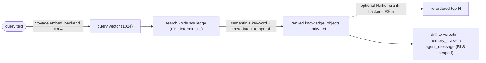

# 🔎 Gold hybrid retrieval — the ranker query-path

How the app **ranks gold knowledge for a query**: the deterministic hybrid ranker over the gold
vector store (`knowledge_object` / `knowledge_embedding`). This is the *retrieval* half of the
vector-data design — the *structure* (tables, the pinned vector contract, chunking, lifecycle) is
in [data-model.md](data-model.md) and [schema-guide.md §2](schema-guide.md#2-the-medallion-bronze--silver--gold).

[← Database](README.md) · Decision: [ADR-0115](../decision-records/ADR-0115-gold-hybrid-ranker-contract.md) ·
Substrate: migration [`0045`](../../db/migrations/0045_gold_knowledge_vectors.sql) +
[`0166`](../../db/migrations/0166_gold_hybrid_search_substrate.sql) · Issue #1166 (epic #966)

---

## What it is

A second-brain recall ("what did we decide about X," "find the conversation where the client said
Y") wants semantic recall **and** exact-keyword precision **and** metadata facets **and** a bias
toward recent knowledge — returned as one ranked list. The hybrid ranker combines four
**deterministic** stages into a single weighted score (MemPalace hybrid-v4 shape):

| Stage | Signal | Index | SQL |
| --- | --- | --- | --- |
| **Semantic** | cosine similarity of the query embedding to the object's best chunk | HNSW (`idx_knowledge_embedding_hnsw`) | `MAX(1 - (embedding <=> $vec))` |
| **Keyword** | full-text rank of the query terms against the chunk | GIN (`ix_knowledge_embedding_chunk_fts`) | `MAX(ts_rank(chunk_fts, plainto_tsquery('english', $q)))` |
| **Metadata** | facet pre-filter (optional) | GIN (`ix_knowledge_object_metadata_gin`) | `metadata @> $filter::jsonb` |
| **Temporal** | exponential recency decay on `updated_at` | — | `exp(-ln2 · age / (half_life · 86400))` |

The combined score is a **weighted sum**: `Σ weightᵢ · scoreᵢ`. Defaults: **semantic 1.0 ·
keyword 0.3 · temporal 0.2**, half-life **30 days**. Metadata is a filter, not a score term, in
this slice. Every query filters `knowledge_embedding` to the **pinned vector triple**
`(embedding_model, dimension, chunking_version)` from
[`db/contracts/vector-contract.json`](../../db/contracts/vector-contract.json) (ADR-0041) so
vector spaces never mix, and ranks only `status = 'published'` objects (drafts carry no
embeddings, ADR-0068 / migration 0068).

Results are `knowledge_object` rows carrying **`entity_ref`** + per-stage component scores, so the
caller can **drill to the verbatim store** — `memory_drawer` for human notes/conversations,
`agent_message` for agent runs (split by origin, ADR-0113). The drill-down is the two-level recall
(CLAUDE.md §4): reason over the gold summary, drill to verbatim for faithful detail.

## Where it runs (ADR-0042 §1)

The front end holds **no AI key**, so the work splits:

- **Deterministic ranker SQL → frontend.** `searchGoldKnowledge(identity, opts)` in
  [`src/lib/data/gold-knowledge-search.ts`](../../src/lib/data/gold-knowledge-search.ts) runs the
  four stages in one statement, given an **already-computed query vector**. Running SQL over a
  vector is a read, not an AI call.
- **Query-embed → backend.** Turning the query *text* into the 1024-d vector is a Voyage call →
  `ImperionCRM_Backend` #304.
- **Optional Haiku rerank → backend.** A Claude Haiku re-rank of the top-N shortlist →
  `ImperionCRM_Backend` #305. Default off (cost); the deterministic rank stands alone.



## Access control

Every read runs inside `withIdentity` ([`src/lib/db/identity.ts`](../../src/lib/db/identity.ts),
ADR-0105), so the two-axis RLS applies to the gold read and to any verbatim drill-down. The ranker
returns only `entity_ref` + title/summary from gold (broad-employee-read, ADR-0100) — never
verbatim PII. To read the verbatim turns the caller drills into the bronze store, where
`memory_drawer` is owner-scoped (ADR-0113) — that drill-down is the load-bearing PII control.

## Usage

```ts
import { searchGoldKnowledge } from "@/lib/data/gold-knowledge-search";

const hits = await searchGoldKnowledge(identity, {
  queryVector,                       // 1024-d, from the backend query-embed (#304)
  queryText: "backup retention policy",
  entityType: "memory",              // conversation summaries
  metadataFilter: { client: "acme" },
  limit: 10,
  // weights / halfLifeDays optional — defaults per ADR-0115
});
// each hit: { knowledgeObjectId, entityType, entityRef, title, summary, score, components }
// → drill via entityRef into memory_drawer / agent_message
```

## Operational note

Until on-prem vectorization goes live (LocalPipeline #176), `knowledge_embedding` is empty, so the
ranker returns `[]` — **deploy-dormant, not broken**. The weights and half-life are constants in
the module + ADR-0115; tuning is a one-line change. No new migration — the ranker rides the
existing HNSW + two GIN indexes (0045 + 0166).

## See also

- [ADR-0115](../decision-records/ADR-0115-gold-hybrid-ranker-contract.md) — the ranker contract (stages, weights, placement).
- [ADR-0041](../decision-records/ADR-0041-gold-knowledge-vector-store.md) / [ADR-0102](../decision-records/ADR-0102-vector-contract-single-home.md) — the pinned vector contract.
- [ADR-0113](../decision-records/ADR-0113-verbatim-memory-tier.md) — verbatim memory tier (the drill-down target).
- [data-model.md](data-model.md) — the vector-data structure + ERD.
