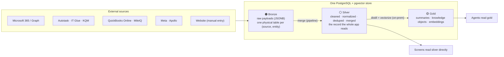
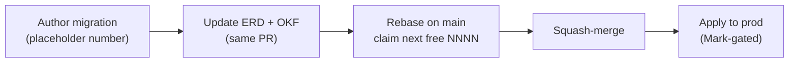

# How the database is shaped — a guide to the schema

> **Audience:** anyone new to Imperion Business Manager who needs to understand the
> data model before reading code or running a query — a new engineer, a reviewer, an
> operator, or an agent author.
> **Scope:** the *narrative* of the schema — how the store is organized, the medallion
> tiers, the conventions every table obeys, how to navigate the ERD, how to find an
> entity, and the migration discipline that keeps it all coherent. This is the
> "read me first" companion to the two reference docs it points at: the
> [ERD / data-model](data-model.md) (the structure, diagram-by-diagram) and the
> [OKF semantic layer](semantic-layer/index.md) (the *meaning* of each silver entity).

[← Database](README.md) · [Documentation library](../README.md) ·
[System of systems](../architecture/system-of-systems.md) ·
[ADR-0092 — medallion data platform](../decision-records/ADR-0092-medallion-data-platform-consolidated.md)

---

## 1. One store, three jobs

Imperion Business Manager runs on a **single PostgreSQL 18 database with the
`pgvector` extension** (`imperioncrm`, Azure Database for PostgreSQL Flexible Server).
That one store does three jobs at once (ADR-0003):

1. **System of record** — the relational tables every screen reads and writes.
2. **Embedding store** — `pgvector` columns hold the vectors the AI suite searches.
3. **Agent memory layer** — agent runs, transcripts, and knowledge live in the same
   place, so an agent reasons over the same truth a human sees.

There is no separate data warehouse, no separate vector database, and no separate
agent-memory store. One store keeps the whole platform — relational queries, semantic
search, and agent reasoning — pointed at one version of the truth.

This repo (the GUI) is the **single source of truth for the schema** (system-level
`CLAUDE.md` §1, [ADR-0042](../decision-records/ADR-0042-division-of-labor-reads-direct-processes-backend.md)).
The three sibling repos — backend, cloud pipeline, on-prem enrichment — are
*consumers*. A schema change is proposed **here**, never in a sibling; if work in a
sibling appears to need one, it stops and files an issue against this repo. The
cross-repo picture of who reads and writes which tier is in
[system-of-systems](../architecture/system-of-systems.md).

---

## 2. The medallion: bronze → silver → gold

Every external fact climbs three tiers on its way from a source system to an answer on
screen or in an agent's context. This is the **staged-enrichment pipeline**
(`CLAUDE.md` §4) and the spine of the whole data model. The consolidated decision is
**[ADR-0092](../decision-records/ADR-0092-medallion-data-platform-consolidated.md)**
(the medallion dossier — it folds in the per-source bronze model, the poll-cadence
control, the silver entities, and the pinned gold vector contract).

### 🟤 Bronze — raw, lossless, per source

Bronze holds the **original payload, untransformed**, so nothing a source said is ever
lost. The shape is **one physical table per `(source, entity)`** read through union
views (ADR-0039, which superseded the older single-enum-discriminated design ADR-0032):

- **Contacts:** `autotask_contacts`, `apollo_contacts`, `m365_contacts`,
  `itglue_contacts`, `website_contacts`.
- **Companies:** the matching `*_companies` set.
- **Devices:** `itglue_devices`, `m365_devices`, `website_devices`.
- Plus the many feed-specific bronze tables — Meta business, Defender
  incidents/alerts, Entra auth-methods, SharePoint sites, Entra groups, DNS posture,
  QuickBooks invoices/bills/purchases, and the on-prem security-posture set (Secure
  Score, Sentinel, Entra/Intune policies, Autotask contracts/tickets, IT Glue export).

The `source` is **implicit in the table name** (`365` → `m365_*` because a SQL
identifier can't start with a digit; the UI label stays "Microsoft 365"). Each bronze
row carries a `payload_bronze` JSONB envelope, an `external_ref` with a
`UNIQUE(source, external_ref)` guard, the silver FK (null until matched), match
metadata, and timestamps. **Union views** — `contact_bronze_all`,
`account_bronze_all`, `device_bronze_all` — re-introduce a `source` literal so the
"Data sources" popup and the merge can scan every source for one entity. Views are
**read-only**; all writes target the physical tables. Manual entries created in the app
land as the **`website` source**, pre-linked to silver, and win at top merge
precedence.

### ⚪ Silver — the record the whole app reads

Silver is the cleaned, normalized, deduplicated, **merged** record. `contact` and
`account` are the silver aggregates; ADR-0039 added the silver `device` entity; ADR-0044
added typed silver `contract` + `ticket`. The cloud pipeline's `merge-sources` pass
populates silver from bronze each sweep (full-scan idempotent upsert; text→typed parsing
is defensive — an unparseable value lands NULL, never fails the row). **Merge
precedence** runs website > autotask > the rest, so a human's manual edit beats a stale
feed.

Most screens read silver **directly** (this repo's GUI may read the DB for rendering;
every *process* still calls the backend — ADR-0042). Some silver "entities" are not
tables but **read-model views** recomputed on every read — e.g. `ticket_sla_breach`
(SLA worklist over silver `ticket`), `invoice_mirror` (AR aging over bronze
`qbo_invoices`), and `device_inventory_all` (the CMDB union). A view was chosen wherever
the underlying pull *is* the refresh, so there is no projection job to run.

### 🟡 Gold — AI-ready knowledge

Gold is the distilled, AI-consumable layer: `knowledge_object` (one per-entity gold
object) → `knowledge_embedding` (chunked vectors behind one HNSW cosine index, with
`embedding_model` / `dimension` / `chunking_version` columns so multiple versions
coexist). The embedding model is **pinned system-wide to Voyage `voyage-3-large` @ 1024
dims** (ADR-0041, settled by ADR-0043). The **on-prem local pipeline is the sole
vectorization producer**; the front end holds **no AI key**. Agents reason over gold;
Claude consumes retrieved *text*, not vectors, so the embedding model is an independent
retrieval choice, not a "Claude-compatible" one.

> **Append-only where it's evidence.** Interactions, consent events, agent runs, and
> audit logs are immutable event logs; current state is *derived* (e.g. the
> `current_consent` view is computed from the consent ledger, never stored). This is a
> deliberate medallion property: the raw evidence is never rewritten.

---

## 3. The conventions every table obeys

Learn these once and they hold across the whole schema:

| Convention | Rule |
| --- | --- |
| **Identity** | All primary keys are `uuid` (`gen_random_uuid()`). |
| **Timestamps** | Every row carries `created_at` / `updated_at`, kept current by the shared `set_updated_at()` trigger. |
| **Soft delete** | `archived_at` where retention requires keeping the row. |
| **Append-only evidence** | Interactions, consent, agent runs, audit logs are immutable; current state is a view. |
| **External systems are referenced, not duplicated** | Only an identity map (`external_identity`) + a short cache lives here; the source stays the system of record (ADR-0012). |
| **Provenance, not duplication** | A downstream record points back to the engagement that produced it via nullable `source_*_id` FKs — the engagement's data is never copied forward. |
| **PII-aware** | PII columns are tagged; access to PII-bearing data is audit-logged (ADR-0016); outbound sends are consent-gated (ADR-0014 / ADR-0025). |
| **Secrets never in the DB** | A connection stores `keyvault_secret_ref` (a Key Vault secret *name*), never the token. |
| **Polymorphic joins** | A few "people/tags/comments on work" tables (`work_assignment`, `work_tag`, `work_comment`) use `(parent_type, parent_id)` with no FK on `parent_id`. |

The **spine** is `account` → `contact` → `opportunity`. Each functional module owns its
own tables and references the spine by FK; satellites never reshape the spine. That is
what keeps a 125-migration schema navigable: find the spine, then follow FKs outward
into the module you care about.

---

## 4. The schema by module (a map)

The full DDL detail is in the [ERD / data-model](data-model.md); this is the
orientation map so you know which of its five diagrams to open.

| Module | Core tables (illustrative) | ERD diagram | Governing ADRs |
| --- | --- | --- | --- |
| **CRM spine & delivery** | `account`, `contact`, `opportunity`, `proposal`, `project`, `task`, `interaction` | Diagram 1 | ADR-0010 · ADR-0052 |
| **Project management parity** | `sprint`, `project_baseline`, `status_def`, `tag`, `work_tag`, `task_dependency`, `work_assignment` | Diagram 1 | ADR-0065/0066/0069 (consolidated **ADR-0094**) |
| **Sale → delivery orchestration** | `project_provisioning`, `task_ticket_fire`, `delivery_template*`, `opportunity_*_bronze` | Diagram 1 | ADR-0080/0081 (consolidated **ADR-0096**) |
| **Integrations, demand-gen & consent** | `connection`, `external_identity`, `campaign`, `ad`, `campaign_metric`, `event`, `consent_event`, `workflow` | Diagrams 2 & 5 | ADR-0012/0024/0053 |
| **Engagement capture** | `question_template`, `question`, `engagement_answer`, `discovery_call`, `assessment`, `assessment_artifact`, `strategic_business_review`, `ticket` | Diagram 4 | ADR-0022/0023 |
| **Agent platform & AI Board** | `agent`, `agent_run`, `agent_message`, `agent_memory`, `board_session*`, `agent_autopilot_policy` | Diagram 3 | ADR-0048/0049/0087 (consolidated **ADR-0091**) |
| **Enrichment dossier** | `contact_enrichment`, `contact_social_identity`, `meeting_action_item` | Diagram 5 | ADR-0025 |
| **Employee finance** | `timesheet`, `time_record`, `expense_item`, `expense_report`, comp data (`pay_rate`) | (in migrations) | ADR-0082/0083 (consolidated **ADR-0093**) |
| **AR & service ops** | `invoice_mirror` (view), `collections_activity`, `ticket_sla_breach` (view), `chat_session` | Diagram 4 | ADR-0044/0074/0085 |
| **Gold knowledge** | `knowledge_object`, `knowledge_embedding` | (vector design) | ADR-0041/0043 |

> **As-built note:** the ERD's Diagram 2 is the original *design* sketch; the tables
> actually built (migrations 0018–0026) are in **Diagram 5**, which is authoritative
> where they differ. The data-model doc says so inline at the top of Diagram 2.

---

## 5. How to find an entity

Three lenses, depending on the question you're asking:

1. **"What columns / FKs does it have?"** → the [ERD / data-model](data-model.md).
   It is organized into five `erdiagram` blocks (CRM core · integrations/demand-gen ·
   agent platform · engagement capture · as-built comms/connections). Search the file
   for the table name in `UPPER_CASE` (the ERD convention).
2. **"What does it *mean* — which source wins, how does it join, is it PII?"** → the
   [OKF semantic layer](semantic-layer/index.md). One concept file per silver entity,
   plus the [coverage matrix](semantic-layer/coverage-matrix.md) that maps **every**
   object → implementation archetype → status → acting ICM workflow. This bundle is
   **governed canon** ([ADR-0086](../decision-records/ADR-0086-okf-semantic-layer-over-silver.md));
   treat it as the authoritative answer to a *meaning* question and do not duplicate it
   into the narrative docs.
3. **"How is it actually created in the DB?"** → the
   [`db/migrations`](../../db/migrations) files, applied in filename order. Each
   migration's header comments name the tables it touches and the design diagram +
   ADR it implements (see `0001_phase1_core.sql` for the model).

A row-level or volatile answer ("how many tickets are open right now?") is **not** in
any of these — it is in the live database, reached read-only via the `postgres` MCP
(`CLAUDE.md` §8). No PII or row-level client data ever lands in these docs.

---

## 6. Migration discipline

The schema source of truth is the **ordered set of raw-SQL migrations** in
[`db/migrations`](../../db/migrations) (ADR-0017). The rules:

- **One migration per schema change.** Files are `NNNN_description.sql`, applied in
  filename order. Each is wrapped in `BEGIN; … COMMIT;` and uses `IF NOT EXISTS` /
  idempotent guards, so a named re-run is safe.
- **Never edit an applied migration** — add a new one. The applied files are immutable
  history.
- **The ERD ships with the schema change.** Updating [data-model.md](data-model.md) is
  part of the same PR as the migration (`CLAUDE.md` §8). If the change touches a silver
  entity's *shape, source-of-record, or join paths*, the matching OKF concept file +
  the coverage-matrix row update **in the same PR** too (ADR-0086; enforced by the
  `semantic-layer` docs-gate CI, #535).
- **Numbers are claimed at MERGE, not at authoring.** Migration numbers are a global
  counter GitHub can't hand out, so concurrent branches collide on them. Author against
  a placeholder; just before squash-merge, rebase on `main`, take the next free number,
  rename the file, and fix every reference (system-level `CLAUDE.md` §10.3). Cite issue
  / PR numbers (`#N`) for cross-references — those are race-free.

### Applying a migration

Migrations apply with a **short-lived Microsoft Entra token** as the password —
**nothing secret is stored or printed** (the same identity model as the read-only
`postgres` MCP, `CLAUDE.md` §8). The full how-to — the `psql` path and the
`scripts/migrate.mjs` Node runner (`node scripts/migrate.mjs 0035`) — is in
[`db/README.md`](../../db/README.md). The runner applies **only the file(s) you name**
(never a blind "run everything", which would re-fire the seed migrations).

> **Applying to prod is Mark-gated.** Anything that touches production data is surfaced
> to the human first, even when a permission rule would allow it (system-level
> `CLAUDE.md` §2). The **repo holds migration files through `0125`**; the
> *prod-applied range* (and which recent additive sets are still gated pending
> credentials / consent) is tracked in [`CLAUDE.md`](../../CLAUDE.md) §6 and the
> project memory — that is the live operational truth, not this doc.

---

## 7. Where to go next

| You want… | Read |
| --- | --- |
| The structure — every table, column, FK, enum | [data-model.md](data-model.md) (the ERD) |
| The meaning — source-of-record, joins, PII per silver entity | [semantic-layer/index.md](semantic-layer/index.md) (governed OKF canon) |
| How the app reads data | [data-access-layer.md](data-access-layer.md) |
| How a fact crosses repo boundaries | [system-of-systems](../architecture/system-of-systems.md) |
| The capability story the data backs | [Imperion Business Manager — overview](../product/imperion-business-manager-overview.md) |
| The decisions behind the platform | [ADR-0092](../decision-records/ADR-0092-medallion-data-platform-consolidated.md) (medallion) · [decision-records](../decision-records/README.md) |

The shared cross-repo security baseline is the
[unified security standard](../security/unified-security-standard.md) — referenced
here, never restated.
