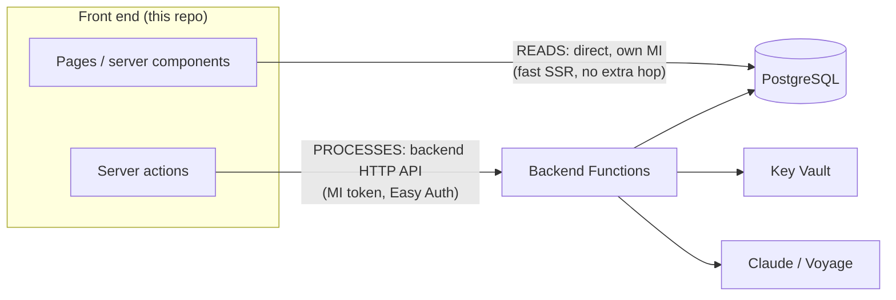

# ADR-0042: Division of labor: direct reads OK, every process runs in the backend

| Field | Value |
|---|---|
| **Repo** | frontend |
| **Status** | Accepted |
| **Date** | 2026-06-09 |
| **Amends** | [ADR-0018 — GUI-only front end](ADR-0018-gui-only-frontend-external-functions.md) (makes its boundary precise) and ADR-0028 (the backend call contract). |
| **Relates to** | backend ADR-0034/0035, pipeline ADR-0011, the [unified security standard](../security/unified-security-standard.md). |
| **Cross-references** | backend ADR-0034, backend ADR-0035, pipeline ADR-0011 |

## Problem

ADR-0018 said "GUI-only front end; heavy logic in external functions" — but in practice
this repo grew a full data-access layer (50+ repository methods over its own managed
identity) doing both reads *and* writes, plus server actions that execute business
processes. Meanwhile the backend exists and is the designated home for processes. The
boundary needed an explicit, enforceable rule — and a decision on how strict to be about
the existing direct DB access.

## Options considered

1. **Reads direct, processes in backend (chosen).** Matches how the app actually
   performs on B-tier compute; the security boundary (per-identity Postgres roles,
   consent gate in the backend) is preserved where it matters — on actions.
2. Full strictness now (zero DB access in the front end). Rejected — 50+ repo methods
   would become HTTP endpoints before any new value ships, and every page render would
   pay a backend hop.
3. Status quo (front end keeps reads + writes + some processes). Rejected — processes in
   the GUI duplicate the backend's consent/audit/identity controls or bypass them.

## Decision

**The front end is strictly GUI. Reading the database directly is fine; running a
process is not.** Settled with the operator 2026-06-09:

1. **Direct DB READS stay.** Server components and repositories may query PostgreSQL
   directly with the web app's managed identity for *rendering* — lists, detail pages,
   dashboards, search. This is the fast path (no extra network hop on every page) and is
   read-only in spirit: it computes nothing durable.
2. **Every PROCESS runs in the backend.** If an action *does* something — sends a
   message, runs an agent, stores a credential, executes an OAuth flow, enriches a
   contact, triggers a refresh, mutates consent/permissions — it goes through a backend
   HTTP API (`src/lib/services/external-client.ts`, MI bearer token). The browser never
   calls the backend; only server-side code does.
3. **Plain CRUD writes are the gray zone, migrated incrementally.** Simple
   create/update/delete server actions (e.g. rename an account, move a pipeline stage)
   may keep their current direct-write implementation for now, but: (a) **new** write
   paths that involve any rule beyond field persistence go to the backend from day one;
   (b) existing write actions move to backend endpoints opportunistically (when touched
   for another reason), not as a big-bang rewrite. The end state is reads-direct /
   writes-via-backend.
4. **Schema + migrations stay HERE.** Direct reads make this repo a first-class schema
   consumer, and the migration tooling (`scripts/migrate.mjs`, Entra-token auth) already
   lives here. ADR-0017 unchanged.

## Consequences

**Security / cost / ops impact**

- **Security:** the consent gate, approval gates, audit logging, and Key Vault access
  live in the backend — by routing every *process* there, the front end cannot bypass
  them. The web app's DB role can be progressively narrowed toward SELECT-heavy as
  writes migrate.
- **Cost:** zero new infrastructure; avoids doubling request hops on render paths.
- **Ops:** when a server action migrates to the backend, ship the backend endpoint
  first, flip the action to `external-client`, then revoke the front-end role's write
  GRANT on that table (each step reversible).
