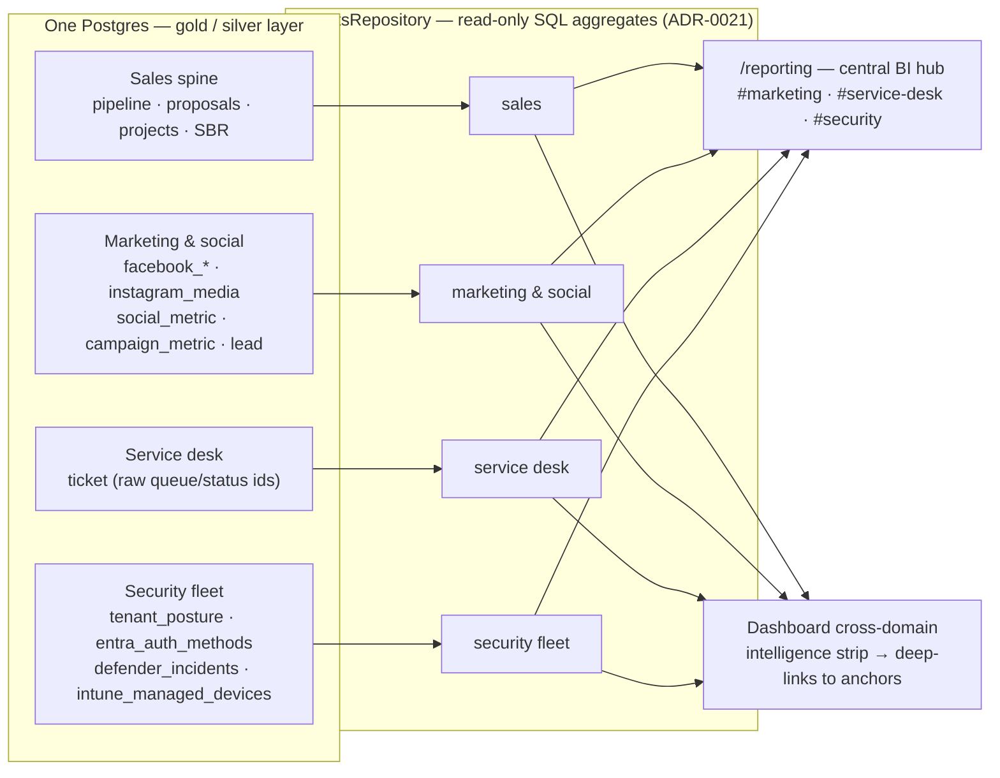

# ADR-0062: Reporting page as the central business-intelligence hub

| Field | Value |
|---|---|
| **Repo** | frontend |
| **Status** | Accepted |
| **Date** | 2026-06-12 |
| **Cross-references** | ADR-0021 (reporting read model + Recharts), ADR-0012 (paid vs organic metric homes), ADR-0030 (revenue gate), ADR-0042 (GUI-only boundary), ADR-0051 (posture surfaces), ADR-0059 (Defender↔ticket links), pipeline ADR-0013 (Meta ingestion), ADR-0082 (employee time tracking — Time Efficiency section, #467) |

## Problem

The data surface has grown far past what `/reporting` and the dashboard show.
Live in prod as of 2026-06-12: Meta organic social (migration 0075 —
`facebook_posts`/`facebook_messages`/`instagram_media`/`social_metric`), lead
captures by source including `facebook_dm`, paid `campaign_metric` rows, Autotask
tickets with raw queue ids (0074), Defender incidents + ticket links (0076),
Entra MFA registration (0077), Intune devices (0069), credential exposures
(0043), and tenant posture rollups (0062). Reporting still shows only the sales
spine (pipeline/proposals/projects/SBR); the dashboard shows only sales KPIs.
There is no single place to see the business across domains.

## Context

ADR-0021 set the pattern: a read-only `reports` repository, SQL aggregation,
thin Recharts client wrappers, per-call mock fallback. Its "future
considerations" explicitly anticipated campaign ROI and richer surfaces "when
those modules land" — they have landed. The GUI-only boundary (ADR-0042) makes
direct DB reads for rendering the correct transport; migration 0075 already
granted the web role SELECT on `social_metric` and the Meta bronze tables "for
future reporting surfaces".

Data-shape constraints verified against prod (2026-06-12):

- `social_metric` metric names are source-truthful and unstable while local #135
  tunes the insight defaults (`page_impressions_unique`, `page_post_engagements`,
  `page_views_total`, `followers_count`). Queries must be **metric-generic** —
  aggregate whatever metrics exist, never hard-code metric names.
- `ticket.status` and `ticket.queue` hold raw Autotask picklist ids (label
  lookup deferred at 0074); no ticket has `closed_at`/completed dates yet. The
  service-desk section therefore reports **distributions and opened-trend**, not
  open/closed flow, until labels and completion dates merge.
- Security fleet tables (`tenant_posture`, `entra_auth_methods`,
  `defender_incidents`, `intune_managed_devices`) are empty until server
  bringup (local #102) registers the collectors — sections must render honest
  empty states ("no coverage yet"), the posture-page precedent.

## Options considered

- **Per-domain pages** (a Social page, a Service-desk analytics page, …) — more
  routes, scatters the "how is the business doing" question across the nav.
- **One BI hub on `/reporting` with anchored domain sections (this decision)** —
  one destination, sections deep-linkable from dashboard cards.
- **Embedded Power BI** — heavyweight, parallel data model, per-seat cost;
  rejected while in-app SQL aggregates suffice.

## Decision

1. `/reporting` becomes the **central BI hub**: anchored sections — Sales
   (existing content), **Marketing & Social** (`#marketing`), **Service Desk**
   (`#service-desk`), **Security Fleet** (`#security`). Fleet-wide rollups live
   here; per-account drill-downs stay on `/security` and the account posture
   pages (ADR-0051).
2. The **dashboard gains a cross-domain intelligence strip** under the sales KPI
   row; each card deep-links to its reporting anchor.
3. Mechanics follow ADR-0021 unchanged: read-only `ReportsRepository` methods
   (one method per section returning a typed payload), SQL `GROUP BY`/`FILTER`
   aggregation, per-call guarded fallback (#193), Recharts wrappers, server
   components.
4. Money figures (campaign spend) sit behind the ADR-0030 revenue gate like
   every other revenue figure.
5. Aggregates only — **no row-level PII** (no DM bodies, no UPNs, no emails) on
   reporting surfaces; bronze text columns are cast defensively
   (`nullif(x,'')::numeric`).

Shipped as four micro-PRs under epic #288 (#289 marketing/social, #290 service
desk, #291 security fleet, #292 dashboard strip).

6. A **Time Efficiency** section (`#time-efficiency`, added under ADR-0082 epic
   #458, issue #467) extends the hub with employee time analytics:
   - **Utilization** is **comp-free** — the split of authoritative attendance
     minutes (silver `time_record`, `kind='attendance'`) across the
     `billable | internal | admin` categories; billable utilization = billable ÷
     attended. Allocation (Autotask) rows carry a null category and are excluded.
   - **Labor cost** is **comp-derived** — Σ(approved hours × effective hourly
     rate) over approved timesheets (`timesheet_payroll_status`, states
     `approved | payroll_approved | paid`), the rate being the latest `pay_rate`
     effective on/before the week start (salaried folded to hourly at 2080 hr).
     It is **AGGREGATE-ONLY** (never a per-person rate) and gated to **finance |
     admin** by `canSeeLaborCost`: `reports.timeEfficiency(includeLaborCost)`
     only runs the `pay_rate` query when the caller is gated in — so comp data is
     never read for other roles, and the whole section is hidden from them.
   - Build-ahead: all figures are zero/empty until `time_record`, approved
     timesheets, and `pay_rate` carry rows (depends on seeding + pipeline/backend
     data flow, ADR-0082). Realization (billable revenue ÷ cost) is deferred — it
     needs a billed-revenue join not yet modeled.

### The hub at a glance

Aggregates only — no row-level PII crosses into the repository; empty fleet
tables render honest "no coverage yet" states, never fake zeros.

## Consequences

### Security impact

Read-only SELECTs over tables the web role already holds grants for (0075
granted the Meta surface explicitly). No new write paths, no new external
surface, no PII in aggregates. Spend respects the revenue gate.

### Cost impact

None. Aggregate queries over indexed columns; no new dependencies.

### Operational impact

No schema change, no migration. Sections degrade to mock data (no DB) or honest
empty states (empty tables) per the existing fallback seam. When local #135
renames insight metrics or #102 fills the fleet tables, the sections pick the
data up without code change.

## Future considerations

Ticket status/queue **label** lookup (deferred at 0074) will upgrade the
service-desk section from raw ids to names. Time-series snapshots (posture
already snapshots via 0063) could extend to MRR/pipeline for trend lines. A
date-range filter and CSV export remain open from ADR-0021.
