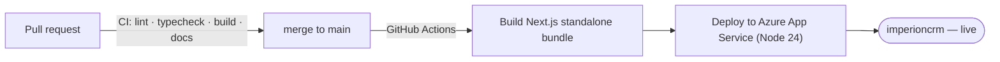

# 🚀 Deployment

How code gets from a merge to the live app, and where configuration lives.

[← Documentation library](../README.md)

## The pipeline

- **CI gate** (`.github/workflows/ci.yml`): every PR runs lint, typecheck, build, and
  the docs check; PRs fail if required documentation is missing.
- **Deploy** (`.github/workflows/main_imperioncrm.yml`): on merge to `main`, builds a
  **standalone** bundle (its own traced `node_modules`) and ships only that —
  `node server.js`, no Oryx build (ADR-0006).

## Configuration & secrets

App configuration (DB host/user, managed-identity client id, auth) lives in **App
Service settings**; secrets live in **Azure Key Vault** — never in the repo. Copy
`.env.example` → `.env.local` for local dev.

## Database changes

Migrations are applied **separately** from the app deploy (raw SQL, ADR-0017) — the
app never auto-migrates. Apply in order with an Entra token; see
[`db/README.md`](../../db/README.md).

> The Postgres repositories **fall back to mock on error**, so a deploy can't break the
> app even if a migration hasn't been applied yet.

What belongs here (to expand): rollback, environment promotion, blue/green or slots.
