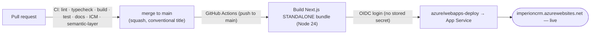

# 🚀 Deployment

How code gets from a merge to the live **Imperion Business Manager** app, where
configuration and secrets live, and how database changes ship *separately* from the app.
Everything here is verified against the actual workflows in `.github/workflows/`.

[← Documentation library](../README.md) ·
[Security](../security/README.md) ·
[Runbooks](../runbooks/README.md) ·
[Disaster recovery](../disaster-recovery/README.md) ·
[Operations](../operations/README.md)

> **Scope.** This is the **front-end (GUI) repo's** deploy story — Azure App Service.
> The three siblings (`ImperionCRM_Backend`, `ImperionCRM_Pipeline`,
> `ImperionCRM_LocalPipelineEnrichment`) deploy themselves; see
> [system of systems](../architecture/system-of-systems.md). A known cross-repo gotcha:
> a **backend deploy lands code but does not sync triggers** — functions stay dormant
> until a manual trigger sync (a sibling-repo concern, noted here so you don't chase a
> phantom front-end bug).

---

## The pipeline at a glance

Two workflows do the work:

| Workflow | File | When | What |
| --- | --- | --- | --- |
| **CI gate** | `.github/workflows/ci.yml` | every PR (+ push to main) | `build` (lint · typecheck · build), `test` (vitest — required), `docs` (required `/docs` tree + ADR-index check), `icm-conformance`, and on PRs the `semantic-layer` gate. PRs fail if required docs are missing. |
| **Deploy** | `.github/workflows/main_imperioncrm.yml` | push to `main` (or manual dispatch) | Builds a **standalone** bundle and ships only that. |
| **Release** | `.github/workflows/release-please.yml` | — | Maintains the Release PR / tags from conventional commits (don't hand-edit tags or CHANGELOG). |

---

## How the deploy actually works (and why it's shaped this way)

The deploy builds a Next.js **standalone** bundle on the runner and ships *only that*:

1. Checkout, set up **Node 24** (matching the App Service runtime).
2. `npm install` → `npm run build`.
3. Assemble `deploy/` = `.next/standalone` + `.next/static` + `public/`.
4. **Log in to Azure via OIDC federated credentials** — `azure/login@v3` with a
   client/tenant/subscription id and **no stored publish profile or deployment secret**.
5. `azure/webapps-deploy@v3` ships `deploy/` to the `imperioncrm` App Service.

> **Why standalone?** The standalone `server.js` bundles its own traced `node_modules`,
> so the container starts with `node server.js` — **no Oryx server build**, and none of
> the old artifact-pipeline breakage (a dropped `next` bin symlink → exit 127 → 503).
> The startup command + Oryx-off are set on the Web App via `az`. Hosting is App Service,
> not Static Web Apps ([ADR-0006](../decision-records/ADR-0006-azure-app-service-hosting.md)).

> **Security note (verified):** CI/CD authenticates to Azure with **OIDC federated
> credentials**, so **no deployment secret lives in GitHub**
> ([unified-security-standard](../security/unified-security-standard.md) §5). The
> `AUTH_SECRET` set in the workflow is a **throwaway build-time-only** value (the real
> one is an App Service setting); `env.ts` is fail-closed at *runtime*, not build time.

---

## Configuration & secrets

| What | Where it lives |
| --- | --- |
| App configuration (DB host/user, managed-identity client id, auth audience, Entra group GUIDs, …) | **App Service settings** — *names/values for config*, never application secrets. |
| Application **secrets** (the real `AUTH_SECRET`, OAuth/source/AI keys) | **Azure Key Vault** — never the repo, never a logged value ([secrets-management](../security/secrets-management.md)). |
| Local dev | Copy `.env.example` → `.env.local`. |

The bright line is the same one as everywhere: **secret *names* may live in config;
secret *values* never leave Key Vault. Never commit secrets** (CLAUDE.md §5).

---

## Database changes ship separately

Migrations are applied **separately from the app deploy** — the app **never
auto-migrates** (raw SQL, [ADR-0017](../decision-records/ADR-0017-raw-sql-migrations.md)):

- Apply in filename order with an **Entra token** (no stored password) per
  [`db/README.md`](../../db/README.md) — `psql -f` or `scripts/migrate.mjs`.
- Schema is **single-sourced in this front-end repo**; siblings are consumers (system
  CLAUDE.md §1).
- Migration numbers are claimed **at merge**, not at authoring (system CLAUDE.md §10.3).
- Applying a migration to **prod is Mark-gated**.

> **Why the app can't break on an unapplied migration:** the Postgres repositories
> **fall back to mock on error**, so a deploy can ship even if a migration hasn't landed
> yet. The two artifacts (code, schema) are decoupled on purpose.

---

## Rollback

- **App:** revert the offending squash commit on `main` (re-deploys the prior bundle), or
  redeploy a known-good build. The app is **stateless**, so rollback is just
  redeployment ([disaster-recovery](../disaster-recovery/README.md)).
- **Schema:** never edit an applied migration — ship a **new** migration that reverses it
  (additive, idempotent). Schema rollback is forward-only by design.

---

## What belongs here (to expand)

- **Environment promotion** / preview slots and **blue-green or slot swaps**.
- A dedicated **rollback runbook** (the keystrokes behind the section above) under
  [runbooks](../runbooks/README.md).
- **Deploy verification** — the post-deploy smoke check (sign-in works, a page renders,
  health probes green).

---

## See also

[Security](../security/README.md) ·
[Runbooks](../runbooks/README.md) ·
[Disaster recovery](../disaster-recovery/README.md) ·
[Operations](../operations/README.md) ·
[`db/README.md`](../../db/README.md) ·
[System of systems](../architecture/system-of-systems.md)
