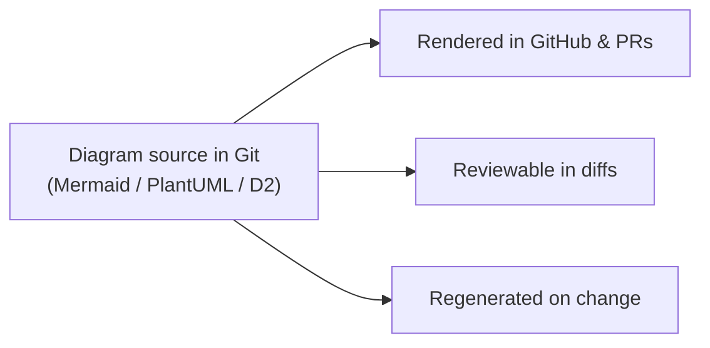

# 🖼️ Diagrams

Shared diagram **source**, version-controlled and rendered from text — never binary
exports (CLAUDE.md §8). Prefer Mermaid; PlantUML/D2 where they fit better.

[← Documentation library](../README.md)

## Why text, not images

A diagram you can diff and regenerate stays true; a screenshot rots.

## Where diagrams live

Most diagrams live **inline** in the doc they explain (e.g. the ERD in
[data-model](../database/data-model.md), the lifecycle in
[customer-lifecycle](../architecture/customer-lifecycle.md)). This folder holds
**shared/cross-cutting** source that several docs embed or reference.

The eight required system diagrams are indexed from
[architecture](../architecture/README.md).
