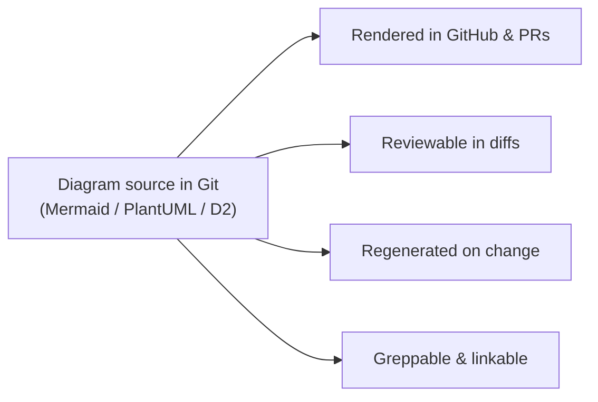
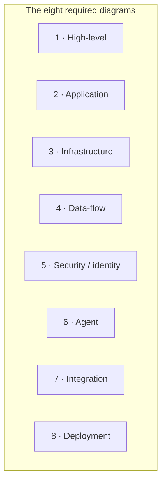

# 🖼️ Diagrams

Shared, cross-cutting **diagram source** for Imperion OS — version
controlled and rendered from text, never binary exports (CLAUDE.md §8). Every diagram in
the documentation library is something you can read, diff, and regenerate; nothing here
is a screenshot.

[← Documentation library](../README.md) ·
[Architecture](../architecture/README.md) ·
[System of systems](../architecture/system-of-systems.md)

---

## Why text, not images

A diagram you can diff and regenerate stays true to the system; a screenshot rots the
moment the code moves. So Imperion OS keeps **diagram source in the repo,
beside the document it explains**, and lets GitHub render it. The house format is
**Mermaid**; PlantUML or D2 are used only where they express something Mermaid cannot.

> This is the same documentation-as-code rule the whole library follows: diagrams are a
> deliverable and a review surface, not an afterthought.

---

## Where diagrams actually live

Most diagrams live **inline** in the document they explain — that keeps the picture and
the prose in one reviewable place. You will find:

| Diagram | Lives inline in |
| --- | --- |
| The data model / ERD | [database/data-model](../database/data-model.md) |
| The assessment-led customer lifecycle | [architecture/customer-lifecycle](../architecture/customer-lifecycle.md) |
| The capability mind-map (CRM · ERP · Extras · AI) | [product/imperion-os-overview](../product/imperion-os-overview.md) |
| The CI gate flow | [testing/README](../testing/README.md) |
| The workflow / journey automation flows | [workflows/README](../workflows/README.md) |

This folder is the home for **shared / cross-cutting source** — the estate-level
pictures that several documents embed or point at, gathered so there is one canonical
copy to maintain. The consolidated copy-paste set lives in
**[imperion-os-system-diagrams](imperion-os-system-diagrams.md)**.

---

## The eight required system diagrams

Per CLAUDE.md §8 the [architecture area](../architecture/README.md) **owns** the eight
required system diagrams; this folder is the index that ties their sources together. They
render inline across the architecture docs:

| # | Diagram | Rendered in |
| --- | --- | --- |
| 1 | **High-level** estate | [system-of-systems](../architecture/system-of-systems.md) |
| 2 | **Application** boundary | [application-boundary](../architecture/application-boundary.md) |
| 3 | **Infrastructure** estate | [system-of-systems](../architecture/system-of-systems.md) |
| 4 | **Data-flow** (medallion → IKF → ICM) | [system-architecture](../architecture/system-architecture.md) · [data-and-automation-doctrine](../architecture/data-and-automation-doctrine.md) |
| 5 | **Security / identity** | [system-of-systems](../architecture/system-of-systems.md) |
| 6 | **Agent** orchestration | [system-architecture](../architecture/system-architecture.md) |
| 7 | **Integration** surface | [application-boundary](../architecture/application-boundary.md) |
| 8 | **Deployment** | [deployment](../deployment/README.md) |

---

## Authoring conventions

- **One concept per diagram.** If a picture needs a paragraph to decode, split it.
- **Label edges**, not just nodes — the relationship is usually the point.
- **Brand:** the product is **Imperion OS** in any diagram title or root
  node, never "Imperion CRM" or "Imperion Business Manager".
- **Keep it renderable in GitHub.** Confirm the Mermaid block parses (GitHub preview or
  the Mermaid live editor) before committing — a broken diagram block is a broken doc.
- **No secrets, no client identifiers, no PII** in any diagram — the same rule as every
  other doc. See the [unified security standard](../security/unified-security-standard.md)
  (referenced, never restated).

---

## See also

- [System diagrams (consolidated source)](imperion-os-system-diagrams.md)
- [Architecture](../architecture/README.md) — owns the eight diagrams and the deeper
  system narrative.
- [System of systems](../architecture/system-of-systems.md) — the four-repo estate.
- [Data model](../database/data-model.md) — the ERD source.
