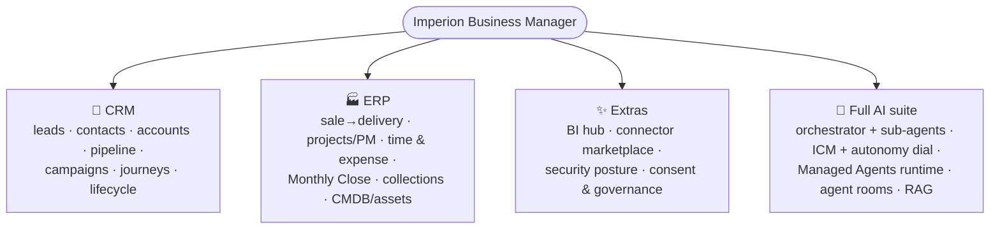
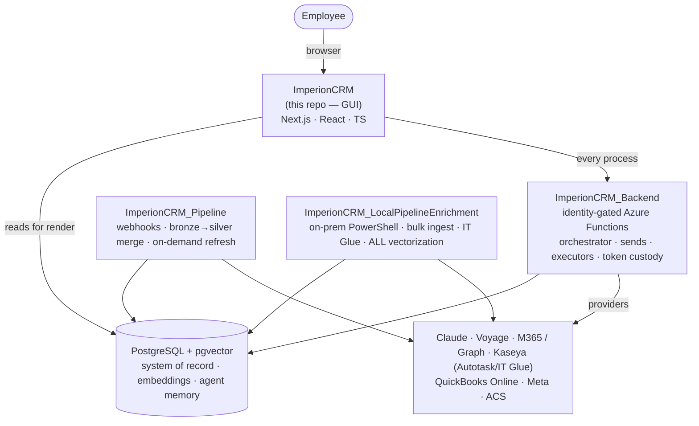
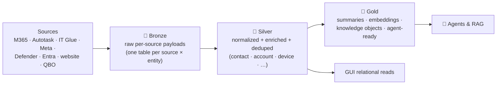
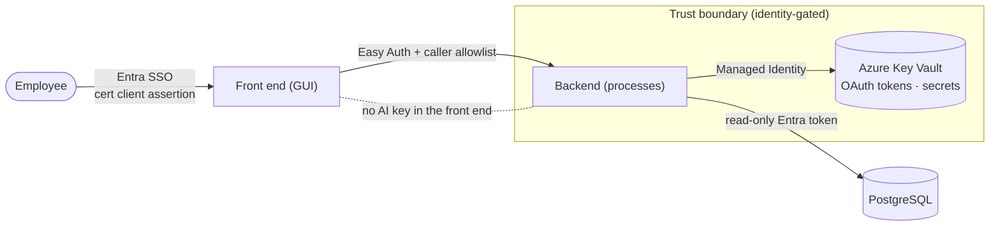
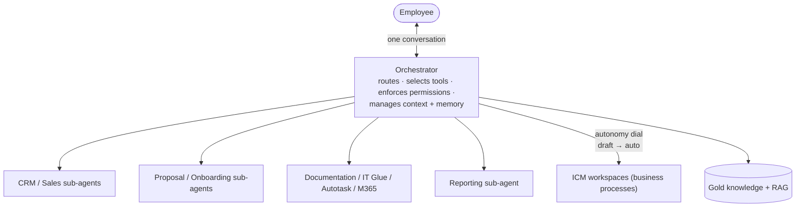
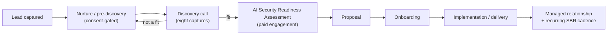

# Imperion Business Manager — system diagrams (consolidated source)

> **What this is:** the cross-cutting, estate-level diagrams that several documents in
> the library refer to, gathered in one place so there is a single canonical source to
> update. Each diagram below is plain Mermaid — copy it into the doc that needs it, or
> link here. Module-specific and component-specific diagrams stay inline in their own
> docs (see the [diagrams index](README.md)).

[← Diagrams](README.md) · [Documentation library](../README.md) ·
[System of systems](../architecture/system-of-systems.md)

---

## 1. The capability surface (CRM · ERP · Extras · AI)

Imperion Business Manager is **not just a CRM** — it is CRM + ERP + extras + a full AI
suite on one surface (CLAUDE.md §1). The four families:

Full narrative: [capability overview](../product/imperion-business-manager-overview.md).

---

## 2. The four-repo estate (high-level + integration)

The product is one application spread across four repositories with a settled division of
labor (ADR-0042). This front end is **GUI only**; every *process* runs in a sibling.

Full ownership table + cross-repo rules: [system-of-systems](../architecture/system-of-systems.md).

---

## 3. Data-flow — medallion enrichment (bronze → silver → gold)

All external data flows through three tiers (CLAUDE.md §4); most agent reasoning consumes
**gold** only.

Meaning of each silver entity lives in the OKF semantic layer
([semantic-layer/index](../database/semantic-layer/index.md), ADR-0086).

---

## 4. Identity / security boundary

Entra ID is the sole identity provider; the front end holds no AI provider key.

Baseline: [unified security standard](../security/unified-security-standard.md)
(referenced, never restated).

---

## 5. Single-orchestrator agent model

The user talks to **one** orchestrator; specialized sub-agents never address the user
directly (CLAUDE.md §2).

Deeper: [agents area](../agents/README.md) and the orchestration matrix.

---

## 6. Assessment-led customer lifecycle

The go-to-market motion the CRM models — from lead to continuous customer success.

Full narrative: [customer-lifecycle](../architecture/customer-lifecycle.md); source assets:
[reference/sales-marketing](../reference/sales-marketing/README.md).

---

## Keeping these honest

These are **maps, not the territory** — verify against source before acting on a picture.
When the system changes, update the diagram in the same PR as the code (docs-as-code,
CLAUDE.md §8). Brand every title **Imperion Business Manager**; never embed secrets,
client identifiers, or PII.
