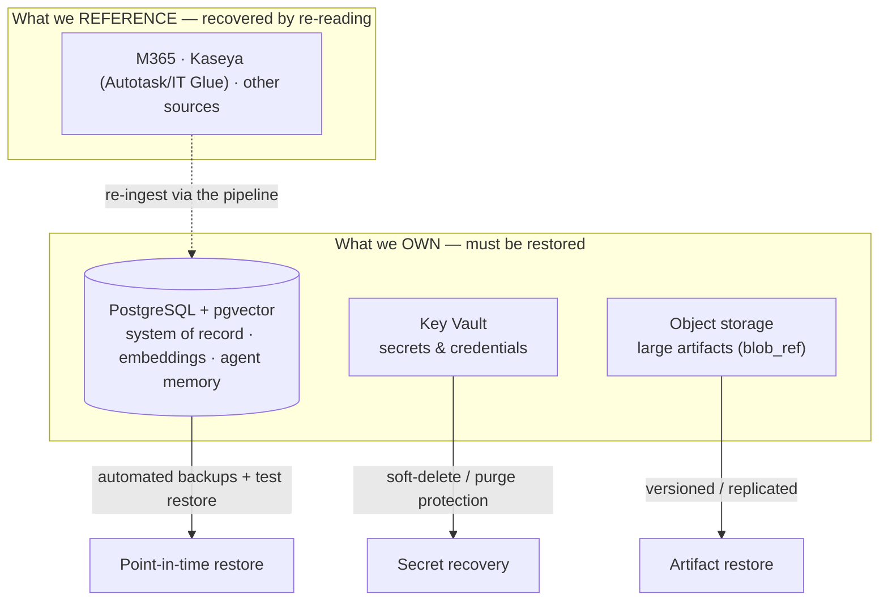

# 🌪️ Disaster Recovery

Business continuity for **Imperion OS**: what we protect, how fast we must
recover it, how we *prove* a restore actually works, and who we tell. DR is the
**recover** phase that [incident-response](../security/incident-response.md) hands off
to — when something is lost or corrupted, this is how it comes back.

[← Documentation library](../README.md) ·
[Security](../security/README.md) ·
[Incident response](../security/incident-response.md) ·
[Deployment](../deployment/README.md) ·
[Operations](../operations/README.md)

> **Status — framework, partly aspirational.** The protections below (Postgres automated
> backups, Key Vault soft-delete/purge protection, redeploy-from-source) are real and in
> place. **RPO/RTO targets and a *scheduled, proven* test restore are pre-go-live work**
> and are called out as such. Treat the numbers as proposed defaults until ratified.

---

## The core idea: own little, re-read the rest

**The database is the one irreplaceable asset.** Almost everything else is either
*derivable* (embeddings, gold-layer knowledge — regenerable by re-running the pipeline)
or *referenced, not owned* — external systems (M365 / Kaseya) are recovered by
**re-reading** them through the pipeline, not by restoring a copy we keep. That single
fact shrinks the DR problem to: **protect Postgres, protect Key Vault, and be able to
redeploy the app.**

---

## What we protect (and how)

| Asset | Recovery approach | Backstop |
| --- | --- | --- |
| **PostgreSQL** (Azure Flexible Server, PG 18) | **Point-in-time restore** from automated backups. | A **scheduled test restore** proves backups are real (below). |
| **Key Vault** secrets | Recover from **soft-delete**; **purge protection** blocks malicious/accidental destroy. | Re-issue + re-store from the [secrets-rotation runbook](../operations/secrets-rotation-runbook.md). |
| **Object storage** (large artifacts via `blob_ref`) | Versioned / replicated storage. | The DB row points at the artifact; re-fetch where the source is external. |
| **The app** | **Redeploy a known-good standalone bundle** from `main` (no state in the app). | Deploy is build-from-source via OIDC ([deployment](../deployment/README.md)). |
| **Derived data** (embeddings, gold knowledge) | **Regenerate** by re-running the pipeline — not separately backed up. | The on-prem pipeline owns vectorization. |
| **External data** (M365 / Kaseya) | **Re-ingest** through the pipeline — referenced, not owned. | Idempotency-by-content-hash makes re-ingestion safe. |

---

## RPO / RTO (proposed defaults — ratify before go-live)

**RPO** = how much data we can afford to lose (the gap back to the last good copy).
**RTO** = how long we can be down.

| Asset | RPO (proposed) | RTO (proposed) | Rationale |
| --- | --- | --- | --- |
| PostgreSQL (system of record) | Minutes (PITR window) | Hours | Irreplaceable; PITR gives a tight RPO. |
| Key Vault secrets | ~0 (soft-delete retains) | Hours | Recoverable in place. |
| App / compute | n/a (stateless) | < 1 hour | Redeploy from `main`. |
| Derived (embeddings/gold) | n/a | Hours–days | Regenerated, not restored; lowest priority. |
| External (M365/Kaseya) | n/a | Days | Re-ingested; bounded by source/API throughput. |

> These are **proposals** until Mark ratifies them. The number that matters most is the
> Postgres pair — everything else is either stateless or re-derivable.

---

## Backup validation — a backup is not real until a restore is proven

The non-negotiable DR principle:

> **An untested backup is a hope, not a backup.** A scheduled **test restore** —
> restore to a throwaway target, run sanity checks (row counts, key invariants,
> pgvector intact), then tear down — is what turns "we have backups" into "we can
> recover." This is tracked as pre-go-live work.

The test restore also exercises the *runbook*, so the procedure is muscle memory before
a real incident, not read for the first time under pressure.

---

## Recovery procedures (to formalize as runbooks)

Each of these becomes a numbered [runbook](../runbooks/README.md) (file an issue per
procedure):

1. **DB point-in-time restore** — restore the Flexible Server to a timestamp, repoint the
   app, verify (Entra-token connection per [`db/README.md`](../../db/README.md)).
2. **Secret recovery** — recover from Key Vault soft-delete, or re-issue + re-store from
   the [secrets-rotation runbook](../operations/secrets-rotation-runbook.md).
3. **App redeploy / rollback** — redeploy a known-good standalone bundle
   ([deployment](../deployment/README.md)).
4. **Re-ingest external data** — re-run the pipeline against the source; idempotency
   makes replays safe.

---

## Communication & escalation

- **Escalation point: Mark** for any production-data recovery, secret recovery, or
  anything touching prod auth/infra (Mark-gated, system CLAUDE.md §2).
- A DR event is also a **security incident** — run it through the
  [incident-response](../security/incident-response.md) loop (detect → contain →
  eradicate → **recover (here)** → review).
- A formal severity matrix and external-notification SLAs are pre-go-live work.

---

## See also

[Incident response](../security/incident-response.md) ·
[Deployment](../deployment/README.md) ·
[Operations](../operations/README.md) ·
[Security](../security/README.md) ·
[secrets-rotation runbook](../operations/secrets-rotation-runbook.md) ·
[`db/README.md`](../../db/README.md)
