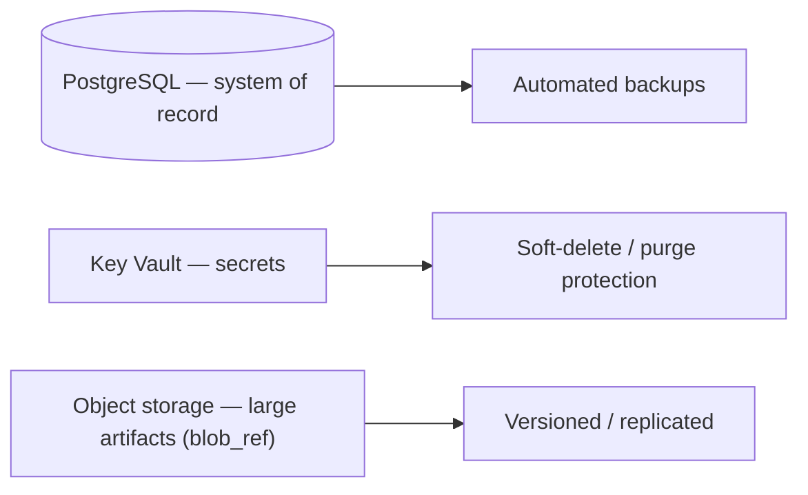

# 🌪️ Disaster Recovery

Business continuity for the platform: what we protect, how fast we recover, and how we
*prove* a restore works.

[← Documentation library](../README.md)

## What we protect

The database is the one irreplaceable asset — external systems (M365/Kaseya) are
referenced, not owned, so they're recovered by *re-reading*, not restoring.

## What belongs here (to define)

- **RPO / RTO** targets per asset.
- **Backup validation:** a scheduled *test restore* — a backup is not real until a
  restore has been proven.
- Recovery procedures (DB point-in-time restore, app redeploy, secret recovery).
- Communication / escalation plan.

See also: [operations](../operations/README.md) · [security](../security/README.md).
