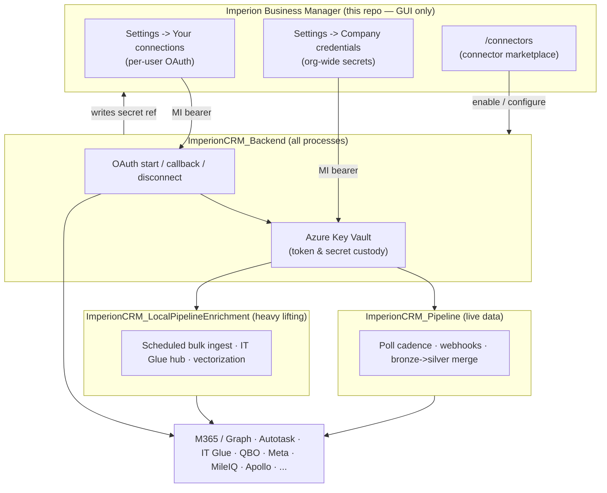

# 🔌 Integrations

How **Imperion Business Manager** connects to the outside world. This area is the
onboarding-grade reference for every external system the platform talks to, the model
that governs those connections, and the security rules that keep credentials out of the
front end.

[← Documentation library](../README.md) ·
[Capability overview](../product/imperion-os-overview.md#4-extras--beyond-classic-crmerp) ·
[System of systems](../architecture/system-of-systems.md)

> **Read this first if you are new.** Imperion Business Manager is the GUI tier of a
> **four-repo system** (ADR-0042). It *renders* integration state and *collects*
> credentials, but it never runs an integration process and never holds a provider
> secret. The live OAuth flows, token custody, polling, and ingestion run in the three
> sibling repos. This README explains the model; the linked pages go deep on each piece.

---

## 1. The integration model in one picture



**The contract:** the front end is the *control surface* — it shows what is connected,
lets a user start an OAuth flow, and lets an admin enter a credential or enable a
connector. Everything that *acts* (exchanging a code for a token, storing a secret,
polling a source, writing data back) happens in a sibling repo behind a managed-identity
boundary. No token, key, or connection string ever lives in this repo's database or
passes through its browser.

---

## 2. In this area

| Doc | What's inside |
| --- | --- |
| [Connector registry & marketplace](connector-registry.md) | The declarative connector marketplace (ADR-0076): the in-code manifest registry, the `connector_instance` lifecycle, and the admin catalog GUI at `/connectors`. |
| [MileIQ External API](mileiq-api.md) | The MileIQ mileage source — its request-gated access model, OAuth 2.1 tiers, and the open questions that gate provisioning (ADR-0083). |
| [Front-end-driven back-end requirements](frontend-driven-backend-requirements.md) | The engines the GUI already expects from the sibling repos — RBAC claim, OAuth + Key Vault, ingestion -> bronze -> silver, enrichment, ticket creation, the agent runtime. The cross-repo to-do list, with status. |

## 3. See also

- [API](../api/README.md) — the endpoint contracts the integration flows call.
- [Database](../database/README.md) — the medallion data platform (ADR-0092) the
  ingest side feeds, and the `connection` / `connector_instance` schema.
- [Security](../security/README.md) and the shared
  [unified security standard](../security/unified-security-standard.md) — the baseline
  every repo conforms to (referenced here, never restated).
- The three sibling repos own the live work: `ImperionCRM_Backend` (OAuth, token
  custody), `ImperionCRM_Pipeline` (polling, merge), `ImperionCRM_LocalPipelineEnrichment`
  (bulk ingest, vectorization).

---

## 4. The connection model (ADR-0012 / ADR-0024)

A single `connection` table models two scopes:

- **`scope = 'user'` — personal connections.** Each employee connects their *own*
  account (M365, Google, YouTube, LinkedIn, Facebook, Plaud) so *their* communications
  flow into the timeline. An ingested communication is attributed **first to the
  employee** (`interaction.owner_user_id`, via `interaction.source_connection_id`) and
  then to the contact/account it concerns.
- **`scope = 'company'` — org-wide systems.** The organization's shared integrations:
  Autotask, IT Glue, My IT Process, QuickBooks Online, Dark Web ID, Televy, Kaseya Quote
  Manager, and Meta. (Microsoft Graph access is the per-client M365 app, ADR-0018.)

`external_identity` is the identity map that correlates an Imperion account/contact to
its identifiers across every system — the principle is **augment, don't duplicate**
(ADR-0012). The same person seen in Autotask, IT Glue, M365, and Apollo resolves to one
silver record.

### 4.1 Ingest vs poll

The model distinguishes two ways data arrives:

- **Ingest -> timeline.** M365 email/Teams, Plaud calls, SMS/WhatsApp, and Facebook /
  YouTube / LinkedIn touches are written as `interaction` rows and flow bronze -> silver ->
  gold. The Imperion record becomes the system of record for the enriched view.
- **Poll, never duplicated.** Autotask tickets and IT Glue assets/docs are fetched live
  and *referenced* — Imperion is never their system of record. They are read on a cadence
  and surfaced, not re-authored.

### 4.2 Poll cadence (ADR-0038)

Each connection carries `poll_interval_minutes` — how often the pipeline should poll it.
Operators set it per connection from a preset dropdown on the connection /
company-credential cards (Manual / 15 min / 30 min / hourly / 6 h / 12 h / daily), which
auto-saves. **`0` = manual / paused** (no automatic polling). This repo *owns* the
column; the `ImperionCRM_Pipeline` repo reads it and must honour `0` as paused
(`pollDue()`, pipeline ADR-0008).

Only true *polled* sources expose a cadence selector and a "Refresh now" control —
`providerIsPollable()` (`src/lib/integrations/company-providers.ts`) gates it out for
consent / OAuth providers (QBO) and for send-capable credentials (Meta), because
nothing polls them.

### 4.3 Secrets — never in this repo

OAuth tokens and API secrets are **never** stored in the database. The
`connection.keyvault_secret_ref` column points at the Azure Key Vault secret that holds
the material (CLAUDE.md §5). Live OAuth flows and token storage run in the backend
(ADR-0018 / ADR-0028, backend ADR-0038). The front end collects a credential, hands it to
the backend over a managed-identity bearer, and persists only the returned *reference*.
The literal rule for the whole platform: **Never commit secrets.** The full posture is in
the [unified security standard](../security/unified-security-standard.md).

---

## 5. Per-user OAuth flow (ADR-0024 + backend ADR-0038)

Settings → **Your connections** runs the real authorization-code flow for
`m365 | google | youtube | linkedin | facebook`. Plaud is key-based (no public OAuth) and
stays a recorded stub until its engine lands.

```mermaid
sequenceDiagram
    participant B as Browser
    participant W as Web app (this repo)
    participant F as Backend (ImperionCRM_Backend)
    participant P as Provider

    B->>W: Connect provider (connectAction, settings:write)
    W->>F: POST /connections/{provider}/start { userId }   (MI bearer)
    F-->>W: { authorizationUrl, state }
    W-->>B: redirect to authorizationUrl
    B->>P: consent
    P-->>B: redirect to /api/connections/{provider}/callback?code&state
    B->>W: GET callback route (session + settings:write required)
    W->>F: POST /connections/{provider}/callback { code, state }   (MI bearer)
    F-->>W: { connectionId, status: 'active' }  (tokens -> Key Vault; row upserted)
    W-->>B: redirect /settings?tab=connections&connect=ok (notice)
```

What each piece does:

- **`connectAction`** (`src/app/(app)/settings/actions.ts`) resolves the acting
  `app_user.id` from the session, calls `connectionsService.startOAuth`
  (`src/lib/services/index.ts` → `INTEGRATION_SERVICE_URL`, managed-identity bearer),
  and redirects the browser to the provider. A backend `501` or an unset service URL
  records the previous stub row with a "not configured yet" notice — the page never
  breaks.
- **`/api/connections/[provider]/callback`** receives the provider redirect and forwards
  `code` + `state` server-side. The browser never talks to the backend and **no token
  material passes through the web app**. A provider `error=` (the user cancelled) and an
  invalid/expired `state` (the backend's one-time, Key-Vault-parked CSRF nonce) surface
  as notices via `/settings?tab=connections&connect=<result>`.
- **`disconnectAction`** calls `POST /connections/{provider}/disconnect` **first** — the
  backend deletes the Key Vault token secret (real revocation) and marks the row
  `revoked` (`connection_status` enum, migrations 0020 / 0033) — then removes the local
  row. If revocation fails unexpectedly, the row is kept visible for retry.
- Pure flow logic and the flag vocabulary live in
  `src/lib/integrations/personal-oauth.ts` (unit-tested).
- **Operator settings** (backend Function App): `OAUTH_REDIRECT_BASE_URL` =
  `https://imperioncrm.azurewebsites.net/api/connections` plus per-provider
  `OAUTH_<P>_CLIENT_ID` / `OAUTH_<P>_CLIENT_SECRET_SECRET` — see
  [`../operations/credential-wiring-next-steps.md`](../operations/credential-wiring-next-steps.md) §4b.

---

## 6. Company credentials (ADR-0036)

Configured under **Settings → Company credentials**. One card per provider; secret fields
are write-only and never echoed back. The entered fields are POSTed to the backend
credential store (`credentialsService` → `INTEGRATION_SERVICE_URL`), which writes the
secret to Key Vault and returns the reference persisted on the company `connection` row
(`keyvault_secret_ref`). Re-saving rotates the credential (upsert by provider,
`uq_connection_company_provider`). Until the backend endpoint is wired, saves record a
`pending` row with a `kv://imperion/conn/<provider>` reference and degrade without error.

The provider catalog is declared in `src/lib/integrations/company-providers.ts` — this is
the authoritative list (verified against source):

| Provider (`connection_provider`) | Kind | Fields collected |
|---|---|---|
| `autotask` | Credential | API user, API secret\*, API integration (tracking) code\* |
| `itglue` | Credential | API key\*, region (US / EU / AU) |
| `myitprocess` | Credential | API key\* — My IT Process (vCIO / strategic roadmap) |
| `quotemanager` | Credential | API key\*, tenant / account ID (Kaseya Quote Manager) |
| `televy` | Credential | API key\* — assessment reporting & scorecards |
| `qbo` | OAuth connect | none — "Connect QuickBooks" (Intuit OAuth; read-only; see §6.2) |
| `darkwebid` | Credential | API key\* — Kaseya / ID Agent Dark Web ID compromised-credential monitoring |
| `meta` | Credential (**send-capable**) | Page access token\*, Facebook Page ID — FB / IG DM replies (see §6.1) |

\* write-only secret — stored in Key Vault, never returned to the client.

> **Two related-but-distinct lists.** `company-providers.ts` declares how a credential is
> *collected* (the form fields handed to the backend, ADR-0036). The
> [connector registry](connector-registry.md) (`connector-manifest.ts`) declares the
> connector's *marketplace shape* (auth type, scopes, cadence, what it maps, what it can
> do, ADR-0076). Both key off the same connector `key`; do not conflate them.

### 6.1 Meta (Facebook / Instagram) send credential (`meta`)

`meta` is the platform's first **send-capable** company credential: its long-lived Page
access token authorizes **outbound** Facebook & Instagram DM replies
(`pages_messaging` / `instagram_manage_messages`), not just ingest. The cloud pipeline
reads it from Key Vault (`conn-company-meta`, fields `pageAccessToken` + `pageId`) and
stays **dormant / fail-closed** until the secret exists (pipeline `credentials.ts`, issue
#89 / PR #113). Because nothing *polls* a send token, the card renders **no poll cadence
and no Refresh button** (`sendCapable: true` → `providerIsPollable()` is false).

**Security gate.** Entering this token is a **Mark-approved security event**: Meta App
Review / Advanced Access for the messaging permissions must be granted before the token is
valid, and Mark approves before the field goes live. The field naming mirrors the
pipeline's `credentials.ts` exactly (`pageAccessToken`, `pageId`) so the two provider
lists stay in sync.

### 6.2 QuickBooks Online connect (`qbo`, OAuth — ADR-0048 / ADR-0085)

A **read-only** connection to Imperion's *own* QBO company — the authoritative payment
fact for time + expense reconciliation. `kind: "consent"` — a full
OAuth authorization-code flow handled by the backend (the app never writes to
QuickBooks):

1. **Connect QuickBooks** → `connectQuickBooksAction` → `connectionsService.startQboConnect()`
   → backend `POST /connections/qbo/start` parks a one-time CSRF `state` in Key Vault and
   returns the Intuit consent URL → the admin is redirected to Intuit.
2. Intuit redirects back to **`/api/qbo/callback`** (= `QBO_REDIRECT_URI`) with
   `code` + `realmId` + `state`. The route (session + `settings:write`) forwards them to
   backend `POST /connections/qbo/callback`, which validates the state, exchanges the
   code, and writes the token set to `conn-company-qbo`. The `qbo` company row flips to
   `active`.
3. The backend then refreshes the access token on-demand forever; a dead refresh token is
   recovered by an admin **Reconnect** (re-run the flow) — there are no customers to
   prompt.

No cookie is used (the backend owns the CSRF state, mirroring the per-user OAuth flow).
Activation = backend app settings `QBO_CLIENT_ID_SECRET` / `QBO_CLIENT_SECRET_SECRET` /
`QBO_REDIRECT_URI` (+ `QBO_ENVIRONMENT`) and the `qbo` provider-enum migration.

**Connect outcomes.** Both the start action and the callback land on
`/settings?tab=credentials&qbo=<result>` (with `&qboStatus=<httpStatus>` when the backend
answered with an HTTP code), and the company-credentials tab renders a specific notice
instead of the row's bare `error`. The full result vocabulary lives in
`src/lib/integrations/qbo-connect.ts`:

| `qbo` code | When | Tone |
| --- | --- | --- |
| `ok` | token exchanged, row active | success |
| `start_not_configured` / `stubbed` | backend returned 501 (Intuit app not registered yet) | warning |
| `denied` | admin cancelled consent at Intuit | warning |
| `start_rejected` (+`qboStatus`) | `start` got a non-2xx from the backend | error |
| `exchange_failed` (+`qboStatus`) | callback: backend 502, Intuit refused the code exchange | error |
| `start_unreachable` | `start` got no usable answer (network / timeout) | error |
| `start_no_url` | `start` returned 200 but no consent URL | error |
| `invalid` | Intuit returned without `code` / `realmId` / `state` | error |
| `forbidden` | caller lacked `settings:write` | error |
| `error` | anything else | error |

Hard failures (`start_rejected` / `exchange_failed` / `start_unreachable`) are also
`console.error`'d server-side (App Service console logs) for triage — **never** with
token material.

---

## 7. Lead-capture hooks (ADR-0024)

`lead_hook` + `lead_capture_event` pull new people into the system (web form, Facebook
lead, YouTube comment, LinkedIn message, inbound email, QR). A resolved capture
creates/links a contact, which starts enrichment and nurture. This is the inbound edge of
the integration surface — the first touch that becomes a managed record.
