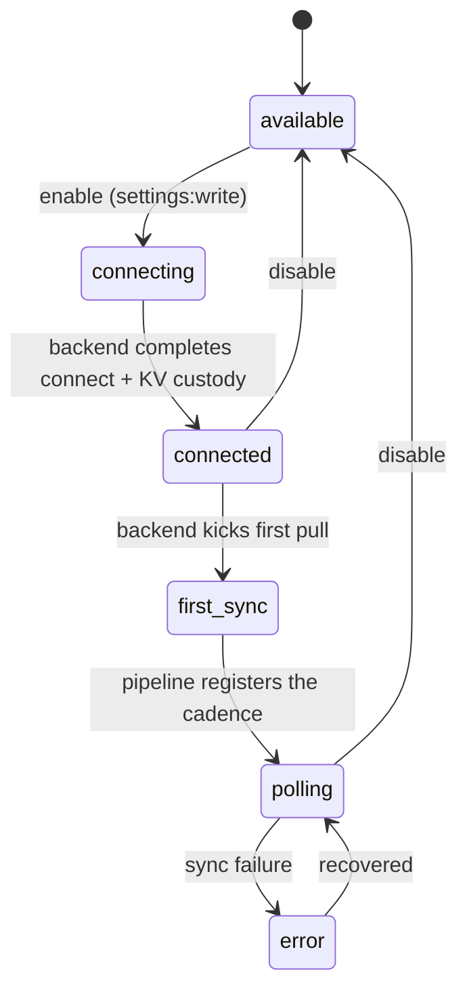

# Connector registry & marketplace (ADR-0076)

[← Integrations](README.md) · [Capability overview](../product/imperion-business-manager-overview.md#4-extras--beyond-classic-crmerp)

The **connector registry** is the declarative, first-party marketplace foundation of
**Imperion Business Manager** (ADR-0076, epic #322). Instead of wiring each integration
by hand, every connector is described by a uniform **manifest** so the platform can
browse, enable, and configure them consistently. This page is the onboarding-grade tour:
what a connector *is*, the two halves that model it, the v1 catalog, the lifecycle, the
admin GUI at `/connectors`, and the security posture.

> **First-party only (#314).** This is an *internal* marketplace for an MSP's own
> connectors. There is **no** third-party connector publishing and no external developer
> API — that AppExchange-scale ecosystem is explicitly out of scope (a future ADR if
> ever).

---

## 1. Why a registry at all

Before ADR-0076, every integration was bespoke: its own settings card, its own poll
wiring, its own notion of "what it maps". The registry replaces that with one shape so a
new connector becomes *data*, not code scattered across the app. The catalog can launch
with a subset of connectors and grow — bespoke integrations migrate onto the lifecycle
incrementally (ADR-0076 consequence).

---

## 2. Two halves: manifest (code) + instance (DB)

ADR-0076 §1/§2 splits a connector into a **manifest** (what a connector *is*) and an
**instance** (a connector *enabled in a scope*):

| | Manifest | Instance |
|---|---|---|
| Lives in | **Code** — `src/lib/integrations/connector-manifest.ts` (versioned, diffable) | **DB** — `connector_instance` (migration 0125) |
| Source of truth for | The catalog: auth type, scopes, default cadence, identity-map, capabilities | Per-scope config + lifecycle status |
| Why | "Manifests are versioned in code; the registry is the catalog's source of truth" (ADR-0076 §1) | One row per enabled connector per account scope |

`connector_instance.connector_key` references a manifest **by key**, validated against the
in-code registry **at the app layer** (`isKnownConnector`), **not** by a DB foreign key —
exactly as `report_definition.root_object` references the in-code semantic registry
(ADR-0075 / #410). The registry is code, so it is reviewed, diffed, and unit-tested like
any other module; the DB only ever holds *which* connectors are enabled and how they are
configured.

---

## 3. Manifest format

The `ConnectorManifest` interface (verified against
`src/lib/integrations/connector-manifest.ts`):

```ts
interface ConnectorManifest {
  key: string;                 // stable; referenced by connector_instance.connector_key
  label: string;               // display name in the catalog
  description: string;         // one-line summary
  category: string;            // Productivity | PSA | Documentation | Marketing | Security | Enrichment
  icon: string;                // lucide icon name resolved by <Icon />
  authType: "oauth" | "jwt" | "api_key";
  scopes: readonly string[];   // requested scopes (display/audit + recorded grant)
  defaultCadenceMinutes: number;   // ADR-0038 units; 0 = on-demand / not polled
  identityMap: readonly string[];  // silver entities this maps (ADR-0012)
  capabilities: readonly string[]; // "ingest:* | write:* | enrich:*"
  version: number;             // bumped in code when the declared shape changes
}
```

The module is **pure and edge-safe** — it imports no `pg`, no `node:*`, no env — so it
unit-tests directly and imports anywhere. Helper API:

- `listConnectorManifests()` — all manifests, in declared order (the catalog "available"
  list).
- `getConnectorManifest(key)` — one manifest, or `undefined`.
- `isKnownConnector(key)` — the gate the instance layer enforces.
- `effectiveCadenceMinutes(key, override)` — the override when set, else the manifest
  default (ADR-0038); `null` for an unknown connector with no override.

---

## 4. The v1 registry

The shipped `CONNECTOR_MANIFESTS` array (verified against source) covers the wired
ingest / enrich connectors. Keys match `company-providers.ts` where the connector also has
a company-credential form (that file declares how the *credential is collected*, ADR-0036;
this declares the *marketplace shape*, ADR-0076 — distinct concerns, shared key).

| Key | Label | Category | Auth | Default cadence | Maps (identity-map) | Capabilities |
|---|---|---|---|---|---|---|
| `m365` | Microsoft 365 | Productivity | oauth | 60 min | contact, account, device, interaction | `ingest:contacts`, `ingest:interactions`, `ingest:devices` |
| `autotask` | Autotask (PSA) | PSA | api_key | 60 min | account, contact, ticket | `ingest:tickets`, `ingest:companies`, `write:tickets` |
| `itglue` | IT Glue | Documentation | api_key | 1440 min (daily) | device, account | `ingest:assets`, `ingest:documents` |
| `meta` | Meta (Facebook / Instagram) | Marketing | oauth | 30 min | campaign, lead, interaction | `ingest:posts`, `ingest:messages`, `ingest:leads`, `write:messages` |
| `darkwebid` | Dark Web ID | Security | api_key | 1440 min (daily) | credential_exposure | `ingest:credential-exposures` |
| `apollo` | Apollo | Enrichment | api_key | 0 (on-demand) | contact, account | `enrich:contacts` |

Notes that matter for onboarding:

- **Autotask is write-back capable** (`write:tickets`, ADR-0074) — the only v1 connector
  that pushes data out as well as pulling it in.
- **Meta is also write-capable** (`write:messages`) — the same send-capable nature flagged
  on its company credential (see [README §6.1](README.md#61-meta-facebook--instagram-send-credential-meta)).
- **Apollo is not polled** (`defaultCadenceMinutes: 0`) — it enriches on demand (ADR-0035),
  not on a schedule.
- **A capability is `verb:noun`.** `ingest:*` pulls a source into bronze → silver
  (ADR-0012); `write:*` pushes back; `enrich:*` augments existing records.

---

## 5. Instance lifecycle (ADR-0076 §3, backend-orchestrated)



Enabling a connector upserts a `connector_instance` for `(connector_key, account_scope)`
and sets it to `connecting`; the **backend** drives the rest and stamps
`status` / `health` / `last_sync_at`; the **pipeline** reads the cadence (override or
manifest default) + `last_sync_at` to register the poll (ADR-0038).

Data-layer accessors (`ConnectorRepository` — interface + postgres + mock):
`listConnectorInstances`, `getConnectorInstance`, `getConnectorInstanceByKey`,
`enableConnector` (upsert → connecting), `setConnectorStatus`, `setConnectorCadence`,
`disableConnector`.

---

## 6. The catalog GUI (`/connectors`, ADR-0076 §4)

The catalog is the admin marketplace surface at **`/connectors`** — **admin-only**
(`canSeeConnectors`, the same nav + route gate as Settings / CMDB, ADR-0030; the route
guard in `src/app/(app)/connectors/page.tsx` redirects a non-admin to `/`). It joins the
in-code manifest registry (the "available" catalog) to the persisted `connector_instance`
rows (the "connected" state) via the pure view-model `buildConnectorCatalog()`
(`src/lib/integrations/connector-catalog.ts`), grouped by category. Each card shows the
connector's status badge, capabilities, auth type, effective poll cadence, last sync, and
(non-secret) health.

The three mutations (all in `src/app/(app)/connectors/actions.ts`, all
`settings:write`-gated, enforced fail-closed via `requireCapability`):

- **`enableConnectorAction`** (available → records lifecycle intent): upserts the instance
  to `connecting`. It does **not** collect a credential — the backend completes the connect
  + Key Vault custody (#149), and the credential itself is entered under **Settings →
  Company credentials** (`company-providers.ts`, ADR-0036). A page notice states this
  explicitly.
- **`setConnectorCadenceAction`** (connected): sets/clears the per-instance poll-cadence
  override (blank = manifest default, ADR-0038).
- **`disableConnectorAction`**: removes the instance.

**No secret ever passes through this surface.**

---

## 7. Security

- **No secret material in the row** (ADR-0034 / 0036 / 0043) — credentials are custodied in
  **backend Key Vault**; the catalog GUI collects and hands off, never stores. The
  `connector_instance` row holds only non-secret config + status; no client PII.
- **Least-privilege grants:** the web identity has SELECT/INSERT/UPDATE/DELETE (catalog
  GUI); the backend has SELECT/UPDATE (orchestrates lifecycle); the pipeline has SELECT
  (reads cadence). The manifest registry, being code, holds no grants or secrets.
- **App-native config, not silver tier** — like `saved_view` / `report_definition`; no OKF
  semantic-layer concept file applies.

Full posture: [unified security standard](../security/unified-security-standard.md)
(referenced, not restated).

---

## 8. Status / what is and isn't shipped

| Slice | State |
|---|---|
| Manifest registry + `connector_instance` persistence (#414) | shipped |
| Catalog GUI — browse available vs connected, enable/configure, health (#416) | shipped |
| Backend connect → token custody → first sync (#149) | unblocked (migration 0125 prod-applied) |
| Pipeline poll registration from the manifest cadence (#116) | pending |
| Migrating existing bespoke connectors onto the lifecycle | incremental (ADR-0076: "the registry can launch with a subset and grow") |

---

## 9. How to add a connector

Adding a connector to the catalog is a small, reviewable **code** change — no migration:

1. Append a `ConnectorManifest` to `CONNECTOR_MANIFESTS` in `connector-manifest.ts`
   (pick a `key`, `category`, `authType`, `scopes`, `defaultCadenceMinutes`, the
   `identityMap` it touches, and its `capabilities`).
2. If the connector needs a credential entered in the GUI, add the matching
   `CompanyProvider` entry to `company-providers.ts` (same `key`) — see
   [README §6](README.md#6-company-credentials-adr-0036).
3. Extend `connector-manifest.test.ts` (and `connector-catalog.test.ts` if it changes the
   view-model).
4. The backend (#149) and pipeline (#116) pick up the new key by manifest — no per-connector
   wiring.

---

## 10. References

- ADR: [`../decision-records/ADR-0076-integration-marketplace.md`](../decision-records/ADR-0076-integration-marketplace.md)
- Schema: [`../database/data-model.md`](../database/data-model.md) → *Integration marketplace — connector_instance*
- Code: `src/lib/integrations/connector-manifest.ts`, `src/lib/integrations/connector-catalog.ts`,
  `src/app/(app)/connectors/`, `db/migrations/0125_connector_instance.sql`
