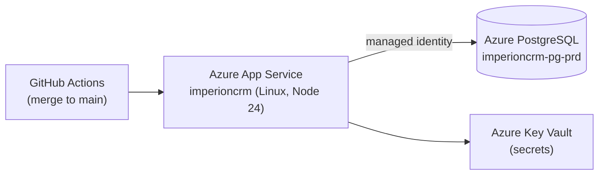

# 🛠️ Operations

Keeping the live platform healthy — monitoring, day-2 tasks, and how to reach the
running app.

[← Documentation library](../README.md)

## The live deployment

- **App:** Azure App Service `imperioncrm` (RG `Imperion_CRM`) — Next.js standalone,
  started via `node server.js`.
- **Database:** `imperioncrm-pg-prd` (PostgreSQL 18), Entra auth, reached by the App
  Service's **user-assigned managed identity** (no stored password).
- **Logs:** `az webapp log tail` is timeliest; on-disk `/home/LogFiles/*` lags.

## Reaching the running app

SCM/Kudu basic-auth is disabled — use the **Kudu API with an AAD bearer token**
(`az account get-access-token` → `…scm.azurewebsites.net/api/command` / `/api/vfs`).
Apply SQL with `az postgres flexible-server execute … -f <file>` (use `-f` for `DO`
blocks). Full detail lives in the team's ops-access notes.

## What belongs here

Health-check endpoints · dashboards & alerts · maintenance windows · the deferred
**pre-go-live secret-rotation** checklist · the [runbooks](../runbooks/README.md) index.

See also: [deployment](../deployment/README.md) · [disaster-recovery](../disaster-recovery/README.md).
