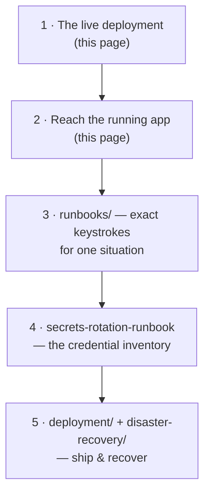
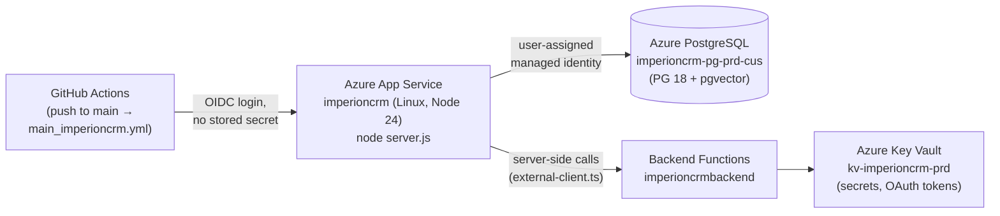

# 🛠️ Operations

**How Imperion OS runs in production — and how you keep it healthy.**

[← Documentation library](../README.md) ·
[Capability overview](../product/imperion-os-overview.md) ·
[System of systems](../architecture/system-of-systems.md)

---

This is the **operator's home page**. If you are on-call, doing a day-2 task, wiring up
a credential, rotating a secret, or running a user-acceptance test, start here. Every
runbook-grade procedure below is verified against the actual code, scripts, and deploy
flow in this repo — there are no invented steps. Anything that touches production auth,
billing, or data is flagged and is **Mark-gated** (see the
[system-level `CLAUDE.md`](../../CLAUDE.md) §2).

> **Scope of this area.** Operations is the **standing picture** of the running platform
> plus the day-2 procedures that keep it healthy. It is the *front-end* (GUI repo) view;
> the three sibling repos each run their own functions and have their own operational
> notes — see [System of systems](../architecture/system-of-systems.md). For one-situation,
> exact-keystroke procedures see [runbooks](../runbooks/README.md); for the
> build-and-ship path see [deployment](../deployment/README.md); for backup/restore and
> RPO/RTO see [disaster-recovery](../disaster-recovery/README.md).

## New here? Read in this order



## The live deployment

Imperion OS (this GUI repo) is **built, deployed, and live** on Azure App
Service at `imperioncrm.azurewebsites.net`, behind Entra SSO. A push to `main` triggers
the GitHub Actions workflow that builds a Next.js **standalone** bundle and ships it.



| Concern | Reality (verified against source) |
| --- | --- |
| **App** | Azure App Service `imperioncrm` (resource group `Imperion_CRM`). Next.js **standalone** bundle started with `node server.js` — **not** `npm start` and **not** an Oryx server build (`main_imperioncrm.yml`). The runner builds `.next/standalone`, copies `.next/static` + `public/`, and deploys only that. |
| **Runtime** | Linux, Node **24** (`setup-node@v5`, `node-version: 24`). |
| **Database** | `imperioncrm-pg-prd-cus.postgres.database.azure.com`, database `imperioncrm` (PostgreSQL 18 + `pgvector`). Reached by the App Service's **user-assigned managed identity** — **no stored password** (`db/README.md`, `scripts/migrate.mjs`). |
| **Secrets / tokens** | Azure Key Vault `kv-imperioncrm-prd` (RBAC mode). The **front end holds no AI key and no integration secret** — those live with the backend / on-prem pipeline (ADR-0043, system `CLAUDE.md` §1). |
| **Identity** | Entra ID everywhere (SSO via certificate client assertion, ADR-0005), plus a break-glass path. |
| **Deploy auth** | OIDC federated credentials — **secretless**; nothing to rotate (see the rotation runbook #8). |

## Reaching the running app

- **Logs (timeliest first):** `az webapp log tail --resource-group Imperion_CRM --name imperioncrm`.
  The on-disk `/home/LogFiles/*` lags behind the live stream.
- **SCM / Kudu:** basic auth is **disabled**. Use the **Kudu API with an AAD bearer token**
  — mint with `az account get-access-token`, then call
  `…scm.azurewebsites.net/api/command` (run a command) or `…/api/vfs` (read files).
- **Database:** apply SQL with `scripts/migrate.mjs` (Node, Entra-token auth) or
  `az postgres flexible-server execute … -f <file>` — use `-f` for `DO` blocks. See
  [the migration procedure](#applying-a-database-migration) below and `db/README.md`.

## Every doc in this area

| Doc | What it is | Read it when… |
| --- | --- | --- |
| [credential-wiring-next-steps](credential-wiring-next-steps.md) | The cross-repo wiring status + remaining steps for **Settings → Company credentials / Your connections** (ADR-0036 / ADR-0038): the secret-write path, Easy Auth, MI bearer token, per-user OAuth. | You are turning a configured-but-not-yet-live integration **on**, or want the exact config state and the named follow-ups. |
| [secrets-rotation-runbook](secrets-rotation-runbook.md) | The **complete inventory** of every secret in the four-repo system — owner, location, rotation procedure, cadence — plus a compromise quick-reference. | Doing the pre-go-live rotation pass, responding to a suspected compromise, or onboarding a new secret. |
| [semantic-layer-gate](semantic-layer-gate.md) | How the **`semantic-layer` CI docs-gate** keeps the OKF meaning layer in sync with the schema (ADR-0086, #535), how it decides, and how to satisfy or escape it. | A migration trips the gate, or you need to understand the OKF sync contract operationally. |
| [public-story-page](public-story-page.md) | How the **unauthenticated** `/story` marketing page is served (middleware bypass, rewrite, deploy) and its security posture. | Editing, deploying, or taking down `/story`. |
| [public-papers-page](public-papers-page.md) | How the **unauthenticated** `/papers` technical-paper set (executive summary + research paper) is served (middleware bypass, deploy) and its security posture. | Editing, deploying, or taking down `/papers`. |
| [time-expense-user-test-plan](time-expense-user-test-plan.md) | Cross-repo **readiness plan** for getting employee time tracking (ADR-0082) and expense (ADR-0083) to hands-on user testing. | Planning a time/expense UAT — what's testable, what's stubbed, the critical path. |
| [time-tracking-uat-script](time-tracking-uat-script.md) | The **hands-on test script** for time tracking (employee → attest → admin approve → reopen), test case by test case. | Actually running the time-tracking UAT. |
| [time-tracking-uat-seeding](time-tracking-uat-seeding.md) | Runbook for `scripts/seed-time-uat.mjs` — seeding **test** employees + pay rates before the UAT. | Preparing UAT data (Mark-gated prod write). |
| [session-handoff-2026-06-10](session-handoff-2026-06-10.md) | A **point-in-time** build-sprint handoff (historical record). | You want the snapshot of what shipped on 2026-06-10; for *current* state read git + the prod DB, not this. |

## Day-2 procedures

These are verified against the scripts and deploy flow in this repo. For full
one-situation runbooks (with all the gotchas), see [runbooks](../runbooks/README.md).

### Applying a database migration

This GUI repo is the **single source of truth for the schema** (system `CLAUDE.md` §1).
Migrations are raw SQL in `db/migrations/NNNN_*.sql`, ordered, idempotent, and
transactional. **Migration numbers are claimed at merge, not at authoring** (system
`CLAUDE.md` §10.3). Applying to prod is **Mark-gated**.

```powershell
# Node runner (no psql needed) — Entra token from your logged-in `az`, no stored secret.
node scripts/migrate.mjs --list        # list available migration files
node scripts/migrate.mjs 0035          # apply db/migrations/0035_*.sql
node scripts/migrate.mjs 0035 0036     # apply several, in the given order
```

`migrate.mjs` applies **only the file(s) you name** (never a blind "run everything",
which would re-fire the seed migrations); each file is idempotent so a named re-run is
safe. Connection defaults to prod, overridable via `PGHOST` / `PGPORT` / `PGDATABASE` /
`PGUSER`; pass `PGTOKEN` to supply a token instead of shelling out to `az`. Full detail:
`db/README.md` and the [runbooks index](../runbooks/README.md).

### Tailing logs / triaging a 5xx

```bash
az webapp log tail --resource-group Imperion_CRM --name imperioncrm
```

A 503 right after a deploy historically meant the standalone server couldn't start; the
current workflow ships `node server.js` from `.next/standalone` specifically to avoid the
old `next`-symlink exit-127 failure (`main_imperioncrm.yml` header comment).

### Restarting the app

```bash
az webapp restart --resource-group Imperion_CRM --name imperioncrm
```

A restart forces App Service settings (e.g. a rotated `AUTH_SECRET`) to take effect and
clears a wedged process.

## What still belongs here (add as needed)

Health-check endpoint docs · dashboards & alerts · maintenance-window policy · cost
monitoring. As these land, add them to the table above and to the
[documentation hub](../README.md).

## Operating rules (non-negotiable)

- **Never commit secrets.** This entire area documents procedures only — no secret value
  is ever stored, printed, or committed (system `CLAUDE.md` §2; the
  [unified security standard](../security/unified-security-standard.md) is the baseline —
  referenced here, never restated).
- **Production data is real client PII.** Aggregate or redact; never copy row-level
  personal data into issues, PRs, docs, or commits (system `CLAUDE.md` §8).
- **Mark-gates.** Anything irreversible, or touching permissions / billing / deploys /
  production data, goes to the human first — even if a permission rule would technically
  allow it.

See also: [runbooks](../runbooks/README.md) · [deployment](../deployment/README.md) ·
[disaster-recovery](../disaster-recovery/README.md) ·
[security](../security/README.md).
