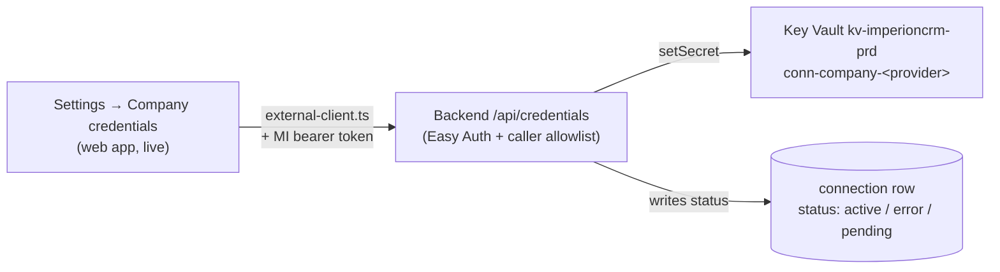

# Company credential configuration — wiring status & next steps

[← Operations](README.md) · [Documentation library](../README.md) ·
[Activate-credential-wiring runbook](../runbooks/activate-company-credential-wiring.md)

---

**What this is.** The cross-repo rollout tracker for the **Settings → Company
credentials** and **Settings → Your connections** features of **Imperion Business
Manager** (ADR-0036 / ADR-0038). It records the exact wiring state across all four repos,
the concrete Azure identifiers for this environment, and the remaining steps to take each
integration from "configured" to "live". Written 2026-06-08. **The UI is live; the
secret-write path is secured but not yet functional end-to-end** — the remaining work is
front-end→backend authentication and per-provider Azure/registration config.

> **For the exact copy-paste activation keystrokes**, use the
> [activate-company-credential-wiring runbook](../runbooks/activate-company-credential-wiring.md)
> — this doc is the *status + plan*, that runbook is the *one-situation procedure*.

## How it fits together

The GUI never holds an integration secret (system `CLAUDE.md` §1). Saving a company
credential is a *process*, so it flows GUI → backend → Key Vault.

## Concrete identifiers (this environment)

> These are **public resource identifiers**, not secrets (no keys, no tokens). They are
> safe to keep in the repo; secret *values* never are.

| Thing | Value |
| --- | --- |
| Subscription | `7916a39b-7a6e-4292-9c1f-0135ec648450` (MCPP Subscription) |
| Tenant | `49307c12-1bb7-42e4-9c7c-43d2850bd8c6` (ImperionLLC.com) |
| Resource group | `Imperion_CRM` |
| Web app | `imperioncrm` (`imperioncrm.azurewebsites.net`) |
| Web app managed identity (client id) | `5efd13c7-2847-4d22-b3e4-6674013b73c7` (`mgid-imperioncrm-web-prd`) |
| Backend Function App | `imperioncrmbackend` (`imperioncrmbackend.azurewebsites.net`) |
| Backend managed identity | `mgid-imperioncrmbackendfunction` (client id `4a2edcaf-9d58-4566-8e3d-2229c6807dc6`) — **Key Vault Administrator** on the vault |
| Pipeline Function App | `imperioncrmpipeline` |
| Key Vault | `kv-imperioncrm-prd` (RBAC mode) |
| Postgres | `imperioncrm-pg-prd` / db `imperioncrm` |
| **Existing Entra app (SSO / token)** | `46f1077b-c93f-42da-abd4-192da13781ac` — **use this for Easy Auth audience; do NOT create a new one** |

## Done this session

- **Migration 0033 applied to prod & verified** — `connection_provider` += `myitprocess,
  televy, quotemanager, gdap`; `connection_status` += `pending`; index
  `uq_connection_company_provider`.
- **Merged & deployed:** front-end #41 (Settings tabs + credential UI), backend #2
  (`/api/credentials` + `/api/gdap/consent`), pipeline #3 (to-do doc), backend #3
  (functions switched to `authLevel: 'anonymous'`).
- **`INTEGRATION_SERVICE_URL`** set on the web app → `https://imperioncrmbackend.azurewebsites.net/api`.
- **`ALLOWED_CALLER_CLIENT_ID`** set on the backend → the web app MI client id
  (`5efd13c7…`). caller-auth now **fails closed**: any request without a verified
  `x-ms-client-principal` is denied (401). The credential endpoints are therefore
  **secured** even though Easy Auth isn't enabled yet.
- Backend `/api/credentials` + `/api/gdap/consent` routes confirmed registered (return
  401, gated).

## Current behavior (important)

`INTEGRATION_SERVICE_URL` is set, so the web app calls the backend on credential save.
caller-auth fails closed → the call returns **401** → the front-end records the company
`connection` row with **`status='error'`** (it still saves the row + reference; it does
not crash). This stays until the auth below is wired. _If a clean `pending` state is
preferred in the meantime, unset `INTEGRATION_SERVICE_URL` on the web app._

## Remaining tasks (follow-up sessions)

### 1. Enable Easy Auth on the backend — use the EXISTING app `46f1077b…`
- Configure App Service Authentication (v2) on `imperioncrmbackend`, Microsoft provider,
  **client id = `46f1077b-c93f-42da-abd4-192da13781ac`**, unauthenticated action
  **`Return401`**.
- **Exclude `/api/health` and `/api/ready`** (globalValidation.excludedPaths) so platform
  probes keep working.
- **Issuer/audience gotcha:** managed-identity tokens are **v1** (issuer
  `https://sts.windows.net/49307c12…/`). Set the allowed token issuer/audience to accept
  v1 tokens whose `aud` = the resource the web app requests (see step 2). Verify with a
  real MI token before relying on it.
- caller-auth checks the token's `appid`/`azp` against `ALLOWED_CALLER_CLIENT_ID`
  (`5efd13c7…`, already set) — the web app MI is the token requester, so its client id is
  what appears. ✔

> **Exact commands for step 1 + 2** are in the
> [activate-company-credential-wiring runbook](../runbooks/activate-company-credential-wiring.md).

### 2. Front-end: attach an MI bearer token (repo `ImperionCRM`) — ✅ CODE DONE
- ✅ `src/lib/services/external-client.ts` now acquires a managed-identity token via
  `@azure/identity` `ManagedIdentityCredential` (reusing `AZURE_MANAGED_IDENTITY_CLIENT_ID`,
  the same MI used for Postgres) and adds `Authorization: Bearer <token>` to `callService`
  requests **when the service declares `audienceEnv`**. Token is cached per-scope and
  refreshed 60s before expiry. `services/index.ts` sets `audienceEnv: "INTEGRATION_SERVICE_AUDIENCE"`
  on the `integration` + `credentials` descriptors.
- **REMAINING (config/ops, not code):**
  - Set **`INTEGRATION_SERVICE_AUDIENCE`** on the web app to the backend's exposed
    resource (e.g. `api://46f1077b-c93f-42da-abd4-192da13781ac`). Until it's set, the call
    goes out **unauthenticated** (no behavior change vs. today → still 401 → `status='error'`).
  - Grant the web app MI permission/consent to request that token if required.
  - Deploy the web app (after task 1 Easy Auth is enabled, so the token is actually honored).

### 3. Verify end-to-end
- Save a credential (e.g. Televy) in Settings → Company credentials. Expect:
  - backend `setSecret` writes `conn-company-televy` to `kv-imperioncrm-prd`;
  - the `connection` row shows **`status='active'`** with `keyvault_secret_ref`;
  - re-saving rotates (one row per provider via `uq_connection_company_provider`).
- `az keyvault secret list --vault-name kv-imperioncrm-prd` should show `conn-company-*`.

### 4. GDAP real admin-consent flow
- Register/confirm the partner multi-tenant app + GDAP relationship in Partner Center.
- Set `GDAP_CLIENT_ID`, `GDAP_REDIRECT_URI`, `GDAP_TENANT` on the backend (the
  `/api/gdap/consent` 501 becomes a live consent URL), and build the web-app consent
  callback that flips the `gdap` row to `active`. (The web-app callback at
  `/api/gdap/callback` is already built — see the activate runbook §4.)

### 4b. Per-user OAuth connections (backend ADR-0038 ↔ front-end wiring, 2026-06-09)

The web app's Settings → Your connections flow is now wired to the backend's
authorization-code endpoints (`/connections/{provider}/{start,callback,disconnect}`,
providers `m365 | google | youtube | linkedin | facebook`; Plaud is key-based and
stays on the stub). Code is done on both sides; what remains is **operator
configuration on the BACKEND Function App (`imperioncrmbackend`)**:

- **`OAUTH_REDIRECT_BASE_URL`** = `https://imperioncrm.azurewebsites.net/api/connections`
  — the backend builds each provider's `redirect_uri` as
  `<OAUTH_REDIRECT_BASE_URL>/<provider>/callback`, which must land on the web app's
  `src/app/api/connections/[provider]/callback/route.ts`. Register the same URLs
  (e.g. `https://imperioncrm.azurewebsites.net/api/connections/m365/callback`) on each
  provider's app registration.
- Per provider `P ∈ {M365, GOOGLE, YOUTUBE, LINKEDIN, FACEBOOK}`:
  **`OAUTH_
_CLIENT_ID`**, **`OAUTH_
_CLIENT_SECRET_SECRET`** (the Key Vault
  secret NAME holding the client secret), optional **`OAUTH_
_SCOPES`**, and
  **`OAUTH_M365_TENANT`** for m365 (defaults to `organizations`). See backend
  ADR-0038 for endpoints/scopes per provider.
- The web app needs nothing new: it reuses `INTEGRATION_SERVICE_URL` +
  `INTEGRATION_SERVICE_AUDIENCE` (tasks 1–2 above). Until a provider is configured the
  backend answers **501** and the UI records the stub row with a "not configured yet"
  notice — nothing breaks.

### 5. Pipeline consumption
- Implement the per-provider ingest/poll in `ImperionCRM_Pipeline`
  (`docs/credential-pipeline-todo.md`): read `conn-company-<provider>` from Key Vault →
  bronze→silver→gold; write `connection.sync_cursor`/`last_sync_at`/`status` for live
  health on the Settings cards.

### 6. Hygiene
- Backend CD has hit intermittent **`409 Conflict` on ZipDeploy** when runs overlap; if a
  deploy hangs, a Function App restart clears the lock. Consider serializing deploys.
- ✅ Updated the ERD in `docs/database/data-model.md` for the extended enums + the
  `uq_connection_company_provider` index (ADR-0036).

## Related

- Rotating any of these credentials once live: [secrets-rotation-runbook](secrets-rotation-runbook.md)
  (#5 company credentials, #6 per-user OAuth, #7 provider client secrets).
- Cross-repo custody and the GUI-holds-no-secret rule:
  [System of systems](../architecture/system-of-systems.md).
