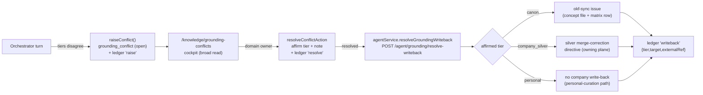

# Grounding-conflict resolution + write-back

How a tri-tier grounding disagreement (canon/OKF · company silver · personal) gets
resolved by a domain owner and corrected at the system of record. Surface = the
**Grounding conflicts** cockpit (`/knowledge/grounding-conflicts`); execution = the
backend write-back executor. (#1035 detection + workflow, #1217 surface + write-back,
backend #364 detection wiring + #365 executor; ADR-0119, ADR-0104, ADR-0086, ADR-0042.)

## The loop

1. **Detect (backend #364).** The orchestrator grounds on the three tiers; when valid tiers
   disagree about a concept it serves the **most-authoritative tier's answer, labelled**
   (anti-stall) and raises a `grounding_conflict` routed to its `domain_owner`.
2. **Resolve (this surface, #1217).** Any employee reads the open queue (transparency). The
   domain owner / fallback role / admin affirms which tier is authoritative (+ a free-text
   *direction*) or dismisses. Authority is the DB predicate
   `app_grounding_conflict_resolver(domain)` — a non-owner's submit is a harmless no-op.
3. **Write back (backend #365).** On a resolve, the FE fires the backend executor with **only
   the conflict id**. The backend re-reads the resolved row (never trusts FE-supplied text)
   and dispatches by the affirmed tier.

## The shared write-back contract (one shape, both repos)

`POST /agent/grounding/resolve-writeback` · request `{ conflictId, actingUserId? }` ·
response `{ conflictId, tier, target, externalRef, dispatched }`.

| Affirmed `tier` | `target` | Action | `externalRef` |
| --- | --- | --- | --- |
| `canon` | `canon` | File an **okf-sync** issue to edit the OKF concept file + `coverage-matrix.md` row (CLAUDE.md §11, ADR-0086) | issue URL (or `null` when no filer is wired) |
| `company_silver` | `silver` | Record a **merge-correction directive** for the owning plane (ADR-0042) | directive ref `silver-correction:<domain>:<concept>:<id>` |
| `personal` | `none` | No company write-back — personal facts correct via the personal-curation path (ADR-0114) | `null` |

Every dispatch is appended to the `grounding_conflict_event` ledger as a **`writeback`** action
(migration 0203 widens the CHECK), with PII-free `detail = { tier, target, externalRef }`.

**Invariants.**
- **One-sided.** The FE records the decision; the backend runs the cross-plane process (ADR-0042).
  The correction text is read from the DB row, never supplied by the caller.
- **Idempotent.** One `writeback` event per conflict; a second call returns the existing dispatch
  (`dispatched: false`) without re-filing.
- **Best-effort + deploy-ahead-safe.** A failure never corrupts the resolved row. No okf-sync
  filer is wired in production yet (the backend holds no GitHub token), so the canon branch ledgers
  the directive with a `null` `externalRef` — the ledger row is the durable artifact. Kill switch:
  `AGENT_GROUNDING_WRITEBACK_ENABLED=off`.
- **PII-free.** The okf-sync issue body and ledger detail are built from the conflict's summary
  fields only (`concept`, `detail`, the `*_claim` summaries, the owner's note).

## Deferred

The actual cross-plane **silver merge nudge** (calling the owning Pipeline / LocalPipeline plane to
re-merge) is recorded as a directive here and executed by the owning plane in a follow-up —
**ImperionCRM_Pipeline #164** (transfer to LocalPipeline if the source is on-prem-ingested, LP
ADR-0026). The okf-sync **filer** (a GitHub-token-backed
`OkfSyncFiler`) is injected later without changing this contract (the eval-harvester precedent).
