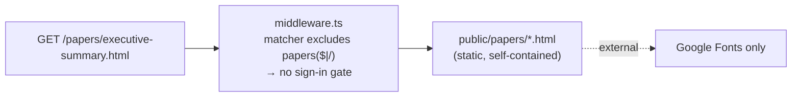

# Public technical papers — `/papers`

[← Operations](README.md) · [Documentation library](../README.md) ·
[Security](../security/README.md) · [Public build-story page](public-story-page.md)

---

**What this is.** The operational detail every operator must understand about the
**second** deliberately **unauthenticated** surface of **Imperion OS** (the first is
[`/story`](public-story-page.md)). `/papers` serves a self-contained, static
technical-paper set — an **executive summary** and a long-form **research paper** —
*without* a sign-in gate (#1181 / epic #1178). Everything else on the platform is behind
Entra SSO. This page explains how that exception is implemented, why it is safe, and how
to change or remove it.

## How it works

- **Files:** `public/papers/executive-summary.html` and
  `public/papers/research-paper.html` — fully self-contained static HTML (inline
  CSS, no JS, no app data). The only external call is Google Fonts.
- **Auth bypass:** `src/middleware.ts` matcher excludes `papers(?:$|/)`. The anchor
  matters — without it any route merely *starting* with "papers" would also skip the
  sign-in gate. This mirrors the `story(?:$|/)` exclusion exactly.
- **No rewrite needed:** the pages are linked by their literal `.html` path
  (`/papers/executive-summary.html`, `/papers/research-paper.html`), so unlike `/story`
  they need no `next.config.mjs` directory-index rewrite. Add one only if a bare
  `/papers` landing path is later wanted.
- **Deploy:** the App Service workflow copies `public/` into the standalone bundle
  (`main_imperioncrm.yml`), so no extra deploy step is needed.

## What links where

- The **executive summary** carries a "Deep dives" quick-link block to the five canonical
  deep dives (by GitHub blob URL) and ends with links to the research paper and
  `how-it-all-fits-together.md`.
- The **research paper** is the long-form rationale for the data-structure decisions, with
  external citations.
- The in-repo deep dives ([`docs/architecture/deep-dives/`](../architecture/deep-dives/README.md))
  and [`data-design-for-agents.md`](../architecture/data-design-for-agents.md) link back to
  these papers.

## Security posture

Static content only: no session, no data layer, no secrets, no PII, no app routes. The
papers cannot read or write any application data. The unauthenticated surface remains
intentionally limited to `/story`, `/papers`, `/opt-in`, and `/legal`. The shared baseline
is [`docs/security/unified-security-standard.md`](../security/unified-security-standard.md)
(referenced, never restated).

## Change / remove checklist

| Goal | Steps |
| --- | --- |
| **Edit content** | Replace the `public/papers/*.html` file in a PR; merge → auto-deploys (`main_imperioncrm.yml` copies `public/`). |
| **Add a paper** | Drop a new self-contained `public/papers/<name>.html`; it is already covered by the `papers(?:$|/)` exclusion — no middleware change needed. |
| **Take it down** | Delete `public/papers/`, remove the `papers(?:$|/)` matcher exclusion in `src/middleware.ts`. After this, the routes 404 and the surface returns to `/story` + `/opt-in` + `/legal`. |
| **Verify the gate** | Confirm `src/middleware.ts` excludes only `papers(?:$|/)` (anchored) — never a bare `papers` prefix, which would unintentionally un-gate sibling routes. |
