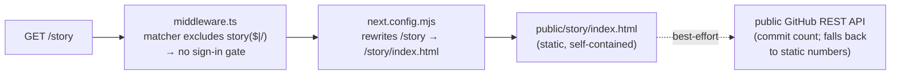

# Public build-story page — `/story`

[← Operations](README.md) · [Documentation library](../README.md) ·
[Security](../security/README.md)

---

**What this is.** The one operational detail every operator must understand about
**Imperion Business Manager**'s single **unauthenticated** route. Everything else on the
platform is behind Entra SSO; `/story` is the deliberate exception — a self-contained,
static marketing/build-story page served *without* a sign-in gate (#248). This page
explains how that exception is implemented, why it is safe, and how to change or remove
it.

## How it works

- **File:** `public/story/index.html` — fully self-contained static HTML (inline
  CSS/JS). External calls: Google Fonts and the *public, unauthenticated* GitHub
  REST API (best-effort commit-count hydration; falls back to static numbers).
- **Auth bypass:** `src/middleware.ts` matcher excludes `story($|/)`. The anchor
  matters — without it any route merely *starting* with "story" would also skip
  the sign-in gate. Everything else remains gated per CLAUDE.md §7.3.
- **Bare path:** `next.config.mjs` rewrites `/story` → `/story/index.html`
  (public files have no directory-index resolution).
- **Deploy:** the App Service workflow copies `public/` into the standalone
  bundle (`main_imperioncrm.yml`), so no extra deploy step is needed.

## Security posture

Static content only: no session, no data layer, no secrets, no app routes. The
unauthenticated surface is intentionally limited to this one static file — it cannot read
or write any application data. To update the page, replace `public/story/index.html` in a
PR. To take it down, delete the directory and remove the matcher exclusion + rewrite. The
shared baseline is [`docs/security/unified-security-standard.md`](../security/unified-security-standard.md)
(referenced, never restated).

## Change / remove checklist

| Goal | Steps |
| --- | --- |
| **Edit content** | Replace `public/story/index.html` in a PR; merge → auto-deploys (`main_imperioncrm.yml` copies `public/`). |
| **Take it down** | Delete `public/story/`, remove the `story($|/)` matcher exclusion in `src/middleware.ts`, remove the `/story` rewrite in `next.config.mjs`. After this, the route 404s and the unauthenticated surface is zero. |
| **Verify the gate** | Confirm `src/middleware.ts` excludes only `story($|/)` (anchored) — never a bare `story` prefix, which would unintentionally un-gate sibling routes. |
