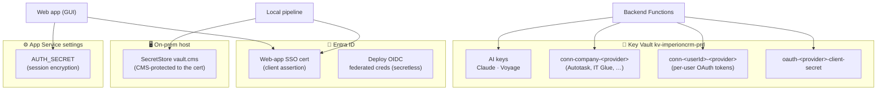

# Secrets rotation runbook

[← Operations](README.md) · [Documentation library](../README.md) ·
[Security](../security/README.md)

---

**What this is.** The complete inventory of every piece of secret material in the
**Imperion OS** four-repo system — who owns it, where it lives, how to
rotate it, and on what cadence — plus a one-glance compromise quick-reference. Use it for
the deferred pre-go-live rotation pass, for routine cadence rotations, when onboarding a
new secret, and as the first thing you reach for during a suspected compromise.

> **Nothing here is a secret.** This runbook documents *procedures only* — no key, token,
> connection string, or password value appears in it or in any repo. That is the standing
> rule (system `CLAUDE.md` §2); the binding baseline is the
> [unified security standard](../security/unified-security-standard.md), referenced here,
> **never restated**.
>
> **Rotation is a security event.** When you rotate something, record it (date +
> operator) in the ops log. Rotations that touch production auth/infra are **Mark-gated**.

> Referenced by the [production-readiness plan](../architecture/production-readiness-plan.md)
> § operator checklist item 7 ("rotate the deferred secrets before go-live").

## Where the secrets live (the custody map)

Secret custody follows the four-repo division of labor (system `CLAUDE.md` §1): the
**front end holds no AI key and no integration secret**. Almost everything lives in Azure
Key Vault `kv-imperioncrm-prd` or as Entra-side credentials; the on-prem host holds only
the SecretStore-protected source keys it needs to run scheduled jobs.

## Inventory

| # | Secret | Lives in | Used by | Cadence |
| - | --- | --- | --- | --- |
| 1 | `AUTH_SECRET` (Auth.js session encryption) | App Service setting on `imperioncrm` | Web app | Go-live, then 6-monthly or on suspicion |
| 2 | Entra auth certificate (`ImperionCRM-WebApp-EntraAuthCert`) | Cert stores + Entra app `Imperion CRM` | Web app SSO (ADR-0005) · local-pipeline SP (cert→token) | Before expiry (check `NotAfter`); revoke on compromise |
| 3 | `Claude-Platform-API-Key-Main` | Key Vault `kv-imperioncrm-prd` | Backend model router | Quarterly or on suspicion |
| 4 | `Voyage-Embedding-API-Key` | Key Vault | Local pipeline vectorizer; backend query embeds | Quarterly or on suspicion |
| 5 | Company credentials (`conn-company-<provider>`: autotask, itglue, televy, darkwebid, …) | Key Vault | Pipelines + backend | Per provider policy; on staff departure |
| 6 | Per-user OAuth token sets (`conn-<userId>-<provider>`) | Key Vault | Backend (refresh-on-read, ADR-0038) | Self-rotating via refresh; **revoke** = disconnect |
| 7 | OAuth provider client secrets (`oauth-<provider>-client-secret`) | Key Vault | Backend OAuth code exchange | Per provider app policy (Entra: ≤24 months) |
| 8 | GitHub→Azure deploy identity | Entra federated credentials (OIDC) | All three deploy workflows | **Secretless** — nothing to rotate; review federation subjects annually |
| 9 | Local SecretStore vault password (CMS blob, post host-provisioning) | `C:\ProgramData\Imperion\vault.cms` on the on-prem host | Scheduled tasks (local `CLAUDE.md` §2) | With cert rotation (#2) |

## Procedures

> **Read the whole procedure before running any command.** Several of these invalidate
> live sessions, bounce a Function App, or change production auth — do them off-hours and
> verify with the listed check.

### 1. `AUTH_SECRET`
1. Generate: `openssl rand -base64 33` (or `node -e "console.log(crypto.randomBytes(33).toString('base64'))"`).
2. App Service `imperioncrm` → Configuration → set `AUTH_SECRET` → save (restarts the app).
3. Effect: all active sessions invalidate; users re-SSO through Entra silently. Do it
   off-hours. CI never sees the real value (the deploy workflow builds with a dummy
   `AUTH_SECRET: ci-build-only-not-a-real-secret`, `main_imperioncrm.yml`).

### 2. Entra auth certificate
Dual-purpose credential — web app client assertion AND the local pipeline's SP cert.
1. Issue the replacement cert (same subject), import to the web App Service (TLS/SSL →
   certificates) and the on-prem host store the pipeline uses.
2. Entra app `Imperion CRM` → Certificates & secrets → upload the new public key.
   **Keep both registered during cutover.**
3. Point the web app's cert thumbprint setting + the local `pipeline.config.psd1`
   `CertThumbprint` at the new cert; verify SSO and a pipeline DB read.
4. Remove the old cert from the Entra app, then from the stores. Compromise = remove
   from Entra app FIRST (kills both consumers), then re-issue.
5. On-prem follow-through: re-protect the SecretStore CMS blob to the new cert (#9)
   (`Protect-CmsMessage -To <new thumbprint>`).

### 3–4. AI provider keys (Claude / Voyage)
1. Issue a new key in the provider console (Anthropic / Voyage).
2. `az keyvault secret set --vault-name kv-imperioncrm-prd --name <secret-name> --value <new>`.
3. Backend picks it up on next cold start; bounce the Function App to force it.
   Local pipeline reads Key Vault per run (interim mode) — no action.
4. Revoke the old key at the provider. Verify: `/api/ready` (backend) and one
   `Invoke-ImperionKnowledgeSync -Vectorize` run (local).

### 5. Company credentials
Rotate at the provider (Autotask/IT Glue/Televy/Dark Web ID console), then re-save
through **Settings → Integrations → company credentials** in the web app — the backend
writes the new version to Key Vault (`POST /api/credentials`); old versions age out in
Key Vault version history. Never hand-edit these in the portal (bypasses audit). The
end-to-end save path must be *activated* first — see
[credential-wiring-next-steps](credential-wiring-next-steps.md) and the
[activate-company-credential-wiring runbook](../runbooks/activate-company-credential-wiring.md).

### 6. Per-user OAuth tokens
Self-rotating: the backend refreshes near-expiry on read and writes back (ADR-0038).
Forced revocation = the user's **Disconnect** button (Settings) or
`POST /api/connections/<provider>/disconnect` — deletes the Key Vault secret first,
then marks the row `revoked`. Staff departure: disconnect all their providers, then
disable the `app_user`.

### 7. OAuth provider client secrets
1. Create the new secret in the provider's console (Entra / Google Cloud / LinkedIn /
   Meta) **before** the old expires.
2. Update the Key Vault secret named by `OAUTH_
_CLIENT_SECRET_SECRET`.
3. Backend reads it per exchange — no restart needed. Delete the provider-side old
   secret after one successful connect.

### 8. Deploy identity
OIDC federated credentials: secretless by design. Annual review — confirm the three
federation subjects still point at `repo:markdconnelly/<repo>:ref:refs/heads/main` and
the SP holds only Website Contributor on the three sites. (The web deploy workflow
authenticates via `azure/login` with OIDC `id-token: write` and no stored secret,
`main_imperioncrm.yml`.)

### 9. SecretStore CMS blob (after host provisioning)
With cert rotation: `Protect-CmsMessage -To <new cert>` over the vault password →
replace `vault.cms` → verify a scheduled task unlocks. The vault password itself
changes only if compromised (`Set-SecretStoreConfiguration`).

## Compromise quick reference

| Suspected compromise of… | Immediate action |
| --- | --- |
| Web session secret | Rotate #1 (kills all sessions) |
| The Entra cert | Remove from Entra app (kills web SSO client-assertion + pipeline SP), re-issue, follow #2 |
| An AI key | Revoke at provider, then #3/#4 |
| A company credential | Revoke at provider, re-save via Settings |
| A user's mailbox/social token | Disconnect the provider (revokes Key Vault custody), have the user revoke app consent provider-side too |
| The on-prem host | Treat as cert compromise (#2) + rotate every SecretStore-held source key |

## Onboarding a new secret

When a new integration introduces a secret, add it to this inventory in the same PR
(docs-as-code, CLAUDE.md §8). Capture: the secret's name, custody location (Key Vault
preferred), the consumer, the rotation procedure, and the cadence — and wire it into the
compromise table if a fast revoke path matters. Keep front-end repos free of integration
secrets and AI keys (system `CLAUDE.md` §1).
