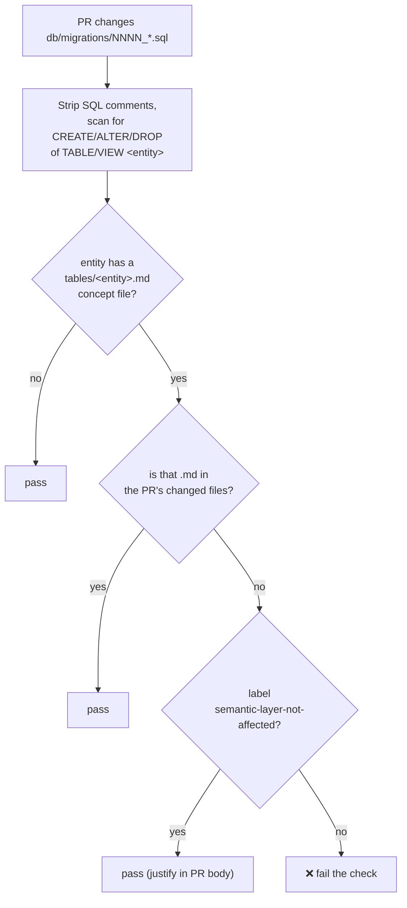

# Semantic-layer docs-gate (CI)

[← Operations](README.md) · [Documentation library](../README.md) ·
[OKF semantic layer](../database/semantic-layer/)

---

**What this is — for an operator.** A CI safety net that stops the curated *meaning* of
the silver data tier from drifting away from the schema it describes. When a pull request
changes a silver table that already has an OKF concept file, this gate **fails the PR**
unless the matching concept file is updated in the same change set. If you see the
`semantic-layer` check red on a PR, this page tells you why and how to clear it.

**Status:** active · **Owns:** ADR-0086 constraint 3 (near-term staleness) ·
**Issue:** [#535](https://github.com/markdconnelly/ImperionCRM/issues/535) ·
**Code:** `scripts/semantic-layer-gate.mjs` (+ `scripts/semantic-layer-gate.test.mjs`),
CI job `semantic-layer` in `.github/workflows/ci.yml`.

> Background: the OKF (Open Knowledge Format) semantic layer is the one curated
> "what does this entity *mean* / which source wins / how does it join" surface, owned by
> this GUI repo (it owns the schema). See the
> [OKF bundle](../database/semantic-layer/) and the system-level `CLAUDE.md` §11 for the
> binding cross-repo contract.

## What it does

When a pull request changes a **migration that adds/alters/drops a silver table
which already has an OKF concept file** under
[`docs/database/semantic-layer/tables/`](../database/semantic-layer/), the PR must
also update that concept file in the same change set — at minimum bumping its
`timestamp`. If it doesn't, the `semantic-layer` CI check fails.

This turns the OKF sync rule (system-level `CLAUDE.md` §11 / this repo's CLAUDE.md
"Semantic layer (OKF canon)") from convention into mechanical enforcement, so the
curated *meaning* layer cannot silently rot away from the schema it documents.



## How it decides

1. The set of guarded entities is derived from the bundle itself — every
   `tables/<entity>.md` is one silver entity whose physical object name is
   `<entity>`. No separate mapping to maintain.
2. For each **changed** `db/migrations/NNNN_*.sql`, SQL comments are stripped and
   the body is scanned for a `CREATE` / `ALTER` / `DROP` of `TABLE` or `VIEW` named
   exactly that entity. Word-boundary matching means `expense_item` does **not**
   match its bronze feed `website_expense_item` or its view `expense_item_all`, and
   a plain foreign-key `REFERENCES expense_item(id)` does not trip it.
3. Every touched entity whose concept file is **absent from the PR's changed files**
   is reported, and the check fails.

## Satisfying the gate

- **Normal path:** update the matching `tables/<entity>.md` (bump `timestamp`; also
  update the entity's row in
  [`coverage-matrix.md`](../database/semantic-layer/coverage-matrix.md) if its
  shape, source-of-record/authority, or join paths changed). Ship it in the same PR.
  The bar a concept file must meet is
  [AUTHORING.md](../database/semantic-layer/AUTHORING.md).
- **Escape hatch:** add the **`semantic-layer-not-affected`** label and justify it in
  the PR body (mirrors `docs-not-needed`). Use only when the migration genuinely
  doesn't change the entity's meaning — e.g. a grant-only or index-only change.

## Deliberately out of scope

- **New silver entities.** A migration creating a brand-new silver table that has no
  concept file yet is *not* flagged — there is no reliable signal distinguishing a
  new silver table from a new bronze/reference/config table. New concepts are added
  via the expansion track ([#536](https://github.com/markdconnelly/ImperionCRM/issues/536))
  and caught at review. Widen the gate here only once entity-tier is declared in the
  migration (e.g. a header tag).
- **Cross-repo drift.** Sibling repos that change a silver entity's meaning file an
  `ImperionCRM` issue (§11); the heavier auto-proposing enrichment agent is
  LocalPipeline [#175](https://github.com/markdconnelly/ImperionCRM_LocalPipelineEnrichment/issues/175)
  (the "agent later" half of ADR-0086 constraint 3).

## Testing / maintenance

The matching logic is pure and unit-tested (`scripts/semantic-layer-gate.test.mjs`,
run by the `test` CI job via `vitest`): comment stripping, bronze/view/FK
false-positive avoidance, multi-migration fan-out, and the escape hatch. To run the
real gate locally against the working tree:

```bash
CHANGED_FILES=$'db/migrations/0099_x.sql\ndocs/database/semantic-layer/tables/expense_item.md' \
  node scripts/semantic-layer-gate.mjs
```

The gate is **PR-only** (`if: github.event_name == 'pull_request'` in `ci.yml`) — there
is no base-branch or label context on a push to `main`.

## Second rule — skill-pointer integrity (ADR-0104 decision 6, layer 1 (b))

The source→skill registry (`source_skill`) maps each provider to its **sanctioned
fetch/validate skill** (ADR-0104 decision 2). A skill **renamed or removed** under
`plugins/imperion-skills/skills/<name>/` can orphan a registry pointer. So the gate also
**fails the PR** when a skill manifest (`SKILL.md`) is *deleted* (rename = delete + add)
unless `docs/database/semantic-layer/tables/source_skill.md` is touched in the same PR
(prompting a review of the map) — or the `semantic-layer-not-affected` label is applied.

A **pure skill edit** (the manifest still exists) is **not** flagged — only a
removal/rename, which is the actual pointer risk. Detection uses
`git diff --diff-filter=D` (exported as `REMOVED_FILES`). The registry *table*'s schema
changes need no special rule — `source_skill` has a concept file, so the migration rule
above already covers it.

## Security impact

None. Reads only migration SQL and bundle filenames already in the repo; no secrets,
no DB connection, no network. Reinforces the ADR-0086 PII boundary indirectly by
keeping the curated (PII-free) layer honest. (The unified security baseline is
[`docs/security/unified-security-standard.md`](../security/unified-security-standard.md),
referenced, never restated.)
