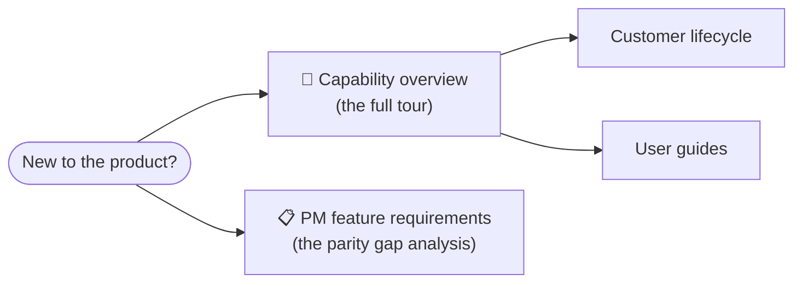

# 📈 Product

What **Imperion Business Manager** *is*, in product terms — the full capability surface
and the requirements behind it. If you are new and want the single best starting read,
open the **[capability overview](imperion-business-manager-overview.md)**.

[← Documentation library](../README.md) ·
[Capability overview](imperion-business-manager-overview.md) ·
[System of systems](../architecture/system-of-systems.md)

---

## Start here

**Imperion Business Manager** is the single operational platform an MSP runs its whole
business on — **not just a CRM**, but **CRM + ERP + extras + a full AI suite** on one
surface, sitting as an intelligence layer above Microsoft 365 and Kaseya (CLAUDE.md §1).
The capability overview is the onboarding-grade tour of every one of those families; this
README is the short index for the product area.

---

## In this area

| Doc | What's inside |
| --- | --- |
| **[Capability overview](imperion-business-manager-overview.md)** | The complete, onboarding-grade tour of every capability — **CRM · ERP · Extras · the full AI suite** — cross-linked to the deeper per-area docs and the ADRs that govern each decision. **Start here.** |
| [PM feature requirements](pm-feature-requirements.md) | The gap analysis and requirement set behind the project-management parity cluster (ADR-0094) — what Imperion needs to match best-in-class PM tools, and why. |

---

## How the product is documented

The product area answers *what the platform does and why*. It hands off to the rest of the
library for *how*:

- **How employees use each module** → [user guides](../user-guides/README.md).
- **How the system is built** → [architecture](../architecture/README.md) and
  [system of systems](../architecture/system-of-systems.md).
- **Why each decision was made** → [decision records](../decision-records/README.md).
- **The motion the product serves** → [customer lifecycle](../architecture/customer-lifecycle.md).

---

## See also

- [System of systems](../architecture/system-of-systems.md) — the four-repo estate.
- [Customer lifecycle](../architecture/customer-lifecycle.md) — the assessment-led motion.
- [User guides](../user-guides/README.md) — how employees use each module.
- [Decision records](../decision-records/README.md) — the consolidated dossiers ADR-0091–0096.
- [Unified security standard](../security/unified-security-standard.md) — the security
  baseline (referenced, never restated).
