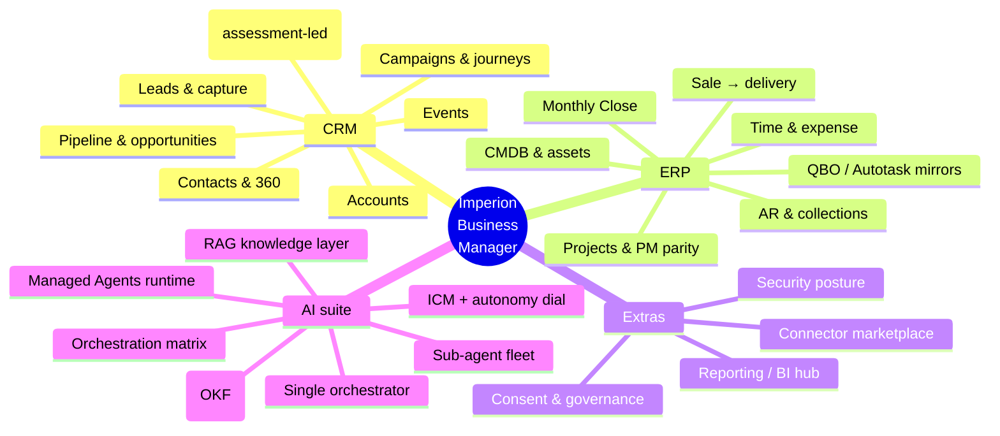
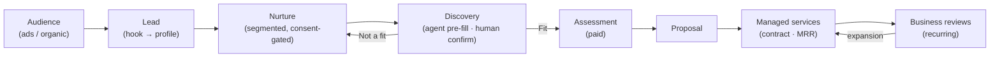
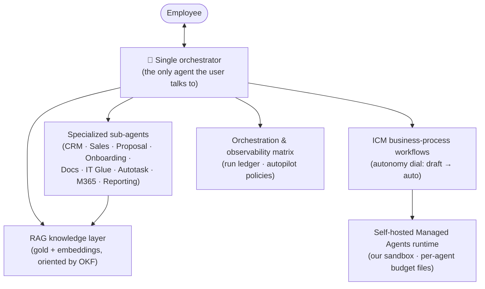

# Imperion Business Manager — capability overview

> **Audience:** anyone new to the product — a new employee, an engineer, a reviewer,
> or a stakeholder who wants the full picture in one read.
> **Scope:** the complete capability surface of Imperion Business Manager, organized
> as **CRM · ERP · Extras · the full AI suite**. Every capability here is built and
> serving in the live app unless explicitly flagged otherwise; this document
> describes what *exists*, cross-linked to the deeper per-area docs and the ADRs that
> govern each decision.

[← Documentation library](../README.md) · [Product area](README.md) ·
[System of systems](../architecture/system-of-systems.md) ·
[Customer lifecycle](../architecture/customer-lifecycle.md)

---

## 1. What Imperion Business Manager is

**Imperion Business Manager** is the single operational platform a Managed Service
Provider runs its whole business on. It began as a CRM and is now far more: it is the
**operational brain** of the MSP, spanning the customer-facing motion (CRM), the
operational and financial backbone (ERP), a set of extras that no classic CRM or ERP
ships with, and a **full AI suite** woven through all of it.

It sits as an **intelligence layer above Microsoft 365 and Kaseya** — augmenting and
orchestrating those systems, never replacing them — and gives every employee **one
place to work** and **one agent to ask**. It is an internal platform for one MSP, not
a multi-tenant SaaS, and it is built on open web technology (not Power Platform /
Dataverse / Copilot Studio).

The four capability families map onto the live left-nav: the cross-cutting overviews
(Dashboard, Pipeline, Reporting) sit at the top; the customer-journey and operational
modules in the middle; the AI surfaces and Settings at the bottom.

---

## 2. CRM — the customer-facing motion

Imperion's CRM covers the full demand-to-relationship motion, all over one unified
contact graph and a single communications timeline.

| Capability | What it does | Where (route) |
| --- | --- | --- |
| **Leads & capture** | Inbound leads, lead-capture hooks that start a profile automatically, a lead inbox, and lead scoring. | `/leads` (reached via the Leads⟷Contacts toggle) |
| **Contacts & Contact-360** | Every person, with a 360 detail view: dossier, the unified communications timeline, per-contact consent, and the message composer. | `/contacts` |
| **Accounts** | The companies leads and contacts belong to, with their engagements and history. | `/accounts` |
| **Pipeline & opportunities** | An interactive sales pipeline — move deals between stages — over the opportunity/deal model. | `/pipeline` |
| **Campaigns & audiences** | Marketing campaigns with audiences and ads, plus builders, over the aggregated profile graph. | `/campaigns` |
| **Journeys** | Multi-step marketing journeys — a journey is a workflow whose steps / A-B / branches live in one object (ADR-0094 PM cluster reuses the same object model; journey = ADR-0073). | `/journeys` |
| **Events** | First-class event objects that campaigns promote, with a JSON-form registration page. | `/events` |
| **Communications** | One unified multi-channel timeline per contact — every email, message, call, meeting, and social touch, attributed to the employee then the company. | `/communications` |
| **Discovery → Assessments → Proposals** | The engagement chain: discovery (with agent-prefilled answers a human confirms), the paid AI Security Readiness Assessment, and proposals. | `/discovery` · `/assessments` · `/proposals` |

**The defining motion is assessment-led.** A *paid* AI Security Readiness Assessment
is the wedge that earns the access and evidence to win a multi-year managed-services
contract, with recurring Strategic Business Reviews after. The full lifecycle is in
[customer-lifecycle](../architecture/customer-lifecycle.md).

Deeper: [user-guides](../user-guides/README.md) ·
[workflows](../workflows/README.md) (nurture & pre-discovery automation) ·
[data-governance](../data-governance/README.md) (the consent gate on every send).

---

## 3. ERP — the operational & financial backbone

This is where Imperion Business Manager goes well beyond a CRM. Once a deal is won,
the same platform runs delivery, project management, time and expense, finance close,
collections, and the asset register — all over the same object model and the same
identity spine.

### 3.1 Sale → delivery orchestration

When a quote is won, Imperion turns it into delivery. The quote source of record is
**Kaseya Quote Manager (KQM), read-only**; a won quote drives an Autotask
project/ticket execution record, with idempotency enforced via Imperion tracking
tables, behind a hard contract gate (DocuSign). Governing decision: **ADR-0096**
(consolidated sale→delivery dossier; the orchestration spine ADR-0080 is Accepted, the
provisioning model ADR-0081 is Proposed).

| Capability | What it does | Where |
| --- | --- | --- |
| **Contracts** | The contract surface that gates provisioning (e-signature via DocuSign). | `/contracts` |
| **Delivery board** | The delivery view that bridges a won sale into a provisioned project. | `/projects/delivery` |
| **Project templates** | Data-driven delivery templates instantiated into projects + tasks + provisioning. | `/project-templates` |

### 3.2 Projects & project-management parity

Imperion's PM surface closes the table-stakes gaps versus Asana / Jira / Monday /
ClickUp — **without** becoming a general-purpose PM SaaS. Governing decision:
**ADR-0094** (PM-parity consolidated dossier; source requirements in
[`pm-feature-requirements.md`](pm-feature-requirements.md)).

| Capability | What it does | Where |
| --- | --- | --- |
| **Project board** | Every project type on one surface, user-creatable types (table, not enum), owners, per-project tasks (ADR-0052). | `/projects` |
| **Tasks** | The shared `task` model used by both sales and delivery, with subtasks, dependencies, multi-assignment, custom fields, configurable statuses, tags, comments, @mentions, attachments, watchers, notifications. | `/tasks` |
| **Multi-view layer** | Kanban, calendar, and timeline views over the same work. | under `/projects` |
| **Planning** | Workload & capacity, weekly capacity, sprints & backlog, goals, portfolio, baselines. | `/projects/workload` · `/projects/capacity` · `/projects/sprints` |
| **Intake forms** | Staff intake forms that file a request as a task (reuses the events JSON-form contract). | `/intake` |
| **Templates & recurrence** | User-editable templates, recurring tasks, checklist templates. | `/project-templates` · `/checklist-templates` |
| **Onboarding** | Client onboarding playbook instantiation — the delivery motion's front door. | `/onboarding` |
| **Sales Activity** | A rep's open sales tasks + meetings (the Sales Queue read model). | `/sales-activity` |

### 3.3 Time & expense, Monthly Close

Employee finance: website-authoritative weekly timesheets and monthly expense
reports, normalized into the silver `time_record` / `expense_item` entities, with
Autotask documentation writes, a unified Monthly Close, and the authoritative
QuickBooks Online payment fact read back (read-only). Governing decision:
**ADR-0093** (employee-finance consolidated dossier). Comp data (pay rate, mileage
rate) is gated and never visible to employee / agent / client roles.

| Capability | What it does | Where |
| --- | --- | --- |
| **Timesheets** | The employee's own weekly Mon–Sun timesheet: enter time + attest. | `/timesheets` |
| **Time Admin** | One all-users lifecycle table (correctness + payroll approval). | `/timesheets/admin` |
| **Employee Mapping** | Map each employee to their Autotask Resource / QuickBooks vendor. | `/timesheets/mappings` |
| **Expenses** | The employee's own monthly expense reports: log + attest (mileage via MileIQ + out-of-pocket, receipts). | `/expenses` |
| **Expense Admin / Categories / Mileage Rate** | Expense lifecycle administration; map the synced QBO chart of accounts to clean categories; the effective-dated system mileage rate. | `/expenses/admin` · `/expenses/categories` · `/expenses/mileage-rate` |
| **Monthly Close** | One finance task rolling up both legs (time + reimbursable expense) per employee per month, with QBO read-back status. The app never pays — finance authorizes the manual payment. | `/monthly-close` |

### 3.4 AR, collections & service operations

| Capability | What it does | Where |
| --- | --- | --- |
| **Collections** | The AR collections / dunning worklist over the read-only QuickBooks invoice mirror plus an app-native dunning overlay (never writes QBO). | `/collections` |
| **Tickets** | Service tickets (Autotask-linked). | `/tickets` |
| **Omnichannel queue & Live Chat** | One prioritized inbound triage queue unifying chat sessions + tickets across channels, and the live-chat agent console with deflection telemetry and escalate-to-Autotask. | `/service-desk` · `/service-desk/chat` |
| **Business Reviews** | Recurring Strategic Business Reviews with managed-active clients. | `/sbr` |

### 3.5 CMDB & asset register

| Capability | What it does | Where |
| --- | --- | --- |
| **CMDB** | A read-only surface over silver inventory: a CI register (client accounts, end-user identities, devices) plus the **Device inventory** tab — the device/asset register over per-source bronze (IT Glue / M365 / website) merged to the silver `device` entity. CMDB is the single hardware/asset home (admin\|technician); `/devices` redirects here (#795). | `/cmdb` |

The medallion data platform underneath all of this — per-source physical bronze read
through union views, merged to silver entities — is **ADR-0092**; details in
[database](../database/README.md) and
[integrations](../integrations/README.md) (QBO, MileIQ, Autotask, IT Glue).

---

## 4. Extras — beyond classic CRM/ERP

| Capability | What it does | Where |
| --- | --- | --- |
| **Reporting / BI hub** | The central BI hub (ADR-0062): marketing/social, service-desk, and security-fleet intelligence over the gold layer, with a cross-domain summary strip on the Dashboard that deep-links into each section. | `/reporting` |
| **Connector marketplace** | The integration marketplace where org-wide data connectors are browsed, enabled, and configured over an in-code manifest registry + `connector_instance` state. Admin-only; never stores a secret. | `/connectors` |
| **Security posture** | The security posture dashboard over the on-prem security-posture bronze (Secure Score, Sentinel, Defender, Entra/Intune policies). Admin-only. | `/security` |
| **Consent & data governance** | An append-only consent ledger with lawful-basis tracking; outbound sends and ad targeting are **blocked unless consent is current** — defensible under TCPA / CAN-SPAM / GDPR. | `/consent` + per-contact on the 360 |
| **Knowledge search** | Search over the gold knowledge layer (semantic search arrives with vectorization). | `/knowledge` |
| **Workflows** | The workflow builder + step editor; the engine behind journeys, nurture, and pre-discovery automation. | `/workflows` |
| **Feedback** | A GitHub-coupled in-app feedback surface. | `/feedback` |

Deeper: [reporting](../reporting/README.md) ·
[integrations](../integrations/README.md) ·
[security](../security/README.md) ·
[data-governance](../data-governance/README.md).

---

## 5. The full AI suite

The AI is not a bolt-on feature — it runs through the whole platform. The user talks
to **one orchestrator agent**; everything else is internal. Governing decision:
**ADR-0091** (agent & ICM platform consolidated dossier). The settled AI stack is
**Claude** for generation + **Voyage `voyage-3-large` @ 1024 dims** for embeddings
(ADR-0092 / ADR-0043); the front end holds **no AI key** — the backend and on-prem
pipeline call the providers.

| Capability | What it is | Where / governing decision |
| --- | --- | --- |
| **Single orchestrator + AI Agents page** | The orchestrator preset + budget, registered sub-agents, and `agent.turn` audit activity. Admin-only. | `/agents` (ADR-0091; preset/budget reused on the Settings AI tab) |
| **Board of Directors** | Convene an AI board: a synchronous two-round deliberation + synthesis, with a sessions list and per-session transcript/recommendation. Admin-only. | `/board` (ADR-0091) |
| **ICM framework + autonomy dial** | MSP business workflows as ICM workspaces under `icm/`, executed by the backend orchestrator with a per-workflow autonomy dial (draft → auto). | `icm/` (ADR-0091; overview [agents/icm](../agents/README.md)) |
| **Self-hosted Managed Agents runtime** | The ICM runtime on self-hosted Managed Agents (the Anthropic loop in our sandbox) with a per-agent budget-file convention. | ADR-0091 (consolidates ADR-0088/0089) |
| **Orchestration & observability matrix** | The agent taxonomy, the run ledger, and the autonomy dial expressed as autopilot policies. | ADR-0091 (consolidates ADR-0087); [orchestration-matrix](../agents/README.md) |
| **Agent rooms (OKF semantic layer)** | Per-agent context oriented by the curated OKF semantic layer over the silver tier (governed canon — ADR-0086). | [database/semantic-layer](../database/README.md) |
| **RAG knowledge layer** | The gold knowledge store + embeddings the agents reason over; semantic search surfaces in Knowledge. | ADR-0092; [database](../database/README.md) |
| **AI-assisted surfaces** | Agent-prefilled discovery answers (human confirms), the right-hand orchestrator agent panel on every page, and AI summaries across modules. | throughout the app |

Deeper: [agents](../agents/README.md) (the full AI suite — identity, tools, security
boundaries, failure handling) · [api](../api/README.md) ·
[integrations](../integrations/README.md).

---

## 6. How it all sits together

Imperion Business Manager (this repo) is the **GUI**: it renders the UI, reads
PostgreSQL directly for display, and routes **every process** to the backend. It is
one of four repositories that make up the product. The single map of the whole estate
— who owns what, how a fact crosses repo boundaries, where identity is enforced — is
[system-of-systems](../architecture/system-of-systems.md).

- **Identity** is Entra ID everywhere, with RBAC gating every surface and every
  mutating action (fail-closed; ADR-0095). Comp data and the AI/admin surfaces are
  gated tighter still.
- **Security** is a product feature: the consent gate, the audit log, least
  privilege, and the shared
  [unified security standard](../security/unified-security-standard.md) (the
  cross-repo baseline — referenced, never restated).
- **Data** flows bronze → silver → gold (ADR-0092); the curated *meaning* of the
  silver tier is the governed OKF semantic layer (ADR-0086).

For the decisions behind every capability above, see
[decision-records](../decision-records/README.md) — in particular the consolidated
dossiers **ADR-0091** (AI/ICM), **ADR-0092** (medallion data), **ADR-0093**
(employee finance), **ADR-0094** (PM parity), **ADR-0095** (RBAC), and **ADR-0096**
(sale → delivery).
