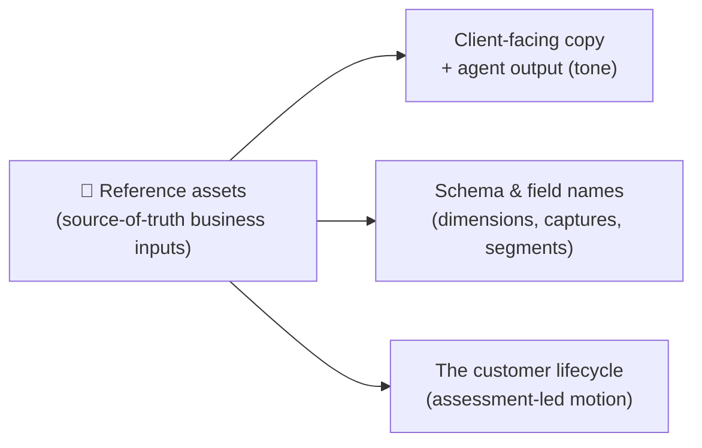

# 📎 Reference

The **canonical source material** Imperion OS is built around — the
originating business assets kept here so the schema, the client-facing copy, and agent
behavior all trace back to a single authority. When a question is "what does the *real*
business process say?", this is where the answer lives.

[← Documentation library](../README.md) ·
[Customer lifecycle](../architecture/customer-lifecycle.md) ·
[Product overview](../product/imperion-os-overview.md)

---

## What "reference" means here

Most of the documentation library *describes* the system. This area is different: it holds
the **inputs** the system was built against — the white paper, the discovery script, the
assessment engagement, the nurture playbook, and the internal voice/tone guide. They are
the originals (PDFs), archived in Git so the team builds against the actual process rather
than assumptions, and so the facts inside them are searchable and version-controlled rather
than locked in a file drawer (CLAUDE.md §8).

> **The originals are inputs, not generated docs.** The PDFs are the originating
> artifacts; the *operational truth* derived from them — exact dimension names, the eight
> discovery captures, the nurture mechanics — is captured as structured facts in the
> sales-marketing page and flows on into the architecture and database docs.

---

## What's here

| Set | What it is |
| --- | --- |
| [sales-marketing](sales-marketing/README.md) | The go-to-market source assets: the **discovery-call script**, the **AI Security Readiness Assessment** engagement, the **segmented nurture campaign**, the **white paper** lead magnet, and the **"How We Show Up"** voice/tone guide — plus the structured facts the application models (the six assessment dimensions, the scorecard ratings, the lead segments, the eight discovery captures, the SBR cadence, and the expertise-not-fear tone). |

These define the [customer-lifecycle](../architecture/customer-lifecycle.md), the exact
dimension names, the eight discovery captures, and the **expertise-not-fear** tone that all
client-facing copy and agent output must follow.

---

## How to use this area

- **Building a client-facing feature or agent prompt?** Read the tone guide and the
  structured facts first — copy and agent output must match the real voice and the exact
  names.
- **Touching schema for the GTM motion?** The dimension names, segment names, capture
  names, and ratings here are the authority; do not invent variants.
- **Onboarding to the business?** Read the [sales-marketing](sales-marketing/README.md)
  page top to bottom — it is the fastest way to understand *why* the lifecycle is shaped
  the way it is.

---

## See also

- [Customer lifecycle](../architecture/customer-lifecycle.md) — the assessment-led motion
  these assets define.
- [Product overview](../product/imperion-os-overview.md) — where the
  capabilities built on these inputs are toured.
- [Workflows](../workflows/README.md) — the nurture/pre-discovery automation built on the
  nurture playbook.
- [Unified security standard](../security/unified-security-standard.md) — the baseline for
  handling any client material (referenced, never restated).
