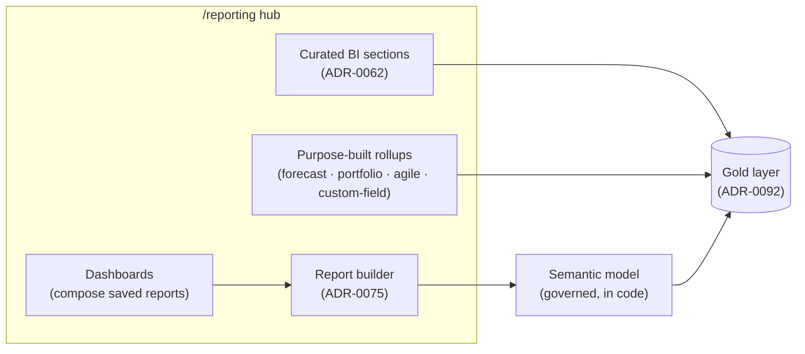

# 📊 Reporting / BI hub

The central reporting and business-intelligence surface of **Imperion Business
Manager** — the BI hub (ADR-0062) over the gold layer, plus the self-serve report builder
and dashboards over a governed semantic model (ADR-0075). This area is the onboarding-grade
reference for everything under `/reporting`.

[← Documentation library](../README.md) ·
[Capability overview](../product/imperion-business-manager-overview.md#4-extras--beyond-classic-crmerp)

---

## 1. Two kinds of reporting, one hub

Imperion Business Manager ships **two** complementary reporting surfaces, both reached
from the `/reporting` hub:

1. **Curated BI dashboards (ADR-0062).** Hand-built, read-optimized intelligence over the
   gold layer — Sales, Marketing & Social, Service Desk, and Security Fleet sections, plus
   purpose-built rollups (forecast, portfolio, agile, custom-field). These are *authored
   by us*; a user reads them.
2. **Self-serve report builder + dashboards (ADR-0075).** A governed, no-code surface where
   any user picks an object, fields, aggregations, filters, and a chart, then saves and
   shares the result — and composes saved reports onto dashboards. The *user* authors
   these, but only ever over a curated semantic model (no raw SQL).

A cross-domain summary strip on the **Dashboard** deep-links into each curated section.

---

## 2. In this area

| Doc | What's inside |
| --- | --- |
| [Dashboards](dashboards.md) | The curated BI sections + rollup pages, and the self-serve dashboard surface that composes saved reports into tiles. |
| [Report builder](report-builder.md) | The self-serve report-building surface: how a report is built, executed without dynamic SQL, RBAC-stripped, and guarded for query cost. |
| [Semantic model](semantic-model.md) | The governed, in-code registry that is the *only* query surface for the report builder — its objects, fields, grants, guardrails, and how to extend it. |

## 3. See also

- [Architecture](../architecture/README.md) · [Database](../database/README.md) — the
  medallion data platform + gold layer (ADR-0092) all reporting reads.
- [Agents](../agents/README.md) — the AI surfaces that consume the same gold layer.
- [Security](../security/README.md) and the
  [unified security standard](../security/unified-security-standard.md) — the RBAC posture
  every report inherits (referenced, never restated).

---

## 4. The governance rule that ties it together

Every reporting surface inherits the same **field-level RBAC** posture: a report can never
surface data its viewer could not already see. Money fields are gated by `canSeeRevenue`,
comp-derived figures by `canSeeLaborCost`. This is enforced at *build* time (forbidden
fields are never offered) **and** at *run* time (selections are re-validated and stripped
for the viewer) — see [semantic-model.md](semantic-model.md) and
[report-builder.md](report-builder.md). Dashboards re-run the strip per tile against the
*viewer's* roles, so sharing never widens access.
