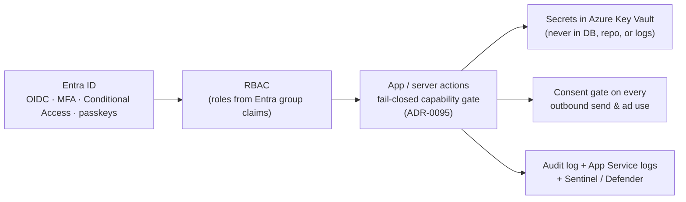

# 🔐 Security

Security in **Imperion Business Manager** is **a product feature, not an afterthought**
(CLAUDE.md §5). The posture — internally code-named **"Mythos Proof"** — assumes
*continuous, AI-assisted attack*, credential theft, supply-chain risk, and insider
threat, and is built so that **identity is the perimeter**: there is no private network
to hide behind, so every workload proves who it is and is granted only what it needs.

[← Documentation library](../README.md) ·
[Governance & compliance](../compliance/README.md) ·
[Data governance](../data-governance/README.md) ·
[Disaster recovery](../disaster-recovery/README.md) ·
[Deployment](../deployment/README.md) ·
[Runbooks](../runbooks/README.md)

---

## Start here (reading order for a newcomer)

You do not need to read everything. Pick the door that matches what you came for:

| If you are… | Read, in order |
| --- | --- |
| **New to the whole security model** | 1. This page (the map) → 2. [unified-security-standard](unified-security-standard.md) (the canon) → 3. [identity-and-authentication](identity-and-authentication.md) (how sign-in actually works). |
| **Reviewing a PR for security impact** | [unified-security-standard](unified-security-standard.md) §2–§5 (the non-negotiables) + the relevant ADR's *Security impact* section. |
| **Wiring or rotating a secret** | [unified-security-standard](unified-security-standard.md) §4 + the [secrets-rotation runbook](../operations/secrets-rotation-runbook.md). |
| **Working out who can do what** | [Authorization & RBAC (ADR-0095)](../decision-records/ADR-0095-authorization-rbac-consolidated.md) — the consolidated dossier; the [authorization-model](authorization-model.md) onboarding tour. |
| **Responding to an incident** | [incident-response](incident-response.md) + the matching runbook. |

> **The one rule that overrides everything:** **Never commit secrets** — no keys,
> tokens, connection strings, or password hashes in the repo, app-settings *values*,
> or logs. Use environment variables locally and **Azure Key Vault** in deployed
> environments (CLAUDE.md §5; [unified-security-standard](unified-security-standard.md) §4).

---

## What's in this area

| Doc | What it covers | Authority |
| --- | --- | --- |
| **[unified-security-standard](unified-security-standard.md)** | **The system-wide security canon, mirrored byte-for-byte in all four repos:** identity is the perimeter — per-workload managed identities, Entra-only Postgres (no stored passwords), RBAC-only Key Vault, public endpoints but never anonymous access, no private networking (deferred for cost), and the consent + audit invariants. | **Canonical / normative.** Single source of truth across the four-repo system. Improve its *framing*, never its *clauses*. |
| [identity-and-authentication](identity-and-authentication.md) | How a human signs in: Entra ID as the sole IdP, the certificate client-assertion (no shared secret), the middleware sign-in gate, and the break-glass emergency path. | Reference + implementation notes. |
| [authorization-model](authorization-model.md) | An onboarding tour of *who can do what once signed in* — the five roles, the GUI gating, the fail-closed write-capability matrix, and break-glass. | **Navigational** — defers entirely to **ADR-0095** for the decision. |
| [threat-model](threat-model.md) | The assets we protect, the adversaries we assume, the trust boundaries, and how each documented control answers a specific threat. | Reference. |
| [secrets-management](secrets-management.md) | How secret material is custodied, referenced, and rotated — and the bright line between *names* (which may live in config) and *values* (which never leave Key Vault). | Reference → defers to the [secrets-rotation runbook](../operations/secrets-rotation-runbook.md) for keystrokes. |
| [logging-and-monitoring](logging-and-monitoring.md) | What gets audited, where the audit trail lands, and how the platform is watched (audit log, App Service logs, Sentinel/Defender). | Reference. |
| [incident-response](incident-response.md) | The detect → contain → eradicate → recover → review loop, mapped to the runbooks that execute each step. | Reference + runbook pointers. |

---

## The model in one sentence

> **There is no private network. Identity is the perimeter** — every workload runs as
> its own Entra principal, every connection mints a short-lived token, every secret
> lives in Key Vault, and every action that matters is audited.

The full picture, including the trust-boundary diagram, is in
[unified-security-standard](unified-security-standard.md) §1. Defense in depth, layer by
layer:

Each layer assumes the one before it can be bypassed — the GUI hiding a control is a
courtesy; the server *never trusts the client* and re-checks every write
([ADR-0095](../decision-records/ADR-0095-authorization-rbac-consolidated.md)).

---

## The pillars (and where each is decided)

- **Identity — Entra ID only.** No third-party IdP without a documented ADR
  (CLAUDE.md §2). The web app authenticates to Entra with a **certificate client
  assertion** (no shared secret — [ADR-0005](../decision-records/ADR-0005-entra-auth-via-authjs-certificate.md));
  it authenticates to Postgres via its **managed identity** (no stored password).
  Break-glass is the audited, off-by-default emergency path
  ([ADR-0008](../decision-records/ADR-0008-break-glass-emergency-access.md), now folded into
  [ADR-0095](../decision-records/ADR-0095-authorization-rbac-consolidated.md)).
- **Authorization — least privilege, fail closed.** Five Entra-group-sourced roles, a
  GUI that hides what a role cannot use, server-side revenue/PII redaction, and a
  fail-closed write-capability matrix on every mutating server action. **Canonically
  decided in [ADR-0095](../decision-records/ADR-0095-authorization-rbac-consolidated.md).**
- **Secrets — Key Vault is the only store.** OAuth tokens, source API keys, and AI
  provider keys all live in the vault; the database stores only
  `keyvault_secret_ref` *pointers*; config stores only secret *names*. Rotation is
  the [secrets-rotation runbook](../operations/secrets-rotation-runbook.md).
- **Data protection & consent.** PII is tagged and access-logged; every outbound send
  and ad use reads `current_consent` and refuses unless opted in
  ([data-governance](../data-governance/README.md)).
- **Pipeline & supply chain.** OIDC-federated CI/CD (no deployment secrets in GitHub),
  dependency scanning, and a docs-as-a-control gate (a feature is not done without its
  security documentation).

---

## Governing decisions

[ADR-0002 Entra sole IdP](../decision-records/ADR-0002-entra-id-as-sole-idp.md) ·
[ADR-0005 certificate client auth](../decision-records/ADR-0005-entra-auth-via-authjs-certificate.md) ·
[ADR-0095 Authorization & RBAC (consolidated)](../decision-records/ADR-0095-authorization-rbac-consolidated.md)
(consolidates the former ADR-0008 break-glass · ADR-0016 RBAC/identity · ADR-0030 RBAC GUI ·
ADR-0045 server-action authz · ADR-0050 admin-only AI surfaces) ·
the shared baseline **[unified-security-standard](unified-security-standard.md)**.

> **Cross-repo:** this standard governs all four repos
> ([system of systems](../architecture/system-of-systems.md)). The siblings
> (`ImperionCRM_Backend`, `ImperionCRM_Pipeline`, `ImperionCRM_LocalPipelineEnrichment`)
> mirror the unified standard and conform to it; they never fork it.
