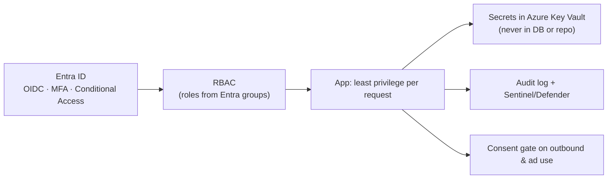

# 🔐 Security

Security is **a product feature, not an afterthought** (CLAUDE.md §5). The posture
assumes continuous, AI-assisted attack, credential theft, supply-chain risk, and
insider threat ("Mythos Proof").

[← Documentation library](../README.md)

## What's here

| Doc | What it covers |
| --- | --- |
| [unified-security-standard](unified-security-standard.md) | **The system-wide standard (mirrored in all four repos):** identity is the perimeter — per-app managed identities, Entra-only Postgres, RBAC-only Key Vault, no private networking (deferred), consent + audit invariants. |
| [identity-and-authentication](identity-and-authentication.md) | Entra ID as the sole IdP, certificate client auth, the middleware sign-in gate, and break-glass access. |

## Defense in depth

## Pillars

- **Identity:** Entra ID only — no third-party IdP. Certificate client auth; the App
  Service authenticates to Postgres via **managed identity** (no stored password).
- **Secrets:** Azure Key Vault. OAuth tokens for connected accounts are *referenced*,
  never stored in the database (ADR-0024).
- **Data protection:** PII is tagged and access-logged; the consent ledger gates
  outbound and ad use ([data-governance](../data-governance/README.md), ADR-0014/0025/0026).
- **Pipeline:** SAST/DAST, dependency scanning, secure CI/CD (CLAUDE.md §5).

## What belongs here (to expand)

Threat models · trust-boundary diagrams · secrets-management runbook · logging &
monitoring (Sentinel) · incident response. A pre-go-live **secret-rotation** pass is
tracked as a deferred action.

Governing decisions:
[ADR-0002 Entra sole IdP](../decision-records/ADR-0002-entra-id-as-sole-idp.md) ·
[ADR-0005 cert auth](../decision-records/ADR-0005-entra-auth-via-authjs-certificate.md) ·
[ADR-0008 break-glass](../decision-records/ADR-0008-break-glass-emergency-access.md) ·
[ADR-0016 RBAC](../decision-records/ADR-0016-rbac-and-identity-model.md)
