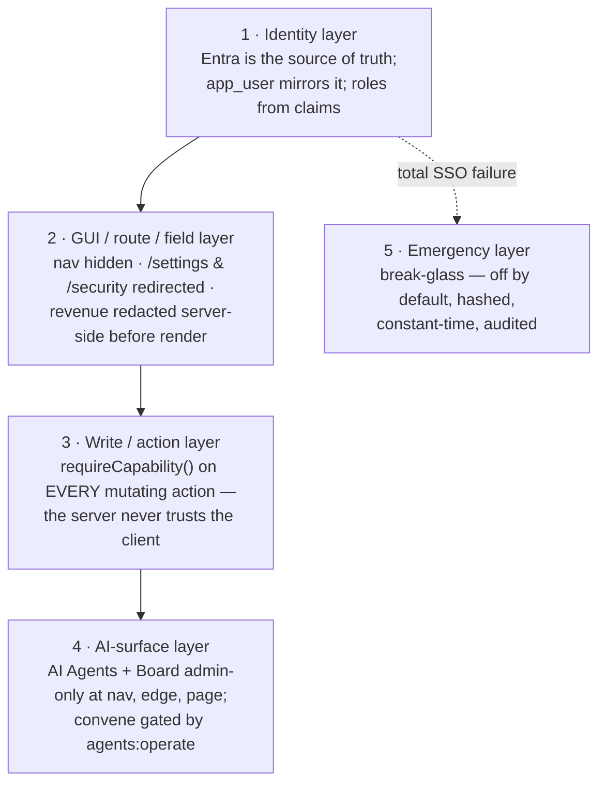

# Authorization & RBAC — onboarding tour

> **This page is navigational, not normative.** The authorization / RBAC model is
> **canonically decided in
> [ADR-0095 — Authorization & RBAC (consolidated dossier)](../decision-records/ADR-0095-authorization-rbac-consolidated.md)**,
> which carries every member decision (the former ADR-0008 / 0016 / 0030 / 0045 / 0050)
> and every fail-closed clause verbatim. When this tour and ADR-0095 ever disagree,
> **ADR-0095 wins.** This page exists only to get a newcomer oriented quickly.

[← Security](README.md) · [Documentation library](../README.md) ·
[unified-security-standard](unified-security-standard.md) ·
[identity-and-authentication](identity-and-authentication.md)

---

## The one idea

**Imperion Business Manager** is single-tenant (Imperion employees only). Authorization
is **layered defense-in-depth**, and every layer assumes the one above it can be
bypassed:

The defining principle of the write layer (ADR-0095, from the former ADR-0045):
**"the server simply never trusts the client to have done so."** The GUI hiding a
button is a *courtesy*; the authorization decision is re-made server-side on every
write.

---

## The five roles

Roles derive from **five Entra security groups** (`Application.ImperionCRM.{Admins,
Finance, ProjectManager, Sales, Support}`) and normalize to a small, stable set in the
pure, edge-safe `src/lib/auth/roles.ts`:

| Role | Source group | What it broadly holds |
| --- | --- | --- |
| `admin` | `…Admins` | **Everything** — holds every capability implicitly; the only role that sees Settings, Security, the AI surfaces, and the CMDB. |
| `finance` | `…Finance` | Contracts/billing, payroll & expense finance-approval, collections, labour-cost analytics. |
| `project_manager` | `…ProjectManager` | Delivery — projects, onboarding, tasks, business reviews, capacity. |
| `sales` | `…Sales` | CRM core, opportunities/proposals/discovery/assessments, campaigns. |
| `support` | `…Support` | Tickets and a narrow comms write; **the default / most-restricted role**. |

**`DEFAULT_ROLE = 'support'`** — a user whose claims resolve to no recognized group
falls back to the *least*-privileged role. This is the fail-closed default
(ADR-0095, from ADR-0030/0045).

> **As-built (ADR-0095, #139/#169):** the live Entra configuration emits **group
> object-id GUIDs in the `roles` claim** (`emit_as_roles`); `rolesFromClaims` resolves
> that claim against both the App-Role name table and an `ENTRA_GROUP_*` env GUID map.
> Defining real App Roles later needs no code change — name-valued claims still map first.

---

## Layer 2 — the GUI / route / field gate (courtesy, never trusted alone)

Pure predicates in `roles.ts` drive three things, all defaulting to the most-restricted
role:

- **Nav filtering** — `canSeeFeature(navKey, roles)` hides nav items a role cannot use
  (`settings`, `security`, `agents`, `board`, `cmdb`, `connectors`, the time/expense
  admin surfaces, `collections`, …).
- **Route redirects** — the edge `authorized` callback and per-page server redirects
  send non-admins away from `/settings` and `/security` (and the AI surfaces — layer 4).
- **Server-side revenue & comp redaction** — `canSeeRevenue` is **false when the only
  role is `support`**; `redactMoney` blanks money **before render**, so restricted data
  *never reaches the client*. Comp-sensitive analytics (`canSeeLaborCost`,
  `canManageMileageRate`) are finance∨admin only.

---

## Layer 3 — the fail-closed write-capability matrix

This is the heart of the model. Every mutating server action calls
`requireCapability(cap)` (`src/lib/auth/guard.ts`) at its top; it resolves the session
roles (default `support`) and **throws `AuthorizationError` — fail closed —** if
`can(roles, cap)` is false. The pure decision lives in `src/lib/auth/policy.ts`, and a
stress-test grid asserts the whole role × capability matrix in CI.

The capability → roles grant map (`admin` holds **all** implicitly):

| Capability | Roles that hold it (besides admin) | Guards |
| --- | --- | --- |
| `crm:write` | sales, project_manager | accounts + contacts core |
| `sales:write` | sales | opportunities, proposals, discovery, assessments, campaigns, leads, workflows |
| `delivery:write` | project_manager | projects, onboarding, tasks, business reviews |
| `contracts:write` | finance | contract / billing records |
| `tickets:write` | support, sales, project_manager | tickets + meeting action items |
| `comms:write` | sales, support | outbound sends + consent ledger |
| `catalog:write` | — (admin only) | discovery/assessment questions + templates |
| `settings:write` | — (admin only) | connections, company credentials, poll cadence |
| `agents:operate` | — (admin only) | convene the AI board / operate the agent layer |
| `time:write` | finance, project_manager, sales, support | **own** weekly timesheet only (the action additionally scopes to the signed-in employee) |
| `time:approve` | — (admin only) | correctness approval of a submitted timesheet |
| `time:map` | — (admin only) | confirm an employee's Autotask/QuickBooks mapping |
| `time:payroll-approve` | finance | CFO payroll approval + QuickBooks-matched Paid |
| `expense:write` | finance, project_manager, sales, support | **own** monthly expense report only |
| `expense:approve` | — (admin only) | correctness approval of a submitted report |
| `expense:finance-approve` | finance | CFO finance approval + QuickBooks-matched Reimbursed |
| `expense:category-map` | — (admin only) | map the read-only QuickBooks chart of accounts |
| `expense:mileage-rate` | finance | **comp data** — gated exactly like Pay Rate |
| `delivery:capacity` | project_manager | per-user weekly capacity hours |
| `collections:write` | finance | dunning overlay on the read-only invoice mirror (never writes QuickBooks) |

> Source of truth for this grid: `src/lib/auth/policy.ts` (`CAPABILITY_ROLES`) and the
> companion predicates in `src/lib/auth/roles.ts`. The verbatim decision is ADR-0095 M4.

### The bootstrap fails closed

A no-claim user falls back to **`support`** (not admin). A documented, **default-off**
flag `RBAC_FAIL_OPEN_ADMIN=true` can restore admin-on-no-claim as a *temporary*
bootstrap while Entra App Roles are assigned — marked **not-for-prod**; break-glass
(forced admin) is the preferred interim path. An interim fail-open that briefly shipped
(#140) was **closed verbatim** by #171 once the live claim mapping landed
(ADR-0095 M4).

---

## Layer 4 — AI surfaces are admin-only end to end

`canSeeAgentPages` (admin-only) gates the **AI Agents** and **Board of Directors** pages
(list *and* transcript detail) at all three layers (nav, edge `authorized`, server
redirect). The costed **convene** action is gated by the admin-only `agents:operate`
capability — *not* just the page — because a page-only gate over a budget-spending
process would leave it POST-invokable (the exact GUI-trust gap layer 3 closes). This
**superseded** the earlier `sales:write` convene gate (ADR-0095 M5, from ADR-0050).

---

## Layer 5 — break-glass (the way back in)

A dedicated `/break-glass` page + Auth.js `break-glass` Credentials provider
authenticates **one non-Entra account** configured via `BREAKGLASS_USERNAME` +
`BREAKGLASS_PASSWORD_HASH` (lowercase-hex SHA-256). It exists because Entra SSO is a
hard gate, and one SSO failure (cert expiry, a Conditional-Access change, an
app-registration change) would otherwise lock out *everyone, including admins*. Its
security properties (carried verbatim in ADR-0095 M1):

- **Off by default** — disabled unless **both** env vars are set.
- Password stored only as a **SHA-256 hash**; compared in **constant time**
  (`crypto.timingSafeEqual`); plaintext is never stored or logged.
- **Every successful use is audit-logged** (`[SECURITY] Break-glass sign-in used …`).
- Reached only via the explicit `/break-glass` URL.
- On sign-in it is **elevated to admin** so the operator can fix the SSO fault.

Treat the break-glass credential like a **root password**: store it in Key Vault,
rotate it, and **alert on the audit-log line**. See
[identity-and-authentication](identity-and-authentication.md) and the
[incident-response](incident-response.md) page.

---

## Agents inherit the acting user's scope

There is no "agent superuser." An agent action runs with the **acting user's
permission scope** (ADR-0095 M2, from ADR-0016/0015) — an agent can never do for a user
what the user could not do themselves. PII columns are flagged and access is
audit-logged (`audit_log`, `pii_access_log`).

---

## Where each layer lives in source

| Layer | File(s) |
| --- | --- |
| Roles + predicates (pure, edge-safe) | `src/lib/auth/roles.ts` |
| Claim → role mapping | `src/lib/auth/claims.ts` |
| Write-capability matrix (pure) | `src/lib/auth/policy.ts` |
| Server-side guard | `src/lib/auth/guard.ts` (`requireCapability`) |
| Session role resolution | `src/lib/auth/session.ts` |
| Sign-in gate (edge) | `src/middleware.ts` |
| Break-glass page | `src/app/break-glass/page.tsx` |

---

## The canonical decision

Read the dossier for the full, verbatim decision and the zero-loss traceability table:

**[ADR-0095 — Authorization & RBAC (consolidated)](../decision-records/ADR-0095-authorization-rbac-consolidated.md)**

It conforms to — and never restates — the
[unified-security-standard](unified-security-standard.md), and its server-side
companion is the backend's own identity gate (backend ADR-0035; Easy Auth + caller
allowlist).
