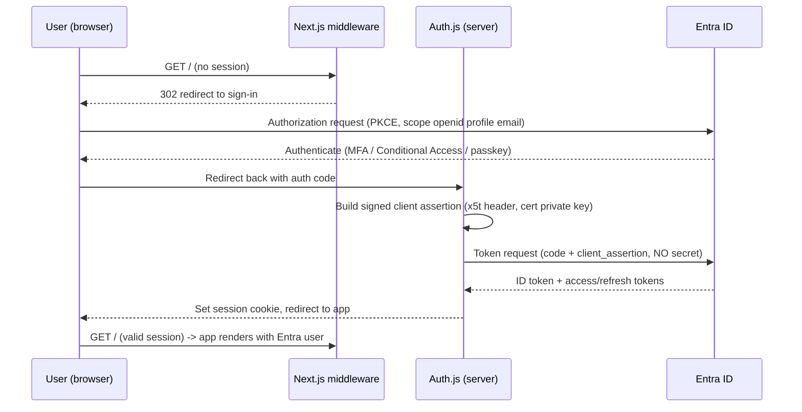

# Identity & Authentication

How Imperion CRM authenticates users. Implements ADR-0002 (Entra ID as sole IdP) and
ADR-0005 (Auth.js + certificate client assertion).

> **Status:** implementation on branch `feat/entra-auth`, pending build/sign-in
> verification (the dev host had Node network-blocked by an Intune firewall
> policy during authoring; see runbooks). Do not treat as production-ready until
> `npm run typecheck`/`build` and a real sign-in pass.

## What it is
Server-side OpenID Connect sign-in against Microsoft Entra ID. Entra is the only
identity provider; no third-party IdP and no local password store. The web app
is a confidential OIDC client that authenticates to Entra with a **certificate**
(signed `private_key_jwt` client assertion), not a shared secret.

## Why certificate, not secret
- "Mythos Proof" posture (CLAUDE.md §5) — minimize shared secrets.
- The repo is public; a certificate means there is **no secret to leak**.
- Assertions are short-lived (~10 min) and single-use (`jti`); the private key
  never leaves the host and never enters source control.

## Components
| Component | File | Responsibility |
|---|---|---|
| Env access | `src/lib/env.ts` | Typed, validated read of Entra vars from the environment only. |
| Cert assertion | `src/lib/auth/client-assertion.ts` | Parse PFX, build + sign the `client_assertion` with the `x5t` header. |
| Auth config | `src/auth.ts` | Auth.js v5 Entra provider; injects the assertion via `customFetch`. |
| Route | `src/app/api/auth/[...nextauth]/route.ts` | OIDC sign-in/callback/sign-out/session endpoints. |
| Gate | `src/middleware.ts` | Redirects unauthenticated requests to Entra before any view renders. |

## Sign-in flow

## Configuration (environment only)
| Variable | Purpose |
|---|---|
| `AZURE_AD_TENANT_ID` | Entra tenant (Imperion LLC). |
| `AZURE_AD_CLIENT_ID` | App registration (client) ID. |
| `AZURE_AD_CERT_PFX_PATH` | Local path to the private-key PFX (gitignored; Key Vault in prod). |
| `AZURE_AD_CERT_PFX_PASSWORD` | PFX password. |
| `AUTH_SECRET` | Auth.js session encryption key. |
| `AUTH_URL` | Base URL for callbacks. |

The certificate's **public** half is uploaded to the app registration
(Certificates & secrets → Certificates); the private PFX stays on the host.

## Trust boundaries
- Browser ⇄ app: session cookie (HTTP-only), gated by middleware.
- App ⇄ Entra: TLS; app authenticated by certificate assertion.
- Secrets/keys: environment / Key Vault only — never the repo.

## Failure handling
- Missing/invalid env → `env.ts` throws at first use (fail closed).
- PFX unreadable / wrong password → assertion build throws; sign-in fails closed.
- Thumbprint mismatch (cert not on the app registration) → Entra rejects the
  assertion (`AADSTS700027`); fix by uploading the matching public cert.

## Monitoring & recovery
- Sign-in successes/failures surface in Entra sign-in logs (and Sentinel, §5).
- Certificate expiry (current cert valid to **2027-06-06**) must be tracked and
  rotated; issue a new cert, upload its public half, update the PFX/secret.

## Production hardening (follow-ups)
- Source the PFX/key from **Key Vault**, not a file path.
- Evaluate **managed identity / workload identity federation** to remove the
  certificate entirely in App Service.
- Add role/permission mapping (RBAC) from Entra groups/app roles.
