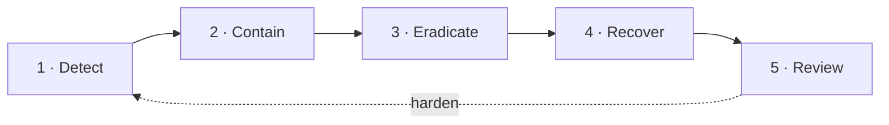

# Incident response

The loop for handling a security incident in **Imperion Business Manager**, and the
runbooks that execute each step. This page is the *map*; the per-situation keystrokes
live in [runbooks](../runbooks/README.md) and the
[secrets-rotation runbook](../operations/secrets-rotation-runbook.md).

[← Security](README.md) · [Documentation library](../README.md) ·
[Runbooks](../runbooks/README.md) ·
[Disaster recovery](../disaster-recovery/README.md)

> **Status — this is the framework, not a drilled plan.** The detection sources and
> containment levers below are all real; a formal on-call rotation, severity matrix, and
> external-notification SLAs are tracked as pre-go-live work. Until then, **Mark is the
> escalation point** for anything touching production auth/infra, permissions, billing,
> or client data.

---

## The loop

| Phase | Goal | Where it happens |
| --- | --- | --- |
| **1 · Detect** | Notice it. | [logging-and-monitoring](logging-and-monitoring.md) — `audit_log`, Entra sign-in logs, Sentinel/Defender, **the break-glass alert**. |
| **2 · Contain** | Stop the bleeding. | Revoke the credential / token, disable the affected path, isolate the workload (below). |
| **3 · Eradicate** | Remove the cause. | Rotate secrets, patch the dependency, fix the misconfiguration. |
| **4 · Recover** | Restore safely. | DB point-in-time restore, app redeploy, secret recovery ([disaster-recovery](../disaster-recovery/README.md)). |
| **5 · Review** | Learn. | Blameless post-incident review → new ADR / runbook / control. |

---

## Detection sources

- **Break-glass audit line** — `[SECURITY] Break-glass sign-in used …`. Break-glass is
  an off-by-default backdoor; **any** use that an operator did not initiate is an
  incident (ADR-0095 M1).
- **Entra sign-in logs** — impossible travel, MFA failures, Conditional-Access blocks.
- **`audit_log` / `pii_access_log`** — unexpected mutating actions, agent turns, or PII
  reads outside a role's normal pattern.
- **Sentinel / Defender** — correlated alerts across the platform telemetry.
- **Dependency / supply-chain alerts** — from dependency scanning on the CI path.

---

## Containment levers (what you can actually pull)

Because **identity is the perimeter**, containment is mostly *identity and secret*
actions — there is no network moat to raise:

| Compromise | First containment move |
| --- | --- |
| Stolen / abused **secret or OAuth token** | Rotate / revoke it in Key Vault; disconnect the affected per-user connection (revokes custody first). [secrets-rotation runbook](../operations/secrets-rotation-runbook.md). |
| Compromised **employee Entra account** | Revoke sessions / disable the account in Entra; require re-auth (MFA / Conditional Access). |
| Misused **break-glass** | Confirm via the audit line; rotate `BREAKGLASS_*`; if no longer needed, unset both env vars to disable it entirely. |
| Compromised **workload identity** (MI / cert) | Rotate the cert / disable the principal; least privilege limits the blast radius by design. |
| Malicious **webhook / source data** | Receivers fail closed on signature mismatch; tighten/disable the source connection. |
| Bad **deploy** | Roll back ([deployment](../deployment/README.md) / [disaster-recovery](../disaster-recovery/README.md)). |

---

## Recovery

- **Database** — the one irreplaceable asset; point-in-time restore from automated
  backups (restore proven by the scheduled test restore).
- **Secrets** — recover from Key Vault soft-delete / re-issue and re-store.
- **App** — redeploy a known-good standalone bundle.
- **External systems** (M365 / Kaseya) — recovered by **re-reading**, not restoring;
  they are referenced, not owned.

Full RPO/RTO and the restore procedures: [disaster-recovery](../disaster-recovery/README.md).

---

## Post-incident review

Every incident closes with a **blameless review**: timeline, root cause, what detected
it (and what should have detected it sooner), and the durable fix. The fix becomes a new
**ADR**, **runbook**, or **control** — and, if it changes a security boundary, an update
to the [unified-security-standard](unified-security-standard.md) **in all four repos**
in the same session.

---

## See also

[logging-and-monitoring](logging-and-monitoring.md) ·
[secrets-management](secrets-management.md) ·
[secrets-rotation runbook](../operations/secrets-rotation-runbook.md) ·
[disaster-recovery](../disaster-recovery/README.md) ·
[runbooks](../runbooks/README.md)
