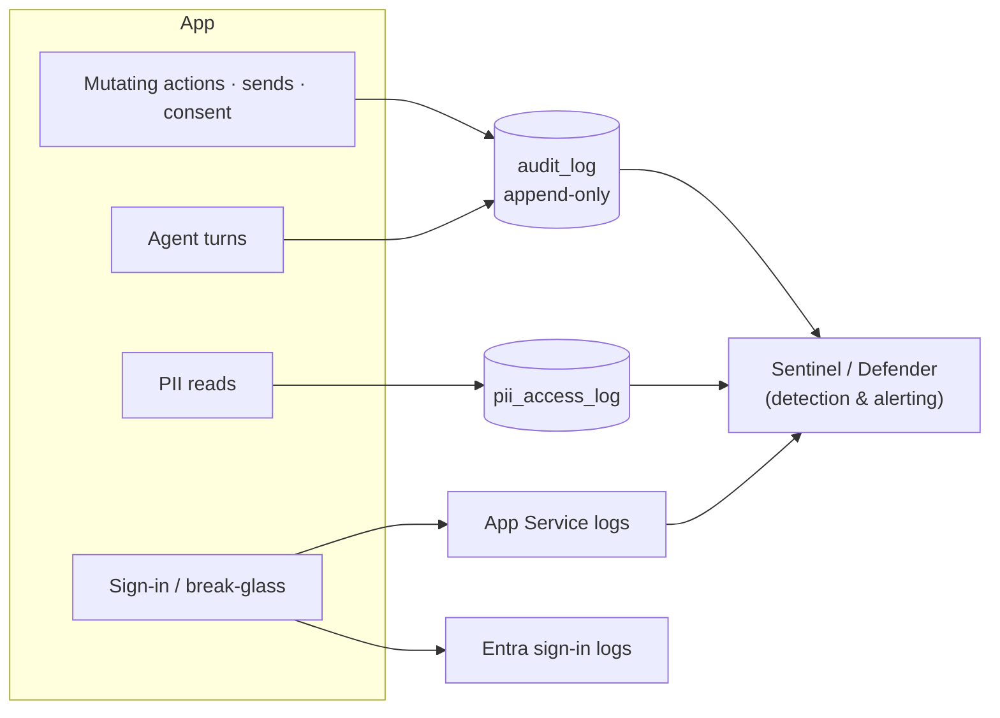

# Logging & monitoring

What **Imperion OS** records, where the record lands, and how the platform
is watched. The governing invariant — **"audit everything that acts"** — is in
[unified-security-standard](unified-security-standard.md) §4 (referenced, not restated).

[← Security](README.md) · [Documentation library](../README.md) ·
[unified-security-standard](unified-security-standard.md) ·
[incident-response](incident-response.md)

---

## The invariant

> **Audit everything that acts.** Agent turns (inputs, tool calls, model, tokens, cost,
> acting user), credential writes, sends, and DB migrations land in `audit_log` /
> structured logs. Approval-gated actions (sends, consent, permissions, billing) are
> *proposed* by agents and **executed only after human approval.**
> — [unified-security-standard](unified-security-standard.md) §4

The point of the audit trail is **non-repudiation**: anything that mutates state or
touches sensitive data leaves a record of *who* did *what*, *when*.

---

## What gets recorded, and where

| Event | Where it lands | Notes |
| --- | --- | --- |
| **Mutating server actions** | Structured logs / `audit_log` | Each write is authorization-gated first (`requireCapability`, ADR-0095). |
| **Agent turns** | `audit_log` (`agent.turn`) | Inputs, tool calls, model, tokens, cost, acting user — agents inherit the user's scope. |
| **Credential writes & sends** | `audit_log` | Approval-gated; consent re-asserted at execution for sends. |
| **Consent changes** | `consent_event` (append-only ledger) | Never updated or deleted — a change of mind is a new event ([data-governance](../data-governance/README.md)). |
| **PII reads** | `pii_access_log` | PII columns are flagged; access is logged (ADR-0095, from ADR-0016). |
| **DB migrations** | `audit_log` / ops log | Applied with an Entra token, separately from deploys ([deployment](../deployment/README.md)). |
| **Sign-in success/failure** | Entra sign-in logs (+ Sentinel) | The IdP is the source of truth for authentication events. |
| **Break-glass use** | App Service logs / Sentinel | `[SECURITY] Break-glass sign-in used …` — **alert on this line** (ADR-0095 M1). |

> The audit and consent ledgers are **append-only by design** — they are evidence, so
> they are never edited in place.

---

## Monitoring & detection

- **Sentinel / Defender** are the SIEM/XDR layer (CLAUDE.md §3): they ingest the logs
  above for detection and alerting. The platform's own *security-posture* telemetry
  (Secure Score, Defender incidents/alerts, Entra/Intune policies) is also ingested as
  bronze and surfaced in the Reporting BI hub's security-fleet section.
- **Entra sign-in logs** carry authentication anomalies (impossible travel, MFA
  failures, Conditional-Access blocks).
- **The must-have alert:** the **break-glass audit line**. Break-glass is a deliberate
  backdoor; any use is a security event that an operator must see immediately
  ([incident-response](incident-response.md)).

---

## What must never be logged

- **No secret values.** Keys, tokens, connection strings, and password hashes never
  appear in logs (CLAUDE.md §5; [secrets-management](secrets-management.md)).
- **No row-level client PII in issues/PRs/commits.** Production data has client PII —
  aggregate or redact before it leaves the system (system CLAUDE.md §8).
- Break-glass authentication logs **the event**, never the password (plaintext is never
  stored or logged — ADR-0095 M1).

---

## See also

[unified-security-standard](unified-security-standard.md) ·
[incident-response](incident-response.md) ·
[data-governance](../data-governance/README.md) ·
[compliance](../compliance/README.md) ·
[deployment](../deployment/README.md)
