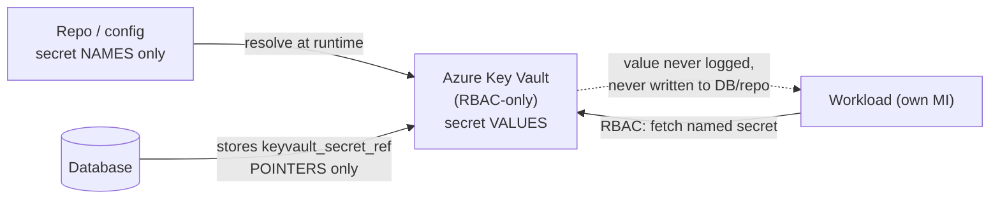

# Secrets management

How secret material is custodied, referenced, and kept out of everywhere it must not be.
This page is the **conceptual model**; the exact rotation keystrokes (inventory, cadence,
compromise quick-reference) live in the
[secrets-rotation runbook](../operations/secrets-rotation-runbook.md). The binding rules
are in [unified-security-standard](unified-security-standard.md) §4 — **referenced here,
never restated**.

[← Security](README.md) · [Documentation library](../README.md) ·
[unified-security-standard](unified-security-standard.md) ·
[secrets-rotation runbook](../operations/secrets-rotation-runbook.md)

---

## The bright line: names vs. values

The single most important rule:

> **Secret *names* may live in config. Secret *values* never leave Key Vault.**
> **Never commit secrets** — no key, token, connection string, or password hash in the
> repo, in App Service settings *values*, or in logs (CLAUDE.md §5).

- **Repo & config** hold only the *names* of secrets (e.g. an app-setting whose value is
  a Key Vault reference, or a provider's secret *name*).
- **The database** holds only `keyvault_secret_ref` **pointers** — never the secret
  itself (e.g. per-user OAuth tokens are custodied in Key Vault by the backend; the DB
  row points at them).
- **Workloads** fetch a *specific named secret* via Key Vault RBAC (*Secrets User*).
  **Vault enumeration is never required** — readers ask for the secret they need.

---

## Where secrets live (custody map)

Custody follows the four-repo division of labor (system CLAUDE.md §1): **the front end
holds no AI key and no integration secret.** Almost everything is in Azure Key Vault
`kv-imperioncrm-prd` or as Entra-side credentials; the on-prem host holds only what it
must, behind a non-exportable machine certificate.

| Secret class | Owner | Custody |
| --- | --- | --- |
| Source API keys, OAuth tokens, AI provider keys | Backend (writes) / workloads (read) | Key Vault `kv-imperioncrm-prd`; DB stores only `keyvault_secret_ref`. |
| The web app's Entra credential | Web app | **Certificate client assertion** — public half on the app registration, private PFX on the host / Key Vault; *there is no shared secret to leak* ([identity-and-authentication](identity-and-authentication.md)). |
| Database access | Every workload | **No stored password** — Postgres is Entra-only; each connection mints a short-lived Entra token. |
| Break-glass account | Operator | `BREAKGLASS_PASSWORD_HASH` (SHA-256) — a *hash*, not the password; ideally sourced from Key Vault; treated as a root password. |
| On-prem unattended secrets | Local pipeline | A non-exportable machine certificate CMS-decrypts the SecretStore vault password; the same cert is the Entra app credential (local-pipeline ADR-0002). No plaintext at rest. |

The full per-secret inventory (who, where, cadence, compromise steps) is the
[secrets-rotation runbook](../operations/secrets-rotation-runbook.md).

---

## Key Vault is RBAC-only

- **Authorization is RBAC, not access policies.** *Secrets User* (read) by default;
  **write roles only for the backend**, which owns credential storage.
- **Readers fetch named secrets** — no `list`/enumerate is needed or granted.
- Key Vault **soft-delete / purge protection** protects against accidental or malicious
  deletion ([disaster-recovery](../disaster-recovery/README.md)).

---

## Why certificate, not a client secret

The web app authenticates to Entra with a signed `private_key_jwt` **client assertion**:

- The repo is public — a certificate means **there is no secret to leak**.
- Assertions are **short-lived (~10 min)** and single-use (`jti`); the private key never
  enters source control.
- A future hardening step is **managed identity / workload-identity federation** to
  remove the certificate from App Service entirely (tracked in
  [identity-and-authentication](identity-and-authentication.md) and ADR-0095 future
  considerations).

---

## What "rotation" means here

Rotation is a **security event** — record it (date + operator) in the ops log; rotations
that touch production auth/infra are **Mark-gated**. The model:

1. Mint/issue the new secret (or certificate).
2. Store the new **value** in Key Vault (or upload the new cert's **public** half to the
   app registration).
3. Point config/DB at the new **name/reference** if the name changed.
4. Verify the workload picks it up; then retire the old value.

Step-by-step procedures, the cadence table, and the suspected-compromise
quick-reference: **[secrets-rotation runbook](../operations/secrets-rotation-runbook.md)**.

> **Known stale artifact:** the Key Vault `Postgres-Password` (break-glass admin) fails
> auth and is on the pre-go-live rotation list (system CLAUDE.md §8). Day-to-day DB
> access uses Entra tokens, so this does not affect normal operation.

---

## Checklist for adding a new secret

- [ ] Put the **value** in Key Vault — never in the repo, an app-setting value, or a log.
- [ ] Store only a **name / reference / `keyvault_secret_ref`** in config or the DB.
- [ ] Grant the consuming workload **read** on that named secret (RBAC, *Secrets User*).
- [ ] Add it to the [secrets-rotation runbook](../operations/secrets-rotation-runbook.md)
      inventory with an owner and a cadence.
- [ ] Confirm nothing secret appears in logs (CLAUDE.md §5).

---

## See also

[unified-security-standard](unified-security-standard.md) §4 ·
[identity-and-authentication](identity-and-authentication.md) ·
[secrets-rotation runbook](../operations/secrets-rotation-runbook.md) ·
[logging-and-monitoring](logging-and-monitoring.md) ·
[disaster-recovery](../disaster-recovery/README.md)
