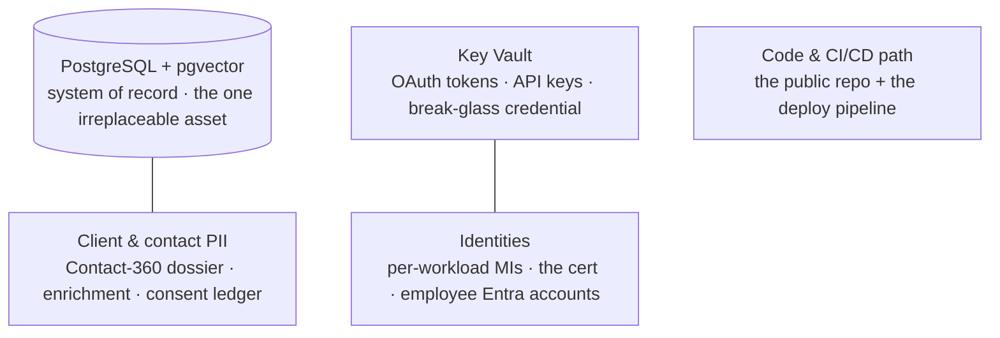
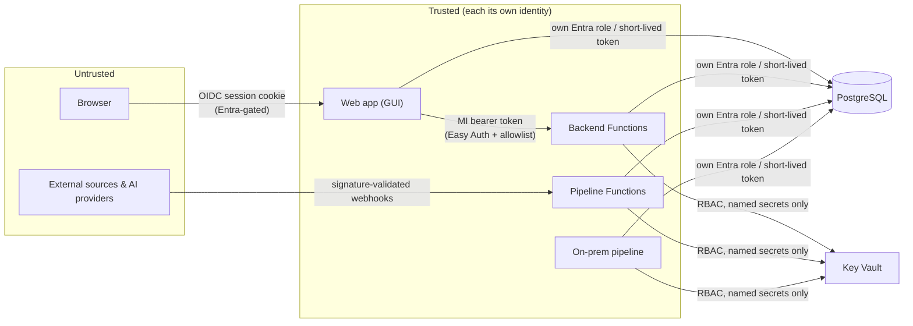

# Threat model

What **Imperion Business Manager** protects, who we assume is attacking it, where the
trust boundaries are, and how each documented control answers a specific threat. This
is a reference that *organizes* the controls defined elsewhere — it does not invent new
ones. Every control named here is decided in the
[unified-security-standard](unified-security-standard.md) or an ADR, and is
**referenced, never restated**.

[← Security](README.md) · [Documentation library](../README.md) ·
[unified-security-standard](unified-security-standard.md) ·
[data-governance](../data-governance/README.md)

---

## Posture & assumptions ("Mythos Proof")

The security posture (CLAUDE.md §5) assumes the *hard* case, not the easy one:

- **Continuous, AI-assisted attack** — adversaries automate reconnaissance and
  exploitation; controls cannot rely on obscurity.
- **Credential theft is likely** — so a stolen credential must buy as little as
  possible (least privilege, short-lived tokens, no standing passwords).
- **Supply-chain compromise is in scope** — dependencies and the CI/CD path are
  attack surface.
- **Insider threat is in scope** — least privilege and audit apply to *employees* too,
  not just outsiders.
- **There is no private network.** Private networking was deliberately deferred for
  cost ([unified-security-standard](unified-security-standard.md) §1/§3); the perimeter
  is **identity**, and the controls below must hold without a network moat.

---

## What we protect (assets, ranked)

| Asset | Why it matters | Primary protection |
| --- | --- | --- |
| **PostgreSQL** (system of record, embeddings, agent memory) | Irreplaceable — external systems are *referenced*, not owned. | Entra-only auth, per-principal roles with table-scoped GRANTs, automated backups + test restore ([disaster-recovery](../disaster-recovery/README.md)). |
| **Client / contact PII** | Legal + reputational exposure; the dossier aggregates a lot. | Tagged + access-logged (`pii_access_log`), consent-gated outbound, lawful-basis per fact ([data-governance](../data-governance/README.md)). |
| **Secret material** (OAuth tokens, source keys, AI keys, break-glass) | A stolen secret is a foothold into client tenants / spend. | Key Vault is the only store; DB holds only `keyvault_secret_ref` pointers; constant-time-compared break-glass hash ([secrets-management](secrets-management.md)). |
| **Identities** (MIs, the cert, employee accounts) | Identity *is* the perimeter; an identity is the keys. | One workload = one identity, never shared; cert (no shared secret); Entra MFA/Conditional Access for humans. |
| **Code & the CI/CD path** | The repo is public; the deploy pipeline reaches prod. | No secrets in repo; OIDC-federated deploy (no deployment secret in GitHub); dependency scanning; docs-as-a-control. |

---

## Adversaries

| Adversary | Goal | What stops them |
| --- | --- | --- |
| **External, automated** | Reach data via an exposed endpoint. | No anonymous access — every inbound path is Entra-authenticated, session-authenticated, or signature-validated; webhooks fail closed. |
| **Credential thief** | Reuse a stolen secret/token. | Short-lived Entra tokens, no standing DB password, per-principal least privilege, Key Vault RBAC. |
| **Malicious / careless insider** | Read or change beyond their role. | Five-role RBAC, fail-closed write-capability gate on every action, server-side revenue/PII redaction, audit log ([authorization-model](authorization-model.md) / ADR-0095). |
| **Supply-chain attacker** | Inject via a dependency or the pipeline. | Dependency scanning, OIDC deploy (no long-lived deploy secret), build-from-source standalone bundle ([deployment](../deployment/README.md)). |
| **Compromised connected account** | Abuse an OAuth grant. | Tokens custodied in Key Vault (never the DB); per-user connections; disconnect revokes custody first. |

---

## Trust boundaries

The authoritative boundary picture (with identities and protocols) is
[unified-security-standard](unified-security-standard.md) §1. Summarized:

Crossing a boundary always requires proving identity:

- **Browser → web app:** HTTP-only session cookie, gated by `src/middleware.ts`; no
  view renders without an authenticated session.
- **Web app → backend:** the web app's managed-identity bearer token; the backend
  enforces Easy Auth + a caller allowlist (backend ADR-0035) — the browser never calls
  the backend directly.
- **External → pipeline:** webhooks are **signature-validated and fail closed** on
  mismatch; per-client M365 ingestion fails closed when a tenant is not in the
  onboarding-app registry.
- **Any workload → Postgres / Key Vault:** the workload's *own* identity, a short-lived
  token, least-privilege role, named secrets only (no vault enumeration).

---

## STRIDE → control map

| Threat (STRIDE) | Concrete risk here | Control (referenced) |
| --- | --- | --- |
| **Spoofing** | Impersonate a user or a workload. | Entra OIDC + MFA for humans; certificate client assertion for the web app (no shared secret); one identity per workload, never shared. |
| **Tampering** | Alter data without authority. | Fail-closed `requireCapability` on every write (ADR-0095); idempotency by content hash on ingestion; append-only consent ledger. |
| **Repudiation** | Deny having acted. | `audit_log` / `pii_access_log` / structured logs record agent turns, credential writes, sends, migrations, break-glass use ([logging-and-monitoring](logging-and-monitoring.md)). |
| **Information disclosure** | Leak PII / revenue / secrets. | Server-side revenue & comp redaction before render; PII access-logged; secrets only in Key Vault, never repo/DB/logs; TLS everywhere (verified). |
| **Denial of service** | Exhaust the app or run up AI spend. | Costed AI operations are admin-only (`agents:operate`); orchestrator budget cap; platform-managed App Service. |
| **Elevation of privilege** | Gain admin / cross-role write. | `DEFAULT_ROLE='support'`, fail-closed bootstrap, no agent superuser (agents inherit the user's scope), break-glass off-by-default + audited. |

---

## Residual risks (tracked, not hidden)

- **No row-level / owner scoping yet.** A role that *may* write a domain may write *any*
  object in it (IDOR within a domain). Tracked in ADR-0095 (from ADR-0016/0045);
  `owner_user_id` exists in the schema for the future second layer.
- **No private network.** Mitigated by the identity-as-perimeter rules; the future
  tier adds VNet + private endpoints *on top of*, never instead of, them
  ([unified-security-standard](unified-security-standard.md) §3).
- **Deferred secret rotation.** A pre-go-live rotation pass is tracked
  ([secrets-rotation runbook](../operations/secrets-rotation-runbook.md)); some
  artifacts (e.g. the break-glass Key Vault `Postgres-Password`) are flagged stale.

---

## See also

[unified-security-standard](unified-security-standard.md) ·
[authorization-model](authorization-model.md) ·
[secrets-management](secrets-management.md) ·
[logging-and-monitoring](logging-and-monitoring.md) ·
[incident-response](incident-response.md) ·
[data-governance](../data-governance/README.md) ·
[disaster-recovery](../disaster-recovery/README.md)
