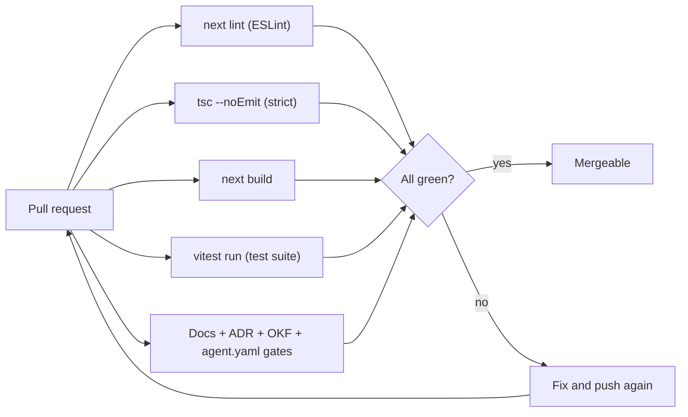

# ✅ Testing

How Imperion Business Manager stays correct — the automated gates that run on every
change, and the strategy behind them. This is the onboarding entry point; the deeper
reasoning, conventions, and how-to live in
**[testing-strategy](testing-strategy.md)**.

[← Documentation library](../README.md) ·
[Testing strategy](testing-strategy.md) ·
[Deployment](../deployment/README.md)

---

## The short version

Every change is proven **mechanically** before it can merge. There is no "works on my
machine" — local installs are sometimes blocked on dev machines, so the source of truth is
**CI** and the **deployed app**. If CI is green, the change passed lint, the strict
type-checker, the production build, the full unit/integration test suite, and the docs
gates.



---

## What runs on every PR

The gates are defined in `.github/workflows/ci.yml` and enforced by the main-branch
ruleset (`build`, `test`, and `docs` are **required** status checks — #188, v1 gate 11).

| Gate | Command | What it protects |
| --- | --- | --- |
| **Lint** | `npm run lint` (`next lint`) | Style + a class of correctness rules. |
| **Typecheck** | `npm run typecheck` (`tsc --noEmit`) | Strict TypeScript — the first line of defense. |
| **Build** | `npm run build` (`next build`) | The app actually compiles for production. |
| **Test** | `npm test` (`vitest run`) | The unit + integration suite passes. |
| **Docs** | `node scripts/*` | Required `/docs` structure, ADR index, OKF semantic-layer sync, and agent.yaml manifests. |

The **docs gate** is a real test, not a formality: it fails the PR if a required `docs/`
directory is missing, if the ADR index is out of date (`scripts/adr-index.mjs --check`,
ADR-0090), if a silver-table migration lands without updating its OKF concept file
(#535), or if a workspace `agent.yaml` manifest is malformed.

---

## The test suite at a glance

The suite is built on **Vitest**. As of this writing it spans **~111 test files** and
**~1,000+ test cases** across the data layer, server actions, libraries, and component
logic. Run the whole thing with:

```bash
npm test           # vitest run — the CI command (one-shot)
npm test -- --watch   # local watch mode while developing
```

> Counts grow with every feature; treat the numbers above as a snapshot, not a target.
> The authoritative count is whatever `vitest run` reports in CI on the current `main`.

---

## Strategy in one paragraph

**Type safety first** — strict mode plus typed repositories catch a large class of bugs
before a test ever runs. **Verify against the real thing** — because local dev is
sometimes unavailable, correctness is established in CI and confirmed on the deployed
app, not on a developer laptop. **Tests ship with the change** — a feature is not done
until code, tests, and docs land together (CLAUDE.md §8). The fuller picture — what we
test at each layer, how to write a good test here, and what is deliberately out of scope
today — is in [testing-strategy](testing-strategy.md).

---

## See also

- [Testing strategy](testing-strategy.md) — the layered approach, conventions, and gaps.
- [Deployment](../deployment/README.md) — the CI/CD pipeline these gates feed.
- [Unified security standard](../security/unified-security-standard.md) — the security
  baseline every change conforms to (referenced, never restated).
