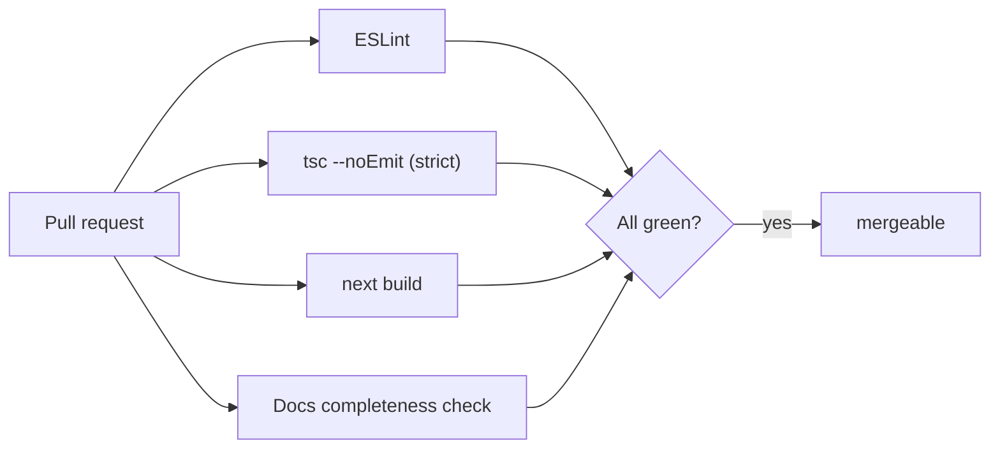

# ✅ Testing

How we keep the platform correct — the gates that run on every change, and the strategy
behind them.

[← Documentation library](../README.md)

## What runs on every PR

CI (`.github/workflows/ci.yml`) blocks merge unless **lint, typecheck, build, and the
docs check** all pass. Strict TypeScript is the first line of defense.

## Strategy (to expand)

- **Type safety first:** strict mode + typed repositories catch a large class of bugs
  before runtime.
- **Verify against the real app:** because local installs are sometimes blocked on dev
  machines, changes are validated in **CI** and on the deployed app.
- Unit/integration/e2e coverage and targets to be defined as the test suite grows.

See also: [deployment](../deployment/README.md) (the CI/CD gates).
