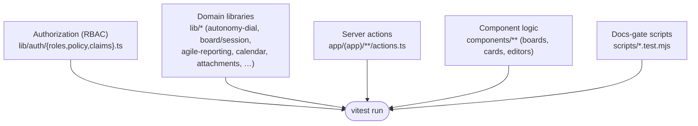

# Testing strategy

> **Audience:** anyone writing or reviewing code in this repo. This explains *how*
> Imperion OS is tested, *why* it is tested that way, and what is
> deliberately out of scope today. For the one-screen summary and the gate table, start
> at the [testing README](README.md).

[← Testing](README.md) · [Documentation library](../README.md) ·
[Deployment](../deployment/README.md)

---

## 1. Principles

1. **Type safety is the first test.** Strict TypeScript (`tsc --noEmit`) plus typed
   repositories eliminate a large class of bugs before any runtime test executes. A red
   typecheck is a failing build — there is no `any`-escape-hatch culture here.
2. **CI and the deployed app are the source of truth, not a laptop.** Local installs are
   sometimes blocked on dev machines, so correctness is *established* in CI and
   *confirmed* on the live app (`imperioncrm.azurewebsites.net`). "It worked locally" is
   not evidence; a green CI run is.
3. **Tests ship with the change.** A feature is not done until code, tests, and docs land
   in the same PR (CLAUDE.md §8). Reviewers can — and do — ask for tests before approving.
4. **Test the boundary that matters.** The front end is GUI-only (ADR-0042); the highest
   value tests cover **authorization** (who can do what), **domain rules** (the logic the
   server actions enforce), and the **gates that protect the docs canon** — the places a
   mistake is most expensive.

---

## 2. The toolchain

| Tool | Role |
| --- | --- |
| **Vitest** | The test runner. `npm test` → `vitest run` (one-shot, the CI command). |
| **TypeScript (strict)** | `npm run typecheck` → `tsc --noEmit`. Compile-time correctness. |
| **ESLint** | `npm run lint` → `next lint`. Style + lint-level correctness rules. |
| **Next build** | `npm run build` → `next build`. Proves the app compiles for production. |
| **Docs gate scripts** | `scripts/adr-index.mjs`, `scripts/agent-yaml-gate.mjs`, the OKF semantic-layer gate, and the required-structure check. |

Vitest configuration lives in `vitest.config.ts`:

- **Environment:** `node` — the units under test are pure (they read only `process.env`),
  so no DOM/jsdom is needed.
- **Include globs:** `src/**/*.test.ts` (the application suites) **and**
  `scripts/**/*.test.mjs` (the docs-gate scripts are themselves tested — the gate that
  guards the OKF bundle, #535, has its own tests).
- **Path alias:** `@/` resolves to `./src`, mirroring `tsconfig` paths.

---

## 3. What we test, by layer

Tests live **next to the code they cover** as `*.test.ts` files (co-located, not in a
separate tree). The suite spans roughly these layers:

- **Authorization / RBAC** (`src/lib/auth/`) — the role, policy, and claims logic is
  stress-tested (the original purpose of the Vitest suite, ADR-0045). Permission gates are
  the most security-sensitive code in a GUI, so they get the most scrutiny.
- **Domain libraries** (`src/lib/`) — pure logic such as the autonomy dial, board
  deliberation, agent cost roll-ups, agile reporting, calendar math, and attachment rules.
  These are the easiest to test well (pure in, pure out) and carry a lot of business
  meaning.
- **Server actions** (`src/app/(app)/**/actions.ts`) — the write paths the UI invokes
  (accounts, campaigns, collections, contacts, notifications, tasks, settings, …). These
  enforce validation and permissions before anything reaches the backend or DB.
- **Component logic** (`src/components/`) — the non-trivial behavior inside boards
  (projects, tasks, kanban), cards, and editors — the parts where a logic bug would be
  user-visible.
- **Docs-gate scripts** (`scripts/`) — the automation that keeps the canon honest is
  tested so the gate cannot silently rot.

---

## 4. Writing a good test here

- **Co-locate it.** `foo.ts` → `foo.test.ts` in the same folder. The include glob picks it
  up automatically.
- **Keep it pure where possible.** Prefer testing extracted logic over wiring; the
  `node` environment means no DOM is available by default.
- **Use the `@/` alias** for imports, the same as production code.
- **Name behavior, not implementation.** A test title should read like a sentence about
  what the system guarantees ("denies a non-admin from convening the board"), so a failure
  tells the next reader *what broke*, not *which line*.
- **Run it the CI way before pushing:** `npm test` (one-shot). If you cannot run locally,
  push to a branch and let CI be the arbiter — that is the intended workflow here.

---

## 5. The docs gates are tests too

CI's `docs` job is a required check and behaves like a test suite for the documentation
canon. It fails a PR when:

- a required `docs/` subdirectory is missing (the structure CLAUDE.md §8 mandates);
- the ADR index is stale or has malformed frontmatter (`scripts/adr-index.mjs --check`,
  ADR-0090);
- a migration changes a silver table that has an OKF concept file, but the PR does not
  update that concept file in the same change set (#535, ADR-0086) — escape hatch:
  the `semantic-layer-not-affected` label;
- a workspace `agent.yaml` manifest is invalid (`scripts/agent-yaml-gate.mjs`).

Treat a red docs gate exactly like a red unit test: fix the cause, do not bypass it.

---

## 6. Scope today, and what is next

What is **in place** today: strict typechecking, lint, production build, a substantial
Vitest suite concentrated on RBAC + domain logic + server actions + component logic, and
the docs gates — all required before merge.

What is **deliberately not yet here** (tracked, not forgotten):

- **End-to-end / browser tests.** There is no Playwright/Cypress layer yet; user-visible
  behavior is confirmed against the deployed app today. An e2e layer is a natural next
  investment as flows stabilize.
- **Formal coverage targets.** Coverage is grown by adding tests with each feature rather
  than chased to a number; explicit thresholds will be set as the suite matures.
- **Load / performance testing.** Out of scope for the current internal-tool stage.

When any of these lands, it ships with its own doc update here (docs-as-code, CLAUDE.md
§8).

---

## See also

- [Testing README](README.md) — the gate table and the at-a-glance summary.
- [Deployment](../deployment/README.md) — the CI/CD pipeline these gates feed into.
- [Decision records](../decision-records/README.md) — ADR-0045 (RBAC suite), ADR-0090
  (ADR index gate), ADR-0086 (OKF semantic layer).
