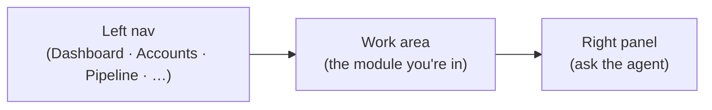

# 📖 User Guides

How employees actually use Imperion CRM, module by module. Written for the person
doing the work, not the person who built it.

[← Documentation library](../README.md)

## The shape of the app

Three columns: navigate on the left, work in the middle, **ask the agent** on the
right (scoped to your Entra permissions).

## Written guides

- [Sales Activity — the Sales Queue](sales-activity.md): work your open sales
  tasks by due date and deal; create and complete them in place.
- [Task board — the kanban view](task-board.md): drag tasks between
  Open / In progress / Done; the drop saves the status.
- [Task calendar — the month view](task-calendar.md): see tasks on a month grid
  by due date; drag a task to another day to reschedule it.
- [Task saved views](task-saved-views.md): switch List / Board / Calendar with
  your filters intact, and name + recall a filter set as a per-user saved view.
- [Project board — the kanban view](project-board.md): drag projects across
  Not started / In progress / Blocked / Complete; the drop saves the status.
- [Delivery templates](delivery-templates.md): author the reusable provisioning
  playbooks a won opportunity is provisioned from (ADR-0081).
- [Delivery board](delivery-board.md): see + steer provisioned delivery projects —
  per-task ticket-fire state, schedule / fire-now controls, the contract gate, and
  the Autotask drill-in (ADR-0080 §4/§7).
- [Portfolio rollup](portfolio-rollup.md): every project on one screen with its
  rolled-up health + next milestone; filter by account/owner/type/health and
  export to CSV (ADR-0069 D5).
- [Company security posture](security-posture.md): read a company's posture —
  per-tenant secure score, policy classification, **DNS governance** (per-domain
  verdict + record drift, ADR-0063), and credential exposures.

## Walkthroughs to write

The features below are **built and live**; the step-by-step guides for them are the
to-do here.

- **Know a contact:** open a contact → read the dossier, timeline, and consent before you call.
- **Run a discovery call:** review the agent-gathered answers, confirm/stamp, set the verdict, route to assessment or nurture.
- **Launch a campaign:** create a campaign, build an audience over the dossier, see who's ad-eligible, launch.
- **Build an ad:** on a campaign, **+ Ad** opens the structured creative builder — headline, body, image ref, CTA, landing URL, UTM — with a live ad-card preview and an audience picker that shows the ad-eligible (ad_targeting opt-in) count (ADR-0053 §3 / ADR-0026; the push to Meta is a backend slice — nothing leaves the building yet).
- **Run an event:** build a webinar (Teams link) or live event (venue) in Events, point a campaign at it, watch registrations land in the capture inbox (ADR-0053; registration/attendance flow ships with #230).
- **Auto-enroll responders:** pick a workflow on the campaign or event builder; when a capture attributed to that campaign (hook config names the campaign) or an event registration resolves to a contact, the contact auto-enrolls in the workflow — once per active enrollment, audit-logged, silent no-op when no workflow is set (ADR-0053 §4, #112).
- **Schedule a blast:** compose an email ({{merge_fields}} + preview) or SMS (segment counter) send on a campaign; schedule absolute or relative to the linked event; consent is enforced at fire time per recipient (ADR-0053 §4–§5 — nothing fires until the backend executor is live).
- **Connect your accounts:** link your M365/LinkedIn/YouTube so your comms flow in. *(UI built; the live OAuth pull is the next phase.)*

The motion behind these is the [customer-lifecycle](../architecture/customer-lifecycle.md);
admin-side configuration is in [admin-guides](../admin-guides/README.md).
