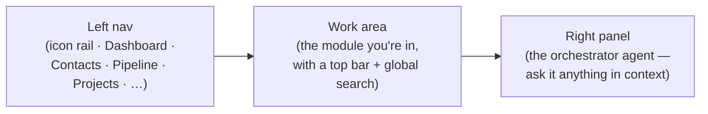

# 📖 User Guides

How employees actually use **Imperion Business Manager**, module by module. Written
for the person doing the work — a new hire on day one — not the person who built it.

[← Documentation library](../README.md) ·
[Capability overview](../product/imperion-business-manager-overview.md) ·
[Customer lifecycle](../architecture/customer-lifecycle.md) ·
[Admin guides](../admin-guides/README.md)

> **New here?** Read the
> [capability overview](../product/imperion-business-manager-overview.md) first for
> the big picture — what the platform is and the four families (CRM · ERP · extras ·
> AI). Then come back here for the screen-by-screen how-to.

---

## The shape of the app

Every page is the same three columns. You **navigate** on the left, **work** in the
middle, and **ask the agent** on the right.

- **Left nav** — a collapsible 64px icon rail. Click an icon to open a module; it
  remembers whether you left it collapsed.
- **Work area** — the module you opened, with a top bar carrying the page title, a
  **global search** (wired to Knowledge), and the graph-sync indicator.
- **Right panel** — the single **orchestrator agent**. It is the only agent you talk
  to; everything it does on your behalf is scoped to your Entra permissions, so it can
  never show you or change something your role can't.

**One rule runs through every screen below:** *reads are broad, writes are gated.*
You can usually open and read a surface; creating, editing, moving, or sending is
checked against your role server-side, so a control you aren't allowed to use either
doesn't render or is refused even if you force it. Revenue figures (MRR, deal value,
fees, quota) are redacted for roles that can't see money. None of this is restated
here per surface beyond what you need — the cross-repo baseline is the
[unified security standard](../security/unified-security-standard.md) (referenced,
never restated).

---

## CRM — the customer-facing motion

Find people, build relationships, and move deals. This is the demand-to-relationship
half of the platform; the full motion is the
[customer lifecycle](../architecture/customer-lifecycle.md).

- **[Leads & capture inbox](leads-capture.md)** — work inbound people who haven't
  signed yet: the leads list, the capture inbox fed by hooks, and resolving a capture
  into a real contact + nurture.
- **[Contacts & the Contact 360](contacts-360.md)** — every person, with the 360
  detail view: dossier, the unified communications timeline, per-contact consent, and
  the message composer (consent-gated email/SMS).
- **[Accounts & the Company 360](accounts-360.md)** — the companies your people belong
  to, with the Imperion Secure Score, DNS posture, integration health, and the
  company-wide timeline.
- **[Sales pipeline](sales-pipeline.md)** — the two interactive boards: contacts by
  lifecycle stage and deals by sales stage. Move a card to advance it; drill into the
  Deal 360.
- **[Discovery calls](discovery-calls.md)** — log a discovery call, review the
  agent-gathered answers, confirm them, set the verdict, and route the prospect to an
  assessment or to nurture.
- **[Security Readiness Assessments](assessments.md)** — the paid AI Security
  Readiness Assessment: the six-dimension scorecard, the client-ready report, evidence
  capture, and converting a finished assessment into a project, opportunity, or ticket.
- **[Proposals & e-signature](proposals.md)** — author a proposal and read its
  DocuSign signature state (see also the focused
  [signature-status](signature-status.md) panel guide).
- **[Conversations on the 360](conversation-panel.md)** — read a company's, contact's,
  or deal's call & meeting intelligence — summary, action items, sentiment,
  objections, and deal-risk from transcribed voice. Read-only.
- **[Sales Activity — the Sales Queue](sales-activity.md)** — work your open sales
  tasks by due date and deal; create and complete them in place, and log a sales
  meeting.
- **[Segments](segments.md)** — build reusable CRM contact sets (manual, bulk, or
  rule-based) — the enrollment source for journeys and a building block for comms and
  list views. Marketing-gated; distinct from ad audiences.

## ERP — running the work and the money

Once a deal is won, the same platform runs delivery, projects, and employee finance.

### Delivery & projects

- **[Project board — the kanban view](project-board.md)** — drag projects across
  configurable status columns; group and swimlane by status / type / account / owner;
  the drop saves the status.
- **[Portfolio rollup](portfolio-rollup.md)** — every project on one screen with its
  rolled-up health and next milestone; filter and export to CSV.
- **[Goals & OKRs](goals-okrs.md)** — measurable objectives above projects, with
  progress rolled up (weighted) from their linked projects and tasks, or set manually.
- **[Delivery templates](delivery-templates.md)** — author the reusable provisioning
  playbooks a won opportunity is provisioned from.
- **[Delivery board](delivery-board.md)** — see and steer provisioned delivery
  projects — per-task ticket-fire state, schedule / fire-now controls, the contract
  gate, and the Autotask drill-in.

### Tasks

- **[Task board — the kanban view](task-board.md)** — drag tasks between configurable
  status columns; group, swimlane, and set WIP limits.
- **[Task calendar — the month view](task-calendar.md)** — see tasks on a month grid
  by due date; drag a task to another day to reschedule it.
- **[Task saved views](task-saved-views.md)** — switch List / Board / Calendar with
  your filters intact, and name + recall a filter set as a per-user saved view.

### Employee finance

- **[My Timesheets](timesheets.md)** — log and attest your weekly Mon–Sun time, with
  the reconciliation memory-jogger against Autotask ticket time.
- **[My Expenses](expenses.md)** — log and attest your monthly expense report —
  mileage (MileIQ) and out-of-pocket items, receipts — and watch it move through
  approval to reimbursement.
- **[Monthly Close](monthly-close.md)** — *(finance / admin)* the one surface that
  rolls up both legs (time + reimbursable expense) per employee per month, with the
  QuickBooks read-back. The app never pays.

### Service operations

- **[Omnichannel queue](omnichannel-queue.md)** — one prioritized inbound queue
  unifying chat sessions + tickets across channels.
- **[Service Desk — live chat agent console](service-desk-live-chat.md)** — work
  active chat sessions — transcript, deflection telemetry, agent reply, and idempotent
  escalate-to-Autotask; plus the embeddable customer chat widget.

## Extras — beyond classic CRM/ERP

- **[Forecast](forecast-view.md)** — weighted pipeline, category rollup
  (commit / best-case / pipeline), and attainment vs quota on the Reporting hub.
  Revenue-gated.
- **[Company security posture](security-posture.md)** — read a company's posture:
  per-tenant secure score, policy classification, DNS governance (per-domain verdict +
  record drift), and credential exposures.

---

## Conventions used in these guides

- **Where (route)** — every guide names the left-nav path *and* the direct URL, e.g.
  *left nav → **Contacts**, route `/contacts`*.
- **Who can do what** — each guide states which capability (e.g. `crm:write`,
  `sales:write`, `comms:write`, `delivery:write`) gates each action and which roles
  hold it.
- **Honest empty states** — many surfaces depend on a backend or pipeline process
  that wires up later. Where a feature is built but its live data is *dormant until
  credentials land*, the guide says so plainly — the page shows an honest empty state,
  it never breaks.
- **Diagrams** are Mermaid, rendered right in GitHub.

## Where to go next

- **Admins** configuring roles, statuses, connectors, templates, and finance setup:
  [admin-guides](../admin-guides/README.md).
- **The automation behind the motion** (nurture, pre-discovery, journeys):
  [workflows](../workflows/README.md).
- **The consent gate on every outbound send**:
  [data-governance](../data-governance/README.md).
- **The full AI suite** (the orchestrator, sub-agents, ICM, the autonomy dial):
  [agents](../agents/README.md).
- **The whole four-repo estate**:
  [system-of-systems](../architecture/system-of-systems.md).
