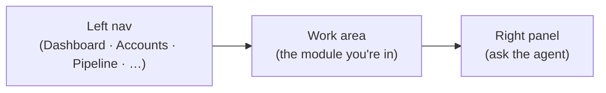

# 📖 User Guides

How employees actually use Imperion CRM, module by module. Written for the person
doing the work, not the person who built it.

[← Documentation library](../README.md)

## The shape of the app

Three columns: navigate on the left, work in the middle, **ask the agent** on the
right (scoped to your Entra permissions).

## Written guides

- [Sales Activity — the Sales Queue](sales-activity.md): work your open sales
  tasks by due date and deal; create and complete them in place.

## Walkthroughs to write

The features below are **built and live**; the step-by-step guides for them are the
to-do here.

- **Know a contact:** open a contact → read the dossier, timeline, and consent before you call.
- **Run a discovery call:** review the agent-gathered answers, confirm/stamp, set the verdict, route to assessment or nurture.
- **Launch a campaign:** create a campaign, build an audience over the dossier, see who's ad-eligible, launch.
- **Run an event:** build a webinar (Teams link) or live event (venue) in Events, point a campaign at it, watch registrations land in the capture inbox (ADR-0053; registration/attendance flow ships with #230).
- **Schedule a blast:** compose an email ({{merge_fields}} + preview) or SMS (segment counter) send on a campaign; schedule absolute or relative to the linked event; consent is enforced at fire time per recipient (ADR-0053 §4–§5 — nothing fires until the backend executor is live).
- **Connect your accounts:** link your M365/LinkedIn/YouTube so your comms flow in. *(UI built; the live OAuth pull is the next phase.)*

The motion behind these is the [customer-lifecycle](../architecture/customer-lifecycle.md);
admin-side configuration is in [admin-guides](../admin-guides/README.md).
