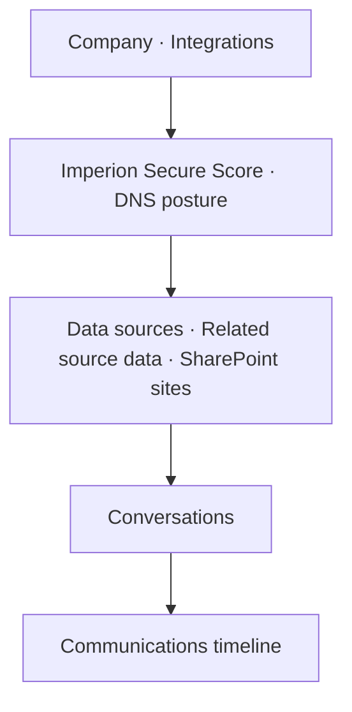

# Accounts & the Company 360

[← User guides](README.md)

An **account** is a company. The Accounts list (left nav → **Accounts**, route
`/accounts`) is every company across the customer lifecycle; the **Company 360**
(`/accounts/[id]`) is the single screen that pulls together a company's profile,
integration health, security posture, and its whole communications history.

## The Accounts list

A table, one row per company:

- **Account** — name, with a health dot.
- **Stage** — its lifecycle stage.
- **Owner** — who owns the relationship.
- **MRR** — monthly recurring revenue. *This is revenue data:* a role that can't see
  money (e.g. **Support**) sees it redacted, server-side (ADR-0030) — the number never
  reaches that browser.
- **Detail** — a short note.

**+ New account**, plus **Edit / Delete** per row, all gated on `crm:write`.

## The Company 360

The header carries the company name, the *Company 360* label, and three actions:

- **Posture** — opens the full [security posture view](security-posture.md).
- **Refresh posture** — re-classifies the company's mapped Customer Tenants on demand
  (`crm:write`; only shown when a tenant mapping exists).
- **Edit** — `/accounts/[id]/edit`.

Below, a multi-section layout:

- **Company** — lifecycle stage, relationship, active flag, owner, health score,
  created / last-updated (and archived, if applicable). Read-only; use **Edit**.
- **Integrations** — a per-source integration-health card.
- **Imperion Secure Score** — a composite grade (A–F) over the mapped tenants with its
  pillar scores (M365 secure score, policy compliance, dark-web), a Defender open-
  incident badge, and MFA-registration coverage. A **Full posture view →** link drills
  in. The full model is in [security posture](security-posture.md).
- **DNS posture** — a per-domain governance verdict badge (managed / not), with a
  prompt to drill into per-domain record drift on the posture view (ADR-0063).
- **Data sources / Related source data** — the bronze records and related-source
  artifacts (Autotask contracts, IT Glue docs, etc.) merged into this company.
- **SharePoint sites** — site metadata only (no file content) when present.
- **[Conversations](conversation-panel.md)** — company-wide call & meeting
  intelligence (read-only; empty until the conversational-intelligence pipeline is
  wired).
- **Communications timeline** — every interaction with the company, newest first, each
  tagged with the contact involved. Click to open the full record. The empty state
  reads *No communications recorded for this company yet.*

## Permissions at a glance

| Action | Capability |
| --- | --- |
| Read the list / 360 | open to signed-in users |
| Create / edit / delete an account, refresh / snapshot posture | `crm:write` |
| See MRR | a revenue-visible role (redacted for Support) |

## Related

- [Contacts & the Contact 360](contacts-360.md) — the people who belong to a company.
- [Company security posture](security-posture.md) — the full posture surface.
- [Sales pipeline](sales-pipeline.md) — the deals against a company.
