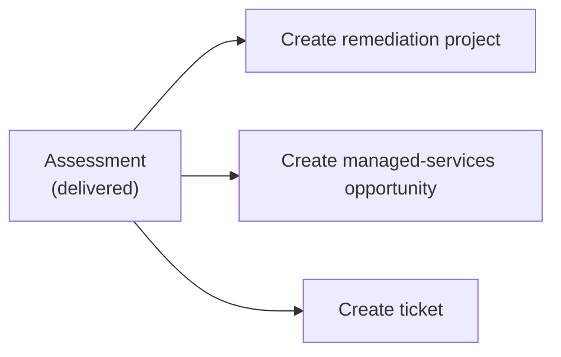

# Security Readiness Assessments

[← User guides](README.md)

The **AI Security Readiness Assessment** is the paid engagement that earns the access
and evidence to win a managed-services contract — the wedge of the
[assessment-led lifecycle](../architecture/customer-lifecycle.md). Assessments (left
nav → **Assessments**, route `/assessments`) is where you create one, score the six
security dimensions, build the client-ready report, and — when it lands — convert it
into the next thing.

## The assessments list

A card per assessment: **Name** (links to detail) **· Account · Status · Fee** (only
if you can see revenue) **· Kickoff date**, with a compact **scorecard** preview of the
six dimensions. Status is colour-coded across its lifecycle: *proposed → scheduled →
in progress → delivered → closed*.

**+ New assessment** creates one. Each card also has **Edit** and **Delete**. The
**Fee** is revenue data — redacted for roles that can't see money.

## The six-dimension scorecard

Every assessment scores six security dimensions, each on a four-step scale:

| Dimension | Ratings |
| --- | --- |
| Identity · Endpoint · Network · Email · Backup · Incident | Not scored · **At Risk** · **Needs Work** · **Solid** · **Strong** |

The scorecard is the spine of the report and the at-a-glance signal on the list.

## The detail page — the client-ready report

Open an assessment (`/assessments/[id]`) for the two-column report view:

- **Left — the report preview** (what the client effectively sees):
  - **Security posture** — the six-dimension scorecard.
  - **Top priorities** — the ranked priorities (or *Not yet documented*).
  - **Recommendation** — the headline recommendation.
  - **Evidence** — artifacts grouped by source (Televy telemetry · M365 read-only
    signals · other), each with its dimension, collected-at date, and summary. The
    empty state explains that Televy telemetry and the 1:1 M365 read-only grant land
    here automatically.
- **Right — assessment data entry** — the questions that aren't covered by Televy.
  Answer them and **Save data**; they feed the scorecard and the report. (As the hint
  says: capture what Televy doesn't.)

**Edit scorecard** opens the full form.

## Editing — the full form

`/assessments/[id]/edit` carries everything: **Name · Account · Opportunity · Status
· Fee · Kickoff date**, a *credit-fee-toward-onboarding-on-conversion* checkbox, the
six scorecard dimensions, top priorities, recommendation, report URL, and notes.

The footer **spawns the next object** from a finished assessment:

## Permissions at a glance

| Action | Capability |
| --- | --- |
| Read / create / edit / score | open to signed-in users |
| See the fee | a revenue-visible role (redacted for Support) |

## Related

- [Discovery calls](discovery-calls.md) — where a *fit* prospect becomes an assessment.
- [Proposals & e-signature](proposals.md) — the proposal that follows a delivered
  assessment.
- [Company security posture](security-posture.md) — the ongoing posture view after the
  one-time assessment.
