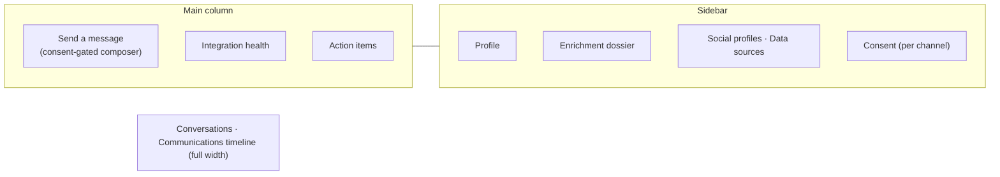

# Contacts & the Contact 360

[← User guides](README.md)

A **contact** is a person. The Contacts list (left nav → **Contacts**, route
`/contacts`) is every signed client contact; the **Contact 360** (`/contacts/[id]`)
is everything Imperion Business Manager knows about one person on a single screen —
their dossier, every conversation you've had, their consent, and the box to send the
next message.

People who haven't signed yet live on the sibling [Leads](leads-capture.md) surface;
the **Leads ⟷ Contacts toggle** at the top of either page flips between them.

## The Contacts list

A table, one row per contact: **Name** (links to the 360), **Email**, **Phone**, and
**Account** (the company they belong to). The count badge reads *N signed client
contacts*.

- **+ New contact** — opens the create form (`/contacts/new`). Use this for someone
  who isn't going to arrive automatically from a connected source or a lead capture.
- **View / Edit / Delete** on each row.

Contacts mostly *arrive* — from connected accounts, from M365/social ingestion, or
from a resolved [lead capture](leads-capture.md) — rather than being typed in. The
empty state says exactly that.

**Who can write:** creating, editing, and deleting a contact require the `crm:write`
capability. Without it the buttons don't render and the server refuses the action.

## The Contact 360

Open a contact to see the 360. The header carries the person's name, their account,
their **CRM stage** badge, their **lifecycle status** badge, and an **Edit** button
(`/contacts/[id]/edit`). Below, a two-column layout.

### The sidebar — who this person is

- **Profile** — email, phone, headline, location, CRM stage, and when the record was
  last enriched. Read-only here; use **Edit** in the header to change it.
- **Enrichment dossier** — the facts gathered about the person from connected sources.
- **Social profiles** — linked social accounts when known.
- **Data sources** — the per-source bronze records that were merged into this contact
  (which systems contributed what).
- **Directory groups** — the Entra groups the person belongs to, when that data is
  present.

### Consent (the gate on every send)

The **Consent** panel carries one opt-in / opt-out toggle **per channel** (email,
SMS). This is not cosmetic — it is the legal gate. An outbound message is **blocked at
send time** unless consent for that channel is current. Setting consent requires the
`comms:write` capability and is recorded in the append-only consent ledger; the
governance behind it is in [data-governance](../data-governance/README.md).

### Send a message (the composer)

The **Send a message** card is how you email or text the person from inside the app.

1. Pick the **channel** (Email or SMS).
2. For email, give it a **subject**; type the **body**.
3. **Approve & send.**

What happens next is honest about what's wired:

| You see | Meaning |
| --- | --- |
| **Sent via email / sms** (green) | The message was delivered — email as *your own* M365 mailbox, SMS via ACS. |
| **Logged to timeline (not delivered)** (green) | The send path isn't fully wired in this environment (no M365 connection, no backend, or no address), so the message was recorded on the timeline instead of sent. The reason is shown. |
| **Blocked — no current email / sms consent** (amber) | The person has not consented on that channel. Fix consent first. |
| **Send failed** (red) | The send was attempted and errored. |

Sending requires `comms:write`. If you can't email *or* SMS, the composer is hidden
entirely. Every send re-checks consent at execution — the toggle you see is enforced,
not advisory.

### Action items, integrations, conversations, timeline

- **Action items** — open follow-ups tied to the contact; complete one in place
  (`tickets:write`).
- **Integrations** — a read-only health card for the sources feeding this record.
- **[Conversations](conversation-panel.md)** — call & meeting intelligence tied to
  this person (read-only; populated once the conversational-intelligence pipeline is
  wired).
- **Communications timeline** — the unified, newest-first record of every email,
  message, call, meeting, and social touch with this person. Click an entry to open
  the full record.

## Permissions at a glance

| Action | Capability |
| --- | --- |
| Read the list / 360 | open to signed-in users |
| Create / edit / delete a contact | `crm:write` |
| Send email/SMS, set consent, complete action items | `comms:write` |

## Related

- [Leads & capture inbox](leads-capture.md) — the not-yet-signed side of the same list.
- [Accounts & the Company 360](accounts-360.md) — the company a contact belongs to.
- [Sales pipeline](sales-pipeline.md) — move a contact along the lifecycle stages.
- [data-governance](../data-governance/README.md) — the consent / lawful-basis model.
