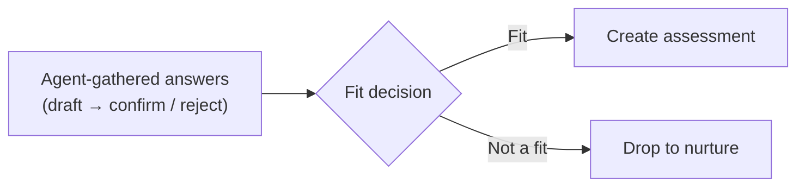

# Discovery calls

[← User guides](README.md)

A **discovery call** is the structured conversation that decides whether a prospect is
a fit. Discovery (left nav → **Discovery**, route `/discovery`) is where you log the
call, review the answers the agent gathered before it, confirm them, and route the
prospect — *fit → assessment*, or *not a fit → nurture*. It is the hinge of the
[assessment-led lifecycle](../architecture/customer-lifecycle.md).

## The discovery list

A table, one row per call: **Account · Held** (date) **· Status · Verdict · Next
step**, with **Edit** and **Delete**. The verdict is colour-coded — *Fit* (green),
*Not a fit* (red), *Nurture* (amber). **+ Log discovery call** opens the create form.

## Logging a call

**+ Log discovery call** (`/discovery/new`) opens the form:

- **Account** (required) and an optional **Opportunity** and **performed-by contact**.
- **Held on** — the date.
- **Status** — Scheduled / Completed / Cancelled.
- **Verdict** — Undecided / Fit / Not a fit / Nurture.
- **SBR cadence** — Monthly / Quarterly (the review rhythm if they convert).
- **Verdict reason** and **Next step**.
- **Discovery captures** — the structured discovery questions (the eight discovery
  points), answered inline.

## Working a call — the detail page

Open a logged call (`/discovery/[id]/edit`) and you get the form plus three panels
that drive the decision:

1. **Agent-gathered data — confirm before the verdict.** Pre-discovery automation
   pre-fills discovery answers *before* the call; they land here as **draft** (with a
   confidence % when available). Review each and **Confirm** or **Reject** it. The
   point is human-in-the-loop: the agent proposes, a person stamps the truth. If there
   were no agent answers, the panel says so.
2. **Fit decision.** Two buttons:
   - **Fit → create assessment** — routes the prospect into a new
     [Security Readiness Assessment](assessments.md).
   - **Not a fit → drop to nurture** — sends them back to nurture.
3. **Provenance** — a footer that can also **Create opportunity** from the call.

The intended order is: confirm the gathered data, *then* route.

## Permissions

Discovery is open to signed-in users — there is no separate write gate on the call
itself; the spawned objects (assessment, opportunity) follow their own surfaces' gates.

## Related

- [Sales pipeline](sales-pipeline.md) — where a qualified prospect comes from.
- [Security Readiness Assessments](assessments.md) — the *fit* destination.
- [workflows](../workflows/README.md) — the pre-discovery automation that pre-fills
  the agent answers, and the nurture motion a *not a fit* drops into.
