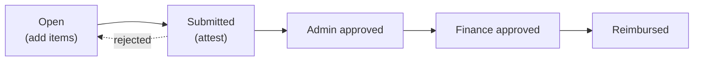

# My Expenses — employee guide

[← User guides](README.md)

How an employee logs and attests their **monthly** expense report (ADR-0083). The
surface is at **Expenses** in the left nav (`/expenses`). It is the expense sibling of
[My Timesheets](timesheets.md) — same shape (log → attest → watch it move), one is
weekly time, the other is monthly out-of-pocket and mileage.

You only ever see and edit **your own** expenses — the surface is scoped to your
signed-in identity (resolved by email to your employee record). If your employee
record isn't resolved yet, the page says so plainly rather than showing a blank form.

## The landing — your months

Opening **Expenses** shows three sections, not a single form:

- **Needs attention & current** (top) — a grid of month tiles. The current month is
  highlighted; a month with an unfinished obligation reads *Needs attention*. Each tile
  is **Start expense report** if you haven't begun it, or **Open report →** if you have.
  You only need a report for a month in which you actually had an expense.
- **Your expense reports** (middle) — a table of every month you've worked: **Month ·
  Total · Reimbursable · Items · Status**, with an **Edit / View →** link. Status is
  colour-coded: *open → submitted → approved → finance_approved → reimbursed*
  (or *rejected*).
- **Status & reimbursements** (bottom) — every month you've submitted, moving along the
  track **Submitted → Admin → Finance → Reimbursed**, so you can watch your money
  without asking anyone.

## A single month

Click a month (or use `?period=YYYY-MM`) to open its detail. The header shows the
period, the total, and the state badge; **← All expense reports** returns to the
landing.

- **No report yet?** A **Start expense report** button creates it.
- **Items table** — one row per expense: **Date · Category · Merchant / detail ·
  Amount · Reimbursable · Billable**. Mileage rows show miles and the category
  *Mileage*; out-of-pocket rows show the merchant and a real category. *Reimbursable*
  (does the company pay you back) and *Billable* (does the client get charged) are
  **independent** — a row can be either, both, or neither.

## Attesting

When the month is complete, **Attest & submit** affirms the items are accurate and
hands the report to admin approval. After that the report is read-only to you and moves
along the track above. If a report is **rejected**, **Reopen to correct** brings it
back to *open* so you can fix and re-attest.

> Mileage comes from **MileIQ** (per-user OAuth) and out-of-pocket items carry
> **receipts**; the deeper entry/correction GUI is an in-progress follow-up, so today's
> surface focuses on the report lifecycle (start → attest → reopen) and the read of
> what's there.

## Security & privacy

You see only your own expenses. **Compensation data — your pay rate, the system
mileage rate — is never on this surface** (ADR-0083 §Security); it lives in a separate,
finance-role-gated store and is never shown to employees, agents, or clients. The
finance roll-up across all employees is the [Monthly Close](monthly-close.md), which is
finance/admin-only.

## Related

- [My Timesheets](timesheets.md) — the weekly-time sibling of this surface.
- [Monthly Close](monthly-close.md) — the finance roll-up of both legs.
- Admin setup (expense categories, the mileage rate, the lifecycle table):
  [admin-guides](../admin-guides/README.md).
