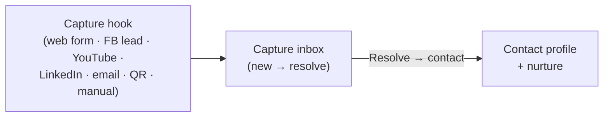

# Leads & the capture inbox

[← User guides](README.md)

A **lead** is a person who has *not* signed yet — someone in the audience, a fresh
inbound, a prospect mid-nurture. The Leads surface (left nav → **Leads**, reached via
the **Leads ⟷ Contacts toggle**, route `/leads`) is where you work them. It has three
parts on one page: the **leads list**, the **capture inbox**, and the **capture
hooks** that feed the inbox.

When a lead converts (signs), they become a [contact](contacts-360.md) — the same
person, the other side of the toggle.

## The leads list

The same table shape as Contacts — **Name · Email · Phone · Account** — but scoped to
people *not yet signed*. The count badge reads *N people not yet signed*.

- **+ New lead** — create a person manually (shares the contact create form).
- **View / Edit / Delete** per row.

## The capture inbox

The **Capture inbox** is the landing zone for inbound captures that hooks produce —
each is a raw lump of inbound interest waiting to be turned into a real person. The
section header shows how many are *new*.

Each row shows **Received** (when it landed), **Hook** (which hook produced it),
**Capture** (a summary of what came in), and **Status** (*new* · *resolved* ·
*ignored*).

**Resolve → contact** — on a *new* capture, this turns the raw capture into a started
contact profile and kicks off nurture. Resolving requires the `sales:write`
capability. Once resolved, the row moves out of the *new* set.

## Capture hooks

A **hook** is a named inbound channel that creates captures automatically. The
**Capture hooks** section lists them (read-only here) with:

- **Hook** — its name.
- **Kind** — Web form · Facebook lead · YouTube comment · LinkedIn message · Inbound
  email · QR · Manual.
- **Active** — Yes / No.
- **Captures** — how many it has produced.

**+ New hook** (`/leads/hooks/new`, gated on `sales:write`) configures a new one. A
hook can be pointed at a campaign so that captures attributed to it
[auto-enroll](../workflows/README.md) the resolved contact into a nurture workflow.

## Permissions at a glance

| Action | Capability |
| --- | --- |
| Read leads / inbox / hooks | open to signed-in users |
| Create / edit / delete a lead | `crm:write` |
| Resolve a capture, create a hook | `sales:write` |

## Related

- [Contacts & the Contact 360](contacts-360.md) — what a lead becomes when it converts.
- [Sales pipeline](sales-pipeline.md) — advance a lead along the lifecycle stages.
- [workflows](../workflows/README.md) — the nurture automation captures feed into.
